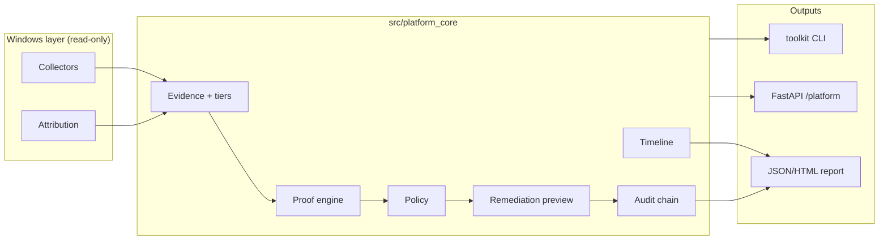

# Endpoint Reliability Decision Platform

**One-liner:** An evidence-based Windows endpoint reliability and IT risk decision platform that collects endpoint signals, builds an incident timeline, generates a risk-based decision, applies policy-gated remediation, and exports an audit-ready report.

Python 3.11+ · Policy-gated · Local-first · 1000+ pytest (CI)

> **Not an AI agent.** This is decision infrastructure: Evidence → Hypothesis → Proof → Policy → Remediation → Audit.

**Canonical core:** `src/platform_core/` — proof-gated remediation, deterministic replay certification, human approval workflow, audit chain-of-custody, outcome learning, governance-ready control mapping.

| Principle | Enforced |
|-----------|----------|
| Observation != Proof | Evidence tier state machine |
| Correlation != Causation | Guards block destructive unlock |
| Confidence != Certainty | Ordinal scores only |
| Policy Permission != Safety Guarantee | Approval + rollback required |

---

## 60-second explanation

Windows can look **online** while browsers and dev tools fail: WinINET/WinHTTP proxy drift, stale localhost listeners, and DNS/HTTPS path differences are common causes. This is **not** a repair script, antivirus, or autonomous containment tool. It is **security observability** and **endpoint reliability** infrastructure: probes → evidence → policy → preview → audit → replay → API/dashboard.

**Epistemic rules:** observation ≠ proof · correlation ≠ causation · confidence is ordinal, not probability · listener match is not registry-writer proof.

---

## Why this is not just a script

| Script mindset | Platform mindset |
|----------------|------------------|
| One-off registry reset | Append-only audit + replay |
| Heuristic = guilt | Evidence levels with upgrade guards |
| Fix immediately | Policy-gated **preview** first |
| Laptop-only | Synthetic fleet (100 endpoints, 20 incidents) |

---

## Architecture

```text
probes → normalization → evidence fusion → reasoning → policy
  → remediation preview → audit → replay → API / dashboard / metrics
```

```text
┌─────────┐   ┌──────────┐   ┌─────────────┐   ┌────────┐   ┌─────────┐
│ Probes  │ → │ Events   │ → │ Evidence    │ → │ Policy │ → │ Preview │
│ WinINET │   │ JSONL    │   │ OBSERVED…   │   │ gates  │   │ dry-run │
└─────────┘   └──────────┘   │ FINAL_CAUS  │   └────────┘   └─────────┘
                             └─────────────┘        │              │
                                                    v              v
                                              ┌─────────────────────────┐
                                              │ Audit → Replay → API/UI │
                                              └─────────────────────────┘
```

Docs: [architecture.md](docs/architecture.md) · [evidence_model.md](docs/evidence_model.md) · [policy_model.md](docs/policy_model.md)

---

## Evidence model

| Level | Claim strength |
|-------|----------------|
| `OBSERVED_ONLY` | Proxy/registry state changed |
| `CORRELATED` | Listener/process match only |
| `PROVEN_REGISTRY_WRITER` | Sysmon E13 / Procmon / ETW |
| `PROVEN_NETWORK_IMPACT` | Browser path impact + writer proof |
| `FINAL_CAUSATION` | Writer + port owner or network impact |

Registry-writer proof when telemetry is available. See [docs/evidence_model.md](docs/evidence_model.md).

---

## Policy model

`ALLOW_OBSERVE` · `PREVIEW_ONLY` · `REQUIRE_TYPED_CONFIRMATION` · `BLOCK_DESTRUCTIVE` · `BLOCK_LOW_CONFIDENCE` · `CORRELATION_ONLY_ALERT`

No silent process kill · no firewall reset · no adapter disable · no registry mutation without typed confirmation · API execute `dry_run=true` by default.

See [docs/policy_model.md](docs/policy_model.md) · [docs/safety_model.md](docs/safety_model.md).

---

## Core workflow

```text
Evidence → Hypothesis → Proof → Policy → Remediation → Audit → Replay → Learning
```

**Canonical modules** (`src/platform_core/`):

| Module | Responsibility |
|--------|----------------|
| `evidence/` | Typed records, tiers, guards, chain of custody |
| `attribution/` | WinINET/WinHTTP/proxy listener classification (read-only) |
| `proof/` | DNS / TCP / HTTP direct vs proxied contrast |
| `timeline/` | Incident timeline normalization |
| `remediation/` | Policy-gated preview, rollback, approval tokens |
| `policy/` | Tier gates — no silent destructive actions |
| `audit/` | Hash-chained JSONL |
| `governance/` | Control mapping, chain verification |

**Windows portfolio** (`windows_network_toolkit/`) — collectors, CLI, reports, API. Platform logic stays in `src/platform_core/`; Windows probes stay isolated.

Package: [`windows_network_toolkit/`](windows_network_toolkit/) — collectors, evidence, decision, remediation, audit, platform API.

### Architecture (consolidated)



Implementation plan: [docs/IMPLEMENTATION_PLAN_ERP.md](docs/IMPLEMENTATION_PLAN_ERP.md)

## Diagnostic CLI (read-only by default)

```powershell
pip install -e ".[dev]"
$env:PYTHONPATH = (Get-Location).Path

# Proxy state (WinINET + WinHTTP)
python -m windows_network_toolkit proxy-status

# Listener attribution + classification
python -m windows_network_toolkit proxy-attribution

# Direct vs proxied path proof
python -m windows_network_toolkit proxy-proof --url https://example.com

# Incident timeline + remediation preview
python -m windows_network_toolkit proxy-timeline --url https://example.com

# 502 / bad gateway (full ERP path)
python -m windows_network_toolkit bad-gateway-diagnose --url https://example.com

# Audit report from fixture or live URL
python -m windows_network_toolkit report proxy_drift_incident.jsonl --format markdown
python -m windows_network_toolkit report --url https://example.com --format html

# Verify audit hash chain
python -m windows_network_toolkit audit verify logs/canonical_decision_audit.jsonl
```

**Example `proxy-status` output:**

```json
{
  "wininet": { "ProxyEnable": 1, "ProxyServer": "127.0.0.1:8080" },
  "winhttp": { "direct_access": true },
  "localhost_port": 8080,
  "classification": "DEAD_PROXY_CONFIG"
}
```

**Safety:** All commands above are diagnostic/preview-only. No registry write, process kill, firewall reset, or adapter disable without typed confirmation + policy gate + rollback plan + audit.

## Replay demo (non-Windows safe)

```powershell
pip install -e ".[dev]"
$env:PYTHONPATH = (Get-Location).Path
python -m toolkit replay windows_network_toolkit/examples/proxy_drift_incident.jsonl
python -m toolkit report windows_network_toolkit/examples/proxy_drift_incident.jsonl --format markdown
uvicorn backend.main:app --reload
# Dashboard: http://127.0.0.1:8000/dashboard/
```

## 5-minute demo (no admin, no host mutation)

```powershell
make demo-healthy
make demo-proxy-drift
make demo-final-causation
make demo-fleet-enterprise
make demo-production
```

Guide: [docs/demo_5_min.md](docs/demo_5_min.md) · ERP package: [docs/endpoint_reliability_platform.md](docs/endpoint_reliability_platform.md)

---

## Safety guarantees

- **Observation ≠ proof** — evidence tiers gate destructive unlock
- **Correlation ≠ causation** — listener match is not registry-writer proof
- **Confidence is ordinal** — not probability; no false precision
- **Policy permission ≠ safety guarantee** — approval + rollback still required
- Preview-only remediation by default; destructive verbs registry-blocked
- Typed confirmation for registry mutations
- Synthetic fixtures in git; real `logs/` and `platform_data/` gitignored
- Local-first — no default cloud upload

**This platform is not:** antivirus, autonomous containment, or a destructive repair script.

## What is not guaranteed

- Malware identification or removal
- Autonomous containment
- Writer attribution without Sysmon/Procmon-class telemetry
- Production authentication (demo RBAC headers only)

---

## API surface

| Endpoint | Purpose |
|----------|---------|
| `GET /health` | ERP service liveness (`endpoint-reliability-decision-platform`) |
| `GET /platform/status` | Platform status |
| `POST /platform/diagnose` | Run evidence → decision pipeline |
| `GET /platform/evidence/timeline` | Latest incident timeline |
| `GET /platform/decision/latest` | Latest decision result |
| `GET /platform/audit/logs` | ERP audit JSONL tail |
| `POST /platform/replay` | Replay JSONL fixture |
| `POST /platform/remediation/preview` | Policy-gated preview |
| `POST /platform/remediation/confirm` | Confirmation alias (dry-run safe) |
| `GET /platform/health` | Legacy platform liveness |
| `GET /metrics` | Prometheus |

OpenAPI: `http://localhost:8000/docs` after `docker compose up`.

## Dashboard

- **Portfolio demo:** `GET /dashboard/` — static FastAPI UI (12 sections, replay button)
- **Production UI:** `frontend/app/platform/` — Next.js operator console

---

## Observability

Prometheus gauges: `proxy_drift_incidents_total`, `evidence_level_total_*`, `policy_decisions_total_*`, `remediation_preview_total`, `fleet_endpoints_total`.

Dashboard: `frontend/app/platform/` — incidents, evidence, policy, replay, SLO.

[docs/observability.md](docs/observability.md)

---

## Tests and CI

```powershell
pytest -q tests/test_policy_safety_contract.py tests/test_api_dry_run_default.py
pytest -q tests/test_evidence_level_contract.py tests/test_fixture_regression_demo.py
pytest -q
```

CI: `.github/workflows/ci.yml` — ruff, pytest, safety contracts, fixture smoke.

---

## Production readiness

Checklist: [docs/production_readiness.md](docs/production_readiness.md) · Deployment: [docs/production_deployment.md](docs/production_deployment.md)

Public release: [PUBLIC_RELEASE_CHECKLIST.md](PUBLIC_RELEASE_CHECKLIST.md)

---

## Case study: browser fails but DNS/ping works (proxy drift)

**Symptom:** Browser shows `ERR_PROXY_CONNECTION_FAILED` or HTTP 502; `ping` and `nslookup` succeed.

**Observation:** WinINET `ProxyEnable=1`, `ProxyServer=127.0.0.1:8080`.

**Correlation:** No process listening on `:8080` → `DEAD_PROXY_CONFIG`.

**Proof:** `proxy-proof --url https://example.com` — direct path HTTP 200, system-proxy path HTTP 502 → `LOCAL_PROXY_UPSTREAM_FAILURE`.

**Policy:** Evidence tier below `FINAL_CAUSATION` → `PREVIEW_ONLY`; disable proxy blocked until approval + rollback reviewed.

**Remediation preview:** `disable_wininet_proxy` shown as registry mutation preview only — **not executed**.

**Audit:** Hash-chained JSONL + report with chain of custody. Sample fixture: [tests/fixtures/erp/sample_audit_report.json](tests/fixtures/erp/sample_audit_report.json).

## Case study: ERR_PROXY_CONNECTION_FAILED

WinINET `ProxyEnable=1` with `ProxyServer=127.0.0.1:PORT` can break browsers while ping/DNS succeed. The platform correlates registry, listener, and path probes, classifies `WININET_PROXY_DRIFT`, and recommends `DISABLE_WININET_PROXY_WITH_CONFIRMATION` only after policy gates pass.

## Big 4 / IT Risk use case

Audit-ready reports (JSON/Markdown/HTML) with executive summary, timeline, evidence, decision, policy gate, remediation preview, rollback plan, and audit trail. See [docs/case_study_mttr_evidence_diagnosis.md](docs/case_study_mttr_evidence_diagnosis.md).

## SRE / Platform Engineering use case

Deterministic replay, append-only audit JSONL, Prometheus metrics, fleet simulation, and CI contract tests — suitable for incident review workflows and platform reliability interviews.

## Interview explanation

> I built an endpoint reliability decision platform that diagnoses Windows proxy-related network failures by correlating registry, process, network, browser, and proof signals. The system produces an incident timeline, classifies risk, recommends policy-gated remediation, and exports an audit-ready report.

STAR write-up: [docs/interview_case_study_tier1.md](docs/interview_case_study_tier1.md)

---

## Known limitations

- Windows-first live probes; Linux CI uses inject fixtures under `tests/fixtures/erp/`
- Legacy root `platform_core/` fleet modules coexist; canonical path is `src/platform_core/`
- Black formatting debt in some modules (CI continue-on-error)

---

## From Windows Toolkit to Multi-Domain Decision Platform

Windows proxy drift, security alerts, cloud incidents, infrastructure failures, and market events are all **event-state decision problems**. The platform normalizes events, builds evidence, ranks hypotheses, scores decisions, applies policy, tracks outcomes, and supports replay — **research / preview / recommendation only** (not autonomous execution, not a trading bot).

> *This project transforms noisy events across Windows, Security, Cloud, Infrastructure, and Market domains into evidence-backed, policy-gated, replayable decision recommendations.*

```bash
python -m src platform events
python -m src platform evidence --event-id win-proxy-localhost-001
python -m src platform decide --event-id win-proxy-localhost-001
python -m src platform replay
python -m src platform metrics
```

**Risk framing:** observation ≠ proof · correlation ≠ causation · confidence ≠ certainty · recommendation ≠ execution permission.

Full design: [docs/multi_domain_decision_platform.md](docs/multi_domain_decision_platform.md)

---

## Event-driven Trading Research Platform (MVP)

**Not a trading bot. Not financial advice.** Local-first research infrastructure for testing market hypotheses.

| Principle | Meaning |
|-----------|---------|
| Observation != Signal | Raw OHLCV bars are not trade triggers |
| Signal != Edge | Confluence signals require backtest validation |
| Backtest != Proof | Historical fit does not guarantee future results |

### MVP scope

```text
OHLCV CSV → PRICE_BREAKOUT + VOLUME_SPIKE → confluence LONG → next-bar backtest → policy → Markdown report
```

| Step | Behavior |
|------|----------|
| Events | `PRICE_BREAKOUT`, `VOLUME_SPIKE` only |
| Signal | `LONG` only when both events share the same timestamp |
| Backtest | Next-bar open, long-only, no leverage |
| Metrics | Total return, Sharpe, max drawdown, trade count |
| Policy | `<20` trades → `NEEDS_MORE_DATA`; drawdown `<-20%` → `BLOCK`; else `APPROVE_RESEARCH_ONLY` |

**Not in MVP:** short selling, leverage, live trading, broker API, options, crypto, ML.

Modules: `src/trading_research/` (import as `trading_research`).

### Example command

```powershell
pip install -e ".[dev]"
python -m trading_research.cli run-research `
  --symbol SPY `
  --data src/trading_research/examples/sample_ohlcv.csv `
  --strategy breakout_v1 `
  --output reports/spy_breakout_report.md
```

### Tests

```powershell
pytest tests/trading_research -q
```

---

## Labs (experimental — not mainline)

Edge simulation and legacy experiments: [labs/README.md](labs/README.md)

---

## Quick links

| Topic | Doc |
|-------|-----|
| Full CLI reference | [docs/cli_reference.md](docs/cli_reference.md) |
| Threat model | [docs/threat_model.md](docs/threat_model.md) |
| Documentation index | [docs/DOCUMENTATION_INDEX.md](docs/DOCUMENTATION_INDEX.md) |
| Tier-1 walkthrough | [docs/tier1_demo_walkthrough.md](docs/tier1_demo_walkthrough.md) |

---

## License

MIT — see [LICENSE](LICENSE).
