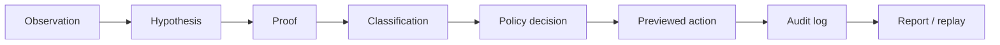

# Technology Risk & Control Analytics Platform

**One-line summary:** An evidence-backed platform that turns Windows endpoint reliability signals into explainable classifications, control test results, policy-gated remediation previews, hash-chained audit trails, and analytics-ready governance exports.

---

## 30-second overview

Windows endpoints often fail while still appearing “online.” Browsers show proxy errors; ping and DNS succeed; WinINET points at a dead localhost port; WinHTTP stays direct; TLS paths diverge; or an unknown process owns a local proxy listener.

This repository is **not** a network repair script or autonomous AI agent. It is a **Technology Risk & Control Analytics Platform** that:

1. Collects **deterministic, read-only evidence**
2. Classifies incidents with **proof tiers (T0–T5)** and explicit **limitations**
3. Runs **control tests** and **policy gates** (preview-only by default)
4. Produces **audit logs**, **replayable reports**, and **Power BI–ready exports**

Use it for operational decision support, internal audit evidence, technology risk committees, and platform/SRE reliability workflows — not as EDR, SIEM, malware detection, or a formal audit opinion engine.

---

## Who this is for

| Audience | Why it matters |
|----------|----------------|
| **Big 4 / technology risk / IT audit** | Control testing, proof tiers, governance reports, CTRL-001–010 mapping |
| **Platform / SRE / reliability engineering** | Deterministic classifiers, state-machine replay, CI safety contracts |
| **FinTech / operational risk** | Policy-gated remediation, audit trail, management reporting |
| **Internal audit / IT governance** | Hash-chained JSONL, replay verification, non-accusatory classifications |
| **Data / BI / PL-300** | Star-schema CSV export, KPI rollups, report blueprint |
| **AI governance / decision intelligence** | Advisory-only AI boundaries; humans authorize execution |
| **MSc / research portfolio** | Reproducible evaluation harness, research framing, limitations register |

**Start here by role**

| If you are… | Read first |
|-------------|------------|
| Big 4 / audit | [docs/big4-interview-defense.md](docs/big4-interview-defense.md) · [docs/control-matrix.md](docs/control-matrix.md) · [reports/sample_governance_report.md](reports/sample_governance_report.md) |
| Platform / SRE | [docs/faang-platform-review.md](docs/faang-platform-review.md) · [docs/state-machine.md](docs/state-machine.md) |
| Power BI / analytics | [analytics/powerbi/report_blueprint.md](analytics/powerbi/report_blueprint.md) · [docs/powerbi-interview-story.md](docs/powerbi-interview-story.md) |
| Research / MSc | [docs/research-framing.md](docs/research-framing.md) · [docs/evaluation.md](docs/evaluation.md) |
| 3-minute demo | [docs/interview-demo-3min.md](docs/interview-demo-3min.md) |

**Deep references:** [PORTFOLIO.md](PORTFOLIO.md) · [SYSTEM_DESIGN.md](SYSTEM_DESIGN.md) · [docs/DOCUMENTATION_INDEX.md](docs/DOCUMENTATION_INDEX.md)

---

## The problem

Teams lose time and audit defensibility when endpoint failures are handled ad hoc:

- **Symptom vs root cause:** Browser fails; network “looks fine” on ping/DNS
- **Stack drift:** WinINET proxy enabled; WinHTTP direct; paths disagree
- **Dead localhost proxy:** `ProxyServer=127.0.0.1:PORT` with no listener
- **Ambiguous ownership:** Unknown process on proxy port — escalated as “malware” without proof
- **Reverter behavior:** Proxy disabled, then silently re-enabled
- **TLS path mismatch:** Browser TLS fails while curl/system path succeeds

Without structured evidence, operators reset registry settings without logs, security over-escalates, and risk committees lack reproducible incident data.

---

## What this platform does

| Capability | Description |
|------------|-------------|
| **Evidence collection** | Read-only WinINET/WinHTTP, listener, TLS, and optional browser signals |
| **Classification** | Twelve primary labels (e.g. `DEAD_PROXY_CONFIG`, `REVERTER_SUSPECTED`) with confidence and limitations |
| **Proof tiers** | T0–T5 claim-strength ladder; governs language and remediation permissions |
| **Control tests** | PASS / FAIL / PARTIAL / NOT_TESTED per incident class |
| **Policy gates** | ALLOW, PREVIEW, BLOCK, REQUIRE_CONFIRMATION, REQUIRE_HUMAN_REVIEW |
| **Remediation preview** | Dry-run by default; typed confirmation for live registry apply |
| **Audit trail** | Append-only hash-chained JSONL; `audit verify` |
| **Replay & reporting** | Deterministic fixture replay; governance markdown/JSON |
| **Analytics export** | Power BI star-schema and flat CSV layers |

This is **portfolio- and prototype-grade** engineering with production-shaped components (FastAPI `/v1`, Postgres option, Docker demo). It is **not** marketed as enterprise-certified, production-hardened, or a replacement for EDR/SIEM/ITSM.

---

## Important distinction

**This system does not let AI blindly decide or repair endpoints.**

AI (when enabled) assists **explanation drafting only**. Execution authority stays with:

- Deterministic classifiers and proof rules
- Policy gates and safety contracts
- Human review and typed confirmation

The platform’s job is to produce **structured, auditable evidence** so humans, policy rules, and approved workflows can make better operational and risk decisions.

---

## Architecture

```text
Evidence collection → Classification → Proof / control tests → Policy gates
  → Remediation preview → Audit trail → Governance reporting → Replay verification
```



**Code layout**

| Layer | Location |
|-------|----------|
| Canonical engine | `src/platform_core/` — classification, policy, audit, governance |
| Primary CLI | `windows_network_toolkit/` — JSON-first operator commands |
| Platform API | `backend/` — FastAPI, optional Postgres, `/v1` enterprise routes |
| Fixtures & tests | `tests/`, `fixtures/`, `examples/evidence/` |

Details: [docs/architecture-infographic.md](docs/architecture-infographic.md) · [docs/architecture.md](docs/architecture.md) · [windows_network_toolkit/architecture.py](windows_network_toolkit/architecture.py)

---

## Evidence model

**Pipeline:** Observation → Hypothesis → Proof → Classification → Policy Decision → Previewed Action → Audit Log → Replay / Report

| Stage | Output | Audit value |
|-------|--------|-------------|
| Observation | Raw proxy/TLS/listener reads | Timestamped signal |
| Proof | Path contrast, listener checks | Separates observation from claim |
| Classification | Primary label + `limitations[]` | Explainable triage |
| Policy | Gate outcome | Shows why action was blocked or previewed |
| Audit | Hash-chained JSONL | Tamper detection, replay |

Canonical doc: [docs/evidence-model.md](docs/evidence-model.md) · Principles: [docs/evidence_to_action_governance_model.md](docs/evidence_to_action_governance_model.md)

Six epistemic rules enforced in CI:

1. Observation is not proof  
2. Correlation is not causation  
3. Confidence is not certainty (ordinal, not probability)  
4. Classification is not accusation  
5. Policy permission is not a safety guarantee  
6. Recommendation is not execution authority  

---

## Classification model

Primary labels include:

`NO_PROXY` · `DEAD_PROXY_CONFIG` · `LOCAL_PROXY_ACTIVE` · `UNKNOWN_LOCAL_PROXY` · `KNOWN_DEV_PROXY` · `KNOWN_SECURITY_TOOL` · `SUSPICIOUS_PROXY` · `POSSIBLE_MITM_RISK` · `PAC_CONFIGURED` · `WININET_WINHTTP_MISMATCH` · `REVERTER_SUSPECTED` · `ERROR_INSUFFICIENT_DATA`

Every classification carries **secondary signals**, **ordinal confidence**, and mandatory **`limitations[]`**. Labels are reliability triage — never `MALWARE_DETECTED` or `MITM_CONFIRMED`.

Full taxonomy: [docs/classification-taxonomy.md](docs/classification-taxonomy.md) · Engine: `src/platform_core/classification/engine.py`

---

## Policy-gated remediation

| Default | Requires explicit human confirmation |
|---------|--------------------------------------|
| Read registry / netstat | Registry mutation |
| Classify & prove | Process kill |
| Preview remediation (`--dry-run`) | Firewall reset |
| Append audit logs | Adapter disable |
| Fixture replay | Autonomous remediation |

**`proxy-disable` defaults to dry-run.** Live apply requires `--dry-run false --confirm DISABLE_WININET_PROXY`.

Proof tiers constrain what remediation language is permitted. See [docs/proof-tiers.md](docs/proof-tiers.md) and [docs/policy-gates.md](docs/policy-gates.md).

---

## Audit and replay

| Artifact | Purpose |
|----------|---------|
| `.audit/*.jsonl` | Operator actions (status, preview, watch) |
| `tests/fixtures/risk_analytics/audit_sample_chained/` | Valid hash-chain demo data |
| `audit verify <file>` | Integrity check from genesis hash |
| `proxy-replay` / `replay-demo` | State-machine replay from JSONL |
| `replay-benchmark` | Deterministic regression harness |

Governance sample: [reports/sample_governance_report.md](reports/sample_governance_report.md)

---

## Analytics, Power BI, and governance reporting

Convert audit evidence into committee-ready outputs:

```powershell
# Star-schema semantic model pack
python -m windows_network_toolkit powerbi-export `
  --audit-dir tests/fixtures/risk_analytics/audit_sample_chained `
  --out-dir examples/powerbi/export

# Flat CSV export (alias also available)
python -m windows_network_toolkit export-powerbi `
  --audit-dir tests/fixtures/risk_analytics/audit_sample_chained `
  --out-dir analytics/powerbi/sample_csv

# Governance report from audit directory
python -m windows_network_toolkit governance-report `
  --audit-dir tests/fixtures/risk_analytics/audit_sample `
  --format markdown
```

**Honest scope:** Portfolio-ready semantic model and CSV layers — not a deployed Power BI Service tenant or formal SOC 2 attestation.

Docs: [analytics/powerbi/schema.md](analytics/powerbi/schema.md) · [analytics/powerbi/report_blueprint.md](analytics/powerbi/report_blueprint.md) · [docs/control-matrix.md](docs/control-matrix.md) (CTRL-001–010)

---

## AI Evals Feedback Loop

Optional parallel module showing how the same **evidence → classification → policy gate → audit/report** architecture applies to **GenAI model evaluation** (support-bot / RAG fixtures). It does not replace endpoint risk workflows and makes **no live LLM API calls**.

```powershell
python -m windows_network_toolkit ai-eval `
  --cases examples/ai_evals/support_bot_cases.json `
  --format markdown
```

Produces pass/fail/partial results, failure taxonomy labels, policy decisions, and a governance-style model quality report. **Not a formal model safety certification.**

Full doc: [docs/ai-evals-feedback-loop.md](docs/ai-evals-feedback-loop.md)

---

## Example incident walkthrough

**Narrative:** Browser fails with `ERR_PROXY_CONNECTION_FAILED`. Ping and DNS work. WinINET shows proxy enabled toward `127.0.0.1:59081`. No listener on that port. WinHTTP is direct. Process owner unclear.

| Step | Action | Result |
|------|--------|--------|
| 1 | `proxy-status` | Structured WinINET/WinHTTP state |
| 2 | `proxy-owner` | Listener check; owner unknown or absent |
| 3 | `diagnose --proof` | Path contrast; proof envelope with limitations |
| 4 | Classifier | `DEAD_PROXY_CONFIG` (+ mismatch secondary) |
| 5 | Policy | `PREVIEW_ONLY` — no silent registry edit |
| 6 | `proxy-disable --dry-run` | Remediation preview only |
| 7 | Audit + report | JSONL row; governance markdown export |

Fixture pack: [fixtures/dead_proxy_config/](fixtures/dead_proxy_config/) · Case study: [docs/one-page-case-study-dead-proxy.md](docs/one-page-case-study-dead-proxy.md)

---

## Demo commands (fixture-safe)

Works on any OS with fixtures — no live registry changes required.

```powershell
pip install -r requirements.txt
$env:PYTHONPATH = (Get-Location).Path

# Golden path (3-minute panel demo)
python -m windows_network_toolkit proxy-status --fixture fixtures/dead_proxy_config/raw_signals.json
python -m windows_network_toolkit diagnose --proof --fixture fixtures/dead_proxy_config/raw_signals.json
python -m windows_network_toolkit proxy-disable --dry-run --fixture fixtures/dead_proxy_config/raw_signals.json
python -m windows_network_toolkit audit verify tests/fixtures/risk_analytics/audit_sample_chained/incidents.jsonl
python -m windows_network_toolkit governance-report --fixture fixtures/dead_proxy_config/raw_signals.json --format markdown

# Evidence & monitoring (read-only)
python -m windows_network_toolkit proxy-watch --fixture tests/fixtures/enert/dead_proxy_59081.json --format json
python -m windows_network_toolkit proxy-health --fixture tests/fixtures/proxy_health_dead.json --json
python -m windows_network_toolkit tls-proof --url https://example.com --fixture tests/fixtures/enert/tls_cert_mismatch.json
python -m windows_network_toolkit website-risk --url https://example.com
python -m windows_network_toolkit evidence-report --fixture fixtures/dead_proxy_config/raw_signals.json --format markdown
python -m windows_network_toolkit proxy-timeline --audit

# Risk & controls
python -m windows_network_toolkit control-test --fixture tests/fixtures/case_studies/case_1_dead_wininet_proxy.json
python -m windows_network_toolkit risk-assess --fixture tests/fixtures/case_studies/case_1_dead_wininet_proxy.json

# Replay
python -m windows_network_toolkit replay-demo --input tests/fixtures/proxy_transitions/proxy_enable_flapping_loop.jsonl

# AI evals (fixture-only, no API keys)
python -m windows_network_toolkit ai-eval --cases examples/ai_evals/support_bot_cases.json --format markdown

# Evaluation
python -m windows_network_toolkit classifier-benchmark --cases examples/evaluation/classifier_benchmark_sample.json
pytest -q tests/evaluation/
```

**API (optional, read-only demo):**

```powershell
uvicorn backend.main:app --host 127.0.0.1 --port 8000
# GET /trisk/health  ·  GET /incidents  ·  GET /reports/executive
```

Full CLI reference: [docs/cli_reference.md](docs/cli_reference.md)

---

## Safety boundaries

This project **must not** be presented as antivirus, EDR, XDR, autonomous repair, or formal audit sign-off.

| We do **not** claim | What we **do** instead |
|---------------------|-------------------------|
| Malware or compromise verdicts | Reliability labels with `limitations[]` |
| Confirmed MITM | `POSSIBLE_MITM_RISK` triage only |
| Autonomous remediation | Preview-only default; typed confirmation |
| AI-authorized execution | AI assists explanation; humans authorize apply |
| Silent registry / firewall / adapter changes | Blocked by policy and CI safety contracts |
| Enterprise production certification | Production-**shaped** prototype with documented gaps |

Enforced in CI: `tests/test_policy_safety_contract.py` · `tests/test_proxy_classifier_safety_contract.py`

Canonical safety doc: [docs/safety-model.md](docs/safety-model.md) · Limitations: [docs/limitations.md](docs/limitations.md)

---

## Portfolio positioning

### Big 4 technology risk / IT audit

- CTRL-001–010 control matrix with pass/fail interpretation  
- Proof ladder T0–T5 and governance report sample  
- Management information framing — not a formal audit opinion  
- [docs/big4-interview-defense.md](docs/big4-interview-defense.md)

### Platform / SRE

- Deterministic classifiers and proxy state machine  
- Replay benchmarks and fleet simulate  
- Observability-shaped metrics and Docker demo stack  
- [docs/faang-platform-review.md](docs/faang-platform-review.md)

### FinTech risk and controls

- Policy-gated remediation previews  
- Ordinal risk ratings with limitations  
- Audit hash chain before committee export  

### Data / BI analytics

- `powerbi-export` / `export-powerbi` star-schema and flat CSV  
- DAX blueprint and RLS design docs  
- [docs/powerbi-interview-story.md](docs/powerbi-interview-story.md)

### AI governance / decision intelligence

- Advisory-only AI analyst with guardrails  
- Human review queue and proof-tier caps  
- [docs/ai-risk-analyst-guardrails.md](docs/ai-risk-analyst-guardrails.md)

**Interview talking points**

1. **Why not a PowerShell fix script?** — Audit trail, proof tiers, policy gates, replay.  
2. **How do you avoid false malware accusations?** — Classification is not accusation; limitations on every output.  
3. **How do you prevent autonomous damage?** — Dry-run default, typed tokens, CI safety contracts.  
4. **Where does AI fit?** — Explanation acceleration only; decisions stay evidence-backed.  
5. **Show auditability.** — `audit verify` + governance report from audit directory.

---

## Production-shaped prototype (optional depth)

For reviewers who want infrastructure depth beyond the CLI:

| Artifact | Path |
|----------|------|
| Docker full stack | `make prod-demo-up` · [docs/docker-production-shaped-demo.md](docs/docker-production-shaped-demo.md) |
| `/v1` RBAC API | [docs/rbac-model.md](docs/rbac-model.md) |
| Fleet benchmark | `make prod-demo-benchmark` |
| Readiness gaps (honest) | [docs/production-readiness-gap.md](docs/production-readiness-gap.md) |
| Threat model | [docs/threat-model.md](docs/threat-model.md) |

```powershell
docker compose -f docker-compose.demo.yml up --build
python -m windows_network_toolkit reviewer-demo --mode mixed
```

---

## Roadmap (planned / not yet complete)

Items documented in blueprints but **not** fully implemented:

- Postgres multi-tenant row-level security  
- Microsoft Entra ID RBAC for enterprise routes  
- Evidence graph module (`/v1/graph/*`)  
- Calibrated confidence (beyond ordinal tiers)  
- Unified enum vocabulary across all legacy classifiers (adapters exist at boundaries)  
- Published Power BI Service deployment  

See [docs/upgrade-deliverables.md](docs/upgrade-deliverables.md) · [docs/enterprise-technology-risk-platform-blueprint.md](docs/enterprise-technology-risk-platform-blueprint.md)

---

## Installation and tests

```powershell
git clone <repo-url>
cd Windows-Network-Recovery-Toolkit
python -m venv .venv
.\.venv\Scripts\Activate.ps1
pip install -r requirements.txt          # runtime + dev (editable install)
$env:PYTHONPATH = (Get-Location).Path

pytest -q                                 # full suite (~1500+ tests)
pytest -q tests/evaluation/               # 15-scenario matrix
ruff check .
make test                                 # Makefile wrapper
```

CI: [.github/workflows/ci.yml](.github/workflows/ci.yml) — lint, test, typecheck, build-smoke

---

## Project structure

```text
src/platform_core/           Classification, policy, audit, governance engine
src/platform_core/ai_evals/  Optional GenAI eval harness (fixture-only)
windows_network_toolkit/     Primary CLI and analytics pipeline
backend/                     FastAPI platform API
fixtures/                    Demo incident packs (dead proxy, reverter, TLS, …)
examples/evidence/           Portfolio evidence schema fixtures
analytics/powerbi/           Schema docs and sample CSV exports
tests/                       Safety contracts, evaluation matrix, replay tests
docs/                        Architecture, case studies, interview packs
reports/                     Sample governance report
```

---

## Documentation index

| Document | Purpose |
|----------|---------|
| [docs/DOCUMENTATION_INDEX.md](docs/DOCUMENTATION_INDEX.md) | Full index |
| [docs/evidence-model.md](docs/evidence-model.md) | Evidence pipeline |
| [docs/proof-tiers.md](docs/proof-tiers.md) | T0–T5 ladder |
| [docs/classification-taxonomy.md](docs/classification-taxonomy.md) | Label definitions |
| [docs/policy-gates.md](docs/policy-gates.md) | Gate mapping |
| [docs/evaluation.md](docs/evaluation.md) | 15-scenario evaluation plan |
| [docs/test-control-matrix.md](docs/test-control-matrix.md) | CTRL → pytest mapping |
| [docs/interview-demo-3min.md](docs/interview-demo-3min.md) | Timed demo script |
| [docs/ai-evals-feedback-loop.md](docs/ai-evals-feedback-loop.md) | GenAI eval harness (optional module) |
| [PUBLIC_RELEASE_CHECKLIST.md](PUBLIC_RELEASE_CHECKLIST.md) | Release hygiene |

---

## License

MIT — see [LICENSE](LICENSE).
