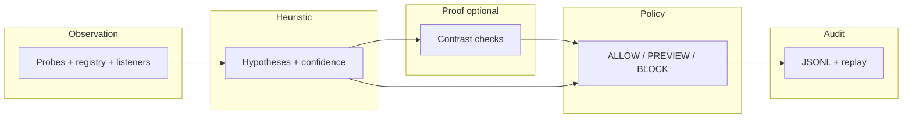
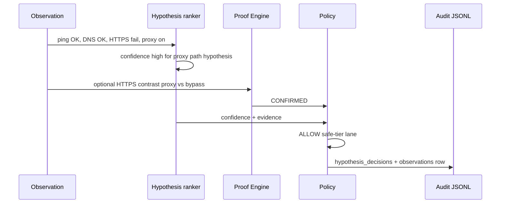

# Endpoint Reliability Platform (Windows Network Recovery Toolkit)

> A **local-first Windows diagnostics and remediation-preview platform** that turns proxy, DNS, browser, and network failures into explainable events, policy-gated actions, and auditable dashboard insights.

This repo keeps **beginner batch workflows** intact while layering **structured diagnostics**, **append-only evidence**, and an optional **FastAPI + Next.js** stack so you can show **what broke**, **what policy allows**, and **what was audited**—before any repair runs.

### Understand it in 60 seconds

| Audience | One sentence |
| --- | --- |
| **Recruiter / manager** | Local-first Windows tool that explains network/proxy failures, previews fixes, and logs every decision—nothing repairs itself. |
| **SRE / platform engineer** | Observe → hypothesize → optional proof → **ALLOW / PREVIEW / BLOCK** policy → append-only JSONL replay without re-probing. |
| **Security reviewer** | Listener correlation is **candidate evidence only**; registry-writer proof requires telemetry; destructive actions stay blocked. |

**Try read-only (no network mutation):**

```powershell
pip install -r requirements.txt
python -m src diagnose --fixture tests/fixtures/features_healthy_signals.json
pytest -q tests/test_policy_v2_regression.py tests/test_safety_regression.py
```

**Optional dashboard demo:** [docs/demo_script.md](docs/demo_script.md) · **Safety:** [docs/safety_model.md](docs/safety_model.md) · **Policy codes:** [docs/policy_engine.md](docs/policy_engine.md)

### Fintech / exchange / low-latency backend angle

This repo is framed as an **event-driven endpoint reliability platform** with trading-infra patterns:

- **Event sourcing** — append-only `logs/events.jsonl`, `logs/decisions.jsonl`, `logs/order_flow_audit.jsonl`
- **State machines** — proxy path composites + `order_flow_simulator` order lifecycle
- **Deterministic replay** — `python -m src replay <run_id>` without re-probing the host
- **Policy gates** — ALLOW / PREVIEW / BLOCK with explicit `reason_codes` (no silent kill/firewall/adapter changes)
- **Latency signals** — order simulator records per-event `latency_ms`; invalid transition counters

```text
Observations → Events → State transitions → Hypotheses → Proof (optional)
      → Policy → Preview → Append-only audit → Replay / dashboard
```

```powershell
python -m order_flow_simulator run --scenario happy_path
python -m order_flow_simulator run --scenario invalid_cancel
python -m src diagnose --live
python -m src replay <run_id>
```

Architecture: [docs/architecture.md](docs/architecture.md)

---

## Problem

Windows often looks “online” while **browser or dev-tool traffic fails**—typically around **DNS**, **WinINET/WinHTTP proxy drift**, **TLS path**, or **browser-only** behavior. Flat repair scripts can change network state without enough context. Here, **diagnosis, hypotheses, policy evaluation, preview, and audit** come first; remediation is **explicit**, **allowlisted**, and **logged** where implemented.

---

## What This Toolkit Does

This repository provides a diagnose-first Windows network reliability toolkit that:

- collects read-only network/proxy observations;
- classifies failures by layer (L1/L2, L3, L4, L7, Infra);
- separates observation, inference, and proof claims;
- emits append-only audit records and human-readable reports;
- previews repair actions before any operator-triggered mutation path.

### L1/L2 vs L3 vs L4 vs L7 vs Infra

- **L1/L2**: link/adapter/local segment problems (media disconnected, adapter down, missing gateway).
- **L3**: IP routing reachability (public IP ping/path issues).
- **L4**: transport reachability (TCP 443 path blocked despite ICMP success).
- **L7**: DNS/HTTP/HTTPS/browser/proxy behavior (for example DNS-only failure or proxy drift).
- **Infra**: router/ISP/upstream/shared-network failures often affecting multiple devices.

### Ping Works but Browser Fails

`ping` success does not prove browser-path success. Browser traffic can fail when:

- WinINET proxy is enabled while WinHTTP appears direct,
- localhost proxy endpoint is stale or unhealthy,
- TCP is reachable but HTTPS request path still fails.

Layer diagnosis treats this as a likely L7/browser-path regression candidate.

### Observation vs Inference vs Proof

- **Observation**: direct probe results (ping/nslookup/tcp/curl/registry snapshots).
- **Inference**: rule-based layer classification from multiple observations.
- **Proof**: stronger telemetry or corroborated evidence; not implied by heuristic process correlation.

Full epistemic boundaries (including confidence as ordinal ranking, not calibrated probability) are in [docs/epistemic_model.md](docs/epistemic_model.md).

### Event-state reasoning (Revolut-style reliability chain)

**Before:** observation → hypothesis → confidence → proof → policy → audit.

**After:** observation → **event** → **state transition** → ranked hypotheses → **evidence tree** → optional proof → **reliability impact** → policy (ALLOW / PREVIEW / BLOCK) → append-only audit / replay → **diagnosis-to-text** from structured evidence only.

Implementation lives under `platform_core/` (`reasoning_models`, `failure_scenarios`, `reasoning_engine`, `evidence_tree`, `impact_score`, `reasoning_audit`, `diagnosis_text`). Full architecture, policy boundaries, and LLM-safe explanation rules are documented in [docs/event_state_reasoning_platform.md](docs/event_state_reasoning_platform.md).

**Interview pitch:** The platform treats endpoint reliability like a risk chain: signals become events, events move an explicit state machine, competing failure scenarios are ranked and rejected with reasons, proof strengthens or limits claims, an explainable impact score prioritizes user-visible degradation, and policy never executes destructive or unconfirmed paths. Decisions are replayable from JSONL without re-probing the machine.

**Demo (read-only, no probes):**

```powershell
python -c "from platform_core.diagnosis_text import render_reasoning_summary; from platform_core.reasoning_engine import observation, run_reasoning; from platform_core.reasoning_models import ProofResult; o=[observation('ping_ok'),observation('dns_ok'),observation('tcp443_ok'),observation('browser_https_failed'),observation('wininet_proxy_enabled'),observation('proxy_bypass_succeeded'),observation('proxied_path_failed')]; r=run_reasoning(o, proof_result=ProofResult(hypothesis='browser_proxy_path_regression',status='CONFIRMED',checks_run=['proxy_bypass_contrast']), requested_action='restore_proxy'); import json; print(json.dumps(render_reasoning_summary(r), indent=2))"
```

### Heuristic Attribution != Proof

Listener ownership or process correlation can indicate candidate actors, but does not prove
which process wrote registry values without stronger registry-write telemetry.

### Safe Repair Policy

- Diagnose before repair.
- No silent process kill.
- No silent firewall reset.
- No silent adapter disable.
- No registry changes without explicit confirmation.
- Repair preview remains descriptive unless operator executes a separate confirmed action.

### Example JSON Output (Layer Diagnosis)

```json
{
  "timestamp": "2026-05-05T13:35:00+00:00",
  "layer": "L7",
  "failure_type": "browser_layer_proxy_drift",
  "observed_signals": ["winhttp=direct", "wininet_proxy_enable=1"],
  "hypotheses": ["WinINET proxy drift can break browser traffic while WinHTTP remains direct."],
  "confidence_rank": "high",
  "evidence_level": "inference",
  "confidence_note": "Ordinal ranking weight — not a calibrated probability",
  "recommended_next_test": "Compare WinINET proxy settings with direct curl and browser behavior.",
  "repair_preview": [
    "Preview only: Compare WinINET and WinHTTP proxy states before any changes.",
    "Preview only: Restore previous proxy fields (ProxyEnable/ProxyServer/AutoConfigURL/ProxyOverride) with confirmation."
  ],
  "safety_policy": {
    "diagnose_first": true,
    "requires_user_confirmation": true,
    "no_silent_process_kill": true,
    "no_silent_firewall_reset": true,
    "no_silent_adapter_disable": true,
    "no_registry_change_without_confirmation": true
  },
  "attribution_notes": []
}
```

### Example Troubleshooting Flow

1. Run `scripts\diagnose_layers.bat`.
2. Review JSON stdout + `logs/network_layer_audit.jsonl`.
3. Open the generated markdown report in `reports/network_layer_diagnosis_<timestamp>.md`.
4. Follow `recommended_next_test` for confidence improvement.
5. Use repair preview guidance first; execute mutations only through explicit confirmation paths.

---

## Proxy Hijack & MITM Risk Detection Engine

This repository also includes a local-first security observability module under `proxy_guard/`:

- reads WinINET proxy posture (`ProxyEnable`, `ProxyServer`, `AutoConfigURL`);
- detects loopback proxy routing (`127.0.0.1`, `localhost`, `::1`);
- attributes proxy listener ports to process metadata when possible (PID/name/path/parent PID);
- inspects startup persistence indicators and trusted-root certificate signals (preview only);
- infers explainable risk classifications with explicit limitations.

This upgrades the toolkit from break/fix network diagnostics into security observability by adding
an evidence chain for browser traffic routing: registry observation -> listener/process attribution
-> persistence and certificate validation prompts -> bounded risk decision. The output is designed
for local triage and audit review, not autonomous containment.

### Design boundary

This module is a **diagnostic and evidence engine**, not antivirus and not auto-remediation.

- It never disables proxy automatically.
- It never kills processes automatically.
- It never deletes certificates automatically.

### Commands

```powershell
python -m proxy_guard scan
python -m proxy_guard report --json
python -m proxy_guard watch
```

### One-click local run

For a Windows double-click workflow that runs read-only diagnostics and starts local demo services
when dependencies are available:

```powershell
scripts\start_everything_safe.bat
```

First-time dependency install is explicit:

```powershell
scripts\start_everything_safe.ps1 -InstallDeps
```

Stop launcher-managed dev servers with:

```powershell
scripts\stop_everything_safe.bat
```

Details: [docs/one_click_run.md](docs/one_click_run.md).

### Classification vocabulary

- `NO_PROXY`
- `KNOWN_DEV_PROXY`
- `KNOWN_SECURITY_TOOL`
- `UNKNOWN_LOCAL_PROXY`
- `SUSPICIOUS_PROXY`
- `POSSIBLE_MITM_RISK`

### Explainability model

Outputs explicitly separate:

1. observed signals
2. inferred classification
3. validation prompts
4. confidence, limitations, and recommended next steps

Heuristic attribution remains bounded:

- listener/process correlation is useful evidence,
- it is **not** proof of registry writer identity.
- suspicious certificates and startup entries increase risk, but still require user or analyst validation.

Every scan/report writes an append-only JSONL event to `logs/proxy_hijack_audit.jsonl` with raw
signals, attribution data, persistence/certificate previews, classification, confidence, limitations,
and recommended next steps. Watch mode polls the WinINET proxy tuple and emits audited events when
the proxy state changes.

---

## Beyond `scripts/*.bat`

The beginner toolkit under `[scripts/](scripts/)` remains **unchanged** in layout and intent: familiar `.bat` flows for operators who want guided steps.

The Python layers add:

- `**python -m src`** — explainable CLI: proxy guard, network-state snapshots, deterministic decision engine, repair-safe low-risk paths (see `[docs/cli_reference.md](docs/cli_reference.md)`).
- `**failure_system/`** — Failure Knowledge System: safe probes → **FailureBlock** records in **append-only JSONL** (optional HTTP API mirrors CLI semantics; no auto-repair).
- `**platform_core/`** + `**backend/`** — typed models, append-only `platform_data/*.jsonl`, policy gates, **FastAPI** routes under `**/platform/*`**.
- `**frontend/`** — Next.js dashboard at `**/platform`** (points at `NEXT_PUBLIC_PLATFORM_API`).
- `**endpoint_agent/`** — **observe-only** local cycles; optional POST to your backend when configured (no auto-repair from the agent module).

---

## Core features


| Track                 | What it is                                                                                                                                                  |
| --------------------- | ----------------------------------------------------------------------------------------------------------------------------------------------------------- |
| `**scripts/*.bat`**   | Beginner Windows batch toolkit (unchanged). See `[docs/script_reference.md](docs/script_reference.md)`.                                                     |
| `**python -m src`**   | Explainable diagnostics CLI: proxy guard, network-state snapshots, decision engine, repair-safe low-risk batch path.                                        |
| `**failure_system/`** | Failure Knowledge System: probes → **FailureBlock** + append-only JSONL (`[failure_system](failure_system/)`).                                              |
| **Platform stack**    | Append-only `**platform_data/*.jsonl`**, `**/platform/*`** ingest + reads, metrics, incidents, attribution, RBAC-shaped headers, `**frontend/**` dashboard. |


Full command matrix: `[docs/cli_reference.md](docs/cli_reference.md)`.

---

## Safety model


| Constraint                        | What it means in this repo                                                                                                                                                                    |
| --------------------------------- | --------------------------------------------------------------------------------------------------------------------------------------------------------------------------------------------- |
| **Diagnose first**                | Collectors and APIs surface evidence before repair-oriented paths.                                                                                                                            |
| **Preview before repair**         | CLI and `**POST /platform/remediation/preview`** describe intended actions.                                                                                                                   |
| **Dry-run default**               | `**POST /platform/remediation/execute`** defaults to `**dry_run=true`** in the request model.                                                                                                 |
| **Allowlist-only remediation**    | Executable remediation resolves through the platform registry and policy gates—not arbitrary strings.                                                                                         |
| **No arbitrary shell from API**   | Platform routes do not accept free-form shell; `**/api/*`** toolkit bridges invoke fixed `**python -m src …`** argv (see `[backend/live_observability.py](backend/live_observability.py)`).   |
| **No default log uploads**        | JSONL and logs stay **local** unless you explicitly point agents or tools at a backend.                                                                                                       |
| **High-risk actions blocked**     | Firewall reset, adapter disable, and similar paths stay **off** API execution unless modeled as preview/manual-only (see tests under `[tests/](tests/)`).                                     |
| **Heuristic attribution ≠ proof** | Process correlation and evidence tiers are **hypotheses**, not proof of who wrote a registry value—see `[evidence/](evidence/)` and `[docs/evidence_pipeline.md](docs/evidence_pipeline.md)`. |


More detail: `[docs/safety_model.md](docs/safety_model.md)`, `[SECURITY.md](SECURITY.md)`.

---

## Proxy Guard Decision Model

`proxy-guard` separates evidence layers deliberately:

- **Observation**: registry polling detects *that* proxy keys changed.
- **Inference**: localhost listener/process correlation provides candidate actors only.
- **Proof**: stronger writer proof requires Sysmon/EventLog registry write telemetry.
- **Decision**: policy + post-change connectivity validation finalize risk/action.
- **Action**: rollback remains policy-gated and safe-by-default.

Important behavior:

- Listener correlation does **not** prove registry writer identity.
- Localhost proxy presence alone is only a provisional allow signal.
- After proxy-registry change, guard validates DNS/TCP443/HTTPS checks and can emit `allowed_but_connectivity_regressed`.
- Rollback paths restore targeted proxy fields only and never reset firewall/adapters.

### Troubleshooting: ping works but Edge/Chrome fail after proxy change

- `ping` does not exercise browser proxy routing.
- TCP 443 can still pass while HTTPS (curl/browser path) fails.
- Edge/Chrome rely on WinINET user proxy settings (`ProxyEnable`, `ProxyServer`).
- A registry proxy toggle can break browser-path traffic even when core network is up.
- Proxy Guard classifies this as HTTPS/browser-path regression and recommends safe restore/prompt.

---

## Architecture

End-to-end mental model:

**collect → snapshot → detect drift → attribute → decide policy → preview remediation → audit → dashboard**


| Stage                   | Role                                                                                                                                       |
| ----------------------- | ------------------------------------------------------------------------------------------------------------------------------------------ |
| **Collect**             | Safe probes via `**python -m src`**, `**failure_system`**, or `**endpoint_agent**` cycles (observe-only; no repair from the agent module). |
| **Snapshot**            | Persist endpoint/network snapshots as JSONL under `**platform_data/`** (or paths set by `**PLATFORM_DATA_DIR`**).                          |
| **Detect drift**        | Compare snapshots / baselines for proxy, DNS, and related divergence.                                                                      |
| **Attribute**           | Merge listener inventory with optional Procmon/Sysmon-style evidence—**ranked hypotheses**, not forensic proof.                            |
| **Decide policy**       | Allowlists, risk tiers, RBAC headers, and `**platform_core`** policy evaluation before execution.                                          |
| **Preview remediation** | `**/platform/remediation/preview`** and CLI previews; blocked actions remain blocked.                                                      |
| **Audit**               | Append audit rows to JSONL / `**logs/`** for previews and allowlisted execution attempts.                                                  |
| **Dashboard**           | `**frontend/`** Next.js app under `**/platform`** for health, metrics, events, incidents.                                                  |


Diagrams and depth: `[docs/architecture_platform.md](docs/architecture_platform.md)`, `[docs/platform_architecture.md](docs/platform_architecture.md)`.

**Future multi-host / SaaS seams (interfaces only, no hosted impl):** `[docs/extension_points_multi_host_saas.md](docs/extension_points_multi_host_saas.md)`.

Contracts: `platform_core/platform_event_contract.py`, `platform_core/policy_engine.py`, `config/platform_policy.example.json`.

---

## Decision pipeline: heuristics vs proof (`python -m src`)

The CLI chains **[observation](#1-observation)** → **[hypothesis / confidence](#2-hypothesis--confidence-heuristic-layer)** → **[trust & uncertainty](#3-data-trust--uncertainty)** → **[proof](#4-proof-proof-engine--targeted-read-only-checks)** (optional) → **[policy](#5-policy-allow--preview--block)** → **[audit](#6-audit--replay)**. Understanding **where guesswork stops** avoids treating ranked scores like lab-grade causality.

### Heuristic vs proof (one glance)


|              | **Heuristic layer**                                                   | **Proof layer**                                                                            |
| ------------ | --------------------------------------------------------------------- | ------------------------------------------------------------------------------------------ |
| **Question** | “What failure mode best matches the snapshot?”                        | “Does a narrow causal story hold for this path?”                                           |
| **Input**    | Normalized probes, registry, parsed proxy, listeners…                 | Same context **plus** a fixed contrast procedure (e.g. HTTPS via proxy vs `--noproxy`).    |
| **Output**   | Ranked hypotheses + **confidence** (0–1 rules, **not** probabilities) | `CONFIRMED` / `REJECTED` / `INCONCLUSIVE` for that check                                   |
| **Role**     | Prioritization, copy, recommendations                                 | Tightens **policy** when the engine can run (`diagnose --proof`, `diagnose-live --proofs`) |


Heuristic confidence can be **high** while proof stays **UNPROVEN** if you did not run the Proof Engine. Proof **CONFIRMED** still **does not** auto-run repairs—**policy** only moves the gate to **ALLOW** for safe-tier paths; operators confirm at execute boundaries.

### 1. Observation

**What:** Immutable snapshot of what was maeasured—pings, DNS-style checks, TCP/HTTPS probes, WinINET/WinHTTP proxy text, listener attribution, etc.

**Code concept:** `LiveNetworkSnapshot` / `FeatureVector` (see `[docs/decision_engine_v2.md](docs/decision_engine_v2.md)`).

### 2. Hypothesis + confidence (heuristic layer)

**What:** Deterministic rules map signals to named hypotheses (e.g. proxy path, DNS-only, TLS path) and produce **confidence** scores with evidence bullets.

**Important:** Confidence is an **ordinal-style weight** for ranking and narrative—it is **not** a calibrated P(failure).

### 3. Data trust & uncertainty

Trust aggregates, conflicts, and “degraded mode” can **cap** an otherwise strong story (e.g. downgrades **ALLOW → PREVIEW**) when signals disagree or the proof layer fails—see `uncertainty` in live JSON and `[docs/decision_engine_v2.md](docs/decision_engine_v2.md)`.

### 4. Proof (Proof Engine, targeted read-only checks)

**What:** Optional **read-only** contrasts (e.g. localhost-proxy HTTPS: `curl` **with** proxy vs **without** via `--noproxy`), producing a structured **ProofResult** attached to the run.

**CLI:** `python -m src diagnose --proof` or `python -m src diagnose-live --proofs`.  
Standalone probe: `python -m src proof-localhost-https`.

### 5. Policy (ALLOW / PREVIEW / BLOCK)

**What:** Maps **confidence + proof outcome + trust** to operator-facing gates. Example: **CONFIRMED** proof for an in-scope hypothesis → **ALLOW** (safe-tier only; no silent destructive work). Unproven high confidence → **PREVIEW**.

### 6. Audit & replay

**What:** Append-only rows (e.g. `logs/decision_runs.jsonl` with embedded **observations**) so you can re-score later without re-probing: `python -m src replay RUN_ID`.

---

### Flow (end-to-end)




*Rectangle **H** runs for every scored run; **P** runs only when you enable proofs; **G** consumes both.*

---

### Worked example (signals → hypothesis → proof → decision)

Summary path:

`ping OK · DNS OK · HTTPS fail · proxy detected` → **hypothesis:** proxy / browser-proxy path (high confidence heuristic) → **proof:** HTTPS **bypass** succeeds (proxy contrast) → `**CONFIRMED`** → **policy decision:** `**ALLOW`** (safe-tier only; manual confirm still required).

**Observed signals**

- Ping to a public IP: **OK**
- DNS resolution (e.g. nslookup-style): **OK**
- App-layer HTTPS (e.g. curl HTTPS): **fail**
- User/system **proxy detected** (WinINET/WinHTTP consistent with routing through a proxy)

**Heuristic read**

- **Hypothesis:** a **proxy / browser–proxy path** story fits best (transport and DNS look fine; HTTPS fails while proxy is in play).  
In v2 live scoring you may see keys such as `browser_proxy_path_issue` or `unexpected_user_proxy` depending on the full snapshot; v1 buckets include a `**proxy_issue`**-style cause.

**Proof (when you run the Proof Engine)**

- **Check:** same HTTPS URL **through the configured proxy** vs **bypassing proxy** (`--noproxy '*'`).
- **Outcome:** **Bypass succeeds** while the proxied path shows the failure mode the engine tests for → causal contrast supports “localhost/manual proxy path is materially involved.”  
- **Proof status:** `**CONFIRMED`** (for that proof’s hypothesis scope—see payload `hypothesis_decisions[]`).

**Policy decision**

- **Decision:** `**CONFIRMED`** + in-scope hypothesis → `**ALLOW`** for **safe-tier** remediation previews only—**still** confirm before any script that changes state; destructive paths stay manual/off-CLI.

**Audit**

- The run is written with **embedded observations** so `python -m src replay RUN_ID` (same value as `diagnosis_id`) recomputes scores and compares them to what was stored.




---

### CLI quick refs


| Intent                                   | Command                                                          |
| ---------------------------------------- | ---------------------------------------------------------------- |
| Live diagnose + hypotheses + policy rows | `python -m src diagnose --live` or `python -m src diagnose-live` |
| Above + Proof Engine                     | or `python -m src diagnose-live --proofs`                        |
| Replay a recorded run                    | `python -m src replay <run_id>`                                  |
| Tiered repair **preview** (no execution) | `python -m src preview`                                          |


Deeper contract: `[docs/decision_engine_v2.md](docs/decision_engine_v2.md)`.

---

## Repository layout


| Path              | Role                                                                                                                   |
| ----------------- | ---------------------------------------------------------------------------------------------------------------------- |
| `scripts/`        | Beginner Windows `**.bat`** toolkit (unchanged)                                                                        |
| `src/`            | `**python -m src`** — explainable CLI, proxy guard, decision pipeline                                                  |
| `failure_system/` | **FailureBlocks** and append-only JSONL                                                                                |
| `platform_core/`  | Platform models, policy, append-only storage, metrics, incidents                                                       |
| `endpoint_agent/` | **Observe-only** endpoint cycles; ingest client (optional HTTP)                                                        |
| `backend/`        | **FastAPI** — `**/platform/*`** plus SaaS-demo and `**/api/*`** toolkit bridges (`[backend/main.py](backend/main.py)`) |
| `frontend/`       | **Next.js** dashboard (`**/platform`**)                                                                                |
| `evidence/`       | Conservative attribution / evidence adapters (Procmon, Sysmon, ETW-style facades)                                      |
| `tests/`          | Offline regression and safety tests                                                                                    |


Do **not** commit real `**logs/`**, `**platform_data/`**, or operator-owned machine data.

---

## 3-minute demo

From the **repository root** in **PowerShell**. Installs match `[docs/demo_script.md](docs/demo_script.md)`.

**Dependencies**

```powershell
pip install -r failure_system/requirements.txt
pip install -r requirements-platform.txt
```

**Seed demo JSONL (optional)**

```powershell
python -m platform_core.demo_fleet --data-dir platform_data_fleet_demo --reset
```

**Point the backend at that directory**

```powershell
$env:PLATFORM_DATA_DIR = "$(Get-Location)\platform_data_fleet_demo"
$env:PYTHONPATH = (Get-Location).Path
uvicorn backend.main:app --host 127.0.0.1 --port 8000
```

**Smoke the API** (browser or `curl`):

- `GET http://127.0.0.1:8000/platform/health`
- `GET http://127.0.0.1:8000/platform/metrics`

**Optional: Next.js dashboard**

```powershell
cd frontend
copy .env.local.example .env.local
```

Edit `.env.local` so `NEXT_PUBLIC_PLATFORM_API=http://127.0.0.1:8000`, then:

```powershell
npm install
npm run dev
```

Open the app URL printed by Next.js (commonly `http://localhost:3000`) and navigate to `**/platform**`.

Longer narrative: `[docs/demo_script.md](docs/demo_script.md)`.

---

## Quick starts

### Beginner scripts

```powershell
cd <repo-root>\scripts
# e.g. auto_diagnose.bat — read-oriented; repairs use explicit prompts where implemented
```

### `python -m src`

```powershell
cd <repo-root>
python -m src diagnose
```

### Failure Knowledge System

```powershell
pip install -r failure_system\requirements.txt
python -m failure_system diagnose
python -m failure_system diagnose --json
python -m failure_system diagnose --markdown
python -m failure_system diagnose --verbose
```

### Backend + observe-only agent

```powershell
pip install -r requirements-platform.txt
$env:PYTHONPATH = (Get-Location).Path
uvicorn backend.main:app --host 127.0.0.1 --port 8000
```

```powershell
python -m endpoint_agent --once --api http://127.0.0.1:8000
python -m endpoint_agent --service --interval 30 --dry-run
```

---

## HTTP surface

Routes below are defined in `[backend/platform_routes.py](backend/platform_routes.py)` (router prefix `**/platform**`). The same app may expose SaaS-style routes on `**backend.main**` (e.g. `/diagnose`, billing); see source for the full list.

### `/platform/*` (platform prototype)


| Method | Path                                  | Notes                                             |
| ------ | ------------------------------------- | ------------------------------------------------- |
| GET    | `/platform/health`                    | Build metadata + data dir                         |
| POST   | `/platform/agent/heartbeat`           | Heartbeat ingest                                  |
| POST   | `/platform/ingest/heartbeat`          | Alias of heartbeat                                |
| POST   | `/platform/snapshots`                 | Snapshot ingest                                   |
| POST   | `/platform/ingest/snapshot`           | Alias of snapshots                                |
| GET    | `/platform/endpoints`                 | List endpoints                                    |
| GET    | `/platform/endpoints/{endpoint_id}`   | Endpoint detail                                   |
| GET    | `/platform/diagnosis/latest`          | Latest stored diagnosis                           |
| GET    | `/platform/diagnosis/{run_id}`        | Stored diagnosis by run id                        |
| POST   | `/platform/diagnosis/run`             | Read-only diagnosis + audit row                   |
| GET    | `/platform/failure-events`            | List failure events                               |
| POST   | `/platform/failure-events/ingest`     | Ingest failure event                              |
| POST   | `/platform/ingest/failure-event`      | Alias of failure-events ingest                    |
| GET    | `/platform/failure-events/{event_id}` | Get failure event                                 |
| POST   | `/platform/remediation/preview`       | Policy preview                                    |
| POST   | `/platform/remediation/execute`       | Execute path; request defaults `**dry_run=True**` |
| GET    | `/platform/audit`                     | Audit rows (RBAC gated)                           |
| GET    | `/platform/audit/tail`                | Append-only audit tail                            |
| GET    | `/platform/lkg/{endpoint_id}`         | Latest LKG snapshot metadata                      |
| POST   | `/platform/lkg/snapshot`              | Store LKG snapshot                                |
| POST   | `/platform/rollback/preview`          | Rollback preview only                             |
| GET    | `/platform/metrics`                   | JSONL-derived KPIs                                |
| GET    | `/platform/events`                    | Normalized envelopes                              |
| GET    | `/platform/incidents`                 | Deterministic clusters                            |
| GET    | `/platform/attribution/{event_id}`    | Evidence fusion                                   |
| GET    | `/platform/policy/summary`            | Policy summary                                    |
| GET    | `/platform/replay/{run_id}`           | Replay stored observations; no live reprobe       |
| POST   | `/platform/replay/preview`            | Replay preview                                    |
| POST   | `/platform/agent/next-step`           | Suggest/explain only; no repair                   |


Contract and headers: `[docs/platform_api_contract.md](docs/platform_api_contract.md)`.
Frontend product contract mapping: `[docs/backend_contract.md](docs/backend_contract.md)`, `[docs/productization_map.md](docs/productization_map.md)`.

### `/api/*` (JWT toolkit bridges)

`[backend/live_observability.py](backend/live_observability.py)` exposes read-mostly `**python -m src**` wrappers, e.g. `**GET /api/proxy/status**`, `**GET /api/proxy/owner**`, `**POST /api/proxy/disable-preview**`, `**POST /api/proxy/disable**` (typed confirmation phrase), `**GET /api/snapshot**`, `**POST /api/diagnose-live**`, `**GET /api/reports/latest**`. Requires authenticated user dependency—see module docstrings.

---

## Interview pitch

**One-liner:** *“I built a local-first Windows endpoint-reliability prototype: append-only JSONL, policy-gated remediation previews with dry-run defaults, honest attribution tiers, and a Next dashboard—without throwing away beginner `.bat` workflows.”*

**STAR anchor:** Situation (browser fails while “online”) → Task (structure + safety) → Action (`failure_system` + `python -m src` + `platform_core` + `/platform/`*) → Result (auditable pipeline, tests block high-risk API execution). Full write-up: `[docs/interview_case_study.md](docs/interview_case_study.md)`.

**Talking points for platform / SRE interviews:**

- **Local-first evidence** — FailureBlocks and platform JSONL are operator-owned artifacts, not silent telemetry uploads.
- **Policy before subprocess** — previews and allowlists mirror how you’d gate change management in production.
- **Honest limits** — regression tests and docs state what attribution can and cannot prove.

---

## aTests & CI

```powershell
$env:PYTHONPATH = (Get-Location).Path
pytest -q
```

`[.github/workflows/ci.yml](.github/workflows/ci.yml)` runs `**pytest` only**—not Windows repair scripts.

Strategy: `[docs/test_strategy.md](docs/test_strategy.md)`.

---

## Repository hygiene

Huge working trees usually mean `**node_modules`**, `**.venv`**, `**.next**`, logs/reports JSONL, and similar—not authored source. See `**[docs/repository_hygiene.md](docs/repository_hygiene.md)**` and run `python tools/repo_size_audit.py --top 30` before `python tools/cleanup_generated.py` (dry-run by default).

---

## License

MIT — see [LICENSE](LICENSE).