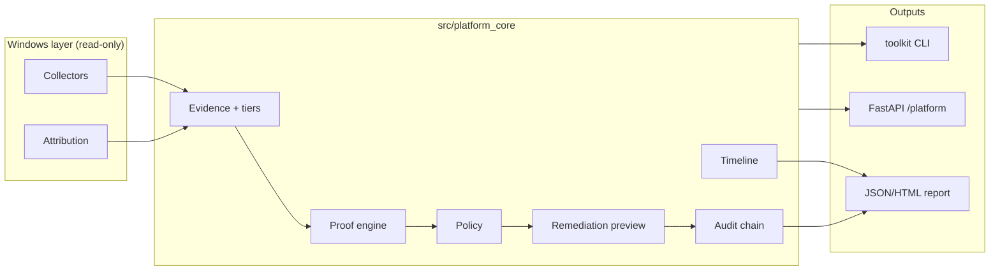

# Endpoint Network Evidence & Risk Toolkit

**One-liner:** An evidence-based Windows endpoint network evidence and IT risk toolkit that detects WinINET proxy drift, attributes registry writers, contrasts TLS paths, scores website risk heuristically, merges timelines, and exports audit-ready reports — with policy-gated remediation preview only.

> **Disclaimer:** This is an **evidence and risk toolkit**, not a full antivirus, EDR, or phishing protection product. Heuristic scores are for IT/security review — not automated blocking verdicts.

Python 3.11+ · Policy-gated · Local-first · 1000+ pytest (CI)

> **Not an AI agent.** This is decision infrastructure: Evidence → Hypothesis → Proof → Policy → Remediation → Audit.

**Primary CLI:** `python -m windows_network_toolkit` (JSON-first) · **Legacy:** `python -m src` (deprecated shim with stderr notice on proxy commands)

**Canonical core:** `src/platform_core/` — classification, proof, policy, audit, timeline. **Facades:** `windows_network_toolkit/` — flat modules delegating to core engines.

| Principle | Enforced |
|-----------|----------|
| Observation != Proof | Evidence tier state machine + proof envelope |
| Correlation != Causation | Guards block destructive unlock |
| Confidence != Certainty | 0–1 ordinal scores with limitations[] |
| Policy Permission != Safety Guarantee | Approval + rollback required |

---

## Who this is for

| Audience | How to use this repo |
|----------|----------------------|
| **IT support** | `proxy-status`, `diagnose --proof`, `proxy-disable --dry-run` — fixture demos need no admin |
| **Endpoint reliability engineers** | Decision pipeline, `proxy-watch`, replay, Prometheus metrics |
| **Security analysts** | Listener vs writer attribution, TLS proof, `UNKNOWN_LOCAL_PROXY` triage |
| **Risk consultants** | [consulting-report.md](docs/consulting-report.md), case studies, audit JSONL |
| **Platform / SRE candidates** | CI safety contracts, deterministic replay, FastAPI platform API |

**Portfolio pack:** [docs/portfolio-summary.md](docs/portfolio-summary.md) · [demo-video-script.md](docs/demo-video-script.md)

---

## Installation

**Requirements:** Python 3.11+, Windows for live probes (fixtures work on any OS)

```powershell
git clone https://github.com/YOUR_ORG/Windows-Network-Recovery-Toolkit.git
cd Windows-Network-Recovery-Toolkit
python -m venv .venv
.\.venv\Scripts\Activate.ps1
pip install -e ".[dev]"
$env:PYTHONPATH = (Get-Location).Path
```

**Verify install:**

```powershell
pytest -q tests/test_portfolio_case_studies.py
python -m windows_network_toolkit proxy-status --fixture tests/fixtures/enert/dead_proxy_59081.json
```

**Optional — API + dashboard:**

```powershell
uvicorn backend.main:app --reload
# http://127.0.0.1:8000/docs  ·  http://127.0.0.1:8000/dashboard/
```

---

## Project structure

```text
windows_network_toolkit/   Primary JSON-first CLI (start here)
src/platform_core/         Canonical decision engine (evidence, proof, policy, audit)
src/proxy_guard/           Windows live probes
backend/                   FastAPI platform API
tests/                     Pytest + safety contracts + golden fixtures
docs/                      Architecture, case studies, portfolio materials
scripts/                   PowerShell/batch wrappers for operators
frontend/                  Next.js operator console (optional)
```

Experimental labs: [labs/README.md](labs/README.md) (not mainline product).

---

## Screenshots

Add demo captures to [docs/screenshots/](docs/screenshots/) before publishing.

| Placeholder | Content |
|-------------|---------|
| `01-browser-proxy-error.png` | Browser error + ping OK |
| `02-proxy-status-json.png` | Classification JSON |
| `03-diagnose-proof.png` | Proof envelope + limitations |
| `04-proxy-disable-dry-run.png` | Dry-run preview |

See [docs/screenshots/README.md](docs/screenshots/README.md) for the full list.

---

## Troubleshooting

| Issue | What to try |
|-------|-------------|
| `ModuleNotFoundError` | Set `$env:PYTHONPATH = (Get-Location).Path` and `pip install -e ".[dev]"` |
| Live probes fail on Linux/macOS | Use `--fixture tests/fixtures/enert/dead_proxy_59081.json` |
| `proxy-disable` does nothing | Default is `--dry-run`; add `--dry-run false --confirm DISABLE_WININET_PROXY` on Windows only after review |
| Low writer attribution confidence | Load Sysmon E13 or use `--fixture registry_writer_observed.json` to see proof upgrade path |
| CI failures locally | `make test` or `pytest -q tests/test_policy_safety_contract.py` first |
| Black/ruff errors | `ruff check .` — formatting debt is non-blocking in CI |

Full FAQ: [docs/faq.md](docs/faq.md)

---

## Safety warning

This toolkit **reads** endpoint state by default. State-changing commands:

- Default to **dry-run**
- Require **typed confirmation** for registry mutations
- **Never** silently kill processes, reset firewall, disable adapters, or modify WinHTTP
- Surface **limitations[]** — does not prove malware, MITM, or full endpoint safety

Do not use heuristic scores as automated blocking verdicts. See [docs/safety_model.md](docs/safety_model.md).

---

## Real case: dead WinINET proxy 127.0.0.1:59081

Golden path used in tests, docs, and demos:

```
ProxyEnable=1, ProxyServer=127.0.0.1:59081, WinHTTP=direct, listener=false
→ DEAD_PROXY_CONFIG + WININET_WINHTTP_MISMATCH
→ diagnose --proof → supported (confidence ~0.92)
→ proxy-disable allowed with --confirm DISABLE_WININET_PROXY
→ does NOT prove malware or MITM
```

```powershell
python -m windows_network_toolkit proxy-status --fixture tests/fixtures/enert/dead_proxy_59081.json
python -m windows_network_toolkit diagnose --proof --fixture tests/fixtures/enert/dead_proxy_59081.json
python -m windows_network_toolkit proxy-disable --dry-run
```

Full case study: [docs/case-studies/dead-localhost-proxy.md](docs/case-studies/dead-localhost-proxy.md)

---

## WinINET vs WinHTTP

| Stack | Used by | This toolkit |
|-------|---------|--------------|
| **WinINET** | Browsers, many desktop apps | Primary observation surface |
| **WinHTTP** | Services, some CLI tools | Contrast path for mismatch detection |

A common failure mode: WinINET points at a **dead localhost proxy** while WinHTTP is direct — ping/`curl` may work, browsers fail. Classification surfaces this as `DEAD_PROXY_CONFIG` with secondary `WININET_WINHTTP_MISMATCH`.

---

## 60-second explanation

Windows can look **online** while browsers and dev tools fail: WinINET/WinHTTP proxy drift, stale localhost listeners, and DNS/HTTPS path differences are common causes. This is **not** a repair script, antivirus, or autonomous containment tool. It is **security observability** and **endpoint reliability** infrastructure: probes → evidence → policy → preview → audit → replay → API/dashboard.

**Epistemic rules:** observation ≠ proof · correlation ≠ causation · confidence is ordinal, not probability · listener match is not registry-writer proof.

---

## Why this is not just a script

| Script mindset | Platform mindset |
|----------------|------------------|
| One-off registry reset | Append-only audit + replay |
| Heuristic = guilt | Evidence levels with upgrade guards |
| Fix immediately | Policy-gated **preview** first |
| Laptop-only | Synthetic fleet (100 endpoints, 20 incidents) |

---

## Architecture

```text
probes → normalization → evidence fusion → reasoning → policy
  → remediation preview → audit → replay → API / dashboard / metrics
```

```text
┌─────────┐   ┌──────────┐   ┌─────────────┐   ┌────────┐   ┌─────────┐
│ Probes  │ → │ Events   │ → │ Evidence    │ → │ Policy │ → │ Preview │
│ WinINET │   │ JSONL    │   │ OBSERVED…   │   │ gates  │   │ dry-run │
└─────────┘   └──────────┘   │ FINAL_CAUS  │   └────────┘   └─────────┘
                             └─────────────┘        │              │
                                                    v              v
                                              ┌─────────────────────────┐
                                              │ Audit → Replay → API/UI │
                                              └─────────────────────────┘
```

Docs: [architecture.md](docs/architecture.md) · [evidence_model.md](docs/evidence_model.md) · [policy_model.md](docs/policy_model.md)

---

## Evidence model

| Level | Claim strength |
|-------|----------------|
| `OBSERVED_ONLY` | Proxy/registry state changed |
| `CORRELATED` | Listener/process match only |
| `PROVEN_REGISTRY_WRITER` | Sysmon E13 / Procmon / ETW |
| `PROVEN_NETWORK_IMPACT` | Browser path impact + writer proof |
| `FINAL_CAUSATION` | Writer + port owner or network impact |

Registry-writer proof when telemetry is available. See [docs/evidence_model.md](docs/evidence_model.md).

---

## Policy model

`ALLOW_OBSERVE` · `PREVIEW_ONLY` · `REQUIRE_TYPED_CONFIRMATION` · `BLOCK_DESTRUCTIVE` · `BLOCK_LOW_CONFIDENCE` · `CORRELATION_ONLY_ALERT`

No silent process kill · no firewall reset · no adapter disable · no registry mutation without typed confirmation · API execute `dry_run=true` by default.

See [docs/policy_model.md](docs/policy_model.md) · [docs/safety_model.md](docs/safety_model.md).

---

## Core workflow

```text
Evidence → Hypothesis → Proof → Policy → Remediation → Audit → Replay → Learning
```

**Canonical modules** (`src/platform_core/`):

| Module | Responsibility |
|--------|----------------|
| `evidence/` | Typed records, tiers, guards, chain of custody |
| `attribution/` | WinINET/WinHTTP/proxy listener + **registry writer** attribution (read-only) |
| `proof/` | DNS / TCP / HTTP direct vs proxied contrast |
| `tls/` | TLS certificate contrast (direct vs proxied), root CA audit, MITM indicators |
| `website_risk/` | Local heuristic URL risk + optional reputation plugins (no hard-coded API keys) |
| `evidence_report/` | Merged timeline + confidence model reports (JSONL / Markdown / HTML) |
| `timeline/` | Incident timeline normalization |
| `remediation/` | Policy-gated preview, rollback, approval tokens |
| `policy/` | Tier gates — no silent destructive actions |
| `audit/` | Hash-chained JSONL |
| `governance/` | Control mapping, chain verification |

**Windows portfolio** (`windows_network_toolkit/`) — collectors, CLI, reports, API. Platform logic stays in `src/platform_core/`; Windows probes stay isolated.

Package: [`windows_network_toolkit/`](windows_network_toolkit/) — collectors, evidence, decision, remediation, audit, platform API.

### Architecture (consolidated)



Implementation plan: [docs/IMPLEMENTATION_PLAN_ERP.md](docs/IMPLEMENTATION_PLAN_ERP.md)

## Diagnostic CLI (read-only by default)

**Primary:** `python -m windows_network_toolkit` · All commands emit JSON.

```powershell
pip install -e ".[dev]"
$env:PYTHONPATH = (Get-Location).Path

# Proxy state + full classification result
python -m windows_network_toolkit proxy-status
python -m windows_network_toolkit proxy-status --fixture tests/fixtures/enert/dead_proxy_59081.json

# Structured proof envelope
python -m windows_network_toolkit diagnose --proof
python -m windows_network_toolkit diagnose --proof --fixture tests/fixtures/enert/dead_proxy_59081.json

# Process owner (JSON)
python -m windows_network_toolkit proxy-owner

# Safe remediation (dry-run default)
python -m windows_network_toolkit proxy-disable --dry-run
python -m windows_network_toolkit proxy-disable --dry-run false --confirm DISABLE_WININET_PROXY

# Reverter watch (read-only, logs to .audit/proxy-watch.jsonl)
python -m windows_network_toolkit proxy-watch --duration 60 --interval 2

# Timeline + incident report from .audit/
python -m windows_network_toolkit proxy-timeline --audit-only
python -m windows_network_toolkit proxy-report --fixture tests/fixtures/enert/dead_proxy_59081.json

# Registry writer attribution (Sysmon E13 when available)
python -m windows_network_toolkit proxy-writer-attribution
python -m windows_network_toolkit proxy-writer-attribution --fixture registry_writer_observed.json

# TLS / MITM evidence (direct vs proxied certificate contrast)
python -m windows_network_toolkit tls-proof --url https://example.com
python -m windows_network_toolkit tls-proof --url https://example.com --fixture tls_cert_mismatch.json

# Website risk scoring (local heuristics; optional VT/Safe Browsing via env keys)
python -m windows_network_toolkit website-risk --url https://example.com
python -m windows_network_toolkit website-risk --url https://paypa1-secure-login.tk/signin --fixture suspicious_domain.json

# Merged evidence report (proxy + TLS + website risk + timeline)
python -m windows_network_toolkit evidence-report --url https://example.com --format markdown
python -m windows_network_toolkit evidence-report --url https://example.com --format jsonl --out reports/evidence.jsonl

# Direct vs proxied path proof
python -m windows_network_toolkit proxy-proof --url https://example.com

# 502 / bad gateway (full ERP path)
python -m windows_network_toolkit bad-gateway-diagnose --url https://example.com

# Verify audit hash chain
python -m windows_network_toolkit audit verify logs/canonical_decision_audit.jsonl
```

**Example `proxy-status` output:**

```json
{
  "wininet": { "ProxyEnable": 1, "ProxyServer": "127.0.0.1:59081" },
  "winhttp": { "direct_access": true },
  "localhost_port": 59081,
  "classification": "DEAD_PROXY_CONFIG",
  "classification_result": {
    "primary_classification": "DEAD_PROXY_CONFIG",
    "secondary_signals": ["WININET_WINHTTP_MISMATCH", "DEAD_LOCALHOST_PORT"],
    "confidence": 0.92,
    "limitations": ["Does not prove malware or MITM."]
  }
}
```

**Docs:** [classification-model.md](docs/classification-model.md) · [proof-vs-observation.md](docs/proof-vs-observation.md) · [interview-case-study.md](docs/interview-case-study.md) · [three-minute-demo-script.md](docs/three-minute-demo-script.md)

**Safety:** All commands above are diagnostic/preview-only. No registry write, process kill, firewall reset, or adapter disable without typed confirmation + policy gate + rollback plan + audit.

## Replay demo (non-Windows safe)

```powershell
pip install -e ".[dev]"
$env:PYTHONPATH = (Get-Location).Path
python -m toolkit replay windows_network_toolkit/examples/proxy_drift_incident.jsonl
python -m toolkit report windows_network_toolkit/examples/proxy_drift_incident.jsonl --format markdown
uvicorn backend.main:app --reload
# Dashboard: http://127.0.0.1:8000/dashboard/
```

## 10-minute demo — Endpoint Network Evidence & Risk (fixture-safe)

All steps below are **read-only** / **preview-only**. Use fixtures on any OS; live probes require Windows + network.

```powershell
pip install -e ".[dev]"
$env:PYTHONPATH = (Get-Location).Path

# 1) Baseline — no proxy
python -m windows_network_toolkit proxy-status
python -m windows_network_toolkit proxy-writer-attribution --fixture no_proxy.json

# 2) Known dev proxy vs unknown localhost proxy
python -m windows_network_toolkit proxy-writer-attribution --fixture known_dev_proxy.json
python -m windows_network_toolkit proxy-writer-attribution --fixture unknown_localhost_proxy.json

# 3) Proxy writer attribution (Sysmon E13 replay)
python -m windows_network_toolkit proxy-writer-attribution --fixture registry_writer_observed.json

# 4) MITM risk — TLS certificate mismatch + suspicious root CA
python -m windows_network_toolkit tls-proof --url https://example.com --fixture tls_cert_mismatch.json
python -m windows_network_toolkit tls-proof --url https://example.com --fixture suspicious_root_ca.json

# 5) Website risk scoring (heuristic replay)
python -m windows_network_toolkit website-risk --url https://example.com --fixture suspicious_domain.json
python -m windows_network_toolkit website-risk --url https://bit.ly/abc --fixture redirect_phishing.json

# 6) Merged evidence report with confidence model (Observation → Hypothesis → Proof)
python -m windows_network_toolkit evidence-report --url https://example.com `
  --fixture registry_writer_observed.json --format markdown

# 7) Golden proxy drift replay (existing ERP fixture)
python -m toolkit replay windows_network_toolkit/examples/proxy_drift_incident.jsonl
```

**Optional reputation plugins** (never hard-coded — configure via environment only):

| Plugin | Environment variable |
|--------|---------------------|
| VirusTotal | `VIRUSTOTAL_API_KEY` |
| Google Safe Browsing | `GOOGLE_SAFEBROWSING_API_KEY` |
| URLHaus | `URLHAUS_API_KEY` |
| PhishTank | `PHISHTANK_API_KEY` |

Without keys, `website-risk` falls back to **local heuristic scoring** and documents limitations in output.

**Proxy risk classifications (12 primaries):** `NO_PROXY` · `DEAD_PROXY_CONFIG` · `LOCAL_PROXY_ACTIVE` · `UNKNOWN_LOCAL_PROXY` · `KNOWN_DEV_PROXY` · `KNOWN_SECURITY_TOOL` · `SUSPICIOUS_PROXY` · `POSSIBLE_MITM_RISK` · `PAC_CONFIGURED` · `WININET_WINHTTP_MISMATCH` · `REVERTER_SUSPECTED` · `ERROR_INSUFFICIENT_DATA`. See [docs/classification-model.md](docs/classification-model.md).

## 5-minute demo (no admin, no host mutation)

```powershell
make demo-healthy
make demo-proxy-drift
make demo-final-causation
make demo-fleet-enterprise
make demo-production
```

## Audit model

Unified append-only JSONL under **`.audit/`** (configurable via `WNT_AUDIT_DIR`):

| File | Events |
|------|--------|
| `proxy-status.jsonl` | Status reads + classification |
| `proxy-disable.jsonl` | Remediation before/after |
| `proxy-watch.jsonl` | Drift + reverter suspects |

Legacy `logs/repair_audit.jsonl` remains readable for backward compatibility.

Timeline merge: `python -m windows_network_toolkit proxy-timeline --audit-only`

---

## Enterprise portfolio docs

| Doc | Audience |
|-----|----------|
| [portfolio-summary.md](docs/portfolio-summary.md) | LinkedIn, resume, interview pitch |
| [case-study-1-proxy-drift.md](docs/case-study-1-proxy-drift.md) | Dead localhost proxy (59081) |
| [case-study-2-unknown-local-proxy-listener.md](docs/case-study-2-unknown-local-proxy-listener.md) | Listener ≠ writer |
| [case-study-3-endpoint-reliability-decision-engine.md](docs/case-study-3-endpoint-reliability-decision-engine.md) | Decision pipeline |
| [consulting-report.md](docs/consulting-report.md) | Manager-facing risk assessment |
| [demo-video-script.md](docs/demo-video-script.md) | 3–5 minute demo script |
| [case-studies/dead-localhost-proxy.md](docs/case-studies/dead-localhost-proxy.md) | Golden 59081 (technical) |
| [interview-case-study.md](docs/interview-case-study.md) | STAR walkthrough |
| [big4-cyber-risk-positioning.md](docs/big4-cyber-risk-positioning.md) | Audit / cyber risk |
| [faang-platform-engineering-positioning.md](docs/faang-platform-engineering-positioning.md) | Platform eng |

---

## Roadmap (not yet implemented)

- Sysmon/Event Log integration for writer causation
- Windows service mode · signed packaging
- Dashboard evidence tree · fleet aggregation
- RBAC, SIEM export, Prometheus, policy-as-code

See [production-readiness.md](docs/production_readiness.md).

---

## Safety guarantees

- **Observation ≠ proof** — evidence tiers gate destructive unlock
- **Correlation ≠ causation** — listener match is not registry-writer proof
- **Confidence is ordinal** — not probability; no false precision
- **Policy permission ≠ safety guarantee** — approval + rollback still required
- Preview-only remediation by default; destructive verbs registry-blocked
- Typed confirmation for registry mutations
- Synthetic fixtures in git; real `logs/` and `platform_data/` gitignored
- Local-first — no default cloud upload

**This platform is not:** antivirus, autonomous containment, or a destructive repair script.

## What is not guaranteed

- Malware identification or removal
- Autonomous containment
- Writer attribution without Sysmon/Procmon-class telemetry
- Production authentication (demo RBAC headers only)

---

## API surface

| Endpoint | Purpose |
|----------|---------|
| `GET /health` | ERP service liveness (`endpoint-reliability-decision-platform`) |
| `GET /platform/status` | Platform status |
| `POST /platform/diagnose` | Run evidence → decision pipeline |
| `GET /platform/evidence/timeline` | Latest incident timeline |
| `GET /platform/decision/latest` | Latest decision result |
| `GET /platform/audit/logs` | ERP audit JSONL tail |
| `POST /platform/replay` | Replay JSONL fixture |
| `POST /platform/remediation/preview` | Policy-gated preview |
| `POST /platform/remediation/confirm` | Confirmation alias (dry-run safe) |
| `GET /platform/health` | Legacy platform liveness |
| `GET /metrics` | Prometheus |

OpenAPI: `http://localhost:8000/docs` after `docker compose up`.

## Dashboard

- **Portfolio demo:** `GET /dashboard/` — static FastAPI UI (12 sections, replay button)
- **Production UI:** `frontend/app/platform/` — Next.js operator console

---

## Observability

Prometheus gauges: `proxy_drift_incidents_total`, `evidence_level_total_*`, `policy_decisions_total_*`, `remediation_preview_total`, `fleet_endpoints_total`.

Dashboard: `frontend/app/platform/` — incidents, evidence, policy, replay, SLO.

[docs/observability.md](docs/observability.md)

---

## Tests and CI

```powershell
# Portfolio smoke (fast, fixture-safe)
pytest -q tests/test_portfolio_case_studies.py

# Safety contracts (run before any PR)
pytest -q tests/test_policy_safety_contract.py tests/test_api_dry_run_default.py
pytest -q tests/test_evidence_level_contract.py tests/test_fixture_regression_demo.py

# Full suite
pytest -q
make test
make lint
```

| Workflow | Purpose |
|----------|---------|
| [.github/workflows/ci.yml](.github/workflows/ci.yml) | ruff, bandit, pytest, safety contracts, fixture smoke, Windows zero-skip |
| [.github/workflows/security.yml](.github/workflows/security.yml) | pip-audit, Trivy filesystem + container scan |
| [.github/workflows/lint.yml](.github/workflows/lint.yml) | Additional lint on schedule |

---

## Production readiness

Checklist: [docs/production_readiness.md](docs/production_readiness.md) · Deployment: [docs/production_deployment.md](docs/production_deployment.md)

Public release: [PUBLIC_RELEASE_CHECKLIST.md](PUBLIC_RELEASE_CHECKLIST.md)

---

## Case study: browser fails but DNS/ping works (proxy drift)

**Symptom:** Browser shows `ERR_PROXY_CONNECTION_FAILED` or HTTP 502; `ping` and `nslookup` succeed.

**Observation:** WinINET `ProxyEnable=1`, `ProxyServer=127.0.0.1:8080`.

**Correlation:** No process listening on `:8080` → `DEAD_PROXY_CONFIG`.

**Proof:** `proxy-proof --url https://example.com` — direct path HTTP 200, system-proxy path HTTP 502 → `LOCAL_PROXY_UPSTREAM_FAILURE`.

**Policy:** Evidence tier below `FINAL_CAUSATION` → `PREVIEW_ONLY`; disable proxy blocked until approval + rollback reviewed.

**Remediation preview:** `disable_wininet_proxy` shown as registry mutation preview only — **not executed**.

**Audit:** Hash-chained JSONL + report with chain of custody. Sample fixture: [tests/fixtures/erp/sample_audit_report.json](tests/fixtures/erp/sample_audit_report.json).

## Case study: ERR_PROXY_CONNECTION_FAILED

WinINET `ProxyEnable=1` with `ProxyServer=127.0.0.1:PORT` can break browsers while ping/DNS succeed. The platform correlates registry, listener, and path probes, classifies `WININET_PROXY_DRIFT`, and recommends `DISABLE_WININET_PROXY_WITH_CONFIRMATION` only after policy gates pass.

## Big 4 / IT Risk use case

Audit-ready reports (JSON/Markdown/HTML) with executive summary, timeline, evidence, decision, policy gate, remediation preview, rollback plan, and audit trail. See [docs/case_study_mttr_evidence_diagnosis.md](docs/case_study_mttr_evidence_diagnosis.md).

## SRE / Platform Engineering use case

Deterministic replay, append-only audit JSONL, Prometheus metrics, fleet simulation, and CI contract tests — suitable for incident review workflows and platform reliability interviews.

## Interview explanation

> I built an endpoint reliability decision platform that diagnoses Windows proxy-related network failures by correlating registry, process, network, browser, and proof signals. The system produces an incident timeline, classifies risk, recommends policy-gated remediation, and exports an audit-ready report.

STAR write-up: [docs/interview_case_study_tier1.md](docs/interview_case_study_tier1.md)

---

## Known limitations

- Windows-first live probes; Linux CI uses inject fixtures under `tests/fixtures/erp/`
- Legacy root `platform_core/` fleet modules coexist; canonical path is `src/platform_core/`
- Black formatting debt in some modules (CI continue-on-error)

---

## From Windows Toolkit to Multi-Domain Decision Platform

Windows proxy drift, security alerts, cloud incidents, infrastructure failures, and market events are all **event-state decision problems**. The platform normalizes events, builds evidence, ranks hypotheses, scores decisions, applies policy, tracks outcomes, and supports replay — **research / preview / recommendation only** (not autonomous execution, not a trading bot).

> *This project transforms noisy events across Windows, Security, Cloud, Infrastructure, and Market domains into evidence-backed, policy-gated, replayable decision recommendations.*

```bash
python -m src platform events
python -m src platform evidence --event-id win-proxy-localhost-001
python -m src platform decide --event-id win-proxy-localhost-001
python -m src platform replay
python -m src platform metrics
```

**Risk framing:** observation ≠ proof · correlation ≠ causation · confidence ≠ certainty · recommendation ≠ execution permission.

Full design: [docs/multi_domain_decision_platform.md](docs/multi_domain_decision_platform.md)

---

## Labs (experimental — not mainline)

Edge simulation and legacy experiments: [labs/README.md](labs/README.md)

---

## Quick links

| Topic | Doc |
|-------|-----|
| Full CLI reference | [docs/cli_reference.md](docs/cli_reference.md) |
| Threat model | [docs/threat_model.md](docs/threat_model.md) |
| Documentation index | [docs/DOCUMENTATION_INDEX.md](docs/DOCUMENTATION_INDEX.md) |
| Tier-1 walkthrough | [docs/tier1_demo_walkthrough.md](docs/tier1_demo_walkthrough.md) |

---

## License

MIT — see [LICENSE](LICENSE).
