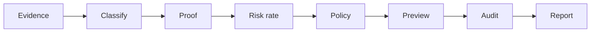

# Technology Risk & Control Analytics Platform

This project demonstrates how **endpoint reliability evidence** can be converted into **technology risk decisions**. It diagnoses proxy drift and TLS path issues, classifies incidents with **proof tiers (T0–T4)**, blocks unsafe remediation by default, and generates **audit-ready governance reports** with replay verification.

**One-line summary:** An AI-assisted Technology Risk & Control Analytics Platform that transforms endpoint reliability evidence into risk hypotheses, explainable recommendations, human-reviewed decisions, and auditable governance reports.

> **Not** antivirus · **Not** EDR/XDR · **Not** autonomous remediation · **Not** malware detection or intrusion prevention.

**Portfolio:** [PORTFOLIO.md](PORTFOLIO.md) · **3-min demo:** [docs/demo-script.md](docs/demo-script.md) · **Architecture:** [docs/architecture.md](docs/architecture.md) · **Case studies:** [docs/portfolio-case-study-1-dead-wininet-proxy.md](docs/portfolio-case-study-1-dead-wininet-proxy.md)

---

## What this proves in an interview

- **Evidence-based diagnosis** — WinINET/WinHTTP/TLS evidence with explicit limitations  
- **Control testing** — mature control tests (PASS/FAIL/PARTIAL/NOT_TESTED) per incident class  
- **Policy-gated automation** — dry-run default, typed confirmation for registry paths  
- **Auditability** — append-only hash-chained JSONL + tamper detection  
- **Human-in-the-loop governance** — `RiskDecisionRecord`, human-review queue, proof tiers  
- **Responsible AI boundary** — AI assists explanation; does not authorize execution  
- **Platform engineering discipline** — fixtures, CI safety contracts, deterministic replay  

---

## Problem statement

Windows endpoints often appear “online” while browsers and business apps fail. Common causes include WinINET/WinHTTP proxy drift, dead localhost proxy ports, and TLS path differences. Teams waste cycles when:

- IT resets settings without evidence  
- Security escalates without proof tier  
- Audit cannot reconstruct who decided what  
- Risk committees lack incident KPIs  

---

## Why this matters for technology risk

| Stakeholder | Value |
|-------------|-------|
| IT / Endpoint support | Structured diagnosis instead of ad-hoc registry edits |
| Security | Triage without false malware accusations |
| Compliance / Audit | Hash-chained JSONL + governance reports |
| Risk committees | KPI rollups, control tests, risk ratings with limitations |
| Platform / SRE | Deterministic replay, CI safety contracts |

---

## PL-300 / Power BI Analytics Layer

This repository includes a **Power BI-ready portfolio layer** aligned with Microsoft PL-300 skills. It is a semantic model and dashboard **specification** with sample CSV data — not a published enterprise Power BI Service deployment.

| PL-300 skill | Repository evidence |
|--------------|---------------------|
| **Prepare the data** | `analytics-export-powerbi` CLI; JSONL → CSV normalization ([data_preparation.md](analytics/powerbi/model/data_preparation.md)) |
| **Model the data** | Star schema: facts + dimensions ([star_schema.md](analytics/powerbi/model/star_schema.md)) |
| **Visualize and analyze** | DAX measures + 4-page dashboard spec ([dax_measures.md](analytics/powerbi/model/dax_measures.md), [technology_risk_dashboard_spec.md](analytics/powerbi/reports/technology_risk_dashboard_spec.md)) |
| **Manage and secure** | RLS design, refresh assumptions, AI boundaries ([governance_and_security.md](analytics/powerbi/model/governance_and_security.md)) |

```powershell
# Regenerate sample CSVs
python -m windows_network_toolkit analytics-export-powerbi --portfolio-sample --out-dir analytics/powerbi/data

# Export from audit JSONL
python -m windows_network_toolkit analytics-export-powerbi `
  --audit-dir tests/fixtures/risk_analytics/audit_sample `
  --out-dir analytics/powerbi/exports --include-seed
```

Sample datasets: [analytics/powerbi/data/](analytics/powerbi/data/) · Overview: [analytics/powerbi/README.md](analytics/powerbi/README.md)

---

## Architecture overview

```text
Evidence collection → Classification → Proof / control tests → Policy gates
  → Remediation preview → Audit trail → Governance reporting → Replay verification
```



Details: [docs/architecture.md](docs/architecture.md)

---

## Evidence-to-action workflow

Six principles (`evidence_to_action.v1`):

1. **Observation is not proof**  
2. **Correlation is not causation**  
3. **Confidence is not certainty** (ordinal, not probability)  
4. **Classification is not accusation**  
5. **Policy permission is not safety guarantee**  
6. **Recommendation is not execution authority**  

```text
Collect → Classify → Prove → Rate risk → Policy → Preview → Audit → Report → Replay
```

Spec: [docs/evidence_to_action_governance_model.md](docs/evidence_to_action_governance_model.md)

---

## Core commands

```powershell
pip install -e ".[dev]"
$env:PYTHONPATH = (Get-Location).Path

# Evidence & classification
python -m windows_network_toolkit proxy-status --fixture examples/evidence/DEAD_PROXY_CONFIG.json
python -m windows_network_toolkit diagnose --proof --fixture examples/evidence/DEAD_PROXY_CONFIG.json

# Risk & governance
python -m windows_network_toolkit risk-assess --fixture tests/fixtures/case_studies/case_1_dead_wininet_proxy.json
python -m windows_network_toolkit control-test --fixture tests/fixtures/case_studies/case_1_dead_wininet_proxy.json
python -m windows_network_toolkit risk-kpi-summary --audit-dir tests/fixtures/risk_analytics/audit_sample --format markdown
python -m windows_network_toolkit governance-report --audit-dir tests/fixtures/risk_analytics/audit_sample --format markdown

# Evidence report & audit
python -m windows_network_toolkit evidence-report --url https://example.com --fixture tests/fixtures/enert/dead_proxy_59081.json --format markdown
python -m windows_network_toolkit audit verify tests/fixtures/analytics/audit_sample/incidents.jsonl

# Intermittent proxy soak (Windows)
make proxy-intermittent
```

Legacy / extended CLI: `python -m src` · Full reference: [docs/cli_reference.md](docs/cli_reference.md)

---

## Safety boundaries

| Allowed by default | Blocked without explicit human confirmation |
|--------------------|---------------------------------------------|
| Read registry / netstat | Registry mutation |
| Classify & prove | Process kill |
| Preview remediation | Firewall reset |
| Append audit logs | Adapter disable |
| Fixture replay | Autonomous remediation |

`proxy-disable` defaults to **dry-run**. Live apply requires `--dry-run false --confirm DISABLE_WININET_PROXY`.

See [docs/safety_model.md](docs/safety_model.md) · [SECURITY.md](SECURITY.md)

---

## Demo scenario

**Symptom:** Browser `ERR_PROXY_CONNECTION_FAILED`; ping/DNS OK.  
**Evidence:** WinINET `127.0.0.1:59081`, no listener, WinHTTP direct.  
**Classification:** `DEAD_PROXY_CONFIG` + `WININET_WINHTTP_MISMATCH`.  
**Policy:** `PREVIEW_ONLY` until typed confirmation.  

Step-by-step: [docs/demo-script.md](docs/demo-script.md)

```powershell
python -m windows_network_toolkit proxy-status --fixture examples/evidence/DEAD_PROXY_CONFIG.json
python -m windows_network_toolkit diagnose --proof --fixture examples/evidence/DEAD_PROXY_CONFIG.json
```

---

## Example outputs

**Classification JSON** (abbreviated):

```json
{
  "classification": "DEAD_PROXY_CONFIG",
  "classification_result": {
    "primary_classification": "DEAD_PROXY_CONFIG",
    "secondary_signals": ["WININET_WINHTTP_MISMATCH"],
    "confidence": 0.92,
    "limitations": ["Does not prove malware or MITM."]
  },
  "governance": { "execution_authority": "preview_only" }
}
```

**Sample reports:** [examples/reports/](examples/reports/) · **Sample evidence:** [examples/evidence/](examples/evidence/)

---

## Audit trail design

| Store | Purpose |
|-------|---------|
| `.audit/*.jsonl` | Operator actions (status, disable preview, watch) |
| `tests/fixtures/risk_analytics/audit_sample/` | KPI / governance demo data |
| Hash chain | `audit verify` integrity check |

Every decision output can include `governance` envelope + limitations. AI reasoning (when used) logs `provider` and `audit_id` — advisory metadata only.

---

## What AI assisted with

Documented in [docs/ai-assisted-delivery.md](docs/ai-assisted-delivery.md):

- README and portfolio narrative structure  
- Markdown report templates  
- Test case scaffolding ideas  
- Demo script drafting  

Implementation: `src/platform_core/ai_risk_analyst/` — rule-based analyst with guardrails; optional LLM provider when API key present.

---

## What AI does not decide

- Proxy disable / registry changes  
- Process termination  
- Malware or compromise verdicts  
- Confirmed MITM claims  
- Control effectiveness attestation  
- Regulatory sign-off  

Final decisions require **evidence + policy + human review**.

---

## Business value

- **Faster MTTR** with evidence-first diagnosis  
- **Reduced false escalations** to security  
- **Audit-ready artifacts** for technology risk forums  
- **Teachable platform patterns** — event sourcing, policy gates, replay  
- **Portfolio credibility** for risk and platform roles  

Framework mapping: [docs/framework_mapping.md](docs/framework_mapping.md) · Risk register: [docs/risk_register.md](docs/risk_register.md)

---

## Interview talking points

1. **“Why not just a PowerShell fix script?”** — Audit trail, proof tiers, policy gates, replay.  
2. **“How do you avoid accusing users of malware?”** — Classification is not accusation; limitations on every output.  
3. **“How do you prevent autonomous damage?”** — Dry-run default, typed tokens, CI safety contracts.  
4. **“Where does AI fit?”** — Explanation and documentation acceleration; decisions stay evidence-backed.  
5. **“Show me auditability.”** — JSONL hash chain + governance-report from audit dir.  

Extended materials: [PORTFOLIO.md](PORTFOLIO.md) · [docs/big4_interview_pitch.md](docs/big4_interview_pitch.md) · [docs/cyber_risk_consultant_demo.md](docs/cyber_risk_consultant_demo.md)

---

## Installation

```powershell
git clone <repo-url>
cd Windows-Network-Recovery-Toolkit
python -m venv .venv
.\.venv\Scripts\Activate.ps1
pip install -e ".[dev]"
$env:PYTHONPATH = (Get-Location).Path
pytest -q tests/test_portfolio_case_studies.py tests/test_portfolio_evidence_suite.py
```

---

## Project structure

```text
src/platform_core/         Canonical decision engine
windows_network_toolkit/   Primary JSON-first CLI
examples/evidence/         Portfolio evidence fixtures
analytics/powerbi/         PL-300 Power BI CSV layer + model docs
tests/                     Safety contracts + portfolio tests
docs/                      Architecture, demos, case studies
backend/                   FastAPI platform API
```

---

## Tests and CI

```powershell
make test          # Full pytest suite
make lint          # Ruff
make typecheck     # Mypy (portfolio modules: ai_risk_analyst, risk, governance, analytics)
pytest -q tests/test_policy_safety_contract.py
pytest -q tests/test_portfolio_evidence_suite.py
pytest -q tests/test_powerbi_analytics.py
```

GitHub Actions: lint · test · typecheck · build-smoke · Windows zero-skip — [.github/workflows/ci.yml](.github/workflows/ci.yml)

---

## Documentation index

| Doc | Purpose |
|-----|---------|
| [PORTFOLIO.md](PORTFOLIO.md) | Interview pack |
| [docs/architecture.md](docs/architecture.md) | Layered architecture |
| [docs/ai-assisted-delivery.md](docs/ai-assisted-delivery.md) | AI usage & guardrails |
| [docs/demo-script.md](docs/demo-script.md) | 3-minute demo |
| [analytics/powerbi/README.md](analytics/powerbi/README.md) | PL-300 / Power BI layer |
| [docs/control-matrix.md](docs/control-matrix.md) | Control mapping |
| [docs/DOCUMENTATION_INDEX.md](docs/DOCUMENTATION_INDEX.md) | Full index |

---

## License

MIT — see [LICENSE](LICENSE).
