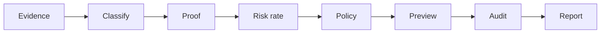

# Technology Risk & Control Analytics Platform

**In 30 seconds:** Windows endpoints often fail while still “online” — dead localhost proxies, WinINET/WinHTTP drift, TLS path mismatches. This repository **collects deterministic evidence**, **classifies incidents** with proof tiers (T0–T5), **runs control tests**, **gates remediation** (preview-only by default), and **exports audit-backed governance reports** and Power BI star-schema CSVs. It is an **evidence pipeline for technology risk** — not a repair bot or security product.

| If you are… | Start here |
|-------------|------------|
| **FAANG / platform / SRE** | [docs/faang-platform-review.md](docs/faang-platform-review.md) · [docs/state-machine.md](docs/state-machine.md) · [docs/api-trisk-examples.md](docs/api-trisk-examples.md) |
| **Big 4 / technology risk / audit** | [docs/big4-interview-defense.md](docs/big4-interview-defense.md) · [docs/control-matrix.md](docs/control-matrix.md) · [reports/sample_governance_report.md](reports/sample_governance_report.md) |
| **Power BI / PL-300** | [docs/powerbi-interview-story.md](docs/powerbi-interview-story.md) · [analytics/powerbi/report_blueprint.md](analytics/powerbi/report_blueprint.md) |
| **3-minute live demo** | [docs/interview-demo-3min.md](docs/interview-demo-3min.md) · [docs/replay-demo.md](docs/replay-demo.md) |

**One-line summary:** An evidence-backed platform that turns Windows endpoint reliability signals into explainable classifications, control test results, policy-gated remediation previews, hash-chained audit trails, and committee-ready analytics.

**Portfolio:** [PORTFOLIO.md](PORTFOLIO.md) · **Architecture (Mermaid):** [docs/architecture-infographic.md](docs/architecture-infographic.md) · **Case study:** [docs/one-page-case-study-dead-proxy.md](docs/one-page-case-study-dead-proxy.md) · **Onboarding:** [docs/ONBOARDING.md](docs/ONBOARDING.md)

---

## Ten-minute orientation (new engineers)

Read in this order to understand structure and core flows without running Windows repair scripts:

| Step | Doc / command | What you learn |
|------|---------------|----------------|
| 1 | This README — **Non-claims** + **Safety boundaries** | What the repo is *not*; dry-run defaults |
| 2 | [docs/DOCUMENTATION_INDEX.md](docs/DOCUMENTATION_INDEX.md) | Full doc map and golden case `59081` |
| 3 | [AGENTS.md](AGENTS.md) | Contributor safety rules and test conventions |
| 4 | `python -m windows_network_toolkit version` | Installed package version (no side effects) |
| 5 | [docs/evidence_to_action_governance_model.md](docs/evidence_to_action_governance_model.md) | Six governance principles |
| 6 | [docs/enterprise-hardening-roadmap.md](docs/enterprise-hardening-roadmap.md) | Phases 1–8 (agent, observability, rollback preview) |

**Repository map (verified paths):**

```text
windows_network_toolkit/   Primary CLI — proxy-status, diagnose, governance-report, agent *
src/platform_core/         Canonical policy, evidence tiers, remediation preview, audit writers
platform_core/             Platform JSONL storage, classic policy previews, fleet helpers
backend/                   FastAPI — /trisk/*, /platform/*, /v1/enterprise/* (optional Postgres)
tests/                     Safety contracts, fixtures, replay — run before risky edits
docs/                      Architecture, demos, audit defense, operational runbooks
```

**Core flow (read-only by default):** collect evidence → classify with `limitations[]` → control tests → policy gate → remediation **preview** → append audit JSONL → governance report / Power BI export.

**Audit evidence to inspect after a demo:** `tests/fixtures/risk_analytics/audit_sample/` (KPI fixtures), `platform_data/audit.jsonl` (when platform API used), `logs/rollback_audit.jsonl` (rollback preview rows), `.audit/*.jsonl` (operator CLI actions).

---

## Non-claims and boundaries

This project **does not** and **must not** be presented as:

| We do **not** claim | What we **do** instead |
|---------------------|-------------------------|
| Antivirus, EDR, XDR, or MITM detection | Path/listener/TLS **evidence** with explicit `limitations[]` |
| Malware or compromise verdicts | Reliability triage labels (`DEAD_PROXY_CONFIG`, not `MALWARE_DETECTED`) |
| Autonomous remediation | Dry-run default; typed confirmation for registry mutations |
| AI-authorized execution | AI assists **explanation only** — humans authorize apply |
| Formal audit opinions | Governance reports are **management information** for committees |
| Process kill / firewall reset / adapter disable by default | Blocked in policy registry; not default CLI behavior |

Safety contracts are enforced in CI: `tests/test_proxy_classifier_safety_contract.py`, `tests/test_policy_safety_contract.py`. ADR: [docs/adr/ADR-portfolio-positioning.md](docs/adr/ADR-portfolio-positioning.md).

---

## Production-like prototype upgrades

Reviewer-facing artifacts for a **production-shaped platform prototype** (still portfolio scope — not shipped enterprise software):

| Artifact | Path |
|----------|------|
| Real evidence case pack | [real_evidence/case-001-dead-proxy/](real_evidence/case-001-dead-proxy/) |
| Production readiness gap table | [docs/production-readiness-gap.md](docs/production-readiness-gap.md) |
| Threat model (10 abuse scenarios) | [docs/threat-model.md](docs/threat-model.md) |
| Reviewer demo CLI | `python -m windows_network_toolkit reviewer-demo --mode big4\|faang\|mixed` |
| Fleet simulate (primary CLI) | `python -m windows_network_toolkit fleet-simulate --scenario mixed_proxy_failures --endpoints 100 --seed 42` |
| Docker reviewer demo | [docs/docker-demo.md](docs/docker-demo.md) |

### Reviewer Docker Demo (Option C)

| Stack | Compose file | Services | Use case |
|-------|--------------|----------|----------|
| **Full platform** | `docker-compose.yml` | API + Postgres + Prometheus + Grafana | Production-shaped local stack |
| **Reviewer demo** | `docker-compose.demo.yml` | API only (`DEMO_MODE=true`, fixture volumes) | Hiring panels, read-only `/trisk/*` |

```bash
docker compose -f docker-compose.demo.yml up --build
curl -s http://127.0.0.1:8000/health   # {"status":"ok","mode":"demo"}
make demo-up demo-health demo-report
```

Legacy `python -m src fleet-simulate` remains unchanged.

---

## What this proves in an interview

- **Evidence-based diagnosis** — WinINET/WinHTTP/TLS evidence with explicit limitations  
- **Control testing** — mature control tests (PASS/FAIL/PARTIAL/NOT_TESTED) per incident class  
- **Policy-gated automation** — dry-run default, typed confirmation for registry paths  
- **Auditability** — append-only hash-chained JSONL + tamper detection  
- **Human-in-the-loop governance** — `RiskDecisionRecord`, human-review queue, proof tiers  
- **Responsible AI boundary** — AI assists explanation; does not authorize execution  
- **Platform engineering discipline** — fixtures, CI safety contracts, deterministic replay  

Deterministic classifiers (`proxy_state_machine.py`), fixture replay tests, safety contract CI, hash-chained audit verification, and explicit `limitations[]` on every classification output. See [docs/anti-code-paste-defense.md](docs/anti-code-paste-defense.md) · [docs/test-strategy.md](docs/test-strategy.md).

---

## FAANG engineering review checklist

| Check | Evidence |
|-------|----------|
| Deterministic classifiers | `pytest tests/test_proxy_state_transitions.py` |
| Safety contracts | `pytest tests/test_proxy_classifier_safety_contract.py` |
| Full test suite | `pytest -q` |
| Audit hash chain | `tests/platform_core/governance/test_audit_tamper_detection.py` |
| Replay determinism | [docs/replay-demo.md](docs/replay-demo.md) |
| State machine | [docs/state-machine.md](docs/state-machine.md) |
| Platform review pack | [docs/faang-platform-review.md](docs/faang-platform-review.md) |
| API examples | [docs/api-trisk-examples.md](docs/api-trisk-examples.md) |

---

## Big 4 audit review checklist

| Check | Evidence |
|-------|----------|
| Control matrix CTRL-001–010 | [docs/control-matrix.md](docs/control-matrix.md) |
| Control methodology | [docs/control-testing-methodology.md](docs/control-testing-methodology.md) |
| Proof ladder T0–T5 | [docs/proxy-proof-ladder.md](docs/proxy-proof-ladder.md) |
| Governance report sample | [reports/sample_governance_report.md](reports/sample_governance_report.md) |
| Risk register | [docs/risk_register.md](docs/risk_register.md) |
| Interview defense | [docs/big4-interview-defense.md](docs/big4-interview-defense.md) |
| 3-min demo paths | [docs/interview-demo-3min.md](docs/interview-demo-3min.md) |

---

## Problem statement

Windows endpoints often appear “online” while browsers and business apps fail. Common causes include WinINET/WinHTTP proxy drift, dead localhost proxy ports, and TLS path differences. Teams waste cycles when:

- IT resets settings without evidence  
- Security escalates without proof tier  
- Audit cannot reconstruct who decided what  
- Risk committees lack incident KPIs

---

## Why this matters for technology risk


| Stakeholder           | Value                                                     |
| --------------------- | --------------------------------------------------------- |
| IT / Endpoint support | Structured diagnosis instead of ad-hoc registry edits     |
| Security              | Triage without false malware accusations                  |
| Compliance / Audit    | Hash-chained JSONL + governance reports                   |
| Risk committees       | KPI rollups, control tests, risk ratings with limitations |
| Platform / SRE        | Deterministic replay, CI safety contracts                 |


---

## Known limitations

- Portfolio-ready semantic model export — not a deployed Power BI Service tenant  
- Registry writer proof requires Sysmon/Procmon/EventLog — not bundled by default  
- Windows-focused WinINET/WinHTTP scope — not cross-platform EDR  
- Confidence values are ordinal ranking weights, not calibrated probabilities  
- Governance reports are management information — not formal audit opinions  

See [docs/risk-control-framework.md](docs/risk-control-framework.md) and [PUBLIC_RELEASE_CHECKLIST.md](PUBLIC_RELEASE_CHECKLIST.md).

---

## Power BI / PL-300 portfolio layer

This feature converts governance audit evidence into **Power BI-ready star schema tables**. It demonstrates data preparation, semantic modeling, DAX KPI design, report storytelling, and RLS design for technology risk reporting — **without** autonomous security decisions or malware verdicts.


| PL-300 skill              | Repository evidence                                                                                                                                |
| ------------------------- | -------------------------------------------------------------------------------------------------------------------------------------------------- |
| **Prepare the data**      | `powerbi-export` CLI — JSONL → CSV ([power_query_guidance.md](examples/powerbi/power_query_guidance.md))                                           |
| **Model the data**        | Star schema pack: `fact_`* + `dim_*` in [examples/powerbi/export/](examples/powerbi/export/)                                                       |
| **Visualize and analyze** | DAX measures + 4-page blueprint ([analytics/powerbi/dax/measures.md](analytics/powerbi/dax/measures.md), [analytics/powerbi/report_blueprint.md](analytics/powerbi/report_blueprint.md)) |
| **Manage and secure**     | RLS role design ([analytics/powerbi/rls_design.md](analytics/powerbi/rls_design.md)) · [docs/powerbi-interview-story.md](docs/powerbi-interview-story.md) |


```powershell
# Primary command — star schema semantic model pack
python -m windows_network_toolkit powerbi-export `
  --audit-dir tests/fixtures/risk_analytics/audit_sample `
  --out-dir examples/powerbi/export

# Legacy flat CSV export (still supported)
python -m windows_network_toolkit analytics-export-powerbi --portfolio-sample --out-dir analytics/powerbi/data
```

**Feature name:** Power BI Risk Analytics Export + Semantic Model Pack  
**Honest scope:** Portfolio-ready layer — not a published Power BI Service deployment.

See also: [analytics/powerbi/README.md](analytics/powerbi/README.md) (earlier portfolio iteration)

---

## Architecture overview

```text
Evidence collection → Classification → Proof / control tests → Policy gates
  → Remediation preview → Audit trail → Governance reporting → Replay verification
```




Details: [docs/architecture.md](docs/architecture.md) · [docs/architecture-infographic.md](docs/architecture-infographic.md)

---

## Evidence-to-action workflow

Six principles (`evidence_to_action.v1`):

1. **Observation is not proof**
2. **Correlation is not causation**
3. **Confidence is not certainty** (ordinal, not probability)
4. **Classification is not accusation**
5. **Policy permission is not safety guarantee**
6. **Recommendation is not execution authority**

```text
Collect → Classify → Prove → Rate risk → Policy → Preview → Audit → Report → Replay
```

Spec: [docs/evidence_to_action_governance_model.md](docs/evidence_to_action_governance_model.md)

---

## Core commands

```powershell
pip install -e ".[dev]"
$env:PYTHONPATH = (Get-Location).Path

# Version (read-only)
python -m windows_network_toolkit version

# Read-only agent cycle (fixture or live collectors)
python -m windows_network_toolkit agent collect --fixture tests/fixtures/agent/sample_evidence_bundle.json
python -m windows_network_toolkit agent status

# Evidence & classification
python -m windows_network_toolkit proxy-status --fixture examples/evidence/DEAD_PROXY_CONFIG.json
python -m windows_network_toolkit proxy-health --fixture tests/fixtures/proxy_health_dead.json --json
python -m windows_network_toolkit analytics-summary --fixture tests/fixtures/analytics_pipeline_fixture.json --json
python -m windows_network_toolkit analytics-export --fixture tests/fixtures/analytics_pipeline_fixture.json --out reports/analytics
python -m windows_network_toolkit evidence-report --analytics --fixture tests/fixtures/analytics_pipeline_fixture.json
python -m windows_network_toolkit diagnose --proof --fixture examples/evidence/DEAD_PROXY_CONFIG.json

# Risk & governance
python -m windows_network_toolkit risk-assess --fixture tests/fixtures/case_studies/case_1_dead_wininet_proxy.json
python -m windows_network_toolkit control-test --fixture tests/fixtures/case_studies/case_1_dead_wininet_proxy.json
python -m windows_network_toolkit risk-kpi-summary --audit-dir tests/fixtures/risk_analytics/audit_sample --format markdown
python -m windows_network_toolkit governance-report --audit-dir tests/fixtures/risk_analytics/audit_sample --format markdown

# Evidence report & audit
python -m windows_network_toolkit evidence-report --url https://example.com --fixture tests/fixtures/enert/dead_proxy_59081.json --format markdown
python -m windows_network_toolkit audit verify tests/fixtures/analytics/audit_sample/incidents.jsonl

# Intermittent proxy soak (Windows)
make proxy-intermittent
```

Legacy / extended CLI: `python -m src` · Full reference: [docs/cli_reference.md](docs/cli_reference.md)

### FastAPI — Technology Risk Analytics (read-only)

```powershell
uvicorn backend.main:app --reload
# GET /trisk/health        — technology risk API health
# GET /incidents           — classified incidents from pipeline
# GET /risks               — typed risk scores
# GET /controls            — control tests + incident→control map
# GET /reports/executive   — executive governance JSON
```

Docs: [docs/risk-model.md](docs/risk-model.md) · [docs/powerbi-schema.md](docs/powerbi-schema.md) · [docs/architecture.md](docs/architecture.md)

---

## Safety boundaries


| Allowed by default      | Blocked without explicit human confirmation |
| ----------------------- | ------------------------------------------- |
| Read registry / netstat | Registry mutation                           |
| Classify & prove        | Process kill                                |
| Preview remediation     | Firewall reset                              |
| Append audit logs       | Adapter disable                             |
| Fixture replay          | Autonomous remediation                      |


`proxy-disable` defaults to **dry-run**. Live apply requires `--dry-run false --confirm DISABLE_WININET_PROXY`.

See [docs/safety_model.md](docs/safety_model.md) · [SECURITY.md](SECURITY.md)

---

## Demo scenario

**Symptom:** Browser `ERR_PROXY_CONNECTION_FAILED`; ping/DNS OK.  
**Evidence:** WinINET `127.0.0.1:59081`, no listener, WinHTTP direct.  
**Classification:** `DEAD_PROXY_CONFIG` + `WININET_WINHTTP_MISMATCH`.  
**Policy:** `PREVIEW_ONLY` until typed confirmation.  

Step-by-step: [docs/demo-script.md](docs/demo-script.md)

```powershell
python -m windows_network_toolkit proxy-status --fixture examples/evidence/DEAD_PROXY_CONFIG.json
python -m windows_network_toolkit proxy-health --fixture examples/evidence/DEAD_PROXY_CONFIG.json --json
python -m windows_network_toolkit diagnose --proof --fixture examples/evidence/DEAD_PROXY_CONFIG.json
```

---

## How to tell whether a localhost proxy is healthy

**localhost** means *this computer* (`127.0.0.1` or `localhost`). A **port** is the service “door number” Windows uses in WinINET `ProxyServer` (for example `127.0.0.1:62285`).

A process **listening** on that port is **not** enough for a healthy proxy:

| Signal | Meaning |
| ------ | ------- |
| No listener / TCP connect fails | **Dead proxy** — browsers may show `ERR_PROXY_CONNECTION_FAILED` |
| Listener exists, proxy probe fails | **Not a proxy** or **forwarding failed** — may be the wrong service on that port |
| Proxy forwards HTTPS, direct also works | **Functional but auditable** — traffic routes through a local process |
| Direct works, proxy fails | **High reliability risk** — WinINET points at a broken path |
| ProxyEnable flips `0 → 1 → 0 → 1` quickly | **Reverter suspected** — something may be restoring proxy settings (correlation only) |

**Read-only checks** (no registry changes):

```powershell
# Current WinINET proxy + health probes
python -m windows_network_toolkit proxy-health
python -m windows_network_toolkit proxy-health --host 127.0.0.1 --port 62285 --json

# Watch for drift; human summary on localhost transitions
python -m windows_network_toolkit proxy-watch --interval 5 --format human --coalesce-ms 1000

# Replay JSONL audit fixtures through the state machine + control tests
python -m windows_network_toolkit proxy-replay --input tests/fixtures/proxy_loop.jsonl
```

Classifications use full before/after state (not single-field diffs). See [docs/proxy-state-transitions.md](docs/proxy-state-transitions.md).

```powershell
# Latest proxy-path evidence report (markdown)
python -m windows_network_toolkit evidence-report --latest --fixture tests/fixtures/evidence_report_latest.json
```

**Troubleshooting patterns**

- **Dead localhost proxy:** `proxy_status` = `DEAD_LOCALHOST_PROXY` or `DIRECT_ONLY_WORKS`; policy suggests preview disable, not auto-fix.
- **Active local proxy:** `HEALTHY_LOCALHOST_PROXY` / `BOTH_DIRECT_AND_PROXY_WORK`; review whether `node.exe` or dev tooling is expected.
- **Reverter suspected:** `proxy-watch` reports `REVERTER_SUSPECTED`; registry writer proof still requires Sysmon/Procmon/EventLog.
- **WinINET vs WinHTTP mismatch:** compare `proxy-status` WinINET block with WinHTTP direct-access flag.

Listener and process names are **correlation only** unless registry writer evidence exists. See [docs/case-study-1-proxy-drift.md](docs/case-study-1-proxy-drift.md).

---

## Evidence to analytics pipeline

This toolkit is **not** malware detection, EDR/XDR, or autonomous remediation. It is an evidence-based endpoint reliability and technology risk analytics toolkit.

```
proxy-watch / proxy-health
        ↓
EvidenceEvent (normalized, raw snapshot preserved)
        ↓
IncidentRecord (class + risk + limitations)
        ↓
ControlTestResult (PASS / FAIL / PARTIAL / NOT_TESTED)
        ↓
dashboard_dataset.json + CSV exports
        ↓
Power BI / governance dashboards / evidence-report --analytics
```

| Stage | Module | Output |
| ----- | ------ | ------ |
| Normalize | `evidence_schema.py` | `EvidenceEvent` with tiers T0–T5 |
| Classify | `incident_classifier.py` | `IncidentRecord` |
| Control map | `control_tests.py` | Six endpoint controls |
| Aggregate | `analytics.py` | Chart-ready counts |
| Orchestrate | `analytics_pipeline.py` | JSON + CSV export |

Legacy platform risk rollup (incidents.jsonl KPIs) remains available via `analytics-summary --legacy-platform --audit-dir <dir>`.

---

## Example outputs

**Classification JSON** (abbreviated):

```json
{
  "classification": "DEAD_PROXY_CONFIG",
  "classification_result": {
    "primary_classification": "DEAD_PROXY_CONFIG",
    "secondary_signals": ["WININET_WINHTTP_MISMATCH"],
    "confidence": 0.92,
    "limitations": ["Does not prove malware or MITM."]
  },
  "governance": { "execution_authority": "preview_only" }
}
```

**Sample reports:** [examples/reports/](examples/reports/) · **Sample evidence:** [examples/evidence/](examples/evidence/)

---

## Audit trail design


| Store                                         | Purpose                                           |
| --------------------------------------------- | ------------------------------------------------- |
| `.audit/*.jsonl`                              | Operator actions (status, disable preview, watch) |
| `tests/fixtures/risk_analytics/audit_sample/` | KPI / governance demo data                        |
| Hash chain                                    | `audit verify` integrity check                    |


Every decision output can include `governance` envelope + limitations. AI reasoning (when used) logs `provider` and `audit_id` — advisory metadata only.

---

## What AI assisted with

Documented in [docs/ai-assisted-delivery.md](docs/ai-assisted-delivery.md):

- README and portfolio narrative structure  
- Markdown report templates  
- Test case scaffolding ideas  
- Demo script drafting

Implementation: `src/platform_core/ai_risk_analyst/` — rule-based analyst with guardrails; optional LLM provider when API key present.

---

## What AI does not decide

- Proxy disable / registry changes  
- Process termination  
- Malware or compromise verdicts  
- Confirmed MITM claims  
- Control effectiveness attestation  
- Regulatory sign-off

Final decisions require **evidence + policy + human review**.

---

## Business value

- **Faster MTTR** with evidence-first diagnosis  
- **Reduced false escalations** to security  
- **Audit-ready artifacts** for technology risk forums  
- **Teachable platform patterns** — event sourcing, policy gates, replay  
- **Portfolio credibility** for risk and platform roles

Framework mapping: [docs/framework_mapping.md](docs/framework_mapping.md) · Risk register: [docs/risk_register.md](docs/risk_register.md)

---

## Interview talking points

1. **“Why not just a PowerShell fix script?”** — Audit trail, proof tiers, policy gates, replay.
2. **“How do you avoid accusing users of malware?”** — Classification is not accusation; limitations on every output.
3. **“How do you prevent autonomous damage?”** — Dry-run default, typed tokens, CI safety contracts.
4. **“Where does AI fit?”** — Explanation and documentation acceleration; decisions stay evidence-backed.
5. **“Show me auditability.”** — JSONL hash chain + governance-report from audit dir.

Extended materials: [PORTFOLIO.md](PORTFOLIO.md) · [docs/big4_interview_pitch.md](docs/big4_interview_pitch.md) · [docs/cyber_risk_consultant_demo.md](docs/cyber_risk_consultant_demo.md)

---

## Installation

```powershell
git clone <repo-url>
cd Windows-Network-Recovery-Toolkit
python -m venv .venv
.\.venv\Scripts\Activate.ps1
pip install -e ".[dev]"
$env:PYTHONPATH = (Get-Location).Path
pytest -q tests/test_portfolio_case_studies.py tests/test_portfolio_evidence_suite.py
```

---

## Project structure

```text
src/platform_core/         Canonical decision engine, operability, evidence_collection, rollback preview
windows_network_toolkit/   Primary JSON-first CLI + read-only agent (agent *)
platform_core/             Platform JSONL (platform_data/), classic RemediationPreview models
backend/                   FastAPI — /trisk/*, /platform/*, SQLModel TRISK tables (SQLite or Postgres)
endpoint_agent/            Legacy remote diagnose loop (optional; distinct from read-only agent)
examples/evidence/         Portfolio evidence fixtures (fictional — no production exports)
analytics/powerbi/         PL-300 star-schema spec + DAX blueprint
tests/                     Safety contracts, portfolio replay, concurrency/scale (synthetic)
docs/                      Architecture, security-review, rollback-strategy, agent-deployment
scripts/                   PowerShell wrappers — see safety headers in each file
```

---

## Tests and CI

```powershell
make test          # Full pytest suite
make lint          # Ruff
make typecheck     # Mypy (portfolio modules: ai_risk_analyst, risk, governance, analytics)
pytest -q tests/test_policy_safety_contract.py
pytest -q tests/test_portfolio_evidence_suite.py
pytest -q tests/test_powerbi_analytics.py
```

GitHub Actions: lint · test · typecheck · build-smoke · Windows zero-skip — [.github/workflows/ci.yml](.github/workflows/ci.yml)

---

## Documentation index


| Doc                                                          | Purpose                 |
| ------------------------------------------------------------ | ----------------------- |
| [PORTFOLIO.md](PORTFOLIO.md)                                 | Interview pack          |
| [docs/architecture-infographic.md](docs/architecture-infographic.md) | Mermaid evidence pipeline |
| [docs/interview-demo-3min.md](docs/interview-demo-3min.md)   | FAANG / Big 4 / mixed demo |
| [docs/one-page-case-study-dead-proxy.md](docs/one-page-case-study-dead-proxy.md) | Dead proxy case study |
| [docs/replay-demo.md](docs/replay-demo.md)                   | Deterministic replay walkthrough |
| [docs/test-strategy.md](docs/test-strategy.md)               | Fixtures, safety contracts, tamper detection |
| [docs/faang-platform-review.md](docs/faang-platform-review.md) | Platform / SRE reviewer pack |
| [docs/big4-interview-defense.md](docs/big4-interview-defense.md) | Technology risk / audit defense |
| [docs/powerbi-interview-story.md](docs/powerbi-interview-story.md) | PL-300 skill mapping |
| [docs/adr/ADR-portfolio-positioning.md](docs/adr/ADR-portfolio-positioning.md) | Evidence pipeline ADR |
| [docs/architecture.md](docs/architecture.md)                 | Layered architecture    |
| [docs/ai-assisted-delivery.md](docs/ai-assisted-delivery.md) | AI usage & guardrails   |
| [analytics/powerbi/README.md](analytics/powerbi/README.md)   | PL-300 / Power BI layer |
| [docs/control-matrix.md](docs/control-matrix.md)             | Control mapping (CTRL-001–010) |
| [docs/domain-model.md](docs/domain-model.md)                 | Core domain entities    |
| [docs/anti-code-paste-defense.md](docs/anti-code-paste-defense.md) | Reviewer defense guide  |
| [docs/demo-faang-big4-review.md](docs/demo-faang-big4-review.md) | FAANG + Big 4 demo paths |
| [docs/proxy-proof-ladder.md](docs/proxy-proof-ladder.md)     | Proof tiers T0–T5       |
| [docs/DOCUMENTATION_INDEX.md](docs/DOCUMENTATION_INDEX.md)   | Full index              |
| [docs/enterprise-hardening-roadmap.md](docs/enterprise-hardening-roadmap.md) | Phases 1–8 program status |
| [docs/security-review.md](docs/security-review.md)           | Threat model + abuse cases |
| [docs/rollback-strategy.md](docs/rollback-strategy.md)       | Preview-first rollback model |
| [docs/agent-deployment.md](docs/agent-deployment.md)         | Read-only agent CLI |
| [docs/observability.md](docs/observability.md)               | trace_id, audit_id, /metrics |
| [docs/scale-testing.md](docs/scale-testing.md)               | Synthetic local scale limits |
| [docs/cross-platform-support.md](docs/cross-platform-support.md) | Linux/macOS PARTIAL foundation |
| [docs/packaging-installer.md](docs/packaging-installer.md)     | pipx/wheel/portable install plan |


---

## License

MIT — see [LICENSE](LICENSE).