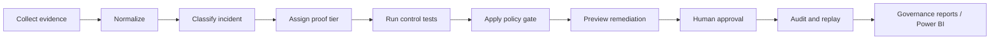

# Technology Risk & Control Analytics Platform

An evidence-backed Windows endpoint reliability platform that turns proxy, listener, TLS, and connectivity signals into explainable incident classifications, control-test results, policy-gated remediation previews, and audit-ready governance analytics.

> **Portfolio scope:** This is a production-shaped prototype. It is not antivirus, EDR/XDR, malware attribution, autonomous remediation, or a formal audit product.

## What it demonstrates

- Deterministic evidence collection and fixture replay
- Incident classifications with proof tiers T0–T5
- Explicit `limitations[]` on decision outputs
- Control testing with `PASS`, `FAIL`, `PARTIAL`, and `NOT_TESTED`
- Preview-first remediation and typed human confirmation
- Hash-chained JSONL audit trails and tamper verification
- FastAPI, Docker, CI safety contracts, and observability
- Power BI-ready star-schema exports, DAX design, and RLS planning

## Example incident: dead localhost proxy

A Windows endpoint can appear online while browsers and business applications fail:

- Ping and DNS succeed
- WinINET points to `127.0.0.1:59081`
- No process listens on port `59081`
- WinHTTP remains direct
- Direct HTTPS succeeds

The platform produces an evidence-backed decision:

| Field | Result |
|---|---|
| Primary classification | `DEAD_PROXY_CONFIG` |
| Secondary signal | `WININET_WINHTTP_MISMATCH` |
| Governance result | `PREVIEW_ONLY` |
| Limitation | Evidence does not prove malware, compromise, or intent |

Case study: [Dead proxy evidence pack](docs/one-page-case-study-dead-proxy.md) · [Real evidence case](real_evidence/case-001-dead-proxy/) · [Replay walkthrough](docs/replay-demo.md)

## How it works


```mermaid
flowchart LR
    A[Collect evidence] --> B[Normalize]
    B --> C[Classify incident]
    C --> D[Assign proof tier]
    D --> E[Run control tests]
    E --> F[Apply policy gate]
    F --> G[Preview remediation]
    G --> H[Human approval]
    H --> I[Audit and replay]
    I --> J[Governance reports / Power BI]
```

The stages remain separate:

```text
Observation → Hypothesis → Proof → Policy → Preview → Approval → Execution → Audit → Replay
```

Stakeholder assignment and maintenance timing do not change technical facts. They determine who may act and when. Policy permission remains separate from execution authorization.

Architecture: [Layered architecture](docs/architecture.md) · [Architecture infographic](docs/architecture-infographic.md) · [State machine](docs/state-machine.md) · [Domain model](docs/domain-model.md)

## Three-minute demo

Install the development package and run a deterministic fixture-driven case:

```powershell
pip install -e ".[dev]"

python -m windows_network_toolkit proxy-status `
  --fixture examples/evidence/DEAD_PROXY_CONFIG.json

python -m windows_network_toolkit diagnose `
  --proof `
  --fixture examples/evidence/DEAD_PROXY_CONFIG.json

python -m windows_network_toolkit control-test `
  --fixture tests/fixtures/case_studies/case_1_dead_wininet_proxy.json

python -m windows_network_toolkit governance-report `
  --audit-dir tests/fixtures/risk_analytics/audit_sample `
  --format markdown
```

Guided paths: [3-minute interview demo](docs/interview-demo-3min.md) · [API examples](docs/api-trisk-examples.md) · [Docker reviewer demo](docs/docker-demo.md)

Optional Docker demo:

```bash
docker compose -f docker-compose.demo.yml up --build
curl -s http://127.0.0.1:8000/health
```

## Capability evidence

| Capability | Repository evidence |
|---|---|
| Deterministic classification | State machine, fixture replay, transition tests |
| Safe automation | Dry-run defaults, typed confirmation, policy contracts |
| Technology controls | Control matrix and control-test CLI |
| Auditability | Hash-chained JSONL and tamper verification |
| Platform engineering | FastAPI, Docker, CI, metrics, structured logs |
| Technology risk reporting | Governance reports, risk register, KPI rollups |
| Data analytics | Star schema exports, DAX measures, RLS design |
| Responsible AI | Explanation-only boundary; humans authorize execution |

Key evidence:

- Classifier tests: `tests/test_proxy_state_transitions.py`
- Safety contracts: `tests/test_proxy_classifier_safety_contract.py`, `tests/test_policy_safety_contract.py`
- Audit tamper detection: `tests/platform_core/governance/test_audit_tamper_detection.py`
- Control framework: [docs/control-matrix.md](docs/control-matrix.md)
- Test strategy: [docs/test-strategy.md](docs/test-strategy.md)
- Anti-code-paste defense: [docs/anti-code-paste-defense.md](docs/anti-code-paste-defense.md)

## Reviewer paths

| Reviewer | Start here |
|---|---|
| Platform / SRE | [FAANG platform review](docs/faang-platform-review.md) |
| Technology Risk / Audit | [Big 4 interview defense](docs/big4-interview-defense.md) |
| Power BI / PL-300 | [Power BI interview story](docs/powerbi-interview-story.md) |
| Security reviewer | [Threat model](docs/threat-model.md) |
| New contributor | [Onboarding](docs/ONBOARDING.md) |
| Full documentation | [Documentation index](docs/DOCUMENTATION_INDEX.md) |

## Safety and non-claims

The platform does not claim to:

- Detect malware, compromise, MITM, or malicious intent
- Replace antivirus, EDR, or XDR
- Autonomously mutate endpoint configuration
- Allow AI to authorize execution
- Produce formal audit opinions

Default behavior is read-only or preview-only. Registry changes require explicit typed confirmation. Process termination, firewall reset, and adapter disable are blocked by default policy.

The evidence model follows six principles:

1. Observation is not proof
2. Correlation is not causation
3. Confidence is not certainty
4. Classification is not accusation
5. Policy permission is not a safety guarantee
6. Recommendation is not execution authority

Details: [Safety model](docs/safety_model.md) · [Evidence-to-action governance model](docs/evidence_to_action_governance_model.md) · [Portfolio positioning ADR](docs/adr/ADR-portfolio-positioning.md)

## Project status

This repository is a **production-shaped portfolio prototype**, not shipped enterprise software.

### Implemented

- Deterministic classifiers and fixture replay
- Control testing and policy gates
- Remediation previews with human confirmation
- Audit hash chains and tamper verification
- FastAPI and Docker reviewer environments
- Governance reports and Power BI exports
- CI safety contracts and Windows test coverage

### Not production-deployed

- Enterprise endpoint fleet rollout
- Centralized production identity and authorization
- Calibrated probability models
- Full registry-writer attribution without Sysmon, Procmon, or Event Log evidence
- Published Power BI Service deployment
- Cross-platform EDR or security enforcement

Readiness details: [Production readiness gap](docs/production-readiness-gap.md) · [Enterprise hardening roadmap](docs/enterprise-hardening-roadmap.md) · [Public release checklist](PUBLIC_RELEASE_CHECKLIST.md)

## Power BI / PL-300 layer

The analytics layer converts governance evidence into Power BI-ready fact and dimension tables.

| PL-300 area | Evidence |
|---|---|
| Prepare data | JSONL-to-CSV export and Power Query guidance |
| Model data | `fact_*` and `dim_*` star schema tables |
| Analyze | DAX measures and four-page report blueprint |
| Secure | Row-level security design |

```powershell
python -m windows_network_toolkit powerbi-export `
  --audit-dir tests/fixtures/risk_analytics/audit_sample `
  --out-dir examples/powerbi/export
```

Details: [Power BI analytics](analytics/powerbi/README.md) · [DAX measures](analytics/powerbi/dax/measures.md) · [Report blueprint](analytics/powerbi/report_blueprint.md) · [RLS design](analytics/powerbi/rls_design.md)

## Repository structure

```text
windows_network_toolkit/   Primary JSON-first CLI and diagnostics
src/platform_core/         Canonical policy, evidence, governance, and audit engine
src/proxy_drift/           Startup observability and dead-proxy guardian
backend/                   FastAPI services and optional database integration
analytics/powerbi/         Star schema, DAX, report, and RLS design
telemetry/                 Registry-writer telemetry foundations
tests/                     Fixtures, replay, safety contracts, and integration tests
docs/                      Architecture, reviewer guides, demos, and runbooks
```

## Installation and validation

```powershell
git clone <repo-url>
cd Windows-Network-Recovery-Toolkit
python -m venv .venv
.\.venv\Scripts\Activate.ps1
pip install -e ".[dev]"
$env:PYTHONPATH = (Get-Location).Path

python -m windows_network_toolkit version
pytest -q tests/test_proxy_classifier_safety_contract.py
pytest -q tests/test_policy_safety_contract.py
pytest -q
```

Common development checks:

```bash
make lint
make typecheck
make test
make principles-test
```

CLI reference: [docs/cli_reference.md](docs/cli_reference.md) · CI/CD: [docs/ci-cd.md](docs/ci-cd.md) · Contributor rules: [AGENTS.md](AGENTS.md)

## Documentation

- [Portfolio interview pack](PORTFOLIO.md)
- [Documentation index](docs/DOCUMENTATION_INDEX.md)
- [Architecture](docs/architecture.md)
- [Control testing methodology](docs/control-testing-methodology.md)
- [Proxy proof ladder](docs/proxy-proof-ladder.md)
- [Risk register](docs/risk_register.md)
- [Startup observability](docs/startup-observability.md)
- [Dead proxy guardian](docs/dead-proxy-guardian.md)
- [AI-assisted delivery and guardrails](docs/ai-assisted-delivery.md)
- [Full former README reference](docs/archive/README_FULL_REFERENCE.md)

## License

MIT — see [LICENSE](LICENSE).
