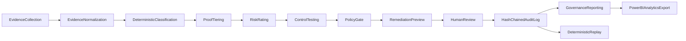
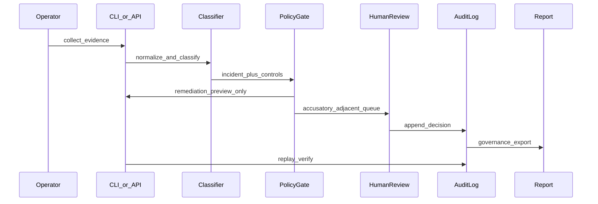

# SYSTEM_DESIGN.md

**Technology Risk & Control Analytics Platform**  
**Status:** Production-shaped portfolio prototype — not enterprise-certified software  
**Audience:** FAANG / platform / SRE reviewers and Big 4 / technology risk / audit reviewers

**Related docs:** [docs/domain-model.md](docs/domain-model.md) · [docs/architecture-infographic.md](docs/architecture-infographic.md) · [docs/state-machine.md](docs/state-machine.md) · [docs/control-matrix.md](docs/control-matrix.md) · [docs/proxy-proof-ladder.md](docs/proxy-proof-ladder.md) · [docs/safety_model.md](docs/safety_model.md) · [docs/threat-model.md](docs/threat-model.md) · [docs/production-readiness-gap.md](docs/production-readiness-gap.md)

---

## 1. Executive Summary

This repository implements a **deterministic evidence pipeline** and **policy-gated decision system** for Windows endpoint reliability and technology risk. It is a **portfolio-scope implementation** that transforms endpoint observations — WinINET/WinHTTP proxy configuration, localhost listener state, path probes, and optional registry-writer telemetry — into classified incidents, proof tiers, control test results, ordinal risk scores, remediation **previews**, human-reviewed decisions, hash-chained audit trails, governance reports, and analytics-ready exports.

The platform is **not a security verdict engine**. It does not detect malware, confirm MITM, or autonomously remediate endpoints. Instead, it provides **audit-backed governance reporting** with explicit `limitations[]` on every classification, separating observation from proof and recommendation from execution authority. AI assists explanation drafting only; humans authorize registry mutation and accusatory-adjacent narratives.

Core workflow: **Evidence collection → normalization → classification → proof tiering → risk rating → control testing → policy gate → remediation preview → human review → audit log → governance reporting → deterministic replay.** Evaluation harnesses (`classifier-benchmark`, `replay-benchmark`) support offline regression testing without live Windows registry access.

---

## 2. Problem Statement

Windows endpoints frequently appear "online" while business applications fail. Common operational patterns include:

- **Ping and DNS succeed** while the browser reports `ERR_PROXY_CONNECTION_FAILED` because WinINET points at a **dead localhost proxy port**.
- **WinINET and WinHTTP drift** — some applications use system proxy settings while others bypass, producing inconsistent connectivity that is hard to diagnose without structured evidence.
- **Security teams escalate without proof** — listener correlation is mistaken for malware or compromise, creating false accusations and audit risk.
- **IT support fixes without evidence** — ad-hoc registry resets are not reconstructable for internal audit or risk committees.
- **Risk committees lack KPIs** — incident data does not roll up into control pass rates, proof-tier distributions, or governance-ready narratives.

This platform standardizes **Evidence → Risk → Decision → Audit** so platform engineers, IT operations, security triage, and technology risk stakeholders share the same artifacts — with epistemic boundaries enforced in code and CI.

---

## 3. Non-Goals and Explicit Boundaries

| Not this | What the system does instead |
|----------|------------------------------|
| **Antivirus / EDR / XDR** | Reliability triage labels (`DEAD_PROXY_CONFIG`, `UNKNOWN_LOCAL_PROXY`) with `limitations[]`; no signature engine or quarantine |
| **Malware verdicts** | Blocks `MALWARE_*` classifications; `unsafe_inferences_blocked[]` in safety contracts |
| **MITM confirmation** | `POSSIBLE_MITM_RISK` requires multiple indicators; never emits "MITM confirmed" |
| **Autonomous remediation** | Dry-run default; `PREVIEW_ONLY` policy outcome; typed confirmation for live apply |
| **Formal audit opinion** | Governance reports are **management information** for committees — not SOC 2 or regulatory attestation |
| **AI-authorized execution** | AI explains only; `explanation_guardrails` rejects approve/remediation language; policy gate is authoritative |
| **Process kill / firewall reset / adapter disable by default** | Blocked in policy registry; not default CLI behavior |

See also: [docs/safety_model.md](docs/safety_model.md) · [docs/adr/ADR-portfolio-positioning.md](docs/adr/ADR-portfolio-positioning.md)

---

## 4. High-Level Architecture



| Stage | Role |
|-------|------|
| **Evidence Collection** | Read-only CLI probes: `proxy-status`, `proxy-health`, `proxy-watch`, `diagnose --proof`, optional fixture inject |
| **Evidence Normalization** | Canonical `EvidenceEvent` rows with deterministic `event_id`, `evidence_tier`, `limitations[]` |
| **Deterministic Classification** | Full before/after state machine + incident classifier — same fixture → same label |
| **Proof Tiering** | T0–T5 claim-strength cap; prevents skipping rungs in audit narrative |
| **Risk Rating** | Ordinal 0–100 score and LOW/MEDIUM/HIGH band — not calibrated probability |
| **Control Testing** | CTRL-001–010 style PASS/FAIL/PARTIAL/NOT_TESTED against evidence |
| **Policy Gate** | Allowed action boundary: observe, alert, preview, require typed confirmation |
| **Remediation Preview** | `proxy-disable --dry-run` shows intended registry change without apply |
| **Human Review** | Queue for accusatory-adjacent classes; AI cannot approve remediation |
| **Hash-Chained Audit Log** | Append-only JSONL with integrity verification |
| **Governance Reporting** | Executive summary, human-review queue, limitations and non-claims |
| **Deterministic Replay** | `replay-benchmark`, `proxy-replay`, fixture pipeline hash compare |
| **Power BI / Analytics Export** | Star-schema CSV export for committee dashboards |

Infographic: [docs/architecture-infographic.md](docs/architecture-infographic.md)

---

## 5. Component Architecture

| Component | Responsibility | Input | Output | Failure Mode | Reviewer Value |
|-----------|----------------|-------|--------|--------------|----------------|
| **CLI evidence collectors** | Read registry, probes, watch timeline | Live Windows or `--fixture` JSON | JSON stdout, JSONL watch log | Partial registry read → insufficient data class | Automation-friendly, CI-reproducible |
| **Evidence normalizer** | Stable `EvidenceEvent` schema | Raw CLI dicts | Normalized events + tiers | Missing timestamp → dedupe gaps | Single analytics grain |
| **Classifier / state machine** | Primary label + secondary signals | Before/after proxy state, probes | `IncidentRecord`, `ProxyTransition` | Field-diff false positive if not full-state | Interview-grade safety design |
| **Proof tier evaluator** | Cap claim strength T0–T5 | Evidence types present | `evidence_tier` on events | Overclaim without listener/path proof | Audit narrative discipline |
| **Risk scorer** | Ordinal governance priority | Incident + controls + impact | `RiskScore`, `human_review_recommended` | Misread as malware probability | Committee prioritization input |
| **Control test engine** | Map evidence to CTRL tests | Fixture / pipeline payload | `ControlTestResult[]` | PARTIAL when writer proof missing | Big 4 control matrix demo |
| **Policy gate** | Authorize action boundary | Classification + risk | `PolicyDecision` PREVIEW_ONLY / etc. | Operator assumes permission = safety | Safety-by-default |
| **Remediation preview** | Show change without apply | Policy + fixture | Dry-run diff, audit row | Skipped dry-run on live host | Blast-radius control |
| **Human review workflow** | Queue + decision JSONL | Accusatory-adjacent class | `human_review.jsonl` | AI actor on approve → rejected | Human-in-the-loop governance |
| **Audit logger** | Append decision rows | CLI / review actions | `audit.jsonl` | Local file deletion | Incident reconstruction |
| **Audit verifier** | Hash chain integrity | JSONL path | `verified: true/false` | Tamper after write | ITGC-style integrity check |
| **Governance report generator** | Committee pack | Audit dir | Markdown/JSON report | Read as formal opinion | Management information |
| **Power BI export** | Star-schema CSVs | Audit / pipeline data | `fact_*`, `dim_*` CSVs | No live Power BI tenant | PL-300 portfolio story |
| **FastAPI read-only API** | HTTP governance views | Fixture query param | Paginated JSON | Open demo endpoints | Reviewer demo without CLI |
| **AI explanation layer** | Draft narrative | Incident context | Sanitized summary | Hallucinated malware claim | Guardrailed advisory only |
| **Evaluation harness** | Offline benchmark | Golden fixtures | Metrics markdown/JSON | Fixture drift undetected | Regression before deploy |

**Modules:** `windows_network_toolkit/cli.py`, `evidence_schema.py`, `incident_classifier.py`, `proxy_state_machine.py`, `control_tests.py`, `decision/policy_engine.py`, `src/platform_core/governance/`, `src/platform_core/evaluation/`, `backend/technology_risk_routes.py`

---

## 6. Core Domain Model

### EvidenceEvent

| | |
|--|--|
| **Purpose** | Canonical normalized observation row for classification, controls, and export |
| **Key fields** | `event_id`, `timestamp_utc`, `endpoint_id`, `evidence_type`, `normalized_fields`, `evidence_tier`, `limitations[]` |
| **Design value** | Deterministic `event_id` enables dedupe and replay |
| **Auditability** | Preserves `raw_snapshot` for reconstruction; tier does not auto-upgrade downstream |

**Module:** `windows_network_toolkit/evidence_schema.py` — see [docs/domain-model.md](docs/domain-model.md)

### IncidentRecord

| | |
|--|--|
| **Purpose** | Classified endpoint incident with human interpretation |
| **Key fields** | `incident_id`, `incident_class`, `secondary_signals`, `confidence`, `limitations[]`, `proof_tier` |
| **Design value** | Stable JSON contract for API and Power BI |
| **Auditability** | Classification is not accusation; limitations mandatory |

### ClassificationResult

| | |
|--|--|
| **Purpose** | Structured classifier output before incident persistence |
| **Key fields** | `primary_classification`, `secondary_signals`, `severity`, `confidence`, `reasoning`, `recommended_next_actions` |
| **Design value** | Separates label from policy and remediation |
| **Auditability** | `confidence` is ordinal 0–1, not calibrated probability |

### ProofTier

| | |
|--|--|
| **Purpose** | Claim-strength label T0–T5 |
| **Key fields** | Tier enum, linked evidence types |
| **Design value** | Prevents narrative overclaim |
| **Auditability** | Maps to allowed language in reports |

### RiskScore

| | |
|--|--|
| **Purpose** | Governance prioritization input |
| **Key fields** | `likelihood`, `impact`, `risk_score`, `risk_level`, `human_review_recommended` |
| **Design value** | Combines classification, controls, business impact |
| **Auditability** | Not financial loss or breach probability |

### ControlTestResult

| | |
|--|--|
| **Purpose** | Detective/preventive control evaluation |
| **Key fields** | `control_id`, `test_result`, `evidence[]`, `limitations[]`, `recommendation` |
| **Design value** | CTRL-001–010 portfolio mapping |
| **Auditability** | FAIL ≠ automatic remediation |

### PolicyDecision

| | |
|--|--|
| **Purpose** | Authorized action boundary |
| **Key fields** | `action`, `outcome` (e.g. `PREVIEW_ONLY`), `requires_confirmation`, `dry_run` |
| **Design value** | Policy permission is not safety guarantee |
| **Auditability** | Logged before any apply attempt |

### RemediationPreview

| | |
|--|--|
| **Purpose** | Intended registry change without execution |
| **Key fields** | `dry_run`, planned keys/values, `typed_confirmation_token` |
| **Design value** | Recommendation is not execution authority |
| **Auditability** | Preview rows in audit JSONL |

### RiskDecisionRecord

| | |
|--|--|
| **Purpose** | Governed decision artifact linking evidence to outcome |
| **Key fields** | `decision_id`, `incident_id`, `policy_decision_id`, `actor`, `limitations[]` |
| **Design value** | Single row for committee drill-down |
| **Auditability** | Hash-chained when in append log |

**Module:** `src/platform_core/governance/risk_decision_record.py`

### AuditEvent

| | |
|--|--|
| **Purpose** | Append-only log row |
| **Key fields** | `timestamp`, `incident_id`, `action`, `actor`, `dry_run`, `prev_hash`, `row_hash` |
| **Design value** | Tamper-evident chain |
| **Auditability** | Integrity ≠ truth of observations |

### GovernanceReport

| | |
|--|--|
| **Purpose** | Committee-ready management information pack |
| **Key fields** | KPIs, control summary, human-review queue, `limitations_and_non_claims` |
| **Design value** | Big 4 storytelling without attestation |
| **Auditability** | Explicit non-claims section required |

---

## 7. Evidence-to-Decision State Flow

1. **Raw observation** is collected via CLI or injected fixture.
2. **Evidence is normalized** into `EvidenceEvent` rows with tier and limitations.
3. **Classifier assigns** primary incident class and secondary signals (full before/after state).
4. **Proof tier is attached** based on evidence types present — never skipped in narrative.
5. **Limitations are attached** — malware/MITM not proven by default.
6. **Risk score is calculated** ordinally from classification, controls, and impact mapping.
7. **Control tests run** against evidence (PASS/FAIL/PARTIAL/NOT_TESTED).
8. **Policy gate decides** allowed action boundary (typically `PREVIEW_ONLY`).
9. **System produces preview**, not execution — dry-run diff only.
10. **Human review** enqueues accusatory-adjacent classes; approves/rejects/requests evidence.
11. **Audit event is appended** to JSONL with optional hash chain.
12. **Replay verifies** deterministic pipeline output and chain integrity.



---

## 8. Classification Design

Classification is **deterministic**: the same normalized evidence fixture produces the same primary label across runs (verified by `replay-benchmark` and `classifier-benchmark`).

### Primary labels (12)

| Label | Meaning |
|-------|---------|
| `NO_PROXY` | Proxy disabled, no PAC |
| `DEAD_PROXY_CONFIG` | Localhost proxy configured, no listener |
| `LOCAL_PROXY_ACTIVE` | Listener on configured port |
| `UNKNOWN_LOCAL_PROXY` | Active listener, unknown process |
| `KNOWN_DEV_PROXY` | Dev-tool heuristic match |
| `KNOWN_SECURITY_TOOL` | Security-tool heuristic match |
| `SUSPICIOUS_PROXY` | External or suspicious configuration |
| `POSSIBLE_MITM_RISK` | Multiple indicators — never "confirmed MITM" |
| `PAC_CONFIGURED` | AutoConfigURL set |
| `WININET_WINHTTP_MISMATCH` | Stack divergence |
| `REVERTER_SUSPECTED` | Flapping / reappearance pattern |
| `ERROR_INSUFFICIENT_DATA` | Missing state; low confidence |

Full reference: [docs/classification-model.md](docs/classification-model.md)

### Design principles

- **Full before/after state** is safer than single-field diffs (localhost removed ≠ remote proxy restored).
- **Localhost proxy listener** is runtime correlation only — not registry writer proof.
- **Registry writer proof** requires stronger telemetry (Sysmon E13, Procmon, Event Log) for T4+.
- **Every output includes `limitations[]`** — classification is not accusation.

**Engines:** `windows_network_toolkit/proxy_state_machine.py`, `windows_network_toolkit/incident_classifier.py`, `src/platform_core/classification/engine.py`

---

## 9. Proof Tier Model

| Tier | Definition | Example evidence | Allowed language (summary) |
|------|------------|------------------|----------------------------|
| **T0** | User-reported symptom only | Helpdesk note, screenshot | "User reported browser failure" |
| **T1** | Local configuration snapshot | `proxy-status` registry read | "WinINET points to 127.0.0.1:59081" |
| **T2** | Network probe / listener evidence | `netstat`, port listen check | "No listener on configured port" |
| **T3** | Direct-vs-proxy path comparison | Paired HTTPS/TCP probes | "Direct path OK, proxy path fails" |
| **T4** | Time-sequenced transition evidence | `proxy-watch` JSONL, coalesced transitions | "Proxy re-enabled 3× in 10 minutes" |
| **T5** | Registry writer / process attribution | Sysmon E13, trusted event logs | "Process X wrote proxy key" (still not malicious intent) |

**Rule:** Never describe T2 as T4. No tier alone supports a malware verdict.

Normative ladder: [docs/proxy-proof-ladder.md](docs/proxy-proof-ladder.md)

---

## 10. Policy Gate and Safety Model

### Allowed by default (read-only)

- Read WinINET / WinHTTP registry and `netsh` excerpts
- `netstat` / listener checks
- Classify evidence and generate reports
- Preview remediation (`--dry-run`)
- Append audit log (with human action)
- Fixture replay and benchmark runs

### Blocked or gated

| Action | Gate |
|--------|------|
| Registry mutation | Typed confirmation token (`DISABLE_WININET_PROXY`) |
| Process kill | Blocked in policy registry |
| Firewall reset | Blocked |
| Adapter disable | Blocked |
| Autonomous remediation | No auto-apply path |

### Safety mechanisms

- **Dry-run default** on remediation commands
- **Typed confirmation** for live registry apply
- **Explicit human authority** for accusatory-adjacent remediation preview approval
- **CI safety contracts:** `tests/test_policy_safety_contract.py`, `tests/test_proxy_classifier_safety_contract.py`, `tests/test_non_claim_regression.py`
- **Policy permission is not a safety guarantee** — preview approval ≠ production change authority

Reference: [docs/safety_model.md](docs/safety_model.md)

---

## 11. Auditability and Replay

### Append-only JSONL

Audit rows are appended to `audit.jsonl`, `incidents.jsonl`, or `human_review.jsonl` under a configurable `audit_dir`. Rows include `timestamp`, `incident_id`, `action`, `dry_run`, and governance `limitations[]`.

### Hash-chain integrity

`src/platform_core/governance/chain_of_custody.py` implements `verify_chain()` — recomputes row hashes from genesis. Tamper tests: `tests/platform_core/governance/test_audit_tamper_detection.py`.

### Commands

```powershell
python -m windows_network_toolkit audit verify tests/fixtures/risk_analytics/audit_sample/incidents.jsonl
python -m windows_network_toolkit replay-benchmark --cases tests/fixtures/evaluation/replay_cases.jsonl
python -m windows_network_toolkit classifier-benchmark --cases examples/evaluation/classifier_benchmark_sample.json
```

### Why it matters

| Stakeholder | Value |
|-------------|-------|
| Internal audit | Reconstruct who decided what, when, with what limitations |
| Platform engineering | Regression-test classifier and pipeline determinism |
| Risk committee | Trust integrity of exported KPIs without claiming formal assurance |

### Example audit row

```json
{
  "incident_id": "INC-001",
  "case_id": "CASE_1",
  "classification": {"primary_classification": "DEAD_PROXY_CONFIG"},
  "evidence_tier": "proof",
  "policy_decision": {"outcome": "PREVIEW_ONLY"},
  "timestamp": "2026-06-11T04:25:00Z"
}
```

See: [docs/audit-hash-chain-explained.md](docs/audit-hash-chain-explained.md) · [docs/evidence-replay-benchmark.md](docs/evidence-replay-benchmark.md)

---

## 12. API Design

The **read-only** Technology Risk API is mounted from `backend/technology_risk_routes.py`. It delegates to `run_endpoint_analytics_pipeline` — no registry mutation, no audit append on GET.

| Endpoint | Purpose | Notes |
|----------|---------|-------|
| `GET /trisk/health` | Service health + positioning disclaimer | Distinct from root `GET /health` (ERP platform) |
| `GET /incidents` | Paginated incident summaries | `limitations[]` on response; `fixture` query for demo |
| `GET /risks` | Ordinal risk score items | `schema_version: technology_risk_scoring.v1` |
| `GET /controls` | Control test results + mapping catalog | Optional `incident_class` filter |
| `GET /reports/executive` | Executive KPI rollup | Committee dashboard shape |

### Example: health response

```json
{
  "status": "ok",
  "service": "windows-network-toolkit",
  "version": "…",
  "api": "technology-risk-analytics",
  "positioning": "Technology Risk & Control Analytics — not antivirus, EDR, or autonomous remediation."
}
```

### Why read-only

- Prevents demo API from becoming an unauthenticated remediation vector
- `DEMO_MODE=true` in `docker-compose.demo.yml` reinforces fixture-only, dry-run posture
- Production would require OAuth2/mTLS, RBAC, and audited ingest — not claimed here

Examples: [docs/api-trisk-examples.md](docs/api-trisk-examples.md) · Docker: [docs/docker-demo.md](docs/docker-demo.md)

---

## 13. Analytics and Power BI Design

### Star-schema export

CLI: `python -m windows_network_toolkit powerbi-export --audit-dir … --out-dir …`

**Module:** `src/platform_core/analytics/powerbi_star_export.py`

| Table | Grain |
|-------|-------|
| `fact_incidents` | One row per incident — risk level, proof tier keys |
| `fact_control_tests` | One row per control test execution |
| `fact_policy_decisions` | Policy outcomes per incident |
| `dim_date` | Time dimension |
| `dim_classification` | Primary label lookup |
| `dim_proof_tier` | T0–T5 labels |
| `dim_stakeholder` | Forum / owner mapping |
| `dim_control` | CTRL metadata |

### PL-300 / committee relevance

- KPI rollups: control pass rate, high-risk count, preview-only remediation ratio
- `Security Accusation Count` should remain **zero** in portfolio demos
- **RLS design concept:** `examples/powerbi/rls_design.md` — role-based row visibility for ops vs risk vs executive

### Portfolio scope (honest)

- Exported **CSV + semantic blueprint** — not a deployed Power BI Service tenant
- Scheduled refresh, gateway, and tenant RLS are **future enterprise hardening**

Reference: [docs/powerbi-interview-story.md](docs/powerbi-interview-story.md) · [analytics/powerbi/report_blueprint.md](analytics/powerbi/report_blueprint.md)

---

## 14. Observability and Operations

| Capability | Status | Notes |
|------------|--------|-------|
| `GET /trisk/health` | **Implemented** | Demo and full stack |
| Structured JSON CLI output | **Implemented** | All primary commands |
| Prometheus metrics | **Production-shaped** | Full `docker-compose.yml` stack |
| Grafana dashboards | **Production-shaped** | Not required for reviewer demo |
| Docker reviewer demo | **Implemented** | `docker-compose.demo.yml`, `DEMO_MODE=true` |
| Deterministic fixtures | **Implemented** | CI runs on Linux without Windows |
| CI lint / test / typecheck | **Implemented** | GitHub Actions |
| SLO dashboards / tracing | **Future** | Enterprise hardening |
| PagerDuty alerting | **Future** | No alert routing in portfolio |

Operations doc: [docs/observability.md](docs/observability.md)

---

## 15. Security, Abuse, and Threat Model

Summary of abuse scenarios and mitigations (full table: [docs/threat-model.md](docs/threat-model.md)):

| Abuse scenario | Mitigation |
|----------------|------------|
| AI overclaiming malware | `explanation_guardrails`; forbidden phrase scan in benchmarks |
| Operator killing processes | Blocked in policy registry; not default CLI |
| Registry mutation without approval | Dry-run default; typed confirmation; audit row |
| False attribution (Cursor/node/powershell) | Writer proof tier cap; `WRITER_LIMITATION` on controls |
| Audit log tampering | Hash chain `verify_chain`; tamper detection tests |
| Fixture drift presented as live proof | Replay recompute; fixture labels in output |
| Report misused as formal audit opinion | `management information` boundary; non-claims section |
| Sensitive endpoint data leakage | Local JSONL; redact-before-export is future work |

Test contracts: `tests/test_policy_safety_contract.py`, `tests/test_governance_safety_contracts.py`, `tests/test_docker_demo_contract.py`

---

## 16. Failure Modes and Trade-Offs

| Failure mode | Impact | Detection | Mitigation | Remaining limitation |
|--------------|--------|-----------|------------|----------------------|
| Missing listener evidence | Under-diagnosis of dead proxy | `proxy-health` FAIL | Path + port probes | Probe success ≠ authorized proxy |
| Wrong process correlation | Misattributed writer | PARTIAL control result | Require Sysmon E13 for T4+ | PID on port ≠ registry writer |
| Incomplete registry writer proof | Overclaim in narrative | Proof tier cap | Limitations + human review | No E13 → no writer proof |
| Proxy flips too quickly | Missed reverter pattern | `proxy-watch` coalescing window | `REVERTER_SUSPECTED` class | Correlation only |
| WinINET/WinHTTP ambiguity | Wrong primary label | Mismatch secondary signal | Full-state classifier | Alignment ≠ policy approval |
| Fixture not representative | Benchmark false confidence | `classifier-benchmark` drift | Expand golden set | Fixtures ≠ fleet diversity |
| Confidence misread as probability | False escalation | Docs + ordinal disclaimers | `human_review_recommended` flag | UI may still mislabel |
| AI explanation hallucination | Unsafe narrative | `validate_explanation_text` | Safe template fallback | Rule-based, not LLM judge |
| Audit log file deletion | Lost reconstruction | External backup not built | Hash verify before export | No WORM storage in portfolio |
| Endpoint privacy concerns | PII in exports | Synthetic fixtures in git | Future redact-at-ingest | Operator responsibility locally |

---

## 17. Scaling Considerations

### Current portfolio-scope assumptions

- **Local CLI** on operator workstation (Windows preferred; fixture mode on Linux CI)
- **Fixture replay** and offline evaluation benchmarks
- **Demo API** with allowlisted fixture paths
- **`fleet-simulate`** — seeded synthetic endpoints, not live fleet ingest
- **CSV exports** to local `out-dir`

### Future enterprise scaling (not fully implemented)

| Direction | Purpose |
|-----------|---------|
| Central evidence ingestion | Multi-endpoint collection |
| Queue-based pipeline | Async processing at fleet scale |
| Signed endpoint agent | Scheduled collection, Authenticode trust |
| Postgres event store | Queryable incident history |
| Object storage for raw evidence | Retention and legal hold |
| Metrics pipeline + SLOs | Operational reliability |
| RBAC + tenant isolation | Multi-tenant SaaS posture |
| Audit retention policies | Compliance schedules |
| SIEM integration | SOC correlation export |
| Power BI Service deployment | Scheduled refresh + tenant RLS |

Honest gap table: [docs/production-readiness-gap.md](docs/production-readiness-gap.md)

---

## 18. FAANG / Platform Engineering Review Angle

This project demonstrates platform engineering discipline applicable to internal developer reliability tooling:

| Pillar | Evidence |
|--------|----------|
| State-machine design | `proxy_state_machine.py` — full before/after transitions |
| Deterministic behavior | `replay-benchmark`, transition tests |
| Failure-mode analysis | Section 16; classifier benchmark false-escalation metrics |
| Separation of concerns | `windows_network_toolkit` facade → `src/platform_core` engines |
| Safety-by-default | Dry-run, policy registry blocks |
| API boundary | Read-only `/trisk/health` + governance GETs |
| Replayability | `proxy-replay`, fixture pipeline hash compare |
| Test strategy | Safety contracts in CI |
| Observability | Health + Prometheus-shaped stack |
| Production-readiness gap awareness | Explicit gap matrix — not overselling |

### Reviewer Q&A (concise)

| Question | Answer |
|----------|--------|
| Is this production fleet software? | **No** — production-shaped prototype with honest gaps |
| Why CLI-first? | Automation, CI fixtures, operator trust via visible JSON |
| How do you prevent classifier drift? | `classifier-benchmark` golden set + replay hash compare |
| Why not auto-fix? | Blast radius; policy gate; typed confirmation |
| What's the hardest trade-off? | Proof tier vs operator urgency — human review bridges gap |

Guide: [docs/faang-platform-review.md](docs/faang-platform-review.md)

---

## 19. Big 4 / Technology Risk Review Angle

| Pillar | Evidence |
|--------|----------|
| Control matrix thinking | CTRL-001–010 in [docs/control-matrix.md](docs/control-matrix.md) |
| Evidence quality | T0–T5 proof ladder |
| Human review | `human_review.jsonl` workflow |
| Audit trail | Hash-chained JSONL + verify command |
| Governance reporting | `governance-report` with non-claims |
| Policy gating | PREVIEW_ONLY default |
| Non-claims | Every output carries `limitations[]` |
| Management information vs assurance | Not formal audit opinion |

### Reviewer Q&A (concise)

| Question | Answer |
|----------|--------|
| Is this a formal audit opinion? | **No** — management information for committees |
| Does listener prove registry writer? | **No** — correlation; Sysmon E13 for writer tier |
| Can AI disable proxy? | **No** — human confirmation + policy gate |
| SOC 2 attestation? | **No** — design-effectiveness demonstration only |
| How do controls map to findings? | `control-test` CLI + `fact_control_tests` export |
| What prevents malware language? | Safety contracts + `explanation_guardrails` |

Guide: [docs/big4-interview-defense.md](docs/big4-interview-defense.md)

---

## 20. AI Explanation Layer

### AI may

- Summarize collected evidence
- Explain classification limitations
- Suggest missing evidence types
- Draft committee-friendly wording
- Explain why policy gate blocked remediation

### AI must not

- Authorize registry changes, process kill, or firewall reset
- Issue malware or MITM verdicts
- Provide formal audit opinions
- Override classifier, human review, or policy gate
- Attest control operating effectiveness for regulators

### Guardrails

**Module:** `src/platform_core/ai_risk_analyst/explanation_guardrails.py`

```python
validate_explanation_text(text) -> ExplanationValidationResult
# is_safe, violations[], recommended_rewrite (rule-based template)
```

`LocalRuleBasedAnalyst` sanitizes narrative fields before return. Provider and `audit_id` logged when applicable.

Reference: [docs/ai-risk-analyst-guardrails.md](docs/ai-risk-analyst-guardrails.md) · ADR: [docs/adr/0006-ai-assisted-not-ai-authorized.md](docs/adr/0006-ai-assisted-not-ai-authorized.md)

---

## 21. Production Readiness Gap

Condensed from [docs/production-readiness-gap.md](docs/production-readiness-gap.md):

| Area | Current state | Production gap | Next step |
|------|---------------|----------------|-----------|
| Deployment | Docker compose + Makefile | GitOps, signed releases | Helm + SBOM |
| Authentication | Open demo `/trisk/*` reads | OAuth2 / mTLS | Entra ID integration |
| RBAC | Policy registry only | Role-scoped execute/export | API middleware |
| Endpoint fleet ingestion | CLI + `fleet-simulate` | Signed scheduled agent | Windows service package |
| Event storage | Local JSONL | Postgres + object store | Partitioned ingest |
| Privacy / data minimization | Synthetic fixtures | Redact-at-ingest | Field-level policy |
| SIEM integration | None | Export connectors | CEF/JSON forwarder |
| Power BI Service | CSV export + blueprint | Scheduled refresh + RLS | Fabric workspace |
| Calibrated risk scoring | Ordinal 0–100 | Statistically calibrated model | Out of portfolio scope |
| Independent control validation | Self-tested CTRL map | External control audit | Third-party review |
| Incident response workflow | `human_review.jsonl` | ServiceNow/Jira queue | Webhook on PENDING |
| Windows event log attribution | Optional Sysmon path | Mandatory E13 for PROVEN | Agent telemetry gate |

**Positioning:** Architecture and safety contracts are demonstrated — this is not a shipped enterprise product.

---

## 22. Interview Demo Narrative

### Shared 3-minute arc

1. **Symptom** — browser fails, ping works  
2. **Evidence** — `proxy-status`, `diagnose --proof`  
3. **Classification** — `DEAD_PROXY_CONFIG` + limitations  
4. **Proof tier** — T1 config + T2/T3 path (not malware)  
5. **Policy gate** — `PREVIEW_ONLY`  
6. **Preview** — `proxy-disable --dry-run`  
7. **Audit** — append row + `audit verify`  
8. **Governance report** — KPIs + human-review queue  
9. **Replay** — `replay-benchmark` determinism  
10. **Limitations** — "Classification is not accusation"

### FAANG / SRE version

```powershell
python -m windows_network_toolkit diagnose --proof --fixture tests/fixtures/enert/dead_proxy_59081.json
python -m windows_network_toolkit replay-benchmark --cases tests/fixtures/evaluation/replay_cases.jsonl
pytest -q tests/test_proxy_state_transitions.py
curl -s http://127.0.0.1:8000/trisk/health
```

**Close:** "Deterministic JSON pipeline, policy-gated previews, replay proves stable outputs — same patterns as internal platform reliability tooling before fleet rollout."

### Big 4 / audit version

```powershell
python -m windows_network_toolkit classifier-benchmark --cases examples/evaluation/classifier_benchmark_sample.json --format markdown
python -m windows_network_toolkit control-test --fixture tests/fixtures/case_studies/case_1_dead_wininet_proxy.json
python -m windows_network_toolkit governance-report --audit-dir tests/fixtures/risk_analytics/audit_sample --format markdown
```

**Close:** "Control tests, proof tiers, and governance report with explicit non-claims — management information for a technology risk committee, not a SOC 2 opinion."

Unified script: [docs/demo-faang-big4-review.md](docs/demo-faang-big4-review.md)

---

## 23. Appendix: Suggested Diagrams

Additional diagrams for future documentation (some already exist in linked docs):

| Diagram | Status / location |
|---------|-------------------|
| C4 context diagram | Future — synthesize from this document |
| C4 container diagram | Partial — [docs/architecture-infographic.md](docs/architecture-infographic.md) |
| Proxy state machine diagram | [docs/state-machine.md](docs/state-machine.md) |
| Evidence-to-decision sequence | Section 7 above |
| Data lineage diagram | Future — `analytics_pipeline` flow |
| Audit hash chain diagram | [docs/audit-hash-chain-explained.md](docs/audit-hash-chain-explained.md) |
| Power BI semantic model | [analytics/powerbi/report_blueprint.md](analytics/powerbi/report_blueprint.md) |
| Threat model diagram | [docs/threat-model.md](docs/threat-model.md) |
| Human review workflow | [docs/human-review-workflow.md](docs/human-review-workflow.md) |

---

## Epistemic Principles (woven throughout)

| Principle | Meaning |
|-----------|---------|
| Observation ≠ proof | Tier ladder caps claim strength |
| Correlation ≠ causation | Listener PID ≠ registry writer without E13 |
| Confidence is ordinal | 0.92 is not 92% probability of malware |
| Classification ≠ accusation | Triage labels with limitations |
| Policy permission ≠ safety guarantee | PREVIEW_ONLY ≠ safe to apply in production |
| Recommendation ≠ execution authority | Humans authorize apply |
| AI explains only | Humans authorize execution |

---

*This document describes a production-shaped portfolio prototype. It is not enterprise production software, not a security product, and not a formal audit assurance tool.*

---

## 24. Senior production upgrade (persistence, queue, `/v1`)

### Components added

| Component | Path | Role |
|-----------|------|------|
| SQLModel persistence | `backend/db/` | Endpoints, evidence, incidents, controls, audit chain |
| Ingestion API | `backend/v1_routes.py` | `POST /v1/evidence`, read incidents, review, reports |
| Queue abstraction | `backend/queue/` | `QueueBackend` — memory (CI) or RQ (compose) |
| Worker | `backend/workers/classifier_worker.py` | Calls existing `analytics_pipeline` — no duplicated classifier |
| RBAC | `backend/auth/` | Demo `X-Api-Token` + `X-Api-Role` |
| Metrics | `backend/trisk_metrics.py` | Merged into `GET /metrics` |

### Data flow

```
Collector/CLI → POST /v1/evidence → Postgres (pending)
              → QueueBackend → classifier_worker → incident + controls
              → AuditChainEntry + JSONL dual-write → GET /v1/incidents
```

### Docker production-shaped demo

`docker compose up` — Postgres, Redis, API, RQ worker, Prometheus, Grafana. See [docs/docker-production-shaped-demo.md](docs/docker-production-shaped-demo.md).

### Reviewer docs

- [docs/senior-platform-review.md](docs/senior-platform-review.md)
- [docs/sre-interview-defense.md](docs/sre-interview-defense.md)
- [docs/big4-senior-risk-review.md](docs/big4-senior-risk-review.md)
- [docs/production-gap-defense.md](docs/production-gap-defense.md)

Legacy `/trisk/*` and `/platform/*` routes remain unchanged.

---

## 25. AI-native platform layers

Five-layer evolution for decision intelligence — see [docs/ai-native-platform-architecture.md](docs/ai-native-platform-architecture.md).

| Layer | Implementation |
|-------|----------------|
| L1 Evidence | CLI collectors + `browser-evidence` (Playwright/HAR) |
| L2 Risk Intelligence | Existing `analytics_pipeline` + controls |
| L3 Agent contracts | `src/platform_core/agents/contracts/` + orchestrator stub |
| L4 MCP | `mcp_server/` read-only tools |
| L5 Web | `/v1` API + Next.js risk-overview, evidence-timeline, audit-viewer |

**Unified event log:** `src/platform_core/events/` — [domain-event-catalog.md](docs/domain-event-catalog.md).

**ADRs:** [ADR-011](docs/adr/ADR-011-unified-domain-event-log.md) · [ADR-012](docs/adr/ADR-012-agent-contracts-not-autonomous-execution.md) · [ADR-013](docs/adr/ADR-013-mcp-read-only-policy-gate.md)

---

## 26. Enterprise decision intelligence platform

Service-oriented decision infrastructure — see [docs/enterprise-decision-platform-architecture.md](docs/enterprise-decision-platform-architecture.md).

| Service | Package | API |
|---------|---------|-----|
| Evidence | `backend/services/evidence_service.py` | `/v1/enterprise/observations`, `/evidence` |
| Classification | `backend/services/classification_service.py` | `/v1/enterprise/classify`, pipeline |
| Policy | `backend/services/policy_service.py` + YAML | `/v1/enterprise/policy/*` |
| Audit | `backend/services/audit_service.py` | `/v1/enterprise/audit/*` |
| Reporting | `backend/services/reporting_service.py` | `/v1/enterprise/reports/*` |

**Pipeline:** Observation → Hypothesis → Evidence → Confidence → Decision → Audit (`POST /v1/enterprise/pipeline/run`).

**Multi-tenant:** `X-Api-Tenant` header + `trisk_tenants` table.

**ADR:** [ADR-014](docs/adr/ADR-014-enterprise-service-architecture.md) · [Migration plan](docs/enterprise-migration-plan.md)

**Decision Intelligence (Foundry):** [decision-intelligence-platform-foundry-blueprint.md](docs/decision-intelligence-platform-foundry-blueprint.md) · [Evidence Graph ontology](docs/decision-intelligence/ontology/evidence_graph.yaml)
