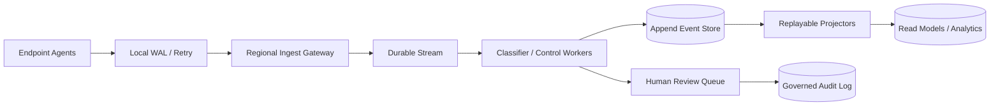

# ADR-008: Fleet Scale Architecture (100,000 Endpoints)

## Status

Proposed — **architecture target, not a demonstrated capacity claim**.

## Context

The platform currently operates **local-first** with append-only JSONL, a single FastAPI instance, and demo-oriented identity controls. This ADR asks what would have to change if the system were required to support a fleet on the order of **100,000 endpoints**.

A planning workload might look like:

- 100,000 enrolled endpoints
- 10–50 evidence events per endpoint per day
- roughly 1–5M events/day before retries, duplicate delivery, replays, and burst amplification
- enterprise tenants ranging from small pilot fleets to tens of thousands of endpoints
- requirements for idempotent ingestion, bounded replay, backpressure, tenant isolation, and auditable failure recovery

These numbers are **capacity-planning inputs**, not measured production traffic. The repository's local fleet benchmark does not prove this deployment can sustain 100,000 live endpoints.

JSONL on a single host is useful for deterministic development, audit examples, and replay tests, but it is not intended to be the system of record for a distributed fleet at this scale.

## Decision

Keep the existing domain contracts, but define a migration path toward a **partitioned, log-oriented ingest and replay architecture** only when measured workload and operational requirements justify it.

| Concern | Proposed production direction | Existing contract / boundary |
|---------|-------------------------------|------------------------------|
| Endpoint durability | Agent-local WAL / retry queue | Evidence event contract |
| Regional ingestion | Stateless authenticated ingest gateways | `fleet/ingestion.py` |
| Backpressure / buffering | Durable stream or queue (Kafka, Redpanda, NATS JetStream, managed equivalent) | `fleet/streaming.py` |
| Source-of-truth event log | Append-oriented event store with retention and replay semantics | `fleet/event_store.py` |
| Partitioning | Stable tenant + endpoint partition key | `fleet/partitioning.py` |
| Deduplication | Explicit idempotency key + bounded dedupe state | `fleet/deduplication.py` |
| Multi-tenancy | Tenant-scoped authorization and storage boundaries | `fleet/tenancy.py` |
| Identity / RBAC | OIDC/JWT claims validated at service boundary | `fleet/rbac.py` |
| Observability | Metrics + traces + structured logs with tenant-safe labels | `fleet/observability.py` |
| Replay | Partition-scoped deterministic projector jobs | `fleet/replay.py` |

### Non-negotiable invariants

Scaling the transport must not weaken the decision model:

1. Observation ≠ Proof.
2. Correlation ≠ Causation.
3. Confidence ≠ Certainty.
4. Audit events are append-oriented and replayable.
5. Policy defaults remain preview-first for risky remediation.
6. Duplicate delivery must not create duplicate governed actions.
7. A partial regional failure must degrade ingestion/replay predictably rather than bypass policy.

## Capacity model and decision triggers

Do **not** introduce Kafka, multi-region storage, or additional services merely to make the architecture look large. Promote a component only when evidence shows the simpler design no longer meets a requirement.

| Trigger | Evidence required before migration |
|---------|------------------------------------|
| Single-process ingest is insufficient | Repeated load tests showing sustained latency/error-budget violation at target concurrency |
| Database becomes bottleneck | Query/write profiling demonstrating resource saturation or lock/contention limits for the actual schema |
| Replay time exceeds objective | Measured replay duration exceeds defined recovery objective |
| Duplicate delivery creates risk | Instrumented duplicate rate + evidence that dedupe state is required for correctness |
| Tenant isolation becomes mandatory | Real multi-tenant deployment requirement and threat model |
| Regional failure tolerance is required | Explicit availability objective and tested failover requirement |

The architectural sequence should therefore be:

```text
measure -> define SLO/capacity objective -> identify bottleneck -> change one boundary -> re-measure
```

not:

```text
assume 100k endpoints -> add distributed systems components -> call it scalable
```

## Candidate production topology



This diagram is a **design proposal**. The repository currently demonstrates the domain contracts, local simulation, deterministic replay, and policy model; it does not claim the distributed topology above is deployed or benchmarked.

## Failure model to defend in an interview

| Failure | Expected behavior |
|---------|-------------------|
| Endpoint offline | Buffer locally; retry with bounded storage policy |
| Gateway unavailable | Retry another healthy endpoint/region only if identity and ordering rules permit |
| Stream backlog | Apply backpressure; expose queue age/depth; do not skip policy stages |
| Worker crash | Redeliver idempotently; governed side effects keyed by decision/event identity |
| Event store unavailable | Stop projection persistence; retain durable upstream events |
| Duplicate event delivery | Same evidence event may be processed again, but governed mutation must remain idempotent |
| Replay job failure | Resume by partition/checkpoint; never rewrite source evidence to hide failure |
| Region partition | Prefer bounded degraded mode over uncoordinated remediation |

## Consequences

- Development/CI keeps `FLEET_MODE=local` and deterministic JSONL fixtures.
- Production transport can evolve independently of evidence/classification contracts.
- More distributed components increase operational cost and failure modes; they are justified only by measured requirements.
- Capacity claims require repeatable benchmark artifacts with environment metadata, not architecture diagrams.

## Alternatives considered

| Alternative | Why it is not the default decision |
|-------------|------------------------------------|
| Keep sharded JSONL indefinitely | Useful locally, but weak for distributed consumer coordination, backpressure, and bounded fleet replay |
| Single relational database for everything | May be entirely adequate at smaller scale; keep until profiling shows otherwise rather than inventing a throughput ceiling |
| Adopt Kafka immediately | Adds operational complexity before measured need; transport choice should follow workload/SLO evidence |
| Full event-sourcing rewrite | Existing append/replay contracts provide most interview value without forcing every read model into event sourcing |

## Validation required before claiming 100k readiness

A future production-readiness claim would require, at minimum:

- a real ingest endpoint and concurrent load generator
- captured CPU/RAM/storage/network environment
- repeated runs, not one best-case sample
- success/error/retry/duplicate accounting
- p50/p95/p99 latency and throughput at the service boundary
- persistence and replay measurements
- fault injection for worker/store/stream failure
- explicit SLO and error-budget criteria
- tenant-isolation and authorization tests

Until those exist, the correct statement is: **"designed with a documented 100k-endpoint migration path"**, not **"supports 100k endpoints."**

## References

- `docs/fleet-benchmark-methodology.md`
- `docs/architecture/fleet_scale_100k.md`
- `docs/migration/fleet_scale_migration_plan.md`
- `platform_core/fleet/`
