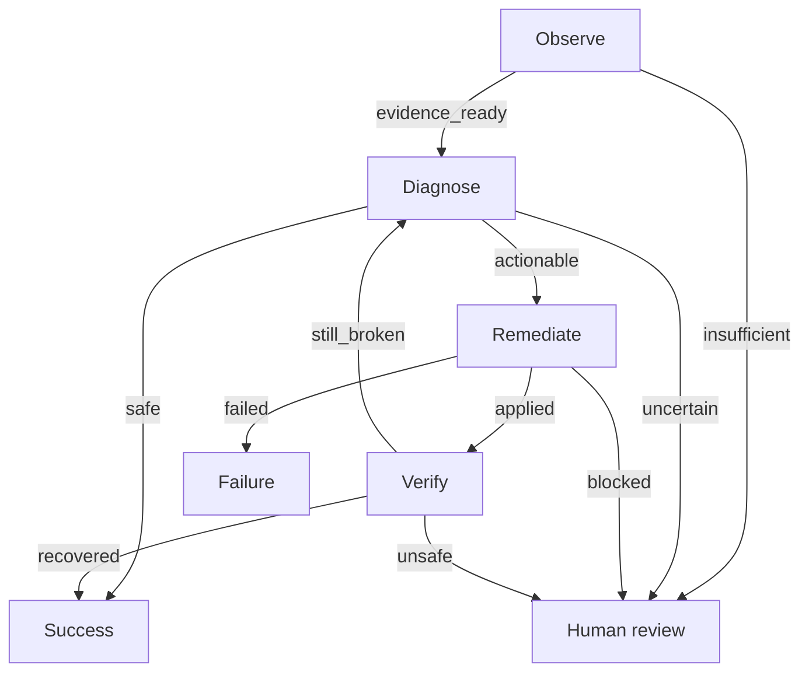

# Stateful Agent Loop Runtime

The platform now includes a small, deterministic graph runtime for bounded agent loops.

## What it adds

- Explicit mutable execution state
- Conditional graph routing
- Per-node retry budgets
- Global step budgets
- Checkpoints before each action
- Human-review escalation
- Terminal success and failure states

## Incident-response graph



The `verify → diagnose` edge creates a real feedback loop instead of a one-pass pipeline.

## Example

```python
from src.platform_core.agents.loop_runtime import (
    LoopState,
    StepResult,
    build_incident_response_graph,
)

runtime = build_incident_response_graph(
    observe=lambda state: StepResult("evidence_ready", {"proxy_enabled": True}),
    diagnose=lambda state: StepResult("actionable", {"cause": "dead_proxy"}),
    remediate=lambda state: StepResult("applied", {"proxy_disabled": True}),
    verify=lambda state: StepResult("recovered", reason="HTTPS probe passed"),
)

result = runtime.run(LoopState(current_node="observe"))
```

Every execution returns history, attempt counters, checkpoints, terminal status, and a terminal reason suitable for audit or replay persistence.

## Safety behavior

The runtime fails closed. Unknown outcomes, exhausted retries, and exhausted global step budgets are routed to `needs_human_review` instead of silently continuing or inventing success.
