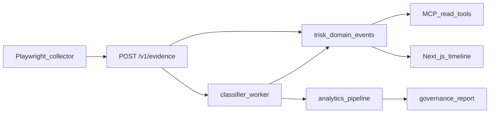

# AI-Native Platform Architecture

**Status:** Portfolio prototype — production-shaped, not enterprise-deployed.

## Five layers

| Layer | Responsibility | Key modules |
|-------|----------------|-------------|
| **L1 Evidence** | Deterministic collection | `windows_network_toolkit/collectors/`, `playwright_collector.py`, `browser_evidence.py` |
| **L2 Risk Intelligence** | Classification, controls, risk | `analytics_pipeline.py`, `incident_classifier.py`, `risk_scoring_engine.py` |
| **L3 Agent Contracts** | Structured JSON I/O, human gates | `src/platform_core/agents/contracts/`, `orchestrator.py` |
| **L4 MCP** | Read-only tool surface | `mcp_server/` |
| **L5 Web** | Governance UI | `frontend/app/platform/` |

## Vertical slice loop

## Non-claims

- Not EDR, not malware detection, not MITM confirmation
- Not autonomous remediation — humans approve apply
- AI explains via contracts only — no execution authority
- Not formal audit opinion

See [SYSTEM_DESIGN.md](../SYSTEM_DESIGN.md) · [domain-event-catalog.md](domain-event-catalog.md) · [agent-workflow-spec.md](agent-workflow-spec.md)
