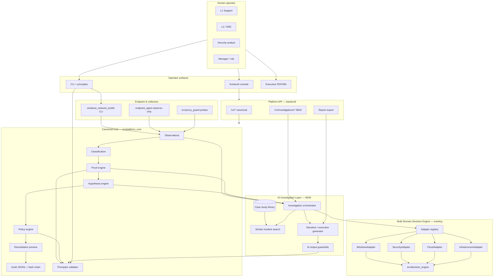
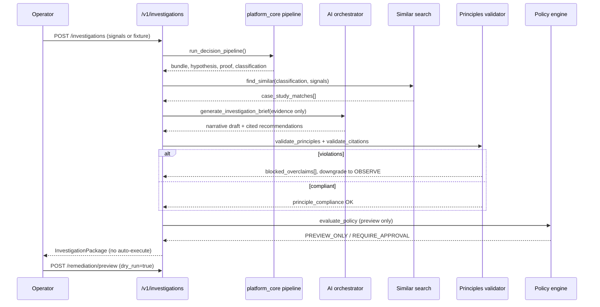

# AI-Assisted Endpoint Investigation Platform — Architecture

**Status:** Design (2026)  
**Audience:** Staff engineers, security architects, product  
**Baseline:** Windows Network Recovery Toolkit v0.2.x  
**Non-negotiables:** Evidence-first · No autonomous remediation · Policy-gated actions · Cited recommendations

---

## 1. Executive summary

This design extends the existing canonical pipeline:

```text
Observation → Classification → Proof → Policy → Remediation Preview → Audit
```

with an **AI Investigation Layer** that assists human operators — it does **not** replace proof, policy, or audit. AI outputs are **advisory narratives and search/ranking** over structured evidence already collected by `src/platform_core/` and `windows_network_toolkit/`.

| Principle | Platform enforcement |
|-----------|---------------------|
| Observation is not proof | AI cannot upgrade evidence tier; `principles.validator` blocks overclaims |
| Correlation is not causation | Recommendations require `evidence_id[]` citations; listener ≠ writer |
| Confidence is not certainty | Ordinal scores only; AI prompts forbid probability language |
| No autonomous remediation | AI routes terminate at `PREVIEW_ONLY`; execution stays in policy engine |
| Policy-gated actions | All `/v1/remediation/*` require approval tokens + dry-run default |
| Cited recommendations | `InvestigationRecommendation.evidence_refs[]` required |

---

## 2. Architecture diagram

### 2.1 System context



### 2.2 Investigation request flow



### 2.3 Layer responsibilities

| Layer | Mutates host? | AI allowed? | Source of truth |
|-------|---------------|-------------|-----------------|
| Observation | No | No | Probes, registry, netstat |
| Classification | No | Assist labels only | `platform_core/classification` |
| Proof | No | No | `proof/engine`, contrast checks |
| Hypothesis | No | Rank/explain only | `hypothesis/engine`, case library |
| AI Investigation | No | Yes (advisory) | Orchestrator + guardrails |
| Policy | No | No | `policy/engine`, principles |
| Remediation preview | Preview only | No | `remediation/planner` |
| Audit | Append-only | No | JSONL hash chain |

---

## 3. Folder structure

Proposed layout **extends** the repo; canonical core stays under `src/platform_core/`.

```text
Windows-Network-Recovery-Toolkit/
├── src/platform_core/                    # Canonical — unchanged authority
│   ├── evidence/                         # Tiers, guards, state machine
│   ├── proof/                            # Structured proof
│   ├── classification/
│   ├── hypothesis/                       # Deterministic hypothesis ranking
│   ├── policy/
│   ├── remediation/
│   ├── audit/
│   ├── principles/                       # ✅ Epistemic contracts (existing)
│   ├── investigation/                    # 🆕 Investigation domain (no AI vendor lock-in)
│   │   ├── __init__.py
│   │   ├── models.py                     # InvestigationPackage, CitedRecommendation
│   │   ├── orchestrator.py               # Pipeline glue (evidence in → package out)
│   │   ├── case_library.py               # Index case_studies/ + fixtures
│   │   ├── similar_incidents.py          # Embedding / feature similarity search
│   │   ├── executive_report.py           # Manager-facing report builder
│   │   └── citation_validator.py         # Every claim → evidence_id
│   └── pipeline.py
│
├── src/platform_core/investigation/ai/   # 🆕 Optional AI provider adapters
│   ├── __init__.py
│   ├── contracts.py                      # Prompt + response schemas
│   ├── guardrails.py                     # Pre/post filters, principle injection
│   ├── providers/
│   │   ├── null_provider.py              # Deterministic fallback (MVP default)
│   │   ├── openai_provider.py            # Pluggable
│   │   └── azure_foundry_provider.py     # Pluggable
│   └── prompts/
│       ├── investigation_brief.yaml
│       └── executive_summary.yaml
│
├── platform_core/decision_platform/      # ✅ Multi-domain (existing)
│   ├── adapters/                         # Windows, Security, Cloud, Infra, Market
│   ├── registry.py
│   └── reasoning.py
│
├── case_studies/                         # 🆕 Canonical case library (expand)
│   ├── index.yaml                        # Tags, classifications, fixture paths
│   ├── cs1_wininet_proxy_drift/          # ✅ Golden case
│   ├── cs2_unknown_local_listener/       # Planned
│   └── cs3_decision_engine_replay/         # Planned
│
├── windows_network_toolkit/              # CLI facade
│   └── cli.py                            # investigate, principles (extend)
│
├── backend/
│   ├── canonical_routes.py               # /v1/*
│   └── investigation_routes.py           # 🆕 /v1/investigations/*
│
├── frontend/app/investigations/            # 🆕 Operator UI
│
└── tests/
    ├── investigation/                    # 🆕 Orchestrator + citation tests
    └── ai/                               # 🆕 Guardrail contract tests
```

**Consolidation rule:** AI code never imports remediation executors. Investigation orchestrator may only call `preview_*` functions.

---

## 4. Data models

All models use Pydantic v2. AI-specific fields are optional; deterministic path works without any LLM.

### 4.1 Core investigation package

```python
# src/platform_core/investigation/models.py (proposed)

class EvidenceCitation(BaseModel):
    evidence_id: str
    signal: str
    tier: EvidenceTierName          # OBSERVED_ONLY | CORRELATED | PROVEN_*
    observed_value: str = ""
    source_ref: str = ""             # probe name, fixture path, audit row id

class HypothesisCandidate(BaseModel):
    hypothesis_id: str
    title: str
    incident_type: str               # WININET_PROXY_DRIFT, UNKNOWN_LOCAL_PROXY, ...
    confidence_ordinal: float        # 0–1 heuristic, NOT probability
    confidence_display: str          # "ordinal 0.92 (heuristic, not probability)"
    supporting_evidence: list[EvidenceCitation]
    contradicting_evidence: list[EvidenceCitation] = []
    status: Literal["supported", "weakened", "unproven", "rejected"]

class SimilarIncidentMatch(BaseModel):
    case_id: str                     # cs1_wininet_proxy_drift
    title: str
    similarity_score: float          # 0–1 feature similarity, not probability
    shared_signals: list[str]
    shared_classification: str | None
    fixture_path: str
    lessons: list[str] = []

class InvestigationRecommendation(BaseModel):
    recommendation_id: str
    action: str                      # INVESTIGATE_LISTENER, PREVIEW_DISABLE_WININET, ...
    policy_outcome: PolicyOutcomeName
    rationale: str
    evidence_refs: list[str]         # REQUIRED — evidence_id list
    limitations: list[str]
    ai_generated: bool = False

class InvestigationPackage(BaseModel):
    investigation_id: str
    incident_id: str
    schema_version: str
    created_at: str
    classification: dict[str, Any]
    proof_envelope: dict[str, Any]
    hypotheses: list[HypothesisCandidate]
    similar_incidents: list[SimilarIncidentMatch]
    recommendations: list[InvestigationRecommendation]
    principle_compliance: PrincipleComplianceResult
    executive_summary: str | None = None   # AI or template
    evidence_chain: list[dict[str, str]]
    blocked_overclaims: list[str]
    safe_remediation_controls: list[str]
    engine_digest: str                     # Deterministic replay anchor
```

### 4.2 Case study library entry

```yaml
# case_studies/index.yaml
cases:
  - id: cs1_wininet_proxy_drift
    title: "WinINET proxy drift — dead localhost proxy"
    primary_classification: DEAD_PROXY_CONFIG
    tags: [proxy, wininet, browser-fail, dead-listener]
    fixture: case_studies/cs1_wininet_proxy_drift/fixture.json
    timeline: case_studies/cs1_wininet_proxy_drift/timeline.jsonl
    principles_validated: true
    interview_tier: golden
```

### 4.3 AI provider contract (advisory only)

```python
class AIInvestigationRequest(BaseModel):
    investigation_id: str
    evidence_bundle: EvidenceBundle
    hypotheses: list[HypothesisCandidate]
    similar_incidents: list[SimilarIncidentMatch]
    forbidden_actions: list[str] = ["execute", "kill", "firewall_reset"]
    system_principles: list[str]       # Injected from principles.yaml

class AIInvestigationResponse(BaseModel):
    executive_summary: str
    operator_narrative: str
    cited_recommendations: list[InvestigationRecommendation]
    model_id: str
    prompt_version: str
    raw_confidence_cap: str = "ordinal_only"
```

Post-processing: `guardrails.py` strips probability language, validates citations, runs `validate_principles()`.

### 4.4 Multi-domain extension (existing + investigation hook)

```python
# platform_core/decision_platform/models.py — extend DomainPipelineResult
class DomainPipelineResult(BaseModel):
    # ... existing fields ...
    investigation_hooks: dict[str, Any] = {}  # Optional cross-domain context for AI brief
```

Windows adapter feeds proxy signals; Security adapter feeds alert severity — orchestrator merges for **narrative only**, not tier upgrades.

---

## 5. API design

Base: `/v1` (canonical). Auth: JWT + RBAC (existing `backend/auth.py`). All write paths default `dry_run=true`.

### 5.1 Investigation endpoints (new)

| Method | Path | Purpose |
|--------|------|---------|
| `POST` | `/v1/investigations` | Create investigation from live signals or fixture |
| `GET` | `/v1/investigations/{id}` | Full `InvestigationPackage` |
| `GET` | `/v1/investigations/{id}/similar` | Similar case studies + past incidents |
| `POST` | `/v1/investigations/{id}/brief` | Generate/regenerate AI brief (optional provider) |
| `GET` | `/v1/investigations/{id}/report` | Executive report (`format=markdown\|html\|pdf`) |
| `POST` | `/v1/investigations/{id}/validate` | Re-run principles + citation validator |

**Request — create investigation**

```json
POST /v1/investigations
{
  "incident_id": "inc-2026-001",
  "signals": {},
  "fixture_path": "case_studies/cs1_wininet_proxy_drift/fixture.json",
  "include_ai_brief": false,
  "similar_limit": 5
}
```

**Response — investigation package (excerpt)**

```json
{
  "investigation_id": "inv-a1b2c3",
  "classification": { "primary_classification": "DEAD_PROXY_CONFIG", "confidence_display": "ordinal 0.92 (heuristic, not probability)" },
  "hypotheses": [{
    "title": "Dead WinINET localhost proxy",
    "status": "supported",
    "supporting_evidence": [{ "evidence_id": "ev-0", "signal": "listener_found", "tier": "OBSERVED_ONLY" }]
  }],
  "similar_incidents": [{ "case_id": "cs1_wininet_proxy_drift", "similarity_score": 0.94 }],
  "recommendations": [{
    "action": "PREVIEW_DISABLE_WININET",
    "policy_outcome": "PREVIEW_ONLY",
    "evidence_refs": ["ev-0", "ev-1"],
    "limitations": ["Does not prove malware or MITM."]
  }],
  "principle_compliance": { "compliant": true },
  "safe_remediation_controls": ["Dry-run default", "Typed confirmation required"]
}
```

### 5.2 Case study library (new)

| Method | Path | Purpose |
|--------|------|---------|
| `GET` | `/v1/case-studies` | List indexed cases |
| `GET` | `/v1/case-studies/{case_id}` | Case metadata + fixture refs |
| `POST` | `/v1/case-studies/{case_id}/replay` | Deterministic replay (read-only) |

### 5.3 Existing endpoints (unchanged authority)

| Method | Path | Role |
|--------|------|------|
| `POST` | `/v1/events` | Ingest signals → pipeline |
| `POST` | `/v1/policy/evaluate` | Policy gate |
| `POST` | `/v1/remediation/preview` | Dry-run remediation |
| `POST` | `/v1/approve` | Typed approval token |
| `POST` | `/v1/outcomes` | Learning loop |
| `POST` | `/v1/replay/certify` | Deterministic certification |

### 5.4 CLI parity

```powershell
python -m windows_network_toolkit investigate --fixture case_studies/cs1_wininet_proxy_drift/fixture.json
python -m windows_network_toolkit investigate --similar --fixture ...
python -m windows_network_toolkit investigate --executive-report --format markdown
python -m windows_network_toolkit principles validate --fixture ...
```

---

## 6. AI Investigation Layer — guardrails

### 6.1 What AI may do

- Summarize **already collected** evidence for operators and managers
- Rank hypotheses **consistent with** deterministic `hypothesis_engine` output
- Find similar cases from `case_studies/index.yaml` + historical JSONL
- Draft executive reports with **mandatory citation blocks**
- Suggest next investigative steps (collect Sysmon E13, run `tls-proof`)

### 6.2 What AI must not do

- Upgrade evidence tier (OBSERVED → PROVEN)
- Emit remediation execute commands
- Claim malware/MITM without `evidence_refs` at PROVEN tier
- Use probability language (% chance, likelihood of compromise)
- Bypass `principles.validator` or policy engine

### 6.3 Guardrail pipeline

```text
Structured evidence → AI provider → citation_validator → principles.validator
  → policy.engine (preview) → audit append → operator review
```

**MVP default:** `null_provider` returns template narratives from Jinja + case library — zero external API dependency, fully testable in CI.

---

## 7. Component mapping (existing → target)

| Capability | Today | Target |
|------------|-------|--------|
| Observations | `collectors/`, `proxy_state` | Unchanged |
| Classification | `classification/` | Unchanged |
| Proof | `proof.py`, `proof/engine` | Unchanged |
| Hypothesis | `hypothesis/engine`, WNT `decision/` | Extend with citation model |
| Confidence | `confidence_score`, principles | Enforce `confidence_display` everywhere |
| Principles | `principles/` ✅ | Gate AI + reports |
| Case studies | `case_studies/cs1_*`, docs | `index.yaml` + API |
| Similar search | — | `similar_incidents.py` (feature vector MVP) |
| Executive report | `report.py`, `consulting-report.md` | `executive_report.py` + API |
| Multi-domain | `decision_platform/adapters` | Feed investigation orchestrator |
| AI | — | `investigation/ai/` pluggable providers |

---

## 8. Implementation roadmap

### Phase 0 — Foundation (2 weeks) ✅ largely done

- [x] Principles module + validator
- [x] CS1 fixture + compliance tests
- [x] Canonical pipeline `/v1/events`
- [ ] `case_studies/index.yaml` + loader

### Phase 1 — Investigation domain (3 weeks) — **MVP core**

| Task | Deliverable |
|------|-------------|
| 1.1 | `investigation/models.py` + citation validator |
| 1.2 | `investigation/orchestrator.py` wrapping existing pipeline |
| 1.3 | `case_library.py` + similar incident search (feature-based) |
| 1.4 | `executive_report.py` with principle sections |
| 1.5 | CLI: `investigate` command |
| 1.6 | Tests: citation required, no uncited recommendations |

### Phase 2 — API + UI (3 weeks)

| Task | Deliverable |
|------|-------------|
| 2.1 | `backend/investigation_routes.py` |
| 2.2 | Frontend investigation detail page |
| 2.3 | Report export (markdown → HTML) |
| 2.4 | CI: investigation contract tests |

### Phase 3 — AI providers (4 weeks)

| Task | Deliverable |
|------|-------------|
| 3.1 | `null_provider` (deterministic templates) |
| 3.2 | `guardrails.py` + prompt YAML |
| 3.3 | Optional OpenAI/Azure provider behind feature flag |
| 3.4 | Audit log: model_id, prompt_version, input digest |
| 3.5 | Red-team tests: jailbreak → still no execute |

### Phase 4 — Multi-domain investigation (4 weeks)

| Task | Deliverable |
|------|-------------|
| 4.1 | Cross-domain `InvestigationPackage` merge |
| 4.2 | Security + Windows joint briefs |
| 4.3 | Outcome learning feedback into similar search |

### Phase 5 — Enterprise hardening (ongoing)

See §10 Enterprise roadmap.

---

## 9. MVP scope

**Goal:** Ship a **deterministic, AI-optional** investigation workflow for Case Study 1 (dead WinINET proxy) in 6–8 weeks.

### In scope (MVP)

| Feature | Notes |
|---------|-------|
| Investigation orchestrator | Wraps existing pipeline; no new probes |
| Case study library | `index.yaml` + CS1, CS2 fixtures |
| Similar incident search | Feature similarity (classification + signals); no vector DB required |
| Hypothesis ranking with citations | Extends existing `hypothesis_engine` |
| Executive report generator | Markdown/HTML; principle sections |
| Principles validation on every package | Hard gate |
| CLI `investigate` | Fixture-safe demos |
| API `POST /v1/investigations` | Fixture mode for CI |
| `null_provider` only | No external LLM dependency |
| Tests | 100% principle compliance on CS1 |

### Out of scope (MVP)

| Feature | Defer to |
|---------|----------|
| Autonomous remediation | Never |
| LLM providers (OpenAI/Azure) | Phase 3 |
| Vector embedding store | Phase 3+ |
| PDF signing / SOAR integration | Enterprise |
| Fleet-wide aggregation | Enterprise |
| Real-time agent streaming | Enterprise |

### MVP success criteria

1. CS1 fixture produces compliant `InvestigationPackage`
2. Every recommendation has ≥1 `evidence_ref`
3. Executive report passes `principles validate`
4. No regression in existing CLI/API tests
5. Demo runnable without admin, network, or API keys

---

## 10. Enterprise roadmap

| Quarter | Theme | Deliverables |
|---------|-------|--------------|
| Q1 | Investigation platform | MVP + `/v1/investigations` + frontend |
| Q2 | AI advisory (governed) | Pluggable providers, prompt registry, audit of AI outputs |
| Q3 | Scale & search | pgvector / Azure AI Search for incident similarity; fleet ingest |
| Q4 | Enterprise integration | SIEM export (JSONL/Splunk HEC), ServiceNow ticket attach, signed PDF reports |
| Q5 | Continuous learning | Outcome loop tunes similar search weights; false-positive feedback |
| Q6 | Multi-tenant SaaS | RBAC, org isolation, quota, data residency |

### Production readiness gates

| Gate | Requirement |
|------|-------------|
| Security | AI outputs never call remediation executors; SAST on `investigation/ai/` |
| Reliability | Deterministic replay digest stable without AI provider |
| Observability | Prometheus: `investigations_total`, `principle_violations_total`, `ai_brief_latency` |
| Compliance | Every report includes limitations + blocked overclaims |
| DR | Case library + audit JSONL replicated; replay certifier in CI |

---

## 11. Maintainability principles

1. **Single authority:** `src/platform_core/` owns tiers, policy, audit — AI is a consumer.
2. **Provider isolation:** LLM vendors live in `investigation/ai/providers/` only.
3. **Test without AI:** `null_provider` is the CI default; LLM tests are optional integration.
4. **Fixture-first:** Every case study is a pytest fixture + API replay target.
5. **No duplicate models:** Reuse `principles.models`, `contracts.py`, `decision_platform.models`.
6. **Explicit deprecation:** Legacy `platform_core/` root shims remain until migration complete — investigation code does not add a third pipeline.

---

## 12. Quick reference

| Doc | Purpose |
|-----|---------|
| [architecture.md](architecture.md) | Current platform map |
| [decision_platform_architecture.md](decision_platform_architecture.md) | Multi-domain adapters |
| [principles](../src/platform_core/principles/principles.yaml) | Epistemic rules |
| [case-study-1-proxy-drift.md](case-study-1-proxy-drift.md) | Golden narrative |
| [consulting-report.md](consulting-report.md) | Executive tone guide |

**Next implementation step:** Phase 1.1 — `src/platform_core/investigation/models.py` + `citation_validator.py` with tests requiring `evidence_refs` on all recommendations.
