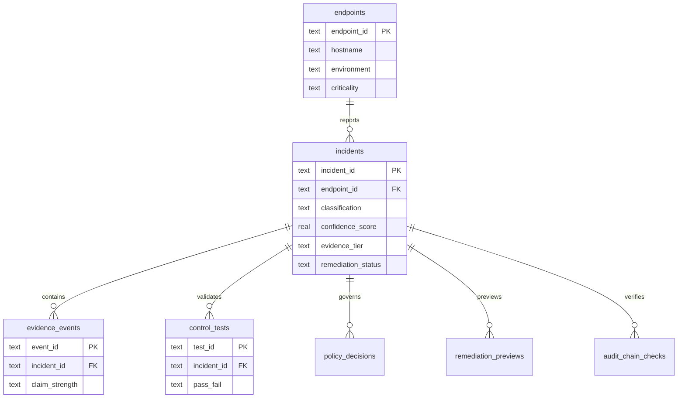

# Analytics Data Model — Risk & Control Warehouse

SQL-ready dimensional model for **Data Analyst**, **Risk Data Analyst**, **Technology Risk Analyst**, **IT Audit Analytics**, and **Security Data Analyst** portfolio work.

**Principles preserved in data design:** Observation ≠ Proof · Correlation ≠ Causation · Confidence ≠ Certainty · Policy Permission ≠ Safety Guarantee · Dry-run by default.

**Executable DDL:** [`schemas/analytics_warehouse.sql`](../schemas/analytics_warehouse.sql)  
**CLI rollup:** `python -m windows_network_toolkit analytics-summary --audit-dir .audit`

Core tables: `incidents`, `evidence_events`, `proof_results`, `policy_decisions`, `remediation_previews`, `audit_events`.

---

## 1. Purpose

The platform produces JSON CLI output, audit JSONL, control tests, and governance reports. For analyst interviews and stakeholder dashboards, those artifacts need a **normalized warehouse layer** that supports:

- KPI and trend reporting (incident volume, evidence maturity, policy block rate)
- Control effectiveness analytics (pass/fail by control objective)
- Endpoint risk concentration (recurring classifications, high-impact low-confidence cases)
- Audit completeness and remediation governance metrics (preview vs execute, hash-chain validity)
- Joinable dimensions for BI tools (Tableau, Power BI, Looker, Excel pivot models)

This model is **informational** — it does not replace append-only audit JSONL. It is the analytics projection of the same events.

---

## 2. Entity relationship overview



**Grain:**

| Table | One row per |
|-------|-------------|
| `endpoints` | Managed endpoint asset |
| `incidents` | Technology risk incident (case) |
| `evidence_events` | Observable signal or proof attempt |
| `control_tests` | Single control test execution |
| `policy_decisions` | Policy engine outcome for an incident |
| `remediation_previews` | Remediation preview or apply attempt |
| `audit_chain_checks` | Hash-chain verification run |

---

## 3. SQL schema

### `endpoints`

```sql
CREATE TABLE endpoints (
    endpoint_id     TEXT PRIMARY KEY,
    hostname        TEXT NOT NULL,
    environment     TEXT NOT NULL DEFAULT 'production',
    owner_team      TEXT,
    criticality     TEXT NOT NULL DEFAULT 'medium',
    last_seen       TIMESTAMPTZ,
    created_at      TIMESTAMPTZ NOT NULL DEFAULT CURRENT_TIMESTAMP
);
```

### `incidents`

```sql
CREATE TABLE incidents (
    incident_id              TEXT PRIMARY KEY,
    endpoint_id              TEXT NOT NULL REFERENCES endpoints(endpoint_id),
    created_at               TIMESTAMPTZ NOT NULL,
    closed_at                TIMESTAMPTZ,
    classification           TEXT NOT NULL,
    secondary_signals        TEXT,
    confidence_score         REAL NOT NULL,
    evidence_tier            TEXT NOT NULL,
    business_impact          TEXT NOT NULL DEFAULT 'medium',
    policy_decision          TEXT,
    remediation_status       TEXT NOT NULL DEFAULT 'open',
    audit_chain_valid        BOOLEAN,
    diagnosis_started_at     TIMESTAMPTZ,
    diagnosis_completed_at   TIMESTAMPTZ,
    source_case_id           TEXT,
    limitations              TEXT
);
```

### `evidence_events`

```sql
CREATE TABLE evidence_events (
    event_id        TEXT PRIMARY KEY,
    incident_id     TEXT NOT NULL REFERENCES incidents(incident_id),
    event_time      TIMESTAMPTZ NOT NULL,
    source          TEXT NOT NULL,
    signal_type     TEXT NOT NULL,
    observed_value  TEXT,
    claim_strength  TEXT NOT NULL DEFAULT 'observation',
    limitation      TEXT
);
```

### `control_tests`

```sql
CREATE TABLE control_tests (
    test_id             TEXT PRIMARY KEY,
    incident_id         TEXT NOT NULL REFERENCES incidents(incident_id),
    control_name        TEXT NOT NULL,
    control_objective   TEXT,
    pass_fail           TEXT NOT NULL,
    evidence_required   BOOLEAN NOT NULL DEFAULT TRUE,
    evidence_available  BOOLEAN NOT NULL DEFAULT FALSE,
    tested_at           TIMESTAMPTZ NOT NULL
);
```

### `policy_decisions`

```sql
CREATE TABLE policy_decisions (
    policy_decision_id  TEXT PRIMARY KEY,
    incident_id         TEXT NOT NULL REFERENCES incidents(incident_id),
    decision            TEXT NOT NULL,
    reason              TEXT,
    blocked_action      TEXT,
    approval_required   BOOLEAN NOT NULL DEFAULT TRUE,
    rollback_required   BOOLEAN NOT NULL DEFAULT TRUE,
    decided_at          TIMESTAMPTZ NOT NULL DEFAULT CURRENT_TIMESTAMP
);
```

### `remediation_previews`

```sql
CREATE TABLE remediation_previews (
    preview_id                  TEXT PRIMARY KEY,
    incident_id                 TEXT NOT NULL REFERENCES incidents(incident_id),
    proposed_action             TEXT NOT NULL,
    dry_run                     BOOLEAN NOT NULL DEFAULT TRUE,
    typed_confirmation_required BOOLEAN NOT NULL DEFAULT TRUE,
    rollback_plan_available     BOOLEAN NOT NULL DEFAULT TRUE,
    executed                    BOOLEAN NOT NULL DEFAULT FALSE,
    previewed_at                TIMESTAMPTZ NOT NULL DEFAULT CURRENT_TIMESTAMP,
    executed_at                 TIMESTAMPTZ
);
```

### `audit_chain_checks`

```sql
CREATE TABLE audit_chain_checks (
    check_id            TEXT PRIMARY KEY,
    incident_id         TEXT NOT NULL REFERENCES incidents(incident_id),
    audit_file          TEXT NOT NULL,
    hash_chain_valid    BOOLEAN NOT NULL,
    checked_at          TIMESTAMPTZ NOT NULL
);
```

---

## 4. Field descriptions

### `endpoints`

| Field | Description |
|-------|-------------|
| `endpoint_id` | Stable surrogate key (UUID or fleet asset id) |
| `hostname` | Device hostname or synthetic fleet label |
| `environment` | `production`, `staging`, `corp`, `remote` |
| `owner_team` | IT Operations, Endpoint Engineering, Trading Floor, etc. |
| `criticality` | Business criticality of the asset (`low`–`critical`) |
| `last_seen` | Last telemetry or agent heartbeat |

### `incidents`

| Field | Description |
|-------|-------------|
| `incident_id` | Primary incident key; maps to `case_id` in case fixtures |
| `endpoint_id` | FK to affected endpoint |
| `created_at` | Incident opened / first observation time |
| `closed_at` | Resolution or governance close time (nullable if open) |
| `classification` | Primary label e.g. `DEAD_PROXY_CONFIG`, `UNKNOWN_LOCAL_PROXY` |
| `secondary_signals` | JSON array: `WININET_WINHTTP_MISMATCH`, `LOCALHOST_PROXY`, etc. |
| `confidence_score` | Ordinal 0–1; **not** a statistical probability |
| `evidence_tier` | Highest defensible tier: `observation` → `final_causation` |
| `business_impact` | Productivity / revenue / compliance impact rating |
| `policy_decision` | Latest outcome e.g. `PREVIEW_ONLY`, `BLOCK`, `REQUIRE_TYPED_CONFIRMATION` |
| `remediation_status` | Workflow state; `preview_only` is default safe path |
| `audit_chain_valid` | Result of hash-chain verification (nullable if not checked) |
| `diagnosis_started_at` / `diagnosis_completed_at` | For MTTD / diagnosis latency KPIs |
| `source_case_id` | Link to fixture or JSONL source for replay |
| `limitations` | JSON array of epistemic caveats surfaced to auditors |

### `evidence_events`

| Field | Description |
|-------|-------------|
| `event_id` | Unique event key |
| `incident_id` | Parent incident |
| `event_time` | When signal was collected |
| `source` | `wininet_registry`, `winhttp`, `netstat`, `tls_proof`, `sysmon_e13` |
| `signal_type` | e.g. `proxy_enabled`, `listener_found`, `cert_issuer_mismatch` |
| `observed_value` | Raw or normalized value |
| `claim_strength` | Epistemic tier for **this** signal alone |
| `limitation` | Per-signal caveat (e.g. "listener ≠ registry writer") |

### `control_tests`

| Field | Description |
|-------|-------------|
| `test_id` | e.g. `CT_PROXY_DRIFT` from `control-test` CLI |
| `control_name` | Detective/preventive control name |
| `control_objective` | ITGC theme: drift detection, remediation governance, audit trail |
| `pass_fail` | `PASS`, `FAIL`, `WARNING`, `NOT_TESTED` |
| `evidence_required` | Whether control requires proof-tier evidence |
| `evidence_available` | Whether required evidence was present in case |
| `tested_at` | Control test execution timestamp |

### `policy_decisions`

| Field | Description |
|-------|-------------|
| `decision` | `PREVIEW_ONLY`, `ALLOW`, `BLOCK`, `REQUIRE_TYPED_CONFIRMATION` |
| `reason` | Policy engine rationale |
| `blocked_action` | e.g. `process_kill`, `firewall_reset`, `adapter_disable` |
| `approval_required` | Human approval gate |
| `rollback_required` | Rollback plan must exist before apply |

### `remediation_previews`

| Field | Description |
|-------|-------------|
| `proposed_action` | e.g. `DISABLE_WININET_PROXY` (allowlisted only) |
| `dry_run` | **Default TRUE** — no silent registry mutation |
| `typed_confirmation_required` | Operator must supply confirmation token |
| `rollback_plan_available` | Snapshot / rollback documented |
| `executed` | FALSE unless policy + confirmation satisfied |

### `audit_chain_checks`

| Field | Description |
|-------|-------------|
| `audit_file` | Path to `.audit/*.jsonl` verified |
| `hash_chain_valid` | Append-only chain integrity result |
| `checked_at` | Verification timestamp |

---

## 5. Example rows

Aligned with golden case `CASE_1_DEAD_WININET_PROXY` and fleet demo patterns.

### `endpoints`

| endpoint_id | hostname | environment | owner_team | criticality | last_seen |
|-------------|----------|-------------|------------|-------------|-----------|
| `ep-59081-001` | `LAPTOP-FIN-042` | production | Endpoint Engineering | high | 2026-06-11T04:31:31Z |
| `ep-fleet-017` | `WS-TRADING-017` | production | Trading Technology | critical | 2026-06-10T18:00:00Z |

### `incidents`

| incident_id | endpoint_id | classification | confidence_score | evidence_tier | business_impact | policy_decision | remediation_status | audit_chain_valid |
|-------------|-------------|----------------|------------------|---------------|-----------------|-----------------|--------------------|-------------------|
| `CASE_1_DEAD_WININET_PROXY` | `ep-59081-001` | `DEAD_PROXY_CONFIG` | 0.92 | proof | medium | `PREVIEW_ONLY` | preview_only | true |
| `INC-UNKNOWN-PROXY-017` | `ep-fleet-017` | `UNKNOWN_LOCAL_PROXY` | 0.35 | observation | high | `REQUIRE_TYPED_CONFIRMATION` | open | null |

### `evidence_events`

| event_id | incident_id | source | signal_type | observed_value | claim_strength |
|----------|-------------|--------|-------------|----------------|----------------|
| `ev-001` | `CASE_1_DEAD_WININET_PROXY` | wininet_registry | proxy_server | `127.0.0.1:59081` | observation |
| `ev-002` | `CASE_1_DEAD_WININET_PROXY` | netstat | listener_found | `false` | observation |
| `ev-003` | `CASE_1_DEAD_WININET_PROXY` | proof_engine | wininet_winhttp_comparison | supported | proof |

### `control_tests`

| test_id | incident_id | control_name | pass_fail | evidence_available |
|---------|-------------|--------------|-----------|-------------------|
| `CT_PROXY_DRIFT` | `CASE_1_DEAD_WININET_PROXY` | Proxy drift detection | FAIL | true |
| `CT_REMEDIATION_SAFETY` | `CASE_1_DEAD_WININET_PROXY` | Policy-gated remediation | PASS | true |

### `remediation_previews`

| preview_id | incident_id | proposed_action | dry_run | executed |
|------------|-------------|-----------------|---------|----------|
| `rp-001` | `CASE_1_DEAD_WININET_PROXY` | `DISABLE_WININET_PROXY` | true | false |

---

## 6. ETL mapping (platform → warehouse)

| Platform artifact | Target table | Notes |
|-------------------|--------------|-------|
| `proxy-status` JSON | `evidence_events`, `incidents` | Observation tier |
| `diagnose --proof` | `evidence_events`, `incidents.evidence_tier` | Upgrade to proof when supported |
| `risk-assess` | `incidents`, dimensions | Risk + governance fields |
| `control-test` | `control_tests` | One row per test |
| `proxy-disable --dry-run` | `remediation_previews`, `policy_decisions` | `executed=false` |
| `audit verify` | `audit_chain_checks` | Hash chain boolean |
| Fleet simulation JSONL | `endpoints`, `incidents` bulk | `platform_core/fleet_simulation.py` |

**Rule:** Never store "malware confirmed" without `claim_strength = attribution` or `final_causation` and explicit telemetry source.

---

## 7. How this supports Data Analyst / Risk Analyst interviews

| Interview theme | What you demonstrate |
|-----------------|----------------------|
| **Data modeling** | Star/snowflake-style incident fact with evidence and control test dimensions |
| **SQL fluency** | [sql_analytics_queries.md](sql_analytics_queries.md) — 12+ business questions |
| **KPI definition** | Evidence maturity %, policy block rate, audit completeness, MTTD |
| **Risk analytics** | Low confidence + high business impact exceptions |
| **Control testing analytics** | Pass/fail rates by control objective |
| **Governance metrics** | Preview vs execute ratio (dry-run culture) |
| **Honest uncertainty** | `claim_strength`, `limitations`, `evidence_tier` columns prevent false certainty in dashboards |
| **Stakeholder communication** | Bridge engineering JSON to management tables |

**Talking point:** "I designed the warehouse so audit and risk teams can query the same epistemic tiers the engineers enforce in code — observation never silently becomes proof in a KPI."

---

## Related

- [sql_analytics_queries.md](sql_analytics_queries.md)
- [technology_risk_control_matrix.md](technology_risk_control_matrix.md)
- [metrics.md](metrics.md)
- [README_BIG4_PORTFOLIO.md](README_BIG4_PORTFOLIO.md)
