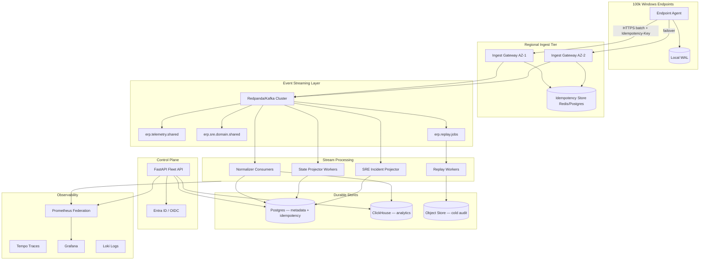
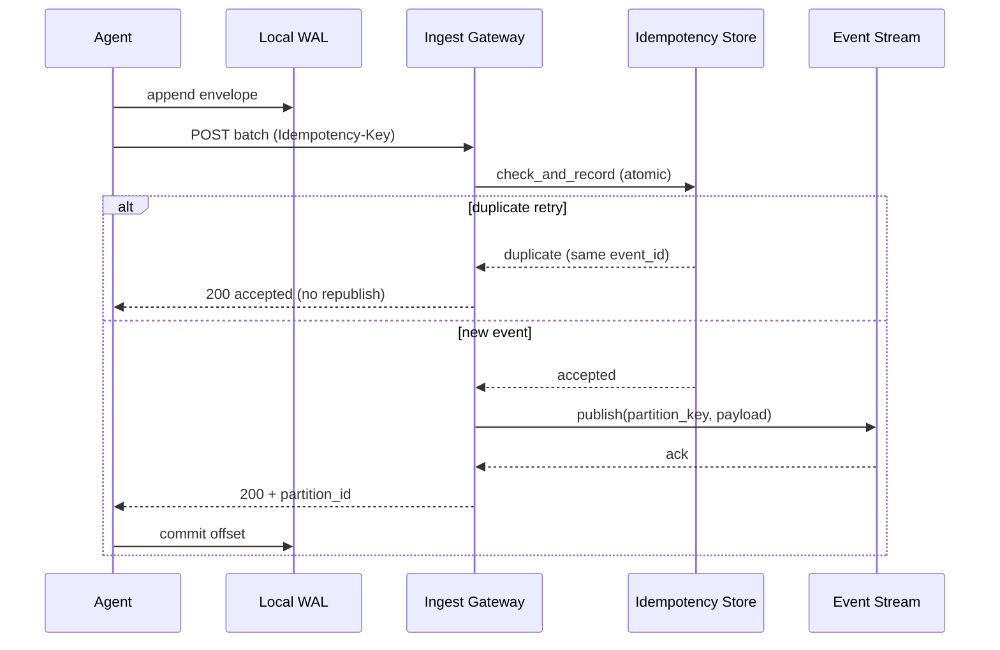
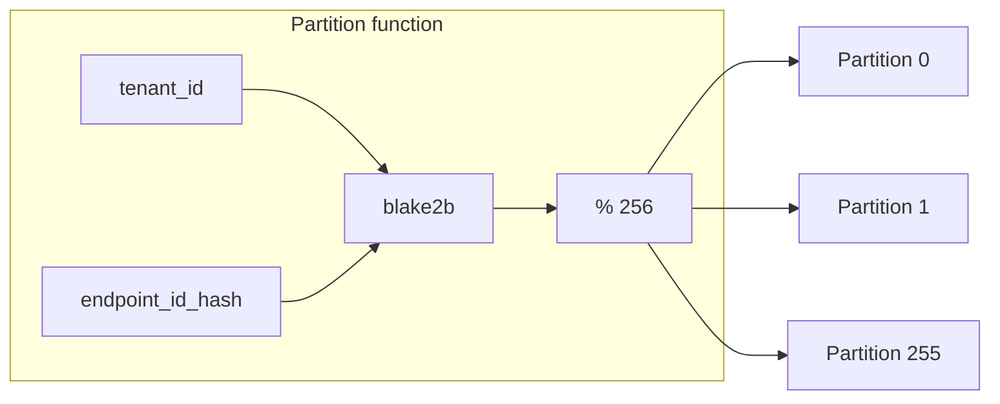
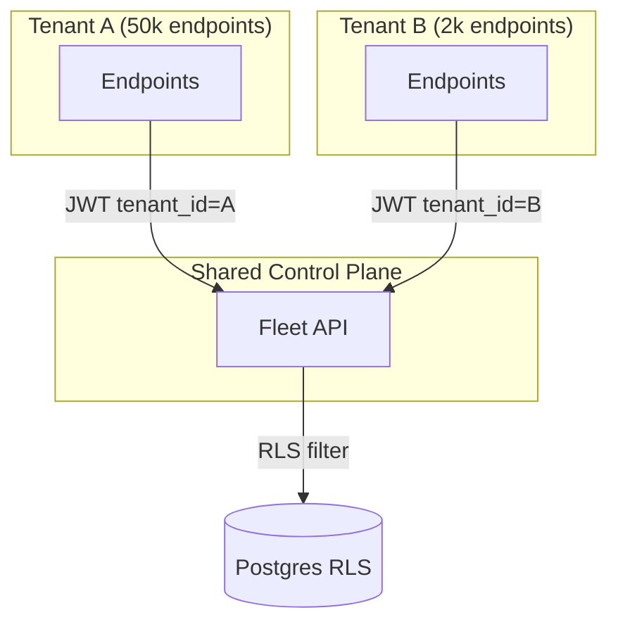
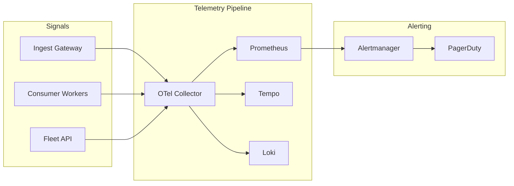
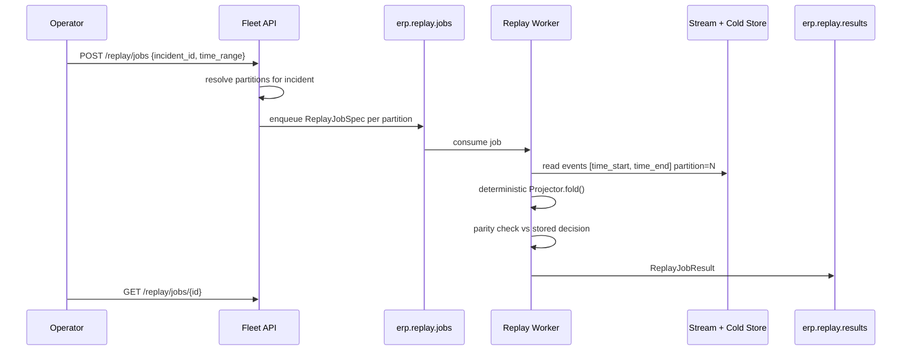

# Fleet Scale Architecture — 100,000 Endpoints

Target: **100,000 Windows endpoints**, multi-tenant enterprise fleet, SRE-grade audit/replay, **correctness over convenience**.

Contracts: `platform_core/fleet/` · ADR: [`ADR-008`](../adr/ADR-008-fleet-scale-100k-endpoints.md) · Migration: [`fleet_scale_migration_plan.md`](../migration/fleet_scale_migration_plan.md)

---

## 1. Capacity model

| Assumption | Value |
|------------|-------|
| Endpoints | 100,000 |
| Events / endpoint / day | 20 (telemetry + state + audit) |
| Daily volume | **2M events/day** |
| Average ingest | **~23 events/sec** |
| Peak (×10 burst) | **~230 events/sec** |
| Tenants | 50–200 (largest: 50k endpoints) |
| Retention (hot stream) | 30 days |
| Retention (cold store) | 7 years (compliance) |

**Design headroom:** 2,000 events/sec sustained (≈100× average) via partitioned streaming.

---

## 2. System context



---

## 3. Distributed ingestion

### Agent responsibilities (data plane)

1. **Collect** — registry, Sysmon, ETW, Event Log, network telemetry (unchanged semantics).
2. **Normalize** — `FleetEventEnvelope` (`fleet.envelope.v1`).
3. **Write local WAL** — `agent_wal.jsonl` (survives network partition).
4. **Batch upload** — HTTPS POST to regional gateway with:
   - `Idempotency-Key: {batch_uuid}`
   - `Authorization: Bearer {agent_jwt}`
   - `X-Tenant-Id: {tenant_id}`

### Gateway responsibilities (ingest tier)

```
POST /platform/v3/ingest/batch
```

| Step | Action | Failure mode |
|------|--------|--------------|
| 1 | JWT + tenant RBAC | 401/403 |
| 2 | Schema validate envelope | 400 |
| 3 | `IdempotencyStore.check_and_record` | 409 on conflict |
| 4 | `assign_partition(tenant_id, endpoint_id_hash)` | — |
| 5 | Publish to stream topic | 503 if circuit open; agent retains WAL |
| 6 | Return per-event `IngestResult` | Agent acks WAL offset |



---

## 4. Event streaming topology

### Topics (reference naming)

| Topic | Partitions | Retention | Key |
|-------|------------|-----------|-----|
| `erp.telemetry.shared` | 256 | 30d | `tenant_id:endpoint_id_hash` |
| `erp.sre.domain.shared` | 256 | 90d | `tenant_id:incident_id` |
| `erp.audit.signed` | 128 | 7y (tiered) | `tenant_id:decision_id` |
| `erp.replay.jobs` | 64 | 7d | `tenant_id:partition_id` |
| `erp.replay.results` | 64 | 30d | `job_id` |
| `erp.dlq.ingest` | 16 | 30d | — |

**Enterprise tier:** dedicated topics `erp.*.enterprise.{tenant_id}` for noisy-neighbor isolation.

### Consumer groups

| Group | Purpose | Scale |
|-------|---------|-------|
| `normalizer-v1` | Raw → `NormalizedPlatformEvent` | 32 workers |
| `state-projector-v1` | Deterministic FSM projections | 32 workers |
| `sre-incident-projector` | Incident read models | 16 workers |
| `audit-archiver` | Cold store + HMAC verify | 8 workers |
| `replay-worker` | Partition-scoped replay jobs | 16 workers (burst) |

---

## 5. Partitioning strategy

```python
partition_id = blake2b(f"{tenant_id}:{endpoint_id_hash}") % FLEET_PARTITION_COUNT
# default FLEET_PARTITION_COUNT=256
```

| Property | Guarantee |
|----------|-----------|
| Per-endpoint ordering | Same `partition_key` → same partition |
| Tenant fairness | Large tenants spread across all partitions |
| Replay parallelism | One worker per `(tenant_id, partition_id, time_range)` |
| Rebalance | Double `FLEET_PARTITION_COUNT` with consumer pause (planned) |



---

## 6. Deduplication & idempotency

### Three layers

| Layer | Key | Store | TTL |
|-------|-----|-------|-----|
| HTTP | `Idempotency-Key` header | Gateway memory → Redis | 72h |
| Envelope | `(tenant_id, producer_id, idempotency_key)` | Redis/Postgres | 72h |
| Event | `event_id` (globally unique) | Stream log compaction | 90d |

### Outcomes

| `DedupDecision` | HTTP | Agent action |
|-----------------|------|--------------|
| `accepted` | 200 | Commit WAL |
| `duplicate` | 200 | Commit WAL (retry OK) |
| `conflict` | 409 | Alert + quarantine batch |

**Rule:** Same idempotency key + different `payload_hash` → **conflict** (never silent overwrite).

---

## 7. Multi-tenant model



| Isolation | Mechanism |
|-----------|-----------|
| Data plane | `tenant_id` on every envelope + stream headers |
| Database | Postgres RLS: `tenant_id = current_setting('app.tenant_id')` |
| Cache | Redis key prefix `t:{tenant_id}:` |
| Observability | `tenant_id` label (low cardinality — tens of tenants, not 100k) |
| Replay | Jobs scoped to `tenant_id` + `partition_id` |
| Blast radius | Per-tenant ingest rate limit; circuit breaker per tenant |

---

## 8. RBAC (production)

Demo headers (`X-Operator-Role`) are **replaced** by JWT claims:

```json
{
  "sub": "operator@contoso.com",
  "tenant_id": "tenant-contoso",
  "roles": ["tenant_operator"],
  "org_id": "org-uuid"
}
```

| Role | Ingest | Read metrics | Investigate | Replay | Postmortem | Cross-tenant |
|------|--------|--------------|-------------|--------|------------|--------------|
| `tenant_viewer` | — | ✓ | — | — | read | — |
| `tenant_operator` | — | ✓ | ✓ | — | read | — |
| `tenant_admin` | — | ✓ | ✓ | ✓ | ✓ | — |
| `tenant_security_auditor` | — | ✓ | read | ✓ | ✓ | — |
| `platform_admin` | ✓ | ✓ | ✓ | ✓ | ✓ | ✓ (break-glass) |

**Agent auth:** separate machine identity (mTLS or client-credentials JWT), scoped to single `tenant_id`.

---

## 9. Observability at scale



### SLOs (100k fleet)

| SLO | Target | Burn alert |
|-----|--------|------------|
| Ingest availability | 99.9% | 5xx > 0.1% 15m |
| Ingest p99 latency | < 500ms | > 1s 10m |
| Partition lag | < 60s p99 | > 300s 5m |
| Replay parity | 99.99% | any mismatch on decision_run |
| MTTR data freshness | < 5m | projector lag |

### Key metrics

See `platform_core/fleet/observability.py` — all counters carry `tenant_id` + `partition` labels where cardinality allows.

---

## 10. Replay at scale

**Problem:** Replaying 2M events/day × 30 days = 60M events — cannot scan JSONL on one host.

**Solution:** Partition-scoped replay jobs.



| Scope | Worker input | Output |
|-------|--------------|--------|
| `incident` | `sre.domain` events for `incident_id` | parity + postmortem input |
| `decision_run` | telemetry + decision snapshot | policy/state/hypothesis parity |
| `tenant_partition` | full partition time slice | projector rebuild benchmark |

Local dev: `ReplayCoordinator.run_local()` delegates to existing `TimeTravelReplay`.

---

## 11. Data store roles

| Store | Role | Not source of truth for |
|-------|------|-------------------------|
| **Kafka/Redpanda** | Hot event log, ordering, replay input | Long-term compliance (tiered) |
| **Postgres** | Idempotency, incident metadata, RBAC, API queries | Raw telemetry firehose |
| **ClickHouse** | Fleet analytics, MTTR rollups, dashboards | Strong consistency writes |
| **S3/Azure Blob** | Cold audit, postmortem artifacts | Real-time ingest |
| **Redis** | Idempotency hot path, rate limits | Durable event history |

---

## 12. Failure domain isolation (fleet extensions)

Existing `platform_core/sre/failure_domains.py` bulkheads extend to fleet tier:

| Domain | Isolation at scale |
|--------|-------------------|
| `telemetry_ingest` | Per-tenant rate limit + gateway circuit |
| `stream_publish` | Separate cluster for enterprise tier |
| `replay` | Dedicated worker pool; no shared CPU with ingest |
| `audit` | Async archiver — never blocks ingest path |

---

## 13. Local vs fleet mode

| `FLEET_MODE` | Behavior |
|--------------|----------|
| `local` (default) | WAL → `fleet_ingest_wal.jsonl`; existing JSONL pipelines |
| `stream` | Gateway publishes to configured `EventPublisher` adapter |

CI and laptop dev stay on `local`. Staging/prod use `stream`.

---

## 14. Related documents

- [`../migration/fleet_scale_migration_plan.md`](../migration/fleet_scale_migration_plan.md)
- [`../adr/ADR-008-fleet-scale-100k-endpoints.md`](../adr/ADR-008-fleet-scale-100k-endpoints.md)
- [`../fleet_architecture.md`](../fleet_architecture.md) (agent/control plane v1)
- [`../extension_points_multi_host_saas.md`](../extension_points_multi_host_saas.md)
- [`../observability_architecture.md`](../observability_architecture.md)
