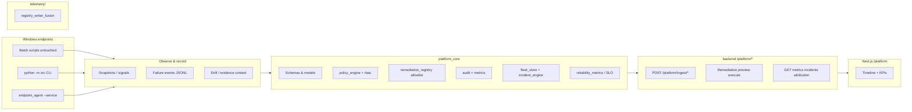

# Endpoint Reliability Platform architecture

This diagram frames the **optional** platform layer: local-first telemetry, append-only JSONL, policy gates, and a localhost dashboard. It **does not** replace beginner `.bat` scripts or the core **`python -m src`** CLI.

## Pipeline (mental model)

1. **Collect** — diagnostics snapshots, proxy drift rows, heartbeat.  
2. **Snapshot / normalize** — privacy redaction (`platform_core.privacy`).  
3. **Detect drift** — compare baselines (`network-state`, proxy guard streams, or FailureBlocks).  
4. **Attribute** — `telemetry/` fuses registry writer telemetry with listener observations; `evidence/` provides Procmon/Sysmon tiers (**honest labeling**).  
5. **Decide policy** — `platform_core.policy` + **`policy_engine.evaluate_route_decision`**.  
6. **Preview remediation** — `POST /platform/remediation/preview` (always before execute).  
7. **Audit** — append-only `audit.jsonl` (including **`execute_live_pending`** before subprocess).  
8. **Dashboard** — `GET /platform/metrics`, `/incidents`, `/events`, attribution drill-down.

## Data plane

All platform rows target files under **`PLATFORM_DATA_DIR`** (`platform_data/` by default):

| Shard | Purpose |
| --- | --- |
| `endpoints.jsonl` | Heartbeats / identity |
| `snapshots.jsonl` | Latest diagnostic captures |
| `failure_events.jsonl` | Ingested failures |
| `remediation_previews.jsonl` | Typed previews |
| `remediation_executions.jsonl` | dry_run / blocked / outcomes |
| `audit.jsonl` | Operator-facing audit |
| `platform_signals.jsonl` | KPI source for metrics merger |
| `fleet_endpoints.jsonl` | Fleet heartbeats (`fleet_store`) |
| `incidents.jsonl` | Incident lifecycle rows |
| `attribution_context.jsonl` | Optional offline attribution fixtures |

Typed envelope models for interviews live in **`platform_core/platform_event_contract.py`**.

## RBAC shortcuts (portfolio)

| Role | Capability |
| --- | --- |
| `viewer` | Read KPIs/events/incidents |
| `operator` | Ingest + preview + dry-run execute |
| `admin` | Low/medium allowlisted live repair + typed confirmation |
| `security_auditor` | Audit + attribution reads; **no** ingest/previews |

See [`platform_api_contract.md`](platform_api_contract.md) and [`rbac_and_remediation.md`](rbac_and_remediation.md).
