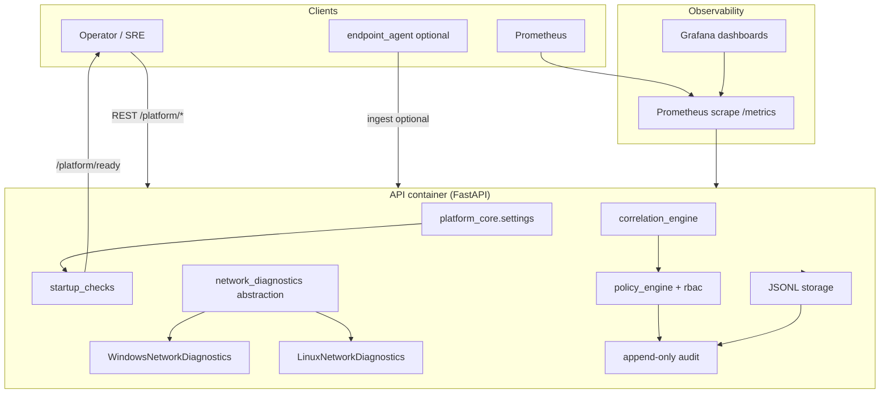
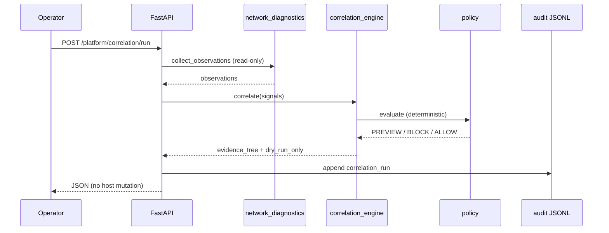
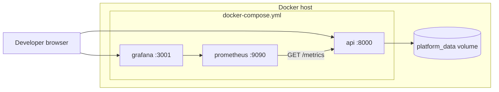

# Production service architecture

This document describes the **containerized Endpoint Reliability Platform service**: typed configuration, startup validation, cross-platform read-only diagnostics, and observability. It complements [architecture_platform.md](architecture_platform.md) (product mental model).

## Epistemic boundaries (non-negotiable)

| Principle | Meaning in this service |
|-----------|-------------------------|
| **Observation != Proof** | DNS, proxy registry reads, and listener hints are labeled `observation` — not writer proof. |
| **Correlation != Causation** | The correlation engine ranks hypotheses; it does not assert root cause. |
| **Policy ALLOW != Safety Guarantee** | `ALLOW` means the policy registry permits a *human-gated* preview/execute path — not autonomous repair. |

---

## Architecture diagram

### Request path (correlation + remediation preview)

---

## Deployment diagram

Optional extensions (dashboard, Loki, Promtail): `docker-compose.full.yml`.

---

## Module map

| Module | Responsibility |
|--------|----------------|
| `platform_core/settings.py` | Typed env + `.env` validation |
| `platform_core/startup_checks.py` | Dependency / filesystem / config checks |
| `platform_core/network_diagnostics/` | OS abstraction (Windows vs Linux) |
| `backend/main.py` | Lifespan, Prometheus `/metrics`, OpenAPI |
| `backend/platform_routes.py` | `/platform/health`, `/platform/ready`, correlation |
| `deploy/prometheus/` | Scrape config |
| `deploy/grafana/` | Dashboard provisioning |

---

## Health vs readiness

| Endpoint | Purpose | HTTP when unhealthy |
|----------|---------|---------------------|
| `GET /platform/health` | **Liveness** — process up, safety flags | Always 200 if reachable |
| `GET /platform/ready` | **Readiness** — startup checks passed | 503 with check details |
| `GET /metrics` | Prometheus scrape | 200 |

Docker `HEALTHCHECK` uses **liveness** (`/platform/health`). Orchestrators may gate traffic on **readiness** (`/platform/ready`).

---

## Related docs

- [production_deployment.md](production_deployment.md) — commands and env vars  
- [production_readiness.md](production_readiness.md) — safety checklist  
- [operator_safety.md](operator_safety.md) — human approval model  
