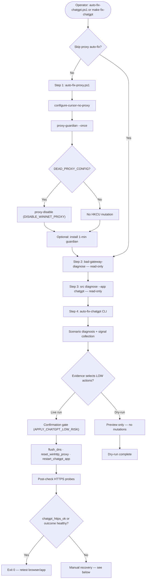

# ChatGPT auto-fix — connectivity and blank messages

One-shot orchestration for **ChatGPT desktop app / browser path degradation** when the root cause is likely local network configuration (dead proxy, DNS, WinHTTP drift, app restart). Chains the dead-proxy recovery layer with read-only diagnosis and **policy-gated LOW-risk remediations**.

**Related:** [dead-proxy-guardian.md](dead-proxy-guardian.md) (proxy layer only) · `src/network_recovery/` (scenario engine)

---

## When to use

| Symptom | May help | Will not fix |
|---------|----------|--------------|
| Browser or app cannot reach `chatgpt.com` | Dead localhost WinINET proxy, WinHTTP loopback hints, DNS cache | OpenAI server outage |
| Sidebar loads, messages blank | Proxy/VPN interaction, Electron stack, DNS | Session/cache corruption (restart is a test, not a cure) |
| `ERR_PROXY_CONNECTION_FAILED` | Step 1 proxy auto-fix | Corporate mandatory proxy (do not disable without policy) |

This is **endpoint reliability triage**, not malware detection, EDR, or proof of who wrote registry keys.

---

## Flow



Steps 2–3 in the PowerShell script are **read-only**. Step 4 re-runs scenario diagnosis inside the CLI orchestrator (`src/network_recovery/auto_fix.py`) and applies LOW-risk actions when evidence-gated.

---

## Commands

### Recommended (no prompts)

```powershell
.\scripts\auto-fix-chatgpt.ps1
```

Or from the repository root:

```powershell
make fix-chatgpt
```

### Dry-run (preview only)

```powershell
.\scripts\auto-fix-chatgpt.ps1 -DryRun
```

```powershell
python -m windows_network_toolkit auto-fix-chatgpt --dry-run true
```

### Skip proxy layer (diagnosis + LOW-risk only)

```powershell
.\scripts\auto-fix-chatgpt.ps1 -SkipProxyAutoFix
```

### CLI only (step 4 — after proxy fix or for scripting)

```powershell
python -m windows_network_toolkit auto-fix-chatgpt --url https://chatgpt.com
python -m windows_network_toolkit auto-fix-chatgpt --dry-run true
python -m windows_network_toolkit auto-fix-chatgpt --skip-proxy-auto-fix --confirm APPLY_CHATGPT_LOW_RISK
```

Legacy read-only scenario diagnose (step 3 of the script):

```powershell
python -m src diagnose --app chatgpt --json
```

Manual MEDIUM-tier preview (never auto-applied):

```powershell
python -m src preview --scenario chatgpt_app_firewall
python -m src remediate --scenario chatgpt_app_firewall --dry-run false --confirm APPLY_CHATGPT_LOW_RISK
```

---

## Confirmation tokens

| Token | Used by | Mutations |
|-------|---------|-----------|
| `DISABLE_WININET_PROXY` | `proxy-guardian` / `proxy-disable` (step 1) | HKCU WinINET `ProxyEnable` (+ optional `ProxyServer` clear) when classification is `DEAD_PROXY_CONFIG` and **no listener** on the configured localhost port |
| `APPLY_CHATGPT_LOW_RISK` | `auto-fix-chatgpt` CLI / LOW-risk executor (step 4) | Allowlisted only: `ipconfig /flushdns`, `netsh winhttp reset proxy`, ChatGPT.exe stop/start |

Live apply uses the default token when `--confirm` is omitted (same posture as `proxy-disable`). `DEMO_MODE` forces dry-run across the toolkit.

---

## LOW-risk actions (evidence-gated)

| Action | Command | Notes |
|--------|---------|-------|
| `flush_dns` | `ipconfig /flushdns` | Selected when DNS probe fails or browser OK but app path fails |
| `reset_winhttp_proxy` | `netsh winhttp reset proxy` | WinHTTP loopback hints or proxy/localhost hypothesis |
| `restart_chatgpt_app` | Stop/start `ChatGPT.exe` | App process detected with degraded HTTPS probe |

**Never auto-executed:** firewall disable/reset, WFP filter deletion, arbitrary process kill, certificate deletion (`remediation_catalog.py` BLOCK/MEDIUM tiers).

---

## Audit paths

After a live run, review:

| Path | Contents |
|------|----------|
| `logs/network_recovery_events.jsonl` | Append-only scenario diagnosis + remediation rows |
| `reports/last_network_recovery_diagnosis.json` | Latest signal bundle, hypotheses, recommended actions |
| `.audit/proxy-disable.jsonl` | Guardian/proxy-disable apply rows (step 1) |
| `logs/proxy_snapshots.jsonl` | Pre-mutation snapshot when proxy-disable runs |

Override audit directory: `WNT_AUDIT_DIR` (default `.audit`).

---

## Limits (what this does not fix)

- **Session or site cache corruption** — hypotheses may rank `app_cache_or_session_issue`, but there is no automated cache clear; app restart is a low-risk test only.
- **Server-side OpenAI outages** — HTTPS probes may fail for external reasons; check status separately.
- **Firewall filtering (MEDIUM tier)** — `firewall_reset_preview` and stale rule cleanup are **preview-only**; requires manual review via `src preview`.
- **Malware / MITM / surveillance** — no verdicts; listener correlation is not registry-writer proof.
- **Active localhost dev proxy** — guardian will **not** clear proxy while a process listens on the configured port.

---

## Recovery steps

If JSON output shows degraded outcome or messages are still blank:

1. **Retest** in a private/incognito window or sign out/in at `chatgpt.com`.
2. **Clear site data** for `chatgpt.com` in browser settings.
3. **Review audit JSON** — `logs/network_recovery_events.jsonl` and `reports/last_network_recovery_diagnosis.json`.
4. **Proxy still dead?** Run `.\scripts\fix-wininet-proxy.cmd` or preview:
   ```powershell
   python -m windows_network_toolkit proxy-disable --dry-run
   python -m windows_network_toolkit proxy-disable --dry-run false --confirm DISABLE_WININET_PROXY
   ```
5. **Firewall hypothesis?** Manual preview only:
   ```powershell
   python -m src preview --scenario chatgpt_app_firewall
   ```

Exit codes: script **0** when HTTPS probe healthy or dry-run; **1** when still degraded.

---

## Privileges and idempotency

- **No admin** required for most steps (`ipconfig /flushdns` is user scope).
- Diagnosis steps are read-only and safe to repeat.
- LOW-risk commands are generally idempotent; app restart is disruptive but bounded to `ChatGPT.exe`.

---

## Module map

| Path | Role |
|------|------|
| `scripts/auto-fix-chatgpt.ps1` | Four-step PowerShell orchestrator |
| `src/network_recovery/auto_fix.py` | CLI orchestrator |
| `src/network_recovery/remediation_executor.py` | LOW-risk allowlist + `APPLY_CHATGPT_LOW_RISK` gate |
| `src/network_recovery/scenarios/chatgpt_app_firewall.py` | Hypothesis ranking |
| `windows_network_toolkit/cli.py` | `auto-fix-chatgpt`, `bad-gateway-diagnose` subcommands |

Tests: `tests/test_network_recovery_auto_fix.py`, `tests/test_network_recovery_chatgpt_scenario.py`
