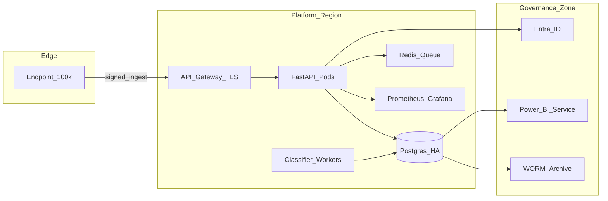
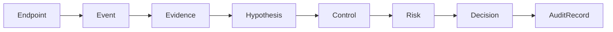
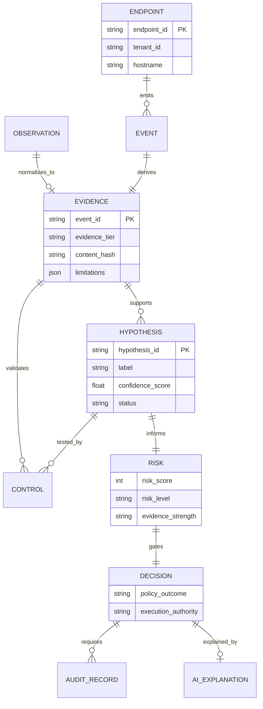
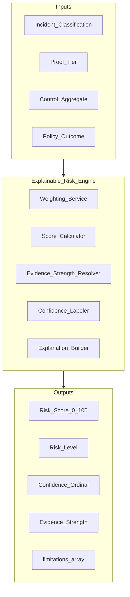
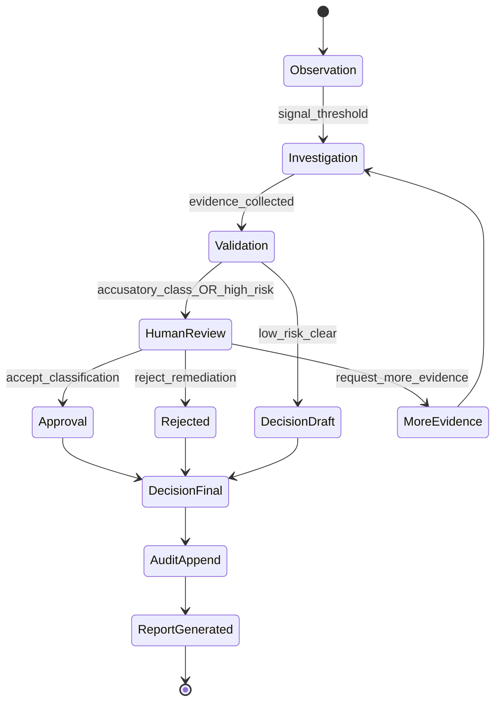
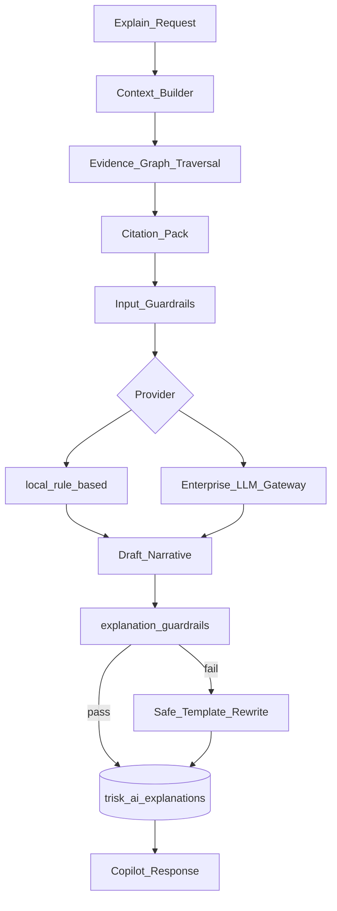
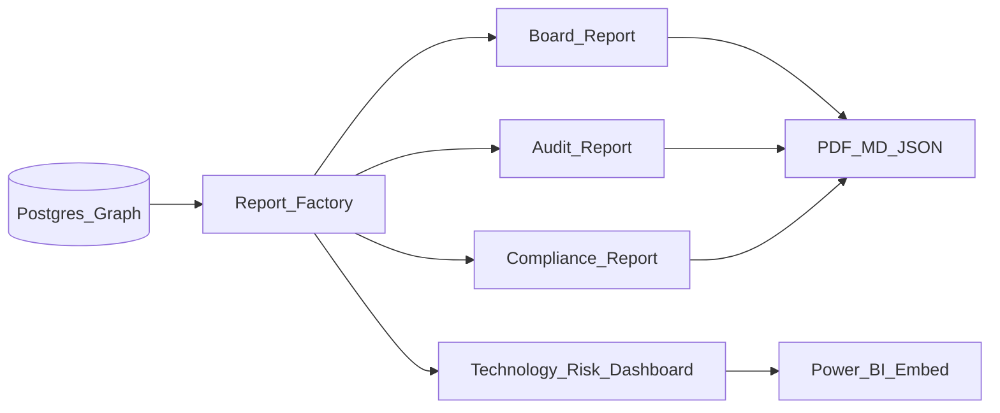
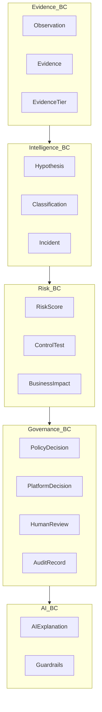
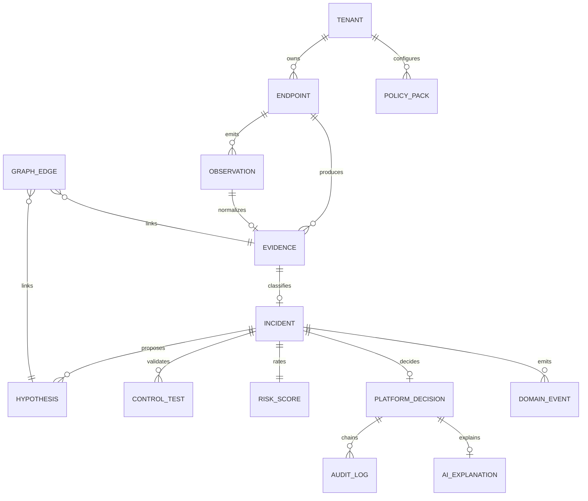

# Decision Intelligence Platform — Foundry Blueprint

**Role:** Palantir Forward Deployed Engineer × Technology Risk Architect  
**Repository:** Windows Network Recovery Toolkit  
**Quality bar:** Foundry-grade ontology, lineage, explainability, and governance — **not** EDR, chatbot, RAG warehouse, or autonomous remediation.

**Epistemic constitution (non-negotiable):**

| Principle | Platform enforcement |
|-----------|---------------------|
| **Observation ≠ Proof** | Evidence tiers T0–T4; `is_proof` flag on citations |
| **Correlation ≠ Causation** | Hypothesis labels; blocked causal language in guardrails |
| **Confidence ≠ Certainty** | Ordinal scores only; `confidence_semantics: ordinal_not_probability` |

**Companion artifacts:** [ontology/evidence_graph.yaml](ontology/evidence_graph.yaml) · [schemas/domain_event.schema.json](schemas/domain_event.schema.json) · [../enterprise-technology-risk-platform-blueprint.md](../enterprise-technology-risk-platform-blueprint.md)

---

## 1. Platform thesis

Raw endpoint telemetry is **unfit for committee decisions** until it passes a governed transformation:

```text
Raw Endpoint Evidence
  → Risk Hypotheses
  → Control Testing
  → Governance Decisions
  → Auditable Reports
```

The platform is a **decision intelligence layer** — like Foundry's ontology + pipeline + audit — applied to technology risk: every object is typed, linked, lineage-tracked, and bounded by epistemic rules.

**What exists today (~70%):** deterministic pipeline, Postgres schema, risk engine, control framework, human review, hash-chained audit, Power BI star export, AI guardrails, `/v1/enterprise` services.

**What this blueprint adds:** unified **Evidence Graph**, explainability contract, copilot with citations, executive report factory, and 12-month convergence roadmap.

---

## 2. System architecture

### 2.1 Foundry-analog layers

| Foundry concept | This platform | Implementation |
|-----------------|---------------|----------------|
| Ontology | Evidence Graph | `docs/decision-intelligence/ontology/` |
| Pipeline | Evidence normalization → classify → score | `analytics_pipeline.py` |
| Lineage | Domain events + audit hash chain | `src/platform_core/events/` |
| Workshop | Enterprise dashboard | `frontend/app/platform/` |
| Quiver | Executive report exports | `audit_report.py`, Power BI star |
| Actions | Human approval only | `human_review.py` — no autonomous Actions |

### 2.2 Logical architecture

```mermaid
flowchart TB
  subgraph collect [Collect]
    AG[Endpoint_Agents]
    PW[Playwright_HAR]
    CLI[CLI_Collectors]
  end

  subgraph graph [Evidence_Graph_Layer]
    ONTO[Ontology_Registry]
    LINE[Lineage_Events]
    PROJ[Graph_Projectors]
  end

  subgraph compute [Decision_Compute]
    NORM[Normalizer]
    HYP[Hypothesis_Engine]
    RISK[Explainable_Risk_Engine]
    CTRL[Control_Test_Framework]
    POL[Policy_YAML]
    GOV[Governance_Workflow]
  end

  subgraph intel [Intelligence]
    COPILOT[AI_Copilot_Advisory]
    REPLAY[Deterministic_Replay]
  end

  subgraph serve [Serve]
    API[FastAPI]
    UI[Workshop_Dashboard]
    RPT[Report_Factory]
    PBI[Power_BI_Star]
  end

  subgraph store [Persistence]
    PG[(PostgreSQL)]
    WORM[WORM_Audit_Archive]
  end

  collect --> NORM --> graph
  graph --> compute
  compute --> intel
  intel --> serve
  compute & graph --> PG
  LINE --> WORM
```

### 2.3 Deployment topology



**Today:** `docker-compose.yml` (Postgres, Redis, API, worker, Prometheus, Grafana)  
**Target:** K8s + Entra ID + immutable audit archive

---

## 3. Evidence Graph

### 3.1 Canonical path



### 3.2 Graph diagram (rich)



### 3.3 Graph query API (target)

```http
GET /v1/graph/evidence/{event_id}/lineage
GET /v1/graph/incident/{incident_id}/subgraph
GET /v1/graph/decision/{decision_id}/citations
```

**Projector today:** `src/platform_core/events/projector.py` → extend with graph edges table:

```sql
CREATE TABLE trisk_graph_edges (
    edge_id         VARCHAR(64) PRIMARY KEY,
    tenant_id       VARCHAR(64) NOT NULL,
    from_type       VARCHAR(32) NOT NULL,
    from_id         VARCHAR(128) NOT NULL,
    to_type         VARCHAR(32) NOT NULL,
    to_id           VARCHAR(128) NOT NULL,
    link_type       VARCHAR(64) NOT NULL,
    properties      JSONB NOT NULL DEFAULT '{}',
    created_at      TIMESTAMPTZ NOT NULL DEFAULT NOW()
);
CREATE INDEX idx_graph_edges_from ON trisk_graph_edges (tenant_id, from_type, from_id);
CREATE INDEX idx_graph_edges_to ON trisk_graph_edges (tenant_id, to_type, to_id);
```

---

## 4. Explainable Risk Engine

### 4.1 Design



### 4.2 Output contract (`explainable_risk.v1`)

```json
{
  "schema_version": "explainable_risk.v1",
  "incident_id": "INC-001",
  "risk_score": 72,
  "risk_level": "HIGH",
  "confidence_score": 0.78,
  "confidence_label": "medium",
  "confidence_semantics": "ordinal_not_probability",
  "evidence_strength": "moderate",
  "proof_tier": "T1_STATE_EVIDENCE",
  "control_aggregate": "PARTIAL",
  "human_review_recommended": true,
  "factor_breakdown": [
    { "factor": "classification_severity", "weight": 0.35, "value": "UNKNOWN_LOCAL_PROXY" },
    { "factor": "proof_tier_cap", "weight": 0.25, "value": "T1 caps claim strength" },
    { "factor": "control_failures", "weight": 0.20, "value": 1 },
    { "factor": "policy_gate", "weight": 0.20, "value": "REQUIRE_HUMAN_APPROVAL" }
  ],
  "limitations": [
    "Ordinal score — not calibrated probability of compromise.",
    "Not a malware or EDR verdict."
  ],
  "unsafe_inferences_blocked": ["malware_confirmed", "mitm_confirmed", "attacker_attribution"]
}
```

### 4.3 Code mapping

| Component | Module |
|-----------|--------|
| Pipeline scorer | `windows_network_toolkit/risk_scoring_engine.py` |
| Proof tier | `src/platform_core/governance/proof_tier.py` |
| Fixture rating | `src/platform_core/risk/risk_rating.py` |
| Hypothesis confidence | `src/platform_core/hypothesis/scorer.py` |
| Evidence strength | `src/platform_core/evidence_report/confidence_model.py` |

**Convergence target:** `src/platform_core/risk/explainable_engine.py` (unify scorers + factor breakdown)

---

## 5. Governance workflow

### 5.1 State machine



### 5.2 Stage definitions

| Stage | Purpose | Artifact | Gate |
|-------|---------|----------|------|
| **Observation** | Raw signal capture | `trisk_observations` | None |
| **Investigation** | Classify + hypothesize | `trisk_hypotheses`, incidents | Deterministic pipeline |
| **Validation** | Control tests | `trisk_control_tests` | PASS ≠ safety guarantee |
| **Human Review** | Committee triage | `trisk_human_reviews` | Required for REVIEW_CLASSES |
| **Approval** | Execution authority | `human_approval_status` | Typed reason required |
| **Audit** | Tamper evidence | `trisk_audit_logs` | Hash chain |
| **Report** | Committee export | governance report JSON | limitations mandatory |

**REVIEW_CLASSES:** `UNKNOWN_LOCAL_PROXY`, `SUSPICIOUS_PROXY`, `POSSIBLE_MITM_RISK`, `REVERTER_SUSPECTED`  
**Module:** `src/platform_core/governance/human_review.py`  
**API:** `POST /v1/enterprise/reviews/{id}/approve`

---

## 6. AI Copilot architecture

> **Not a chatbot.** Advisory copilot with evidence citations and uncertainty — zero execution authority.

### 6.1 Architecture



### 6.2 Copilot response contract (`ai_copilot.v1`)

```json
{
  "schema_version": "ai_copilot.v1",
  "explanation_id": "expl-abc123",
  "decision_id": "pdec-xyz",
  "reasoning_summary": "Evidence tier T1 supports a dead localhost proxy path failure hypothesis...",
  "cited_evidence": [
    {
      "evidence_id": "ev-001",
      "signal": "wininet_proxy_server",
      "observed_value": "127.0.0.1:59081",
      "tier": "T1_STATE_EVIDENCE",
      "is_proof": false,
      "citation_text": "WinINET proxy server observation — not registry writer proof."
    }
  ],
  "uncertainty_notes": [
    "Listener attribution incomplete — correlation only.",
    "Confidence is ordinal, not probability of compromise."
  ],
  "recommended_next_actions": [
    "Run proxy-health with path probes before remediation preview.",
    "Collect Sysmon E13 if registry writer attribution required.",
    "Route to human review queue — accusatory-adjacent classification."
  ],
  "limitations": [
    "AI output is advisory — does not authorize execution.",
    "Not malware detection or EDR."
  ],
  "guardrail_passed": true,
  "blocked_patterns": []
}
```

### 6.3 Copilot rules

| Must do | Must not do |
|---------|-------------|
| Cite `evidence_id` + tier | Confirm malware/MITM |
| State uncertainty explicitly | Recommend autonomous kill/reset |
| Recommend **next investigative** steps | Approve remediation |
| Pass `explanation_guardrails` | Override policy engine |

**Modules:** `src/platform_core/ai_risk_analyst/` · `explanation_guardrails.py`  
**Target API:** `POST /v1/copilot/explain/decision/{decision_id}`

---

## 7. Executive reporting factory

### 7.1 Report types



| Report | Audience | Generator | Key sections |
|--------|----------|-----------|--------------|
| **Board** | C-suite / board risk committee | `governance_report.py` | Executive narrative, top themes, limitations |
| **Audit** | Internal audit | `audit_report.py` v2 | Hash chain verify, control summary, evidence timeline |
| **Compliance** | GRC / SOC2 workshop | `framework_mapping.md` + pack | NIST/ISO control evidence mapping |
| **Tech risk dashboard** | CTO / SRE / IT Risk | Power BI star + `/v1/enterprise/reports/dashboard` | KPIs, review queue, control heatmap |

### 7.2 Power BI star schema (exists)

**Facts:** `fact_incidents`, `fact_control_tests`, `fact_policy_decisions`, `fact_audit_events`, `fact_risk_decisions`  
**Dims:** `dim_date`, `dim_classification`, `dim_proof_tier`, `dim_stakeholder` (+ `dim_tenant` target)  
**Export:** `src/platform_core/analytics/powerbi_star_export.py`

### 7.3 Report API (target)

```http
GET  /v1/reports/board?period=Q2-2026
GET  /v1/reports/audit?audit_dir=...
GET  /v1/reports/compliance?framework=nist_csf_2
GET  /v1/reports/dashboard
POST /v1/reports/schedule
```

---

## 8. Domain model (bounded contexts)



---

## 9. Event schemas

Canonical envelope: [schemas/domain_event.schema.json](schemas/domain_event.schema.json)

### 9.1 Lifecycle events

| Event | When | Graph edge created |
|-------|------|-------------------|
| `ObservationRecorded` | Raw signal ingested | Endpoint→Event |
| `EvidenceCollected` | Normalized package stored | Event→Evidence |
| `HypothesisProposed` | Triage label assigned | Evidence→Hypothesis |
| `ControlTestCompleted` | CTRL-00x executed | Evidence→Control |
| `RiskClassified` | Score computed | Hypothesis→Risk |
| `PolicyEvaluated` | YAML + engine gate | Risk→Decision (draft) |
| `HumanApprovalGranted` | Reviewer action | Decision finalized |
| `AIExplanationGenerated` | Copilot narrative | Decision→AIExplanation |
| `AuditAppended` | Hash chain write | Decision→AuditRecord |
| `GovernanceReportGenerated` | Committee export | — |
| `ReplayCertified` | Deterministic replay pass | — |

**Store:** `trisk_domain_events` + JSONL mirror  
**Replay:** `src/platform_core/events/replay.py`

---

## 10. API design

### 10.1 Surface map

| Namespace | Auth | Purpose |
|-----------|------|---------|
| `/v1/evidence` | Token + RBAC | Ingest + read |
| `/v1/enterprise/*` | Token + tenant | Decision services |
| `/v1/graph/*` | Auditor+ | Evidence graph traversal |
| `/v1/copilot/*` | Reviewer+ | AI explanations |
| `/v1/reports/*` | Auditor+ | Executive factory |
| `/v1/fleet/*` | mTLS agent | Multi-endpoint ingest |

### 10.2 Core endpoints (implemented ✅ / planned 🔲)

```yaml
# Evidence Graph
POST /v1/enterprise/observations          # ✅
POST /v1/enterprise/evidence              # ✅
POST /v1/enterprise/pipeline/run          # ✅ full loop
GET  /v1/graph/evidence/{id}/lineage      # 🔲
GET  /v1/evidence/{id}/timeline           # ✅ projector

# Explainable Risk
GET  /v1/risks                            # ✅
GET  /v1/incidents/{id}                   # ✅
GET  /v1/risk/explain/{incident_id}       # 🔲 factor breakdown

# Governance
POST /v1/enterprise/reviews/{id}/approve  # ✅
GET  /v1/enterprise/reviews/pending       # ✅
GET  /v1/audit/verify                     # ✅

# AI Copilot
POST /v1/copilot/explain/decision/{id}    # 🔲
GET  /v1/copilot/explain/decision/{id}    # 🔲

# Reports
GET  /v1/reports/executive                # ✅
GET  /v1/enterprise/reports/governance    # ✅
GET  /v1/reports/compliance               # 🔲
```

OpenAPI: auto-generated at `/openapi.json` — tag by bounded context.

---

## 11. Target folder structure

```text
Windows-Network-Recovery-Toolkit/
├── backend/                          # FastAPI host
│   ├── main.py                       # App wiring
│   ├── v1_routes.py                  # Core /v1 API
│   ├── decision_platform_routes.py   # /v1/enterprise
│   ├── workers/classifier_worker.py  # Async pipeline
│   ├── db/
│   │   ├── schema.sql                # Core trisk tables
│   │   ├── enterprise_schema.sql     # Tenants, graph-adjacent
│   │   └── models.py                 # SQLModel ORM
│   └── services/                     # Service-oriented layer
│       ├── evidence_service.py
│       ├── classification_service.py
│       ├── policy_service.py
│       ├── audit_service.py
│       ├── reporting_service.py
│       └── pipeline.py               # Decision loop orchestrator
│
├── src/platform_core/                # Decision intelligence domain
│   ├── events/                       # Lineage + replay
│   ├── hypothesis/                   # Hypothesis engine + EvidenceRef
│   ├── governance/                   # Human review, audit reports
│   ├── risk/                         # Risk rating, business impact
│   ├── controls/                     # Mature control suite
│   ├── ai_risk_analyst/              # Copilot + guardrails
│   ├── analytics/                    # KPI + Power BI star export
│   ├── agents/contracts/             # Agent I/O schemas (no autonomy)
│   └── graph/                        # 🔲 NEW: graph projectors + edges
│
├── windows_network_toolkit/          # Collectors + pipeline
│   ├── analytics_pipeline.py         # Normalization orchestrator
│   ├── risk_scoring_engine.py        # Pipeline risk scorer
│   ├── control_tests.py              # CTRL-001–006
│   ├── evidence_schema.py            # EvidenceEvent contract
│   └── collectors/                   # CLI + Playwright
│
├── platform_core/fleet/              # Multi-endpoint ingest (100k design)
├── frontend/app/platform/            # Workshop dashboard
├── analytics/powerbi/                # Semantic model + CSV samples
├── config/policy/                    # YAML policy-as-code packs
├── docs/decision-intelligence/       # Ontology + schemas (this blueprint)
│   ├── ontology/evidence_graph.yaml
│   └── schemas/domain_event.schema.json
└── tests/
    ├── backend/                      # API + pipeline tests
    ├── platform_core/                # Domain unit tests
    └── security/                       # Guardrail + abuse tests
```

---

## 12. Database design

### 12.1 Entity-relationship (consolidated)



### 12.2 Table inventory

| Table | Graph node | Status |
|-------|------------|--------|
| `trisk_tenants` | — | ✅ |
| `trisk_endpoints` | Endpoint | ✅ |
| `trisk_observations` | Observation | ✅ |
| `trisk_evidence_events` | Evidence | ✅ |
| `trisk_incidents` | Risk (partial) | ✅ |
| `trisk_hypotheses` | Hypothesis | ✅ |
| `trisk_control_tests` | Control | ✅ |
| `trisk_platform_decisions` | Decision | ✅ |
| `trisk_human_reviews` | Governance | ✅ |
| `trisk_audit_logs` | AuditRecord | ✅ |
| `trisk_domain_events` | Event | ✅ |
| `trisk_policy_packs` | Policy | ✅ |
| `trisk_graph_edges` | Links | 🔲 |
| `trisk_ai_explanations` | AIExplanation | 🔲 |

### 12.3 AI explanations table (new)

```sql
CREATE TABLE trisk_ai_explanations (
    explanation_id    VARCHAR(64) PRIMARY KEY,
    tenant_id           VARCHAR(64) NOT NULL REFERENCES trisk_tenants(tenant_id),
    decision_id         VARCHAR(64) NOT NULL,
    provider            VARCHAR(32) NOT NULL DEFAULT 'local_rule_based',
    model_version       VARCHAR(64),
    input_hash          VARCHAR(64) NOT NULL,
    reasoning_summary   TEXT NOT NULL,
    cited_evidence      JSONB NOT NULL DEFAULT '[]',
    uncertainty_notes   JSONB NOT NULL DEFAULT '[]',
    recommended_actions JSONB NOT NULL DEFAULT '[]',
    guardrail_passed    BOOLEAN NOT NULL,
    blocked_patterns    JSONB NOT NULL DEFAULT '[]',
    limitations         JSONB NOT NULL DEFAULT '[]',
    created_at          TIMESTAMPTZ NOT NULL DEFAULT NOW()
);
```

---

## 13. Twelve-month roadmap

### Q1 — Graph + Explainability Foundation

| Month | Deliverable | Outcome |
|-------|-------------|---------|
| M1 | `trisk_graph_edges` + projector | Traversable Evidence Graph API |
| M2 | `explainable_engine.py` unification | Factor breakdown on all risk scores |
| M3 | Postgres RLS + `tenant_id` on events | True multi-tenant isolation |
| M3 | Human review UI in Next.js | Governance workflow visible |

### Q2 — Copilot + Lineage Hardening

| Month | Deliverable | Outcome |
|-------|-------------|---------|
| M4 | `trisk_ai_explanations` + copilot API | Cited advisory narratives |
| M5 | Retire JSONL dual-write | Postgres SSOT for review + audit |
| M6 | Entra ID JWT middleware | Enterprise auth |
| M6 | WORM audit archive job | Compliance retention |

### Q3 — Multi-Endpoint + Report Factory

| Month | Deliverable | Outcome |
|-------|-------------|---------|
| M7 | Signed fleet agent + `/v1/fleet/ingest` | Multi-endpoint at scale |
| M8 | Browser evidence in default ingest | Playwright → pipeline |
| M9 | Report factory: board + compliance packs | NIST/ISO automated bundles |
| M9 | Power BI Service deploy + tenant RLS | Live executive dashboards |

### Q4 — Production + Certification Path

| Month | Deliverable | Outcome |
|-------|-------------|---------|
| M10 | K8s Helm chart (trisk stack) | Production deploy |
| M11 | Scoring policy versioning + drift alerts | Explainability over time |
| M12 | SOC2 evidence automation workshop | External audit readiness pack |
| M12 | Replay certification API | Deterministic attestation digest |

### Milestone gates

```text
M3:  Graph API + explainable risk live
M6:  Copilot with citations in production UI
M9:  Board report scheduled + Power BI refresh
M12: Full Decision Intelligence Platform v1.0
```

---

## 14. Foundry-quality checklist

| Criterion | Status |
|-----------|--------|
| Typed ontology with link types | ✅ YAML + ER diagrams |
| Pipeline with deterministic replay | ✅ analytics_pipeline + replay |
| Lineage on every decision | ✅ domain events + audit chain |
| Explainability factor breakdown | 🔲 unify scorers |
| Human-in-the-loop Actions | ✅ review queue — no auto Actions |
| Advisory AI with citations | 🔲 copilot API |
| Executive Workshop UI | 🔲 partial Next.js |
| Multi-tenant data model | ✅ schema — RLS pending |
| Epistemic guardrails in CI | ✅ security + guardrail tests |
| Committee-ready exports | ✅ governance + Power BI star |

---

## 15. Interview narrative (90 seconds)

> We built a **Decision Intelligence Platform** for technology risk — Foundry-style ontology over endpoint evidence. Raw observations flow through a typed **Evidence Graph**: Endpoint → Event → Evidence → Hypothesis → Control → Risk → Decision, with hash-chained audit lineage. Our **explainable risk engine** produces ordinal scores, confidence labels, and evidence strength — never malware verdicts. Governance runs Observation → Investigation → Validation → Human Review → Approval → Audit. An **AI copilot** cites evidence tiers, surfaces uncertainty, and recommends next investigative steps — it cannot execute remediation. Executive reporting generates board, audit, and compliance packs plus Power BI star-schema dashboards. The constitution is simple: observation isn't proof, correlation isn't causation, confidence isn't certainty.

---

## 16. Related documents

| Document | Topic |
|----------|-------|
| [evidence_to_action_governance_model.md](../evidence_to_action_governance_model.md) | Six epistemic principles |
| [domain-event-catalog.md](../domain-event-catalog.md) | Event types |
| [control-matrix.md](../control-matrix.md) | CTRL-001–010 |
| [framework_mapping.md](../framework_mapping.md) | NIST / ISO |
| [powerbi-schema.md](../powerbi-schema.md) | Star schema |
| [state-machine.md](../state-machine.md) | Proxy transitions |
| [enterprise-technology-risk-platform-blueprint.md](../enterprise-technology-risk-platform-blueprint.md) | Enterprise services |
