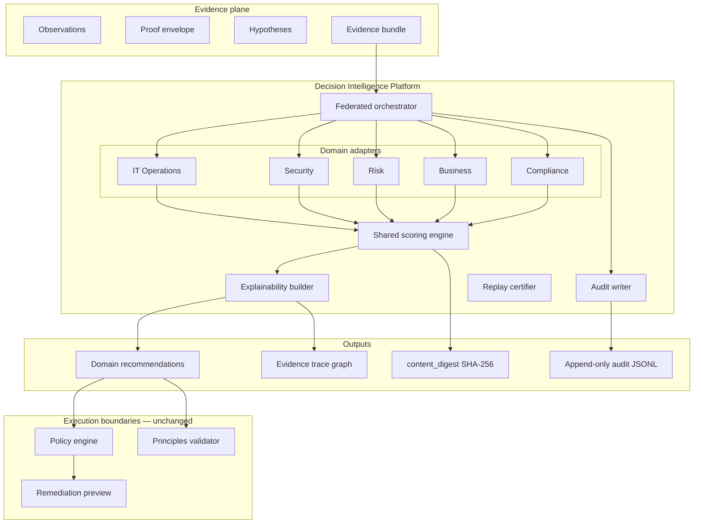

# Decision Intelligence Platform — Architecture

**Status:** Design + reference implementation (2026)  
**Role:** Principal Systems Architect  
**Baseline:** Windows Network Recovery Toolkit · canonical core `src/platform_core/`  
**Module:** `src/platform_core/decision_intelligence/`

---

## 1. Executive summary

The Decision Intelligence Platform (DIP) transforms **shared evidence** into **multiple domain-specific recommendations** — each explainable, traceable, auditable, and replayable. It does **not** execute actions; policy gates and human approval remain authoritative.

### Example (dead WinINET proxy — CS1)

| Domain | Recommendation | Policy posture |
|--------|----------------|----------------|
| **IT Operations** | Preview disable WinINET proxy after structured proof | PREVIEW + confirmation |
| **Security** | Monitor process / collect writer telemetry | OBSERVE / investigate |
| **Risk** | Collect additional evidence before strong claims | Defer remediation |
| **Business** | Minimize user downtime — targeted fix vs broad reset | Prefer surgical fix |
| **Compliance** | Log decision, retain audit chain, document limitations | Audit-first |

---

## 2. Architecture

### 2.1 System context



### 2.2 Pipeline stages

```text
EvidenceBundle (shared)
  → FederatedOrchestrator.evaluate()
      → per domain: collect_domain_evidence → build_candidates → score_candidates
      → DomainRecommendation (rank 1..n per domain)
  → ExplainabilityGraph (evidence_id → decision_id edges)
  → AuditRecord (append-only, digest-linked)
  → FederatedDecisionResult
```

### 2.3 Layer responsibilities

| Layer | Mutates host? | Purpose |
|-------|---------------|---------|
| Evidence | No | Single source of truth for all domains |
| Domain adapters | No | Translate shared evidence → domain candidates |
| Scoring engine | No | Deterministic benefit/risk/confidence |
| Orchestrator | No | Fan-out / fan-in, conflict surfacing |
| Audit / replay | Append-only | Integrity + post-incident review |
| Policy | No | ALLOW / PREVIEW / BLOCK execution |

### 2.4 Mapping to existing code

| DIP domain | Existing module | Notes |
|------------|-----------------|-------|
| IT Operations | `WindowsAdapter`, WNT remediation | Proxy disable preview |
| Security | `SecurityAdapter`, hypothesis engine | Process monitor, writer proof |
| Risk | **New** `RiskAdapter` | Evidence gaps, defer destructive |
| Business | **New** `BusinessAdapter` | Downtime / UX impact |
| Compliance | **New** `ComplianceAdapter` + `governance/` | Controls, limitations, audit |
| Scoring | `src/decision_engine/scoring.py` | Shared formulas |
| Audit store | `di_*` tables, `.audit/` JSONL | SQLite → PostgreSQL |
| Replay | `replay/certifier.py`, `content_digest` | Deterministic |

---

## 3. Data models

### 3.1 Core enums

```python
class DecisionDomain(StrEnum):
    IT_OPERATIONS = "it_operations"
    SECURITY = "security"
    RISK = "risk"
    BUSINESS = "business"
    COMPLIANCE = "compliance"

class PolicyPosture(StrEnum):
    ALLOW = "ALLOW"              # rare — still requires confirmation for mutations
    PREVIEW = "PREVIEW"
    OBSERVE = "OBSERVE"
    DEFER = "DEFER"
    BLOCK = "BLOCK"
```

### 3.2 Shared evidence input

Reuses `src/platform_core/contracts.EvidenceBundle` + optional extensions:

```python
class FederatedEvidenceInput(BaseModel):
    incident_id: str
    bundle: EvidenceBundle
    hypothesis_primary: str | None = None
    classification: str | None = None
    proof_status: str | None = None
    limitations: list[str] = []
    metadata: dict[str, Any] = {}
```

### 3.3 Domain recommendation (output unit)

```python
class EvidenceTrace(BaseModel):
    evidence_id: str
    signal: str
    tier: EvidenceTierName
    weight: float
    role: Literal["supporting", "contradicting", "missing"]

class ScoreExplain(BaseModel):
    benefit: int
    risk: int
    confidence: float
    final_score: int
    benefit_components: dict[str, float]
    risk_components: dict[str, float]
    confidence_components: dict[str, float]
    formulas: dict[str, str]

class DomainRecommendation(BaseModel):
    domain: DecisionDomain
    recommendation_id: str
    title: str
    recommendation: str
    policy_posture: PolicyPosture
    confidence: float                    # ordinal 0–1, not probability
    confidence_display: str
    evidence_trace: list[EvidenceTrace]
    missing_evidence: list[str]
    limitations: list[str]
    explain: ScoreExplain
    ranked_alternatives: list[str] = []  # other candidates in domain
```

### 3.4 Federated result

```python
class ExplainabilityGraph(BaseModel):
    nodes: list[dict[str, str]]          # evidence + decision nodes
    edges: list[dict[str, str]]          # supports | contradicts | requires

class AuditRecord(BaseModel):
    audit_id: str
    incident_id: str
    timestamp_utc: str
    content_digest: str
    domains_evaluated: list[str]
    policy_postures: dict[str, str]
    replay_anchor: str

class FederatedDecisionResult(BaseModel):
    incident_id: str
    schema_version: str
    recommendations: list[DomainRecommendation]   # one primary per domain
    explainability: ExplainabilityGraph
    audit: AuditRecord
    epistemic_notice: str
    metadata: dict[str, Any] = {}
```

### 3.5 Persistence (audit / replay)

Aligns with `platform_core/db/decision_intelligence_schema.sql`:

| Table | Purpose |
|-------|---------|
| `di_events` | Incident ingest |
| `di_evidence` | Evidence nodes |
| `di_decisions` | Per-domain recommendation rows |
| `di_outcomes` | Ground truth after operator action |
| `dip_federated_runs` | **New** — digest, incident_id, full JSON snapshot |

---

## 4. Decision engine

### 4.1 Federated orchestrator algorithm

```python
def evaluate_federated(evidence: FederatedEvidenceInput) -> FederatedDecisionResult:
    shared = normalize_evidence_items(evidence.bundle)
    recommendations = []
    graph_edges = []

    for adapter in [ITOpsAdapter(), SecurityAdapter(), RiskAdapter(),
                    BusinessAdapter(), ComplianceAdapter()]:
        candidates = adapter.build_candidates(evidence)
        scored = [score_candidate(shared, c) for c in candidates]
        top = max(scored, key=lambda s: s.final_score)
        rec = adapter.to_recommendation(top, evidence)
        recommendations.append(rec)
        graph_edges.extend(adapter.evidence_edges(rec, shared))

    digest = content_digest({"evidence": shared, "recommendations": [...]})
    audit = write_audit_record(evidence, recommendations, digest)
    return FederatedDecisionResult(...)
```

### 4.2 Domain adapter contract

```python
class DecisionDomainAdapter(ABC):
    @property
    def domain(self) -> DecisionDomain: ...

    def build_candidates(self, evidence: FederatedEvidenceInput) -> list[CandidateDecision]: ...

    def to_recommendation(self, scored: ScoredDecision, evidence: FederatedEvidenceInput) -> DomainRecommendation: ...

    def evidence_edges(self, rec: DomainRecommendation, shared: list[EvidenceItem]) -> list[dict]: ...
```

### 4.3 Domain logic (CS1 dead proxy)

| Domain | Top candidate | Trigger |
|--------|---------------|---------|
| IT Operations | `preview_disable_wininet` | DEAD_PROXY + proof supported |
| Security | `monitor_process_and_writer` | localhost proxy, no writer proof |
| Risk | `collect_additional_evidence` | missing writer telemetry |
| Business | `minimize_downtime_surgical_fix` | browser fail + ping ok |
| Compliance | `audit_log_and_document_limitations` | always when evidence present |

### 4.4 Conflict handling

When domains disagree (IT: fix now vs Risk: defer):

```python
class ConflictSurface(BaseModel):
    domains: tuple[DecisionDomain, DecisionDomain]
    summary: str
    resolution: str  # "Human review required — policy engine arbitrates execution"
```

Orchestrator **surfaces** conflicts; it does not auto-resolve by executing the highest score across domains.

---

## 5. Scoring framework

### 5.1 Shared formulas (existing)

From `src/decision_engine/scoring.py`:

```text
benefit = base_benefit + Σ(evidence.weight × relevance × BENEFIT_EVIDENCE_SCALE)
risk    = base_risk    + Σ(counter-evidence × RISK_EVIDENCE_SCALE)
confidence = support_ratio × (0.5 + 0.5 × evidence_coverage)
final_score = clamp(round(benefit × confidence − risk × 0.35), 0, 100)
```

Every `ScoredDecision` includes full `ScoreBreakdown` for explainability.

### 5.2 Domain weights (orchestrator layer)

| Domain | Benefit bias | Risk bias | Notes |
|--------|--------------|-----------|-------|
| IT Operations | +10 repair speed | standard | Favors restore service |
| Security | standard | +15 caution | Favors observe/investigate |
| Risk | standard | +20 defer | Penalizes premature remediation |
| Business | +15 uptime | standard | Penalizes broad outages |
| Compliance | +10 audit completeness | standard | Favors document/retain |

Applied as `base_benefit` / `base_risk` offsets on candidates — **transparent in breakdown**.

### 5.3 Confidence display

All domains use:

```text
confidence_display = "ordinal {score:.2f} (domain score input, not probability)"
```

Domain `confidence` field maps from `ScoredDecision.confidence` — engine output, not Bayesian posterior.

### 5.4 Evidence traceability

Every recommendation includes:

```python
evidence_trace: [
  EvidenceTrace(evidence_id="ev-proxy", signal="listener_found", tier="OBSERVED_ONLY", role="supporting"),
  EvidenceTrace(evidence_id="ev-writer", signal="writer_telemetry", tier="OBSERVED_ONLY", role="missing"),
]
```

Missing evidence explicitly listed — supports Risk domain defer posture.

---

## 6. Audit logging & replay

### 6.1 Audit flow

```text
FederatedDecisionResult
  → append dip_federated_runs (PostgreSQL) OR platform_data/dip_audit.jsonl
  → link di_decisions rows (one per domain)
  → hash chain optional via governance/chain_of_custody
```

### 6.2 Replay

```python
def replay_federated(digest: str, snapshot: dict) -> bool:
    recomputed = evaluate_federated_from_snapshot(snapshot)
    return recomputed.audit.content_digest == digest
```

Uses same `content_digest` algorithm as `run_decision_engine` — evidence JSON + ranked payloads sorted.

### 6.3 Explainability graph

```json
{
  "nodes": [
    {"id": "ev-registry", "type": "evidence", "tier": "OBSERVED_ONLY"},
    {"id": "rec-it-ops", "type": "recommendation", "domain": "it_operations"}
  ],
  "edges": [
    {"from": "ev-registry", "to": "rec-it-ops", "relation": "supports"},
    {"from": "ev-writer", "to": "rec-risk", "relation": "missing"}
  ]
}
```

---

## 7. API surface (target)

| Method | Path | Description |
|--------|------|-------------|
| `POST` | `/v1/decision-intelligence/federated/evaluate` | Evidence in → all domain recommendations |
| `GET` | `/v1/decision-intelligence/federated/{incident_id}` | Latest federated result |
| `GET` | `/v1/decision-intelligence/federated/{incident_id}/explain` | Graph + breakdowns |
| `POST` | `/v1/decision-intelligence/federated/replay` | Verify digest |
| `GET` | `/v1/decision-intelligence/domains` | List DecisionDomain values |

Extends existing `backend/decision_intelligence/routes.py`.

---

## 8. Example output (CS1)

```json
{
  "incident_id": "cs1-wininet-drift",
  "recommendations": [
    {
      "domain": "it_operations",
      "title": "Preview disable WinINET proxy",
      "recommendation": "After structured proof, preview DISABLE_WININET_PROXY with typed confirmation.",
      "policy_posture": "PREVIEW",
      "confidence_display": "ordinal 0.84 (domain score input, not probability)",
      "evidence_trace": [{"evidence_id": "ev-registry", "role": "supporting", "tier": "OBSERVED_ONLY"}],
      "limitations": ["Does not prove malware or MITM."]
    },
    {
      "domain": "security",
      "title": "Monitor process and collect writer proof",
      "recommendation": "Monitor for reverter respawn; collect Sysmon E13 registry writer telemetry.",
      "policy_posture": "OBSERVE"
    },
    {
      "domain": "risk",
      "title": "Collect additional evidence",
      "recommendation": "Defer strong causation claims until writer telemetry or path proof is complete.",
      "policy_posture": "DEFER",
      "missing_evidence": ["registry_writer_telemetry", "proof_path_contrast"]
    },
    {
      "domain": "business",
      "title": "Minimize user downtime",
      "recommendation": "Prefer surgical WinINET disable over adapter reset or broad network changes.",
      "policy_posture": "PREVIEW"
    },
    {
      "domain": "compliance",
      "title": "Audit log and document limitations",
      "recommendation": "Append audit JSONL, retain evidence chain, document limitations in incident record.",
      "policy_posture": "ALLOW"
    }
  ],
  "audit": {"content_digest": "sha256:...", "replay_anchor": "sha256:..."},
  "epistemic_notice": "Domain recommendations are advisory; execution requires policy gates."
}
```

---

## 9. Roadmap

### Phase 0 — Foundation ✅ (existing)

- `src/decision_engine/` scoring + digest
- `platform_core/decision_platform/` adapters (Windows, Security, …)
- `backend/decision_intelligence/` API + SQLite/PostgreSQL store
- Principles + hypothesis engines

### Phase 1 — Federated DIP core (4 weeks)

| Week | Deliverable |
|------|-------------|
| 1 | `DecisionDomain` models + 5 adapters + unit tests |
| 2 | `FederatedOrchestrator` + explainability graph |
| 3 | Audit JSONL + `content_digest` replay tests |
| 4 | `POST /federated/evaluate` API + CS1 fixture demo |

### Phase 2 — Integration (3 weeks)

- Wire investigation orchestrator → federated evaluate
- CLI: `investigate --domains all`
- Frontend: multi-domain recommendation cards
- Conflict surface UI

### Phase 3 — Persistence & scale (4 weeks)

- `dip_federated_runs` PostgreSQL table
- Link `di_decisions` per domain row
- Outcome loop: `di_outcomes` tunes domain weights
- Prometheus: `dip_federated_evaluations_total{domain}`

### Phase 4 — Enterprise (ongoing)

- SOAR / ITSM ticket attach per domain recommendation
- Signed audit exports
- Multi-tenant RLS on `dip_*` tables
- Control mapping (NIST/SOC2) on Compliance domain

### MVP success criteria

1. CS1 fixture → 5 domain recommendations with evidence traces  
2. Identical input → identical `content_digest`  
3. Every recommendation has ≥1 evidence trace or explicit `missing_evidence`  
4. No domain recommendation bypasses policy PREVIEW for host mutations  
5. Replay test passes in CI  

---

## 10. Module layout (implementation)

```text
src/platform_core/decision_intelligence/
├── __init__.py
├── models.py              # FederatedEvidenceInput, DomainRecommendation, ...
├── orchestrator.py        # evaluate_federated()
├── explain.py             # ExplainabilityGraph builder
├── audit.py               # AuditRecord + JSONL append
├── adapters/
│   ├── base.py
│   ├── it_operations.py
│   ├── security.py
│   ├── risk.py
│   ├── business.py
│   └── compliance.py
└── replay.py              # verify digest

tests/test_federated_decision_intelligence.py
```

---

## Related docs

- [decision_platform_architecture.md](decision_platform_architecture.md)
- [hypothesis_engine_design.md](hypothesis_engine_design.md)
- [ai_investigation_platform_architecture.md](ai_investigation_platform_architecture.md)
- [evidence_model.md](evidence_model.md)
- [policy_model.md](policy_model.md)
