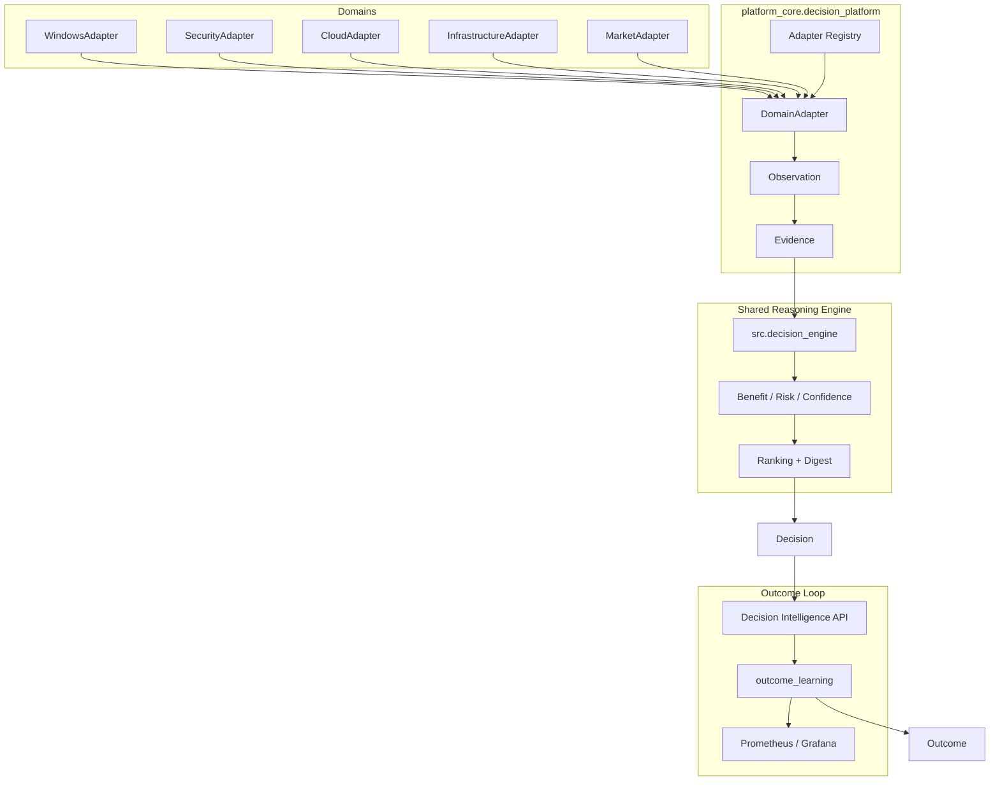

# Multi-Domain Decision Intelligence Platform — Architecture

## Overview

All domains normalize into **Observation → Evidence → Decision → Outcome** and share one deterministic reasoning engine (`src.decision_engine`).



## Domain adapters

| Domain | Adapter | Primary signals |
|--------|---------|-----------------|
| Windows | `WindowsAdapter` | Proxy drift, DNS, listener correlation |
| Security | `SecurityAdapter` | Alert severity, IOC verification |
| Cloud | `CloudAdapter` | Service health, error budget, failover |
| Infrastructure | `InfrastructureAdapter` | CPU saturation, circuit breaker, SLO burn |
| Market Events | `MarketAdapter` | Calendar catalysts, volatility bias |

## Common output contract

Every `DomainAdapter.evaluate()` returns `DomainPipelineResult`:

- `observations[]` — domain facts
- `evidence[]` — weighted evidence nodes
- `decision` — ranked recommendation from shared engine
- `alternatives[]` — counterfactual paths
- `engine_digest` — SHA-256 replay anchor

## Epistemic boundaries

- Observation ≠ proof
- Correlation ≠ causation
- Confidence ≠ certainty
- Research signal ≠ execution permission

## Safety boundaries

- Adapters **do not** execute remediation, failover, isolation, or trades.
- Windows toolkit policy gates (`ALLOW` / `PREVIEW` / `BLOCK`) remain authoritative for host changes.
- API routes persist audit rows only; execution paths live elsewhere under RBAC.

## Failure modes

| Failure | Symptom | Recovery |
|---------|---------|----------|
| Empty candidate specs | `ValueError` from `evaluate()` | Ensure adapter returns ≥1 candidate |
| Unstable digest | Digest differs across replays | Set stable `evidence_id` on adapter evidence |
| Unknown domain | `KeyError` from `get_adapter()` | Use `list_domains()` or `PlatformDomain` enum |
| Postgres unavailable | Silent fallback to JSONL | Check `DATABASE_URL`; inspect `di_health` storage_backend |

## Troubleshooting

```powershell
# Verify all domains produce a decision
$env:PYTHONPATH = (Get-Location).Path
pytest -q tests/decision_platform

# Inspect adapter output in Python
python -c "from platform_core.decision_platform import AdapterContext, PlatformDomain, get_adapter; print(get_adapter(PlatformDomain.WINDOWS).evaluate(AdapterContext(payload={})))"
```

## Module map

| Path | Role |
|------|------|
| `platform_core/decision_platform/` | Adapters, registry, unified models |
| `src/decision_engine/` | Shared scoring + counterfactual engine |
| `platform_core/outcome_learning/` | Post-decision accuracy metrics |
| `backend/decision_intelligence/` | HTTP API + PostgreSQL/JSONL store |
| `src/knowledge/` | Versioned YAML facts separated from code |
