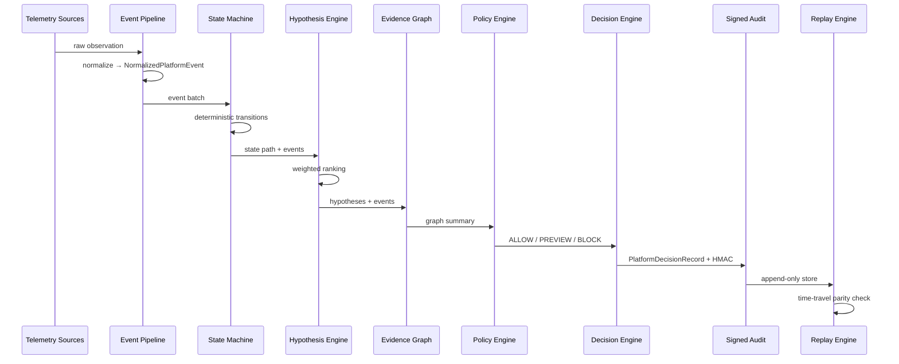
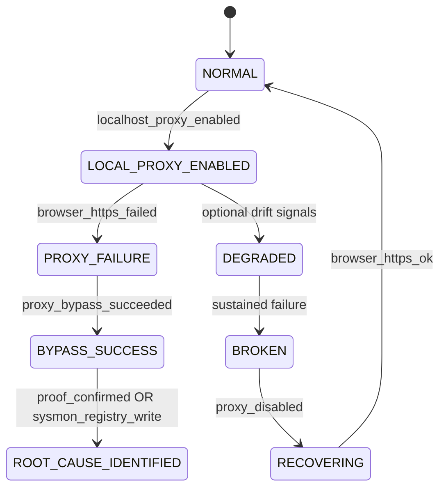

# Reliability Platform — Sequence & State Diagrams

## Decision pipeline (sequence)

## State machine

## Evidence graph node kinds

| Kind | Example |
|------|---------|
| `process` | node.exe ← powershell.exe |
| `registry_write` | ProxyEnable=1 |
| `listener` | 127.0.0.1:61187 |
| `network_flow` | HTTPS failure via proxy path |
| `policy_decision` | PREVIEW — unproven high confidence |
| `hypothesis` | Known developer tool (ordinal 0.72) |

## API surfaces

| Version | Base path | Purpose |
|---------|-----------|---------|
| v1 | `/platform/*` | Fleet, incidents, remediation preview |
| v2 | `/platform/v2/*` | Events, decisions, replay, policies |
