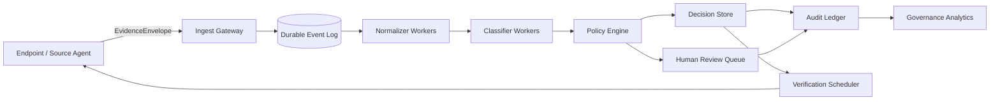

# Distributed Evidence Platform Architecture

## Goal

Generalize the repository from a Windows proxy-focused toolkit into a reusable evidence decision platform without pretending that a production distributed deployment already exists.

The target abstraction is:

```text
Evidence -> Normalize -> Classify -> Policy -> Decision -> Action Preview -> Verify -> Audit
```

The architecture below is a **design target and testable contract**, not a claim that the repository currently operates a global production fleet.

## System model



## Core contracts

### EvidenceEnvelope

Every event carries:

- `event_id`: globally unique idempotency key;
- `source_id`: endpoint/account/resource identity;
- `observed_at`: source observation time;
- `ingested_at`: platform receive time;
- `schema_version`: explicit compatibility boundary;
- `evidence_type`: proxy, TLS, IAM drift, FinOps anomaly, AI-control evidence, etc.;
- `payload_digest`: SHA-256 of canonicalized evidence;
- `provenance`: collector and collection mode;
- `limitations[]`: what the evidence cannot establish.

### DecisionRecord

A decision must include:

- evidence references, never only free-text reasoning;
- classifier/policy version;
- proof/evidence tier;
- decision status;
- `limitations[]`;
- human approval state when required;
- immutable audit linkage;
- verification requirement after any approved mutation.

## Delivery semantics

The preferred operational contract is **at-least-once delivery plus idempotent processing**.

Exactly-once delivery is not assumed. Instead:

1. producers generate stable `event_id` values;
2. consumers maintain a processed-event ledger or transactional dedupe store;
3. duplicate events must not create duplicate irreversible actions;
4. audit records may record duplicate arrival while preserving a single decision effect.

This is easier to reason about and test than making an unsupported exactly-once claim.

## Partitioning

Default partition key: `source_id`.

Benefits:

- preserves per-source ordering;
- limits concurrent conflicting decisions for one endpoint/resource;
- allows horizontal scaling across independent sources.

Hot partitions are possible for shared resources. Mitigations include hierarchical keys, resource sub-partitioning, and explicit serialized control-plane paths for high-risk mutations.

## Backpressure

Each stage must expose queue depth, oldest-event age, processing rate, retry rate, and rejection rate.

Backpressure policy:

1. never drop high-integrity audit events silently;
2. prefer delayed classification over unbounded memory growth;
3. degrade optional analytics before evidence ingestion;
4. reject malformed or unsupported schemas into a dead-letter path;
5. surface stale-data limitations to downstream decisions.

## Retry and dead-letter policy

Retries use bounded exponential backoff with jitter. Events move to a dead-letter queue after a configured retry budget or on non-retryable schema/validation failures.

A dead-letter event is not considered resolved until:

- its cause is classified;
- the event is replayed successfully or explicitly waived;
- the disposition is audit logged.

## Ordering

Only per-partition ordering is required. Global ordering is intentionally not promised.

Decision logic that needs cross-source evidence must use an explicit evidence window and watermark rather than assuming globally ordered arrival.

## Failure isolation

Blast radius should be bounded by:

- tenant/domain partition;
- evidence type;
- worker pool;
- policy namespace;
- mutation capability.

A classifier failure must not automatically disable evidence ingestion or audit persistence. A governance analytics failure must not block safety-critical policy evaluation.

## Multi-domain generalization

The platform abstraction should be reusable for:

| Domain | Evidence | Decision example |
|---|---|---|
| Windows reliability | WinINET/WinHTTP/listener/TLS | proxy drift classification |
| Cloud IAM | role bindings/policy diffs | excessive privilege review |
| FinOps | billing/allocation/usage | anomaly or budget exception |
| AI governance | model/version/eval/policy evidence | release approval gate |
| Compliance | control-test artifacts | PASS/FAIL/PARTIAL decision |

The common value is not the domain label; it is the evidence-to-decision contract.

## What must be measured before production-scale claims

A production claim requires measured evidence for at least:

- sustained ingest throughput;
- p50/p95/p99 end-to-end decision latency;
- queue-age behavior under overload;
- retry amplification;
- dedupe correctness;
- partition skew;
- recovery after worker/broker/database failure;
- audit durability;
- cost per million evidence events;
- SLO compliance over a meaningful observation window.

Until those measurements exist, this repository should describe this architecture as a **production-shaped design target**, not deployed fleet capacity.
