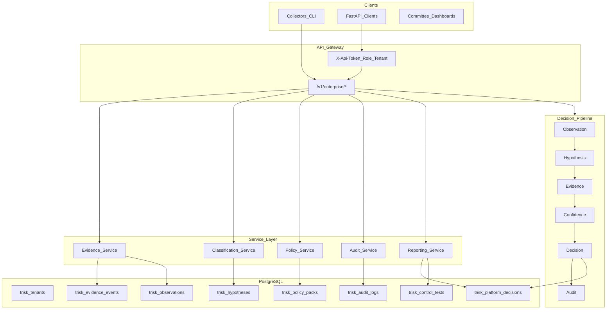

# Enterprise Decision Intelligence Platform — Architecture

## Positioning

This platform is **decision infrastructure** for technology risk committees — not a chatbot, RAG system, EDR product, or autonomous remediation engine. Every stage preserves epistemic boundaries: observation ≠ proof, classification ≠ accusation, policy permission ≠ safety guarantee.

## Service-oriented architecture



## Five services

| Service | Responsibility | Key tables | API prefix |
|---------|----------------|------------|------------|
| **Evidence** | Observations + structured evidence ingest | `trisk_observations`, `trisk_evidence_events` | `/v1/enterprise/observations`, `/evidence` |
| **Classification** | Deterministic pipeline + hypothesis proposals | `trisk_hypotheses`, `trisk_incidents` | `/v1/enterprise/classify`, pipeline stage |
| **Policy** | YAML policy packs + canonical `evaluate_policy` | `trisk_policy_packs` | `/v1/enterprise/policy/*` |
| **Audit** | Hash-chained tenant audit logs | `trisk_audit_logs` | `/v1/enterprise/audit/*` |
| **Reporting** | Governance + executive dashboards | reads decisions/controls | `/v1/enterprise/reports/*` |

## Decision loop

```
Observation → Hypothesis → Evidence → Confidence → Decision → Audit
```

1. **Observation** — raw signal captured (`trisk_observations`); limitations applied.
2. **Hypothesis** — triage label proposed (`trisk_hypotheses`); not causation proof.
3. **Evidence** — structured package ingested (`trisk_evidence_events`); content-hash idempotent.
4. **Confidence** — ordinal score from deterministic classifier; not calibrated probability.
5. **Decision** — policy engine + YAML rules → `trisk_platform_decisions`; human approval when required.
6. **Audit** — append-only hash chain per tenant (`trisk_audit_logs`).

Trigger: `POST /v1/enterprise/pipeline/run`

## Multi-tenant model

- Header: `X-Api-Tenant` (default: `default`)
- Table: `trisk_tenants`
- Tenant ID on evidence, incidents, decisions, audit logs
- Admin role bypasses tenant boundary; other roles scoped to principal tenant

## RBAC

| Role | Ingest | Pipeline | Policy admin | Review | Audit read |
|------|--------|----------|--------------|--------|------------|
| `admin` | ✓ | ✓ | ✓ | ✓ | ✓ |
| `operator` | ✓ | ✓ | | | |
| `risk_reviewer` | | ✓ | | ✓ | |
| `auditor_readonly` | | | | | ✓ |
| `demo_viewer` | | | | | partial |

Headers: `X-Api-Token`, `X-Api-Role`, `X-Api-Tenant`

## Policy-as-code

Default pack: [`config/policy/enterprise_default.yaml`](../config/policy/enterprise_default.yaml)

Tenants may register packs via `POST /v1/enterprise/policy/packs`. Active pack is evaluated alongside `src/platform_core/policy/engine.py` canonical gates.

Safety invariants (YAML `safety` block):
- No automatic process kill
- No automatic network reset
- Registry mutation requires typed confirmation
- Default mode: `read_only`

## Human approval

High-risk classifications enqueue `trisk_human_reviews`. Reviewers call:

`POST /v1/enterprise/reviews/{review_id}/approve`

Actions: `accept_classification`, `reject_remediation`, `request_more_evidence`

## OpenAPI

FastAPI auto-generates OpenAPI 3 at `/openapi.json`. Tags:
- `enterprise-decision-platform`
- `evidence-service`, `classification-service`, `policy-service`, `audit-service`, `reporting-service`
- `decision-pipeline`, `human-approval`

## Non-goals

- Autonomous remediation execution
- Malware/EDR/MITM confirmation claims
- LLM chatbot or RAG retrieval layer
- Trading or unrelated decision domains (use `/decision-intelligence` for generic DI experiments)

## Related documents

- [Migration plan](enterprise-migration-plan.md)
- [ADR-014](adr/ADR-014-enterprise-service-architecture.md)
- [RBAC model](rbac-model.md)
- [Domain event catalog](domain-event-catalog.md)
