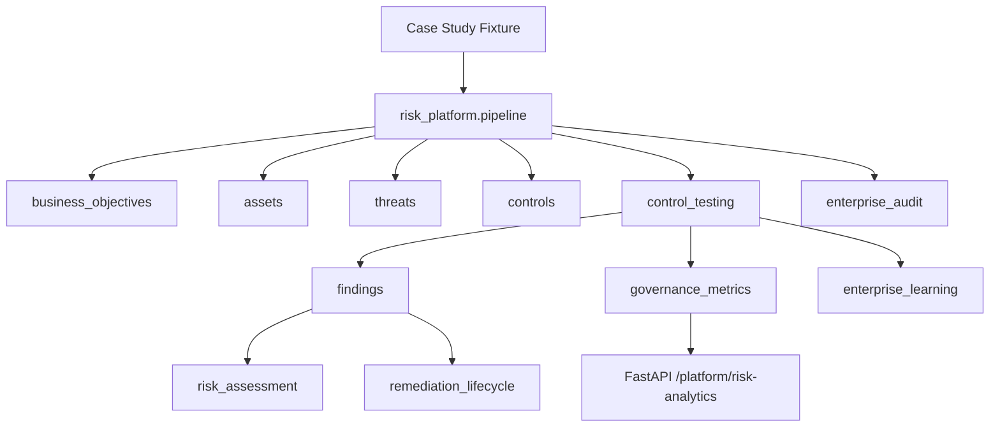

# Technology Risk & Control Analytics Platform

**Positioning:** Enterprise Technology Risk & Control Analytics Platform — **not** antivirus, EDR, XDR, or autonomous AI.

Transforms technical endpoint observations into business-aligned risk intelligence with full traceability.

## Documentation index

| Document | Description |
|----------|-------------|
| [Architecture](architecture.md) | System context, package layout, integration |
| [Control framework](control-framework.md) | NET-xxx catalog, types, traceability |
| [Risk register design](risk-register-design.md) | Inherent/residual scoring model |
| [Governance dashboard](governance-dashboard-design.md) | Executive metrics by audience |
| [Audit trail design](audit-trail-design.md) | Hash chain, exports, verification |
| [Executive summary](executive-summary.md) | Leadership one-pager |

## Core philosophy

- Observation != Proof
- Correlation != Causation
- Confidence != Certainty
- Policy Permission != Safety Guarantee

## Enterprise framework

```text
Business Objective
      ↓
    Asset
      ↓
   Threat
      ↓
   Control
      ↓
   Testing
      ↓
  Finding
      ↓
Risk Assessment
      ↓
 Remediation
      ↓
 Governance
      ↓
   Audit
      ↓
  Learning
```

## Architecture



## Module map

| Layer | Package |
|-------|---------|
| Business objectives | `src/platform_core/business_objectives/` |
| Assets | `src/platform_core/assets/` |
| Threats | `src/platform_core/threats/` |
| Controls | `src/platform_core/controls/` |
| Control testing | `src/platform_core/control_testing/` |
| Findings | `src/platform_core/findings/` |
| Risk assessment | `src/platform_core/risk_assessment/` |
| Remediation lifecycle | `src/platform_core/remediation_lifecycle/` |
| Governance metrics | `src/platform_core/governance_metrics/` |
| Audit export | `src/platform_core/enterprise_audit/` |
| Learning | `src/platform_core/enterprise_learning/` |
| Pipeline | `src/platform_core/risk_platform/` |

## Control framework (sample)

| ID | Name | Type | Objective |
|----|------|------|-----------|
| NET-001 | Proxy Baseline Validation | Detective | BO-001 |
| NET-002 | Registry Integrity Validation | Detective | BO-002 |
| NET-003 | TLS Trust Path Validation | Detective | BO-004 |
| NET-004 | Remediation Preview Gate | Preventive | BO-003 |
| NET-005 | Connectivity Recovery Procedure | Corrective | BO-005 |

## Risk register design

Each finding produces:

- **Inherent risk** — likelihood × impact (ordinal)
- **Residual risk** — after control effectiveness
- **Control effectiveness** — pass rate from test executions

Risk levels: LOW · MEDIUM · HIGH · CRITICAL

## Governance dashboard

Executive metrics:

- Controls tested / passed / failed
- High-risk findings
- Open remediations
- Compliance % (control pass rate — not regulatory attestation)

Audiences: CIO · CISO · Internal Audit · Risk Committee · Board (summary)

## Audit trail design

Hash-chained JSONL records with:

`event_id` · `timestamp` · `source` · `evidence_tier` · `classification` · `policy_decision` · `limitations` · `previous_hash` · `current_hash`

Exports: JSON · JSONL · CSV (findings) · Markdown executive summary

## Demo commands

```powershell
python -m windows_network_toolkit risk-analytics --fixture tests/fixtures/case_studies/case_1_dead_wininet_proxy.json
python -m windows_network_toolkit risk-analytics --fixture tests/fixtures/case_studies/case_3_tls_mismatch.json --format markdown

curl -X POST http://127.0.0.1:8000/platform/risk-analytics/assess -H "Content-Type: application/json" -d "{\"fixture_path\":\"tests/fixtures/case_studies/case_1_dead_wininet_proxy.json\"}"
```

## Target users

- Big 4 Technology Risk
- Internal Audit
- Risk Advisory
- Financial Institutions
- Enterprise Governance Teams
- Security Governance Teams

## Executive summary

This platform provides **traceability from business objectives to audit evidence** for Windows endpoint network risk — proxy drift, rogue listeners, TLS path anomalies — without positioning as autonomous security software. Remediation remains **preview-only** with typed confirmation for any host mutation.
