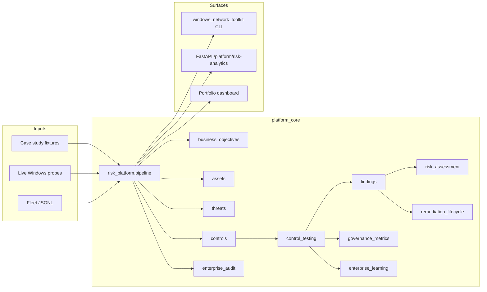
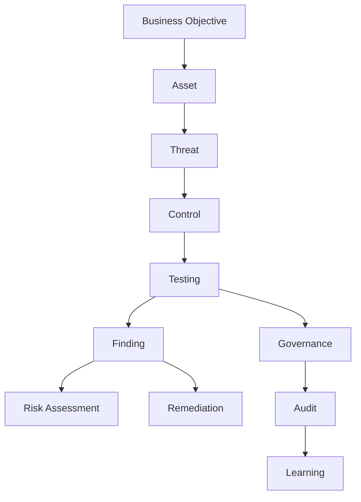

# Architecture — Technology Risk & Control Analytics Platform

## Purpose

Transform Windows endpoint network **observations** into **business-aligned risk intelligence** with end-to-end traceability. This is governance infrastructure — not antivirus, EDR, XDR, or autonomous remediation.

## Epistemic constraints

| Principle | Implementation |
|-----------|----------------|
| Observation ≠ Proof | Evidence tiers; proof envelope required for destructive actions |
| Correlation ≠ Causation | Limitations[] on every output; no auto-remediation |
| Confidence ≠ Certainty | Ordinal scores (0–1) with explicit uncertainty |
| Policy Permission ≠ Safety Guarantee | Typed confirmation + rollback plan for mutations |

## System context



## Enterprise flow



## Package layout

```text
src/platform_core/
├── business_objectives/   # BO-001..005 catalog
├── assets/                # Endpoint, proxy, registry, TLS assets
├── threats/               # THR-001..006 threat models
├── controls/              # NET-001..005 control library
├── control_testing/       # PASS | FAIL | WARNING | NOT_TESTED
├── findings/              # Severity-scored findings
├── risk_assessment/       # Inherent & residual risk register
├── remediation_lifecycle/ # OPEN → CLOSED states
├── governance_metrics/    # Executive dashboard metrics
├── enterprise_audit/      # Hash-chained audit trail
├── enterprise_learning/   # Continuous improvement recommendations
├── risk_platform/         # Orchestrating pipeline
└── enterprise/enums.py    # Shared enumerations
```

## Integration points

| Surface | Entry |
|---------|-------|
| CLI | `python -m windows_network_toolkit risk-analytics --fixture …` |
| API | `POST /platform/risk-analytics/assess` |
| Dashboard | `GET /platform/risk-analytics/governance-dashboard` |
| Export | `GET /platform/risk-analytics/export/findings.csv` |

## Deployment model

- **Local-first:** No cloud dependency for core analytics
- **Fixture-safe CI:** Deterministic replay on Linux/macOS/Windows
- **Dry-run default:** Host mutations require explicit confirmation
