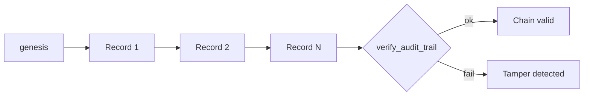

# Audit Trail Design

## Principles

1. **Immutability** — Hash-chained records; tampering breaks verification
2. **Traceability** — Every event links to business objective → control → test → finding
3. **Evidence tiering** — Observation vs hypothesis vs proof explicitly labeled
4. **Exportability** — JSON, JSONL, CSV, executive Markdown

## Chain structure



Each record contains:

| Field | Purpose |
|-------|---------|
| `event_id` | Unique event identifier |
| `timestamp` | ISO-8601 UTC |
| `layer` | business_objective · asset · threat · control · test · finding · risk · remediation · governance · learning |
| `entity_id` | ID of the governed object |
| `action` | catalog · test · assess · recommend |
| `evidence_tier` | observation · hypothesis · proof |
| `classification` | Technical classification if applicable |
| `policy_decision` | allow · deny · preview |
| `limitations` | Epistemic caveats |
| `previous_hash` | SHA-256 of prior record (or `genesis`) |
| `current_hash` | SHA-256 of this record payload |

## Recorded entities

The pipeline emits audit events for:

- Business objectives (catalog load)
- Assets (derived from fixture)
- Threats (mapped to classification)
- Controls (catalog + test execution)
- Tests (result + evidence)
- Findings (severity + recommendation)
- Risk register entries
- Remediation records
- Governance dashboard snapshot
- Learning recommendations

## Verification

```python
from src.platform_core.enterprise_audit.trail import build_audit_trail, verify_audit_trail

trail = build_audit_trail(pipeline_result)
ok, detail = verify_audit_trail(trail)
```

Pipeline sets `audit_chain_verified: true` when chain validates.

## Export formats

| Format | Endpoint / CLI | Use case |
|--------|----------------|----------|
| JSON | `POST /platform/risk-analytics/assess` | Full pipeline replay |
| JSONL | Audit module | SIEM / log aggregation |
| CSV | `GET /platform/risk-analytics/export/findings.csv` | Spreadsheet review |
| Markdown | `risk-analytics --format markdown` | Executive report |

## Retention guidance

- Store JSONL append-only in WORM or object-lock storage for formal audit
- Include `limitations[]` in every export — required for defensible governance
- Chain verification should run before any report is submitted to audit committee

## Non-goals

- Not a SIEM replacement
- Not real-time streaming (batch assess model)
- Not cryptographic signing (hash chain only; HSM signing is integrator responsibility)
