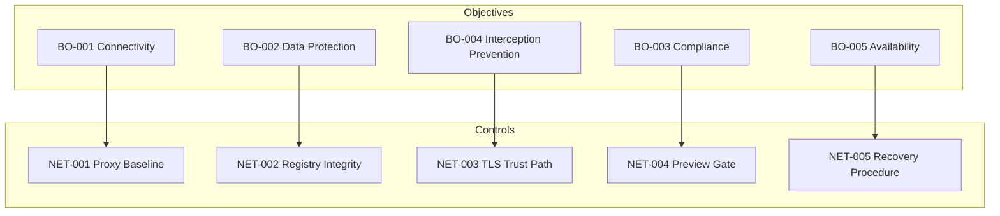

# Control Framework Design

## Control taxonomy

| Type | Purpose | Example |
|------|---------|---------|
| **Preventive** | Block unauthorized change before impact | NET-004 Remediation Preview Gate |
| **Detective** | Identify drift or anomaly | NET-001 Proxy Baseline Validation |
| **Corrective** | Restore known-good state (preview-only) | NET-005 Connectivity Recovery Procedure |

## Control catalog

## Control record schema

| Field | Description |
|-------|-------------|
| `control_id` | Unique identifier (e.g. NET-001) |
| `control_name` | Human-readable name |
| `objective_id` | Linked business objective (BO-xxx) |
| `control_owner` | Governance owner role |
| `control_type` | Preventive · Detective · Corrective |
| `frequency` | Continuous · On-demand · Periodic |
| `evidence_requirements` | Required artifacts for attestation |

## Test result matrix

| Result | Meaning | Finding generated |
|--------|---------|-------------------|
| PASS | Control effective for observed state | No |
| FAIL | Control not met | Yes |
| WARNING | Partial or inconclusive | Optional |
| NOT_TESTED | No runner or insufficient evidence | No |

## Traceability rule

**Every control MUST trace to exactly one business objective.** The catalog enforces `objective_id` on each `Control` record; pipeline validation rejects orphan controls.

## Sample mappings

| Control | Threat mitigated | Assets tested |
|---------|------------------|---------------|
| NET-001 | THR-001 Proxy Drift | Proxy Configuration, Endpoint |
| NET-002 | THR-005 Registry Modification | Registry |
| NET-003 | THR-004 TLS Interception | Certificate Store, Browser |
| NET-004 | THR-002 Rogue Local Proxy | Endpoint |
| NET-005 | THR-003 Malware Persistence | Endpoint, DNS Configuration |
