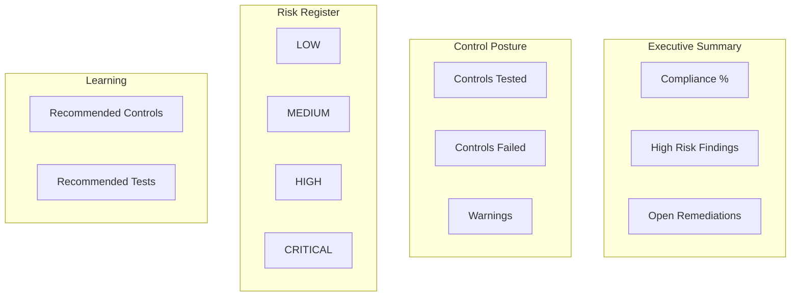

# Governance Dashboard Design

## Purpose

Provide **executive-ready metrics** from control testing and risk assessment — suitable for CIO, CISO, Internal Audit, Risk Committee, and Board summary reporting.

## Metric catalog

| Metric | Definition | Source |
|--------|------------|--------|
| `controls_tested` | Count of executed control tests | control_testing |
| `controls_passed` | Tests with result PASS | control_testing |
| `controls_failed` | Tests with result FAIL | control_testing |
| `controls_warning` | Tests with result WARNING | control_testing |
| `high_risk_findings` | Findings severity HIGH or CRITICAL | findings |
| `open_remediations` | Remediations not CLOSED/MITIGATED | remediation_lifecycle |
| `compliance_percentage` | controls_passed / controls_tested × 100 | computed |
| `risk_summary` | Count by residual risk level | risk_assessment |

## Dashboard layout

## Audience views

### CIO / CISO

- Compliance percentage trend (fixture replay baseline)
- Open remediations with due dates
- CRITICAL residual risks

### Internal Audit

- Controls failed with evidence links
- Audit chain verification status
- Limitations on each metric

### Risk Committee

- Inherent vs residual risk distribution
- Threat-to-control coverage gaps (NOT_TESTED)

### Board (summary)

- Single-page executive summary via `GET /platform/risk-analytics/executive-summary`
- No raw host data — aggregated counts only

## API endpoints

| Endpoint | Method | Output |
|----------|--------|--------|
| `/platform/risk-analytics/governance-dashboard` | GET | Metric JSON |
| `/platform/risk-analytics/executive-summary` | GET | Markdown summary |
| `/platform/risk-analytics/assess` | POST | Full pipeline + dashboard |

## UI integration

Portfolio dashboard (`/dashboard/`) loads governance metrics from the governance-dashboard endpoint into the **Technology Risk & Control Analytics** panel.

## Epistemic notice

Compliance percentage reflects **control test pass rate** for the assessed fixture or host snapshot — not SOC 2, ISO 27001, or regulatory certification.
