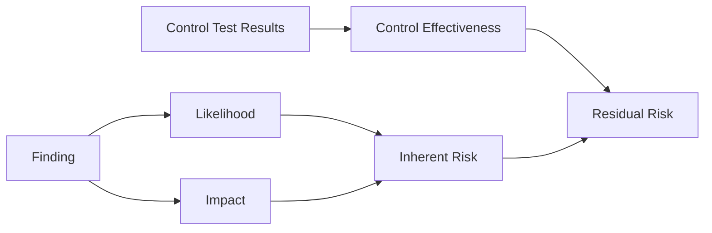

# Risk Register Design

## Overview

The risk register translates **failed control tests** and **findings** into scored risk entries suitable for enterprise risk committees and internal audit.

## Risk calculation model



### Inherent risk

```
Inherent Risk = f(Likelihood, Impact)
```

Ordinal mapping from threat catalog:

| Likelihood | Impact | Inherent |
|------------|--------|----------|
| Low | Low | LOW |
| Medium | Medium | MEDIUM |
| High | High | HIGH |
| High | Critical | CRITICAL |

Finding severity can elevate inherent risk (e.g. CRITICAL finding → CRITICAL inherent).

### Residual risk

```
Residual Risk = f(Inherent Risk, Control Effectiveness)
```

Control effectiveness derived from test pass rate:

| Pass rate | Effectiveness | Typical residual adjustment |
|-----------|---------------|---------------------------|
| 100% | High | −1 level |
| 50–99% | Medium | −0 levels |
| <50% | Low | No reduction |

### Risk levels

`LOW` · `MEDIUM` · `HIGH` · `CRITICAL`

## Register entry schema

| Field | Type | Description |
|-------|------|-------------|
| `risk_id` | string | Unique register ID |
| `finding_id` | string | Source finding |
| `threat_id` | string | Linked threat |
| `asset_ids` | string[] | Impacted assets |
| `inherent_risk` | enum | Pre-control score |
| `residual_risk` | enum | Post-control score |
| `likelihood` | enum | Threat likelihood |
| `impact` | enum | Business impact |
| `control_effectiveness` | float | 0.0–1.0 |
| `limitations` | string[] | Epistemic caveats |

## API access

```http
GET /platform/risk-analytics/risk-register?fixture=tests/fixtures/case_studies/case_1_dead_wininet_proxy.json
```

## Governance use

| Audience | Primary fields |
|----------|----------------|
| CISO | residual_risk, threat_id, control_effectiveness |
| Risk Committee | inherent vs residual delta, asset criticality |
| Internal Audit | finding_id trace, evidence, limitations |
| Board | aggregated CRITICAL/HIGH counts only |

## Limitations

- Scores are **heuristic** — not regulatory attestation
- Fixture replay produces deterministic register for demo/audit
- Live host state may differ; limitations[] must be reviewed
