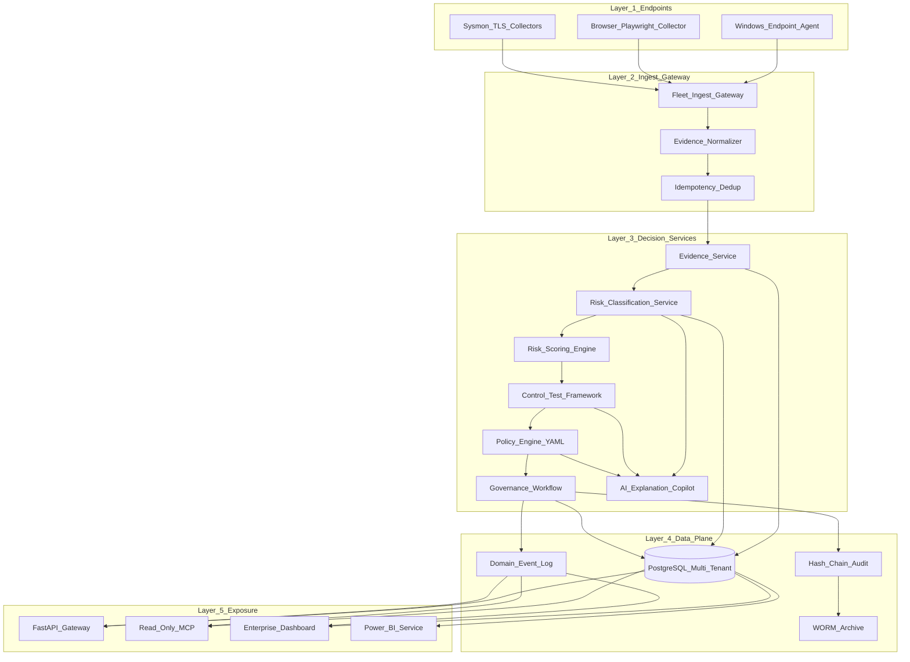
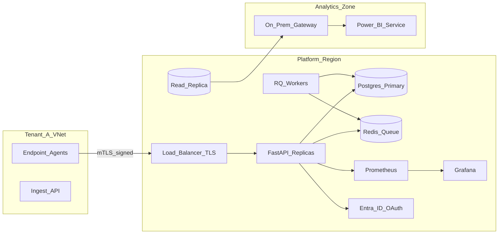
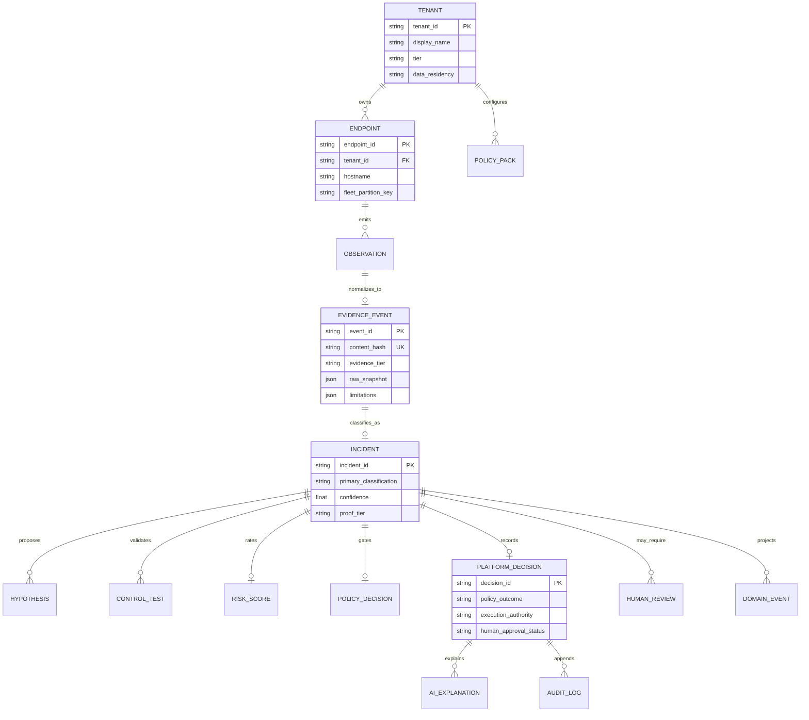
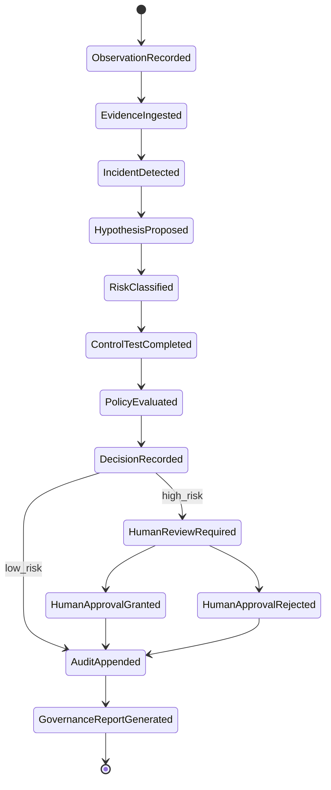
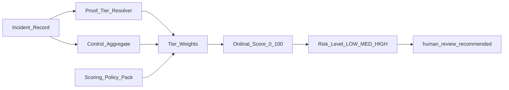
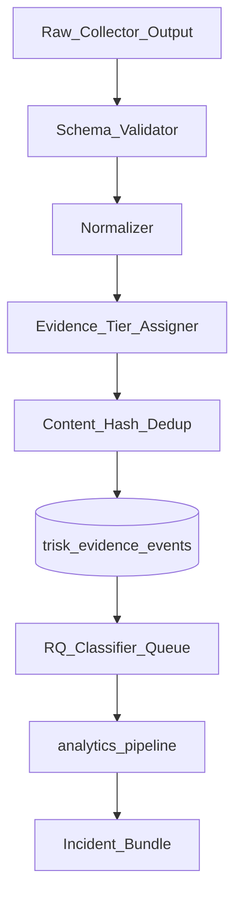
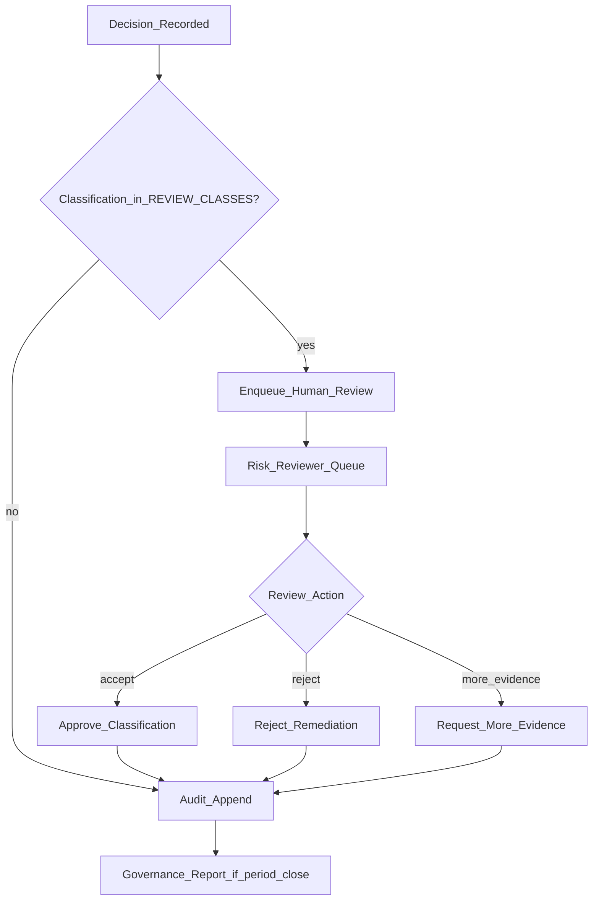
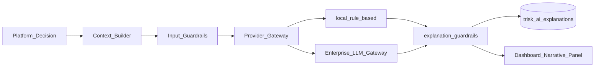
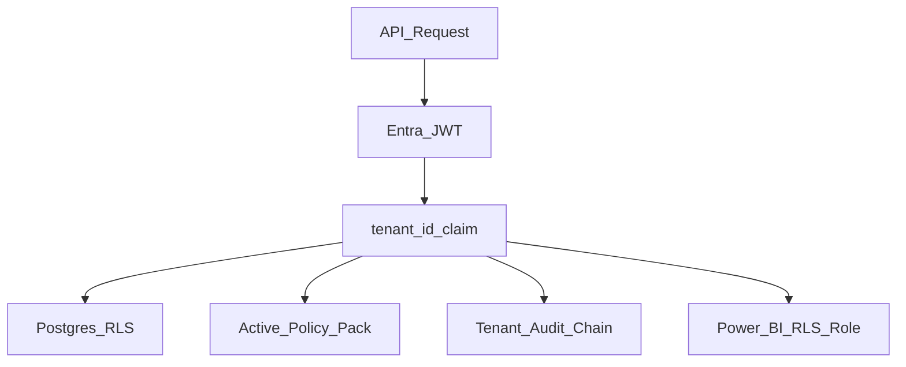

# Enterprise Technology Risk Decision Platform — Principal Blueprint

**Audience:** Senior Staff / Principal Engineer, Big 4 Technology Risk, Internal Audit, GRC  
**Status:** Target architecture — builds on existing portfolio prototype (not greenfield)  
**Positioning:** Decision infrastructure with auditability, explainability, and human gates — **not** EDR, SOC automation, chatbot, RAG, or autonomous remediation.

**Baseline assets:** [SYSTEM_DESIGN.md](../SYSTEM_DESIGN.md) · [enterprise-decision-platform-architecture.md](enterprise-decision-platform-architecture.md) · [control-matrix.md](control-matrix.md) · [framework_mapping.md](framework_mapping.md)

---

## 1. Executive summary

The Windows Network Recovery Toolkit is **already** a production-shaped technology risk prototype. This blueprint **consolidates and elevates** it into a single enterprise platform:

| Pillar | Current state | Target state |
|--------|---------------|--------------|
| Multi-endpoint | Fleet envelope + `trisk_endpoints` | Unified fleet ingest → Postgres evidence plane |
| API | 4 route tiers (`/platform`, `/trisk`, `/v1`, `/v1/enterprise`) | One governed API surface + legacy shims |
| Persistence | Dual JSONL + Postgres; 3 event systems | Postgres canonical + WORM audit archive |
| Risk | Two scorers (pipeline + fixture) | Versioned scoring policy packs |
| Governance | Human review + hash chain | Committee workflow + ticketing hooks |
| AI | Guardrailed explanation only | Copilot layer (read/explain, never execute) |
| Analytics | Star schema CSV export | Power BI Service + tenant RLS |
| Compliance | Document mapping | Automated control evidence packs |
| Deploy | Docker Compose + GHCR | K8s + SSO + multi-region option |

---

## 2. System architecture

### 2.1 Logical architecture (target)



### 2.2 Physical deployment (production target)



**Existing:** `docker-compose.yml` (Postgres, Redis, API, worker, Prometheus, Grafana) — [deployment-topology.md](deployment-topology.md)  
**Gap:** K8s manifests, Entra ID, WORM bucket, Power BI workspace automation

---

## 3. Domain model



**Code mapping:**

| Domain entity | Implementation today |
|---------------|---------------------|
| Tenant | `trisk_tenants`, `TenantRecord` |
| Endpoint | `trisk_endpoints`, fleet `FleetEventEnvelope` |
| Observation | `trisk_observations` |
| Evidence | `trisk_evidence_events`, `EvidenceEvent` schema |
| Incident | `trisk_incidents`, classifier |
| Hypothesis | `trisk_hypotheses` |
| Control test | `trisk_control_tests`, `control_tests.py` |
| Policy decision | `trisk_policy_decisions`, YAML + `evaluate_policy` |
| Platform decision | `trisk_platform_decisions` |
| Human review | `trisk_human_reviews`, `human_review.py` |
| Audit | `trisk_audit_logs`, `trisk_audit_chain` |
| Domain event | `trisk_domain_events`, `TriskEventType` |

---

## 4. Database schema (consolidated target)

### 4.1 Core tenancy & endpoints

```sql
-- Canonical tenant registry (exists: enterprise_schema.sql)
CREATE TABLE trisk_tenants (
    tenant_id       VARCHAR(64) PRIMARY KEY,
    display_name    VARCHAR(256) NOT NULL,
    tier            VARCHAR(32) NOT NULL DEFAULT 'standard',  -- standard | enterprise | regulated
    data_residency  VARCHAR(16) DEFAULT 'us',
    status          VARCHAR(32) NOT NULL DEFAULT 'active',
    created_at      TIMESTAMPTZ NOT NULL DEFAULT NOW()
);

CREATE TABLE trisk_endpoints (
    endpoint_id     VARCHAR(128) PRIMARY KEY,
    tenant_id       VARCHAR(64) NOT NULL REFERENCES trisk_tenants(tenant_id),
    hostname        VARCHAR(256),
    fleet_partition INTEGER,
    last_seen_at    TIMESTAMPTZ,
    created_at      TIMESTAMPTZ NOT NULL DEFAULT NOW()
);
CREATE INDEX idx_endpoints_tenant ON trisk_endpoints (tenant_id);
```

### 4.2 Evidence & incidents (exists + extensions)

```sql
CREATE TABLE trisk_evidence_events (
    event_id            VARCHAR(64) PRIMARY KEY,
    tenant_id           VARCHAR(64) NOT NULL REFERENCES trisk_tenants(tenant_id),
    endpoint_id         VARCHAR(128) NOT NULL,
    source_event_id     VARCHAR(128),
    content_hash        VARCHAR(64) NOT NULL,
    evidence_type       VARCHAR(64) NOT NULL,
    evidence_tier       VARCHAR(64) NOT NULL DEFAULT 'T1_STATE_EVIDENCE',
    raw_snapshot        JSONB NOT NULL DEFAULT '{}',
    normalized_fields   JSONB NOT NULL DEFAULT '{}',
    limitations         JSONB NOT NULL DEFAULT '[]',
    classification_status VARCHAR(32) NOT NULL DEFAULT 'pending',
    created_at          TIMESTAMPTZ NOT NULL DEFAULT NOW(),
    UNIQUE (tenant_id, endpoint_id, source_event_id)
);

CREATE TABLE trisk_incidents (
    incident_id             VARCHAR(64) PRIMARY KEY,
    tenant_id               VARCHAR(64) NOT NULL,
    evidence_event_id       VARCHAR(64) NOT NULL REFERENCES trisk_evidence_events(event_id),
    endpoint_id             VARCHAR(128) NOT NULL,
    primary_classification  VARCHAR(64) NOT NULL,
    proof_tier              VARCHAR(64) NOT NULL,
    confidence              DOUBLE PRECISION NOT NULL,
    secondary_signals       JSONB NOT NULL DEFAULT '[]',
    limitations             JSONB NOT NULL DEFAULT '[]',
    scoring_policy_version  VARCHAR(32),  -- NEW: versioned risk engine
    created_at              TIMESTAMPTZ NOT NULL DEFAULT NOW()
);
```

### 4.3 Hypotheses, decisions, controls

```sql
CREATE TABLE trisk_hypotheses (
    hypothesis_id       VARCHAR(64) PRIMARY KEY,
    tenant_id           VARCHAR(64) NOT NULL,
    incident_id         VARCHAR(64) REFERENCES trisk_incidents(incident_id),
    label               VARCHAR(128) NOT NULL,
    confidence_score    DOUBLE PRECISION NOT NULL,
    confidence_ordinal  VARCHAR(16) NOT NULL,
    status              VARCHAR(32) NOT NULL DEFAULT 'proposed',
    limitations         JSONB NOT NULL DEFAULT '[]'
);

CREATE TABLE trisk_platform_decisions (
    decision_id               VARCHAR(64) PRIMARY KEY,
    tenant_id                 VARCHAR(64) NOT NULL,
    incident_id               VARCHAR(64),
    evidence_event_id         VARCHAR(64) NOT NULL,
    confidence_score          DOUBLE PRECISION NOT NULL,
    policy_outcome            VARCHAR(64) NOT NULL,
    execution_authority       VARCHAR(64) NOT NULL DEFAULT 'preview_only',
    human_approval_required   BOOLEAN NOT NULL DEFAULT TRUE,
    human_approval_status     VARCHAR(32) NOT NULL DEFAULT 'pending',
    rationale                 TEXT,
    limitations               JSONB NOT NULL DEFAULT '[]'
);

CREATE TABLE trisk_control_tests (
    incident_id     VARCHAR(64) NOT NULL REFERENCES trisk_incidents(incident_id),
    control_id      VARCHAR(32) NOT NULL,  -- CTRL-001 .. CTRL-010
    test_result     VARCHAR(32) NOT NULL, -- PASS | FAIL | PARTIAL | NOT_TESTED
    evidence        JSONB NOT NULL DEFAULT '[]',
    limitations     JSONB NOT NULL DEFAULT '[]',
    PRIMARY KEY (incident_id, control_id)
);
```

### 4.4 Governance, audit, AI explanations

```sql
CREATE TABLE trisk_human_reviews (
    review_id       VARCHAR(64) PRIMARY KEY,
    tenant_id       VARCHAR(64) NOT NULL,
    incident_id     VARCHAR(64) NOT NULL,
    status          VARCHAR(32) NOT NULL DEFAULT 'PENDING_REVIEW',
    actor           VARCHAR(128),
    reason          TEXT NOT NULL DEFAULT ''
);

CREATE TABLE trisk_audit_logs (
    log_id          VARCHAR(64) PRIMARY KEY,
    tenant_id       VARCHAR(64) NOT NULL,
    correlation_id  VARCHAR(128) NOT NULL,
    event_type      VARCHAR(64) NOT NULL,
    actor           VARCHAR(128) NOT NULL,
    resource_type   VARCHAR(32) NOT NULL,
    resource_id     VARCHAR(128) NOT NULL,
    payload         JSONB NOT NULL,
    prev_hash       VARCHAR(128) NOT NULL,
    row_hash        VARCHAR(128) NOT NULL,
    created_at      TIMESTAMPTZ NOT NULL DEFAULT NOW()
);

-- NEW: first-class AI explanation artifacts (advisory only)
CREATE TABLE trisk_ai_explanations (
    explanation_id      VARCHAR(64) PRIMARY KEY,
    tenant_id           VARCHAR(64) NOT NULL,
    decision_id         VARCHAR(64) NOT NULL REFERENCES trisk_platform_decisions(decision_id),
    provider              VARCHAR(32) NOT NULL,  -- local_rule_based | enterprise_gateway
    model_version         VARCHAR(64),
    input_hash            VARCHAR(64) NOT NULL,
    output_text           TEXT NOT NULL,
    guardrail_passed      BOOLEAN NOT NULL,
    blocked_patterns      JSONB NOT NULL DEFAULT '[]',
    limitations           JSONB NOT NULL DEFAULT '[]',
    created_at            TIMESTAMPTZ NOT NULL DEFAULT NOW()
);

CREATE TABLE trisk_domain_events (
    event_id        VARCHAR(64) PRIMARY KEY,
    tenant_id       VARCHAR(64) NOT NULL,
    event_type      VARCHAR(64) NOT NULL,
    aggregate_id    VARCHAR(128) NOT NULL,
    sequence        INTEGER NOT NULL,
    actor           VARCHAR(128) NOT NULL,
    correlation_id  VARCHAR(128),
    payload         JSONB NOT NULL,
    limitations     JSONB NOT NULL DEFAULT '[]',
    created_at      TIMESTAMPTZ NOT NULL DEFAULT NOW(),
    UNIQUE (aggregate_id, sequence)
);
```

### 4.5 Row-level security (target — not yet implemented)

```sql
ALTER TABLE trisk_evidence_events ENABLE ROW LEVEL SECURITY;
CREATE POLICY tenant_isolation ON trisk_evidence_events
    USING (tenant_id = current_setting('app.tenant_id', true));
-- Repeat for all tenant-scoped tables
```

---

## 5. API design

### 5.1 API tiers (consolidation strategy)

| Tier | Path | Auth | Fate |
|------|------|------|------|
| **Canonical** | `/api/v1/*` | OAuth2 + tenant | Target surface (alias existing `/v1`) |
| **Enterprise** | `/api/v1/enterprise/*` | OAuth2 + RBAC | Decision services |
| **Fleet** | `/api/v1/fleet/*` | mTLS agent cert | Multi-endpoint ingest |
| **Analytics** | `/api/v1/analytics/*` | Auditor role | Read-only exports |
| **Legacy shim** | `/trisk/*`, `/platform/*` | Deprecation headers | 12-month sunset |

### 5.2 Core endpoints (implemented + planned)

#### Evidence & normalization

| Method | Path | Status | Description |
|--------|------|--------|-------------|
| POST | `/v1/evidence` | ✅ | Ingest evidence → async classify |
| POST | `/v1/enterprise/observations` | ✅ | Record raw observation |
| POST | `/v1/enterprise/evidence` | ✅ | Tenant-scoped evidence |
| POST | `/v1/fleet/ingest` | 🔲 | Signed fleet envelope batch |

#### Risk & classification

| Method | Path | Status | Description |
|--------|------|--------|-------------|
| GET | `/v1/incidents` | ✅ | Paginated incidents |
| POST | `/v1/enterprise/classify` | ✅ | Deterministic pipeline |
| POST | `/v1/enterprise/pipeline/run` | ✅ | Full decision loop |
| GET | `/v1/risks` | ✅ | Risk scores |

#### Policy & controls

| Method | Path | Status | Description |
|--------|------|--------|-------------|
| POST | `/v1/enterprise/policy/evaluate` | ✅ | YAML + canonical policy |
| POST | `/v1/enterprise/policy/packs` | ✅ | Register tenant policy |
| GET | `/v1/controls` | ✅ | Control test results |

#### Governance & human approval

| Method | Path | Status | Description |
|--------|------|--------|-------------|
| POST | `/v1/incidents/{id}/review` | ✅ | Review action |
| POST | `/v1/enterprise/reviews/{id}/approve` | ✅ | Human approval gate |
| GET | `/v1/enterprise/reviews/pending` | ✅ | Review queue |

#### Audit & replay

| Method | Path | Status | Description |
|--------|------|--------|-------------|
| GET | `/v1/events` | ✅ | Domain event log |
| GET | `/v1/audit/verify` | ✅ | Hash chain verify |
| GET | `/v1/enterprise/audit/logs` | ✅ | Tenant audit logs |
| POST | `/v1/replay` | 🔲 | Deterministic replay certify |

#### AI explanation (copilot — not chatbot)

| Method | Path | Status | Description |
|--------|------|--------|-------------|
| POST | `/v1/explain/decision/{id}` | 🔲 | Guardrailed narrative |
| GET | `/v1/explain/decision/{id}` | 🔲 | Stored explanation artifact |

#### Reporting & analytics

| Method | Path | Status | Description |
|--------|------|--------|-------------|
| GET | `/v1/reports/executive` | ✅ | Executive KPIs |
| GET | `/v1/enterprise/reports/governance` | ✅ | Committee report |
| GET | `/v1/analytics/powerbi/export` | 🔲 | Star schema job |

**Auth headers (interim):** `X-Api-Token`, `X-Api-Role`, `X-Api-Tenant`  
**Auth target:** Entra ID JWT with `tenant_id`, `roles[]` claims

---

## 6. Event model

### 6.1 Decision loop events



### 6.2 Event catalog (canonical)

| Event | Producer | Consumer |
|-------|----------|----------|
| `ObservationRecorded` | Evidence Service | Timeline, replay |
| `EvidenceCollected` | Ingest API | Worker, MCP |
| `IncidentDetected` | Classifier Worker | Risk engine |
| `HypothesisProposed` | Classification Service | AI copilot |
| `RiskClassified` | Risk Scoring Engine | Dashboard, PBI |
| `ControlTestCompleted` | Control Framework | GRC mapping |
| `PolicyEvaluated` | Policy Engine | Decision record |
| `DecisionRecorded` | Governance Workflow | Audit |
| `HumanApprovalGranted` | Human Review | Execution authority |
| `AIExplanationGenerated` | AI Copilot | UI narrative panel |
| `AuditAppended` | Audit Service | Verify, WORM |
| `GovernanceReportGenerated` | Reporting Service | Committee export |
| `ReplayCertified` | Replay Engine | Audit attestation |

**Store:** `trisk_domain_events` (Postgres) + optional Kafka for fleet scale  
**Replay:** `src/platform_core/events/replay.py` + fixture certification digest

---

## 7. Risk scoring engine design

### 7.1 Architecture



### 7.2 Scoring inputs (deterministic)

| Input | Source | Weight role |
|-------|--------|-------------|
| Proof tier T0–T4 | `proof_tier.py` | Caps claim strength |
| Classification severity | `incident_classifier` | Base ordinal |
| Control aggregate | `control_tests.py` | PASS reduces; FAIL increases |
| Policy outcome | Policy engine | Blocks HIGH without approval |
| Confidence | Classifier output | Ordinal label only — not probability |

**Implementation:** `windows_network_toolkit/risk_scoring_engine.py` (pipeline) + `src/platform_core/risk/risk_rating.py` (fixture)  
**Target:** Unify behind `RiskScoringService` with `scoring_policy_version` on incidents

### 7.3 Output contract

```json
{
  "schema_version": "technology_risk_scoring.v1",
  "incident_id": "INC-001",
  "risk_score": 72,
  "risk_level": "HIGH",
  "confidence_type": "ordinal",
  "human_review_recommended": true,
  "control_aggregate": "PARTIAL",
  "limitations": [
    "Ordinal score — not calibrated probability.",
    "Not a malware or compromise verdict."
  ]
}
```

---

## 8. Evidence normalization pipeline



| Stage | Module | Invariant |
|-------|--------|-----------|
| Validate | `evidence_schema.py` | Reject malformed; quarantine |
| Normalize | `analytics_pipeline._normalize` | Canonical field names |
| Tier | T0–T5 ladder | Observation ≠ proof |
| Dedup | `content_hash` | Idempotent ingest |
| Classify | `incident_classifier.py` | Same fixture → same label |

**Collectors:** CLI proxy-status, Playwright HAR (`browser_evidence.py`), fleet agent, Sysmon reader (deferred)

---

## 9. Control testing framework

### 9.1 Structure

| Layer | Controls | Engine |
|-------|----------|--------|
| Endpoint (WNT) | CTRL-001–006 proxy controls | `control_tests.py` |
| Mature governance | CTRL-EPR-001–010 | `control_test_mature.py` |
| Matrix reference | CTRL-001–010 business | `docs/control-matrix.md` |

### 9.2 Test lifecycle

```
Incident classified → map incident_class → control_ids → run tests → store trisk_control_tests → export to Power BI fact_control_tests
```

**Outcomes:** `PASS` | `FAIL` | `PARTIAL` | `NOT_TESTED` | `INSUFFICIENT_EVIDENCE`  
**Rule:** Control PASS ≠ production safety guarantee

---

## 10. Governance workflow



**Accusatory-adjacent classes:** `UNKNOWN_LOCAL_PROXY`, `SUSPICIOUS_PROXY`, `POSSIBLE_MITM_RISK`, `REVERTER_SUSPECTED`  
**AI actors blocked** from `approve_remediation_preview` — `human_review.py`  
**Execution authority:** `preview_only` → `requires_approval` → `blocked` (never `autonomous`)

---

## 11. AI copilot architecture (explanation layer — not chatbot)



### Principles

| Rule | Enforcement |
|------|-------------|
| AI does not execute | No tool-calling to remediation endpoints |
| AI does not confirm malware/MITM | `explanation_guardrails.py` regex blocks |
| AI does not approve | RBAC + `HumanReviewDecision` actor checks |
| Every output has limitations | Mandatory `limitations[]` on store |
| Provider auditable | `input_hash`, `model_version`, `guardrail_passed` |

**Not in scope:** RAG over tickets, conversational chatbot, autonomous agent loop (Phase 6 deferred)

**Modules:** `src/platform_core/ai_risk_analyst/` — extend with `POST /v1/explain/decision/{id}`

---

## 12. Audit trail & replay

| Layer | Mechanism | Path |
|-------|-----------|------|
| Operational timeline | Domain events | `trisk_domain_events` |
| Tamper evidence | Hash chain | `trisk_audit_logs`, `chain_of_custody.py` |
| Governance records | Audit JSONL mirror | `PLATFORM_DATA_DIR/audit.jsonl` |
| Long-term | WORM object store | Target: S3 Object Lock / Azure Immutable |
| Replay | Deterministic digest | `events/replay.py`, `outcome_learning` |

**Verify:** `GET /v1/audit/verify` + `GET /v1/enterprise/audit/verify`  
**Replay certify:** Re-run pipeline on frozen fixture → compare `content_digest`

---

## 13. Power BI star schema

**Schema version:** `powerbi_star_export.v1` — `powerbi_star_export.py`

### Fact tables

| Table | Grain | Key measures |
|-------|-------|--------------|
| `fact_incidents` | One row per incident | risk_level, confidence_score |
| `fact_control_tests` | One row per control test | result, limitation_count |
| `fact_policy_decisions` | One row per policy decision | execution_authority |
| `fact_audit_events` | One row per audit event | chain_verified |
| `fact_remediation_previews` | One row per preview | dry_run |
| `fact_risk_decisions` | One row per human decision | approval outcome |

### Dimension tables

| Table | Role |
|-------|------|
| `dim_date` | Time intelligence |
| `dim_classification` | Incident taxonomy + accusation flag |
| `dim_proof_tier` | T0–T4 maturity order |
| `dim_stakeholder` | Business owner mapping |
| `dim_tenant` | **NEW** — multi-tenant RLS |

**CLI:** `python -m windows_network_toolkit powerbi-export`  
**Target:** Scheduled Fabric refresh + tenant RLS roles in Power BI Service

---

## 14. Compliance mapping (SOC 2 / ISO 27001 / NIST)

> **Disclaimer:** Design-effectiveness mapping for committee workshops — **not** formal attestation.

### 14.1 SOC 2 Trust Services Criteria (illustrative)

| TSC | Platform control | Evidence artifact | CTRL ID |
|-----|------------------|-------------------|---------|
| CC6.1 Logical access | RBAC on `/v1` | RBAC tests, audit logs | CTRL-009 |
| CC7.2 Detection | Proxy drift detection | `proxy-status`, incidents | CTRL-001 |
| CC8.1 Change management | Policy-gated preview | dry-run audit entries | CTRL-009 |
| CC9.2 Risk mitigation | Human review queue | `trisk_human_reviews` | CTRL-006 |
| A1.2 Audit trail | Hash chain integrity | `audit verify` | CTRL-010 |

### 14.2 ISO 27001 Annex A (selected)

| Control | Platform mapping | Test |
|---------|------------------|------|
| A.8 Asset management | Endpoint + proxy config as asset | `risk-assess` |
| A.12.4 Logging | Domain events + audit chain | `GET /v1/events` |
| A.16 Incident management | Evidence-backed triage | `diagnose --proof` |
| A.18 Compliance | Governance report + limitations | `governance-report` |

### 14.3 NIST CSF 2.0

See [framework_mapping.md](framework_mapping.md) — Govern, Identify, Protect, Detect, Respond, Recover mapped with pass/fail criteria and explicit limitations.

**Target automation:** `GET /v1/compliance/pack?framework=nist_csf_2` → evidence bundle per function

---

## 15. Enterprise dashboard

### 15.1 Information architecture

| View | Data source | Status |
|------|-------------|--------|
| Risk overview | `/v1/incidents`, `/v1/risks` | ✅ `frontend/app/platform/risk-overview` |
| Evidence timeline | `/v1/events` | ✅ `evidence-timeline` |
| Audit viewer | `/v1/audit/verify` | ✅ `audit-viewer` |
| Human review queue | `/v1/enterprise/reviews/pending` | 🔲 API only |
| Decision detail + AI narrative | `/v1/explain/decision/{id}` | 🔲 Planned |
| Control coverage matrix | Power BI embed | 🔲 Planned |
| Tenant admin | `/v1/admin/tenants` | 🔲 Planned |

### 15.2 UX principles

- Every panel shows `limitations[]` footer
- No red "MALWARE DETECTED" affordances — ordinal risk bands only
- Human approval actions require typed reason
- Tenant switcher in header (`X-Api-Tenant`)

---

## 16. Multi-tenant architecture



| Isolation layer | Today | Target |
|-----------------|-------|--------|
| API header | `X-Api-Tenant` | JWT claim |
| Application filter | `assert_tenant_access` | Keep + RLS |
| Data partition | Shared `PLATFORM_DATA_DIR` | Per-tenant prefix |
| Policy | `trisk_policy_packs` per tenant | ✅ |
| Fleet | `TenantContext` in envelope | Signed agent binding |

---

## 17. Production deployment architecture

### 17.1 Environment tiers

| Env | Stack | Purpose |
|-----|-------|---------|
| Local | `docker-compose.yml` | Developer + pytest |
| Demo | `docker-compose.demo.yml` | Reviewer walkthrough |
| Staging | `docker-compose.prod.yml` + GHCR SHA | Pre-prod validation |
| Production | K8s + managed Postgres | Enterprise tenants |

### 17.2 Service topology (Compose — exists)

| Service | Image | Port |
|---------|-------|------|
| postgres | postgres:16 | 5432 |
| redis | redis:7 | 6379 |
| api | GHCR toolkit API | 8000 |
| worker | GHCR classifier worker | — |
| prometheus | prom/prometheus | 9090 |
| grafana | grafana/grafana | 3001 |

### 17.3 Production hardening checklist

- [ ] Entra ID OAuth2 for `/v1` (replace static token)
- [ ] Postgres RLS + `app.tenant_id` session variable
- [ ] mTLS for fleet agents
- [ ] WORM audit archive (S3 Object Lock)
- [ ] K8s HPA for API + workers
- [ ] Secrets via Key Vault / AWS SM
- [ ] SBOM + signed container images
- [ ] Multi-AZ Postgres with PITR
- [ ] Power BI workspace per tenant tier

---

## 18. Implementation roadmap

### Phase 0 — Foundation (✅ largely complete)

- Postgres schema + SQLModel ORM
- `/v1` ingest + worker classification
- Domain event log + audit chain
- Control tests + risk scoring
- Enterprise services + `/v1/enterprise`
- Power BI star export
- AI guardrails (advisory)
- Docker Compose production-shaped stack

### Phase 1 — Consolidation (Q1)

| Work item | Outcome |
|-----------|---------|
| Unify risk scorers | Single `RiskScoringService` + policy version |
| Postgres as SSOT | Retire JSONL dual-write for human review |
| Tenant RLS | `app.tenant_id` on all queries |
| API gateway auth | Entra ID JWT middleware |
| Enterprise dashboard | Human review UI + decision detail |
| Versioned migrations | Alembic for `trisk_*` |

### Phase 2 — Multi-endpoint scale (Q2)

| Work item | Outcome |
|-----------|---------|
| Signed fleet agent | mTLS + Authenticode MSI |
| Kafka/Redpanda adapter | Fleet ingest at 100k endpoints (design exists) |
| Browser evidence in ingest | Playwright packages → `/v1/evidence` |
| WORM audit archive | Immutable compliance retention |
| Power BI Service deploy | Scheduled refresh + RLS |

### Phase 3 — GRC integration (Q3)

| Work item | Outcome |
|-----------|---------|
| Compliance evidence packs | NIST/ISO/SOC2 automated bundles |
| ServiceNow/Jira webhooks | Human review ticketing |
| AI explanation API | `trisk_ai_explanations` + UI panel |
| MCP enterprise gateway | OAuth + read-only tool audit |
| K8s production manifests | Helm chart for trisk stack |

### Phase 4 — Enterprise certification path (Q4+)

| Work item | Outcome |
|-----------|---------|
| SOC 2 Type II readiness | Control evidence automation |
| Cross-region DR | Postgres replica + failover |
| Scoring drift monitoring | Classifier version A/B |
| Formal API SLA | SLO dashboards in Grafana |
| External pen test remediation | Per `production-readiness-gap.md` |

---

## 19. Interview positioning (one paragraph)

> We built an **enterprise technology risk decision platform**: multi-endpoint evidence flows through a deterministic normalization and classification pipeline, ordinal risk scoring, control testing against a CTRL-001–010 matrix, YAML policy-as-code, and human approval gates — with hash-chained audit trails, domain event replay, Power BI star-schema exports, and NIST/ISO/SOC2 mapping for committee reporting. An AI copilot layer explains decisions under strict guardrails but never executes remediation. The architecture is multi-tenant, FastAPI-native, Postgres-backed, and production-deployable via Docker/Kubernetes — explicitly **not** antivirus, EDR, or autonomous repair.

---

## 20. Related documents

| Document | Topic |
|----------|-------|
| [enterprise-decision-platform-architecture.md](enterprise-decision-platform-architecture.md) | Service layer detail |
| [enterprise-migration-plan.md](enterprise-migration-plan.md) | Migration phases |
| [state-machine.md](state-machine.md) | Incident state machine |
| [human-review-workflow.md](human-review-workflow.md) | Approval workflow |
| [powerbi-schema.md](powerbi-schema.md) | Semantic model |
| [production-readiness-gap.md](production-readiness-gap.md) | Honest gaps |
| [ADR-014](adr/ADR-014-enterprise-service-architecture.md) | Service-oriented ADR |
