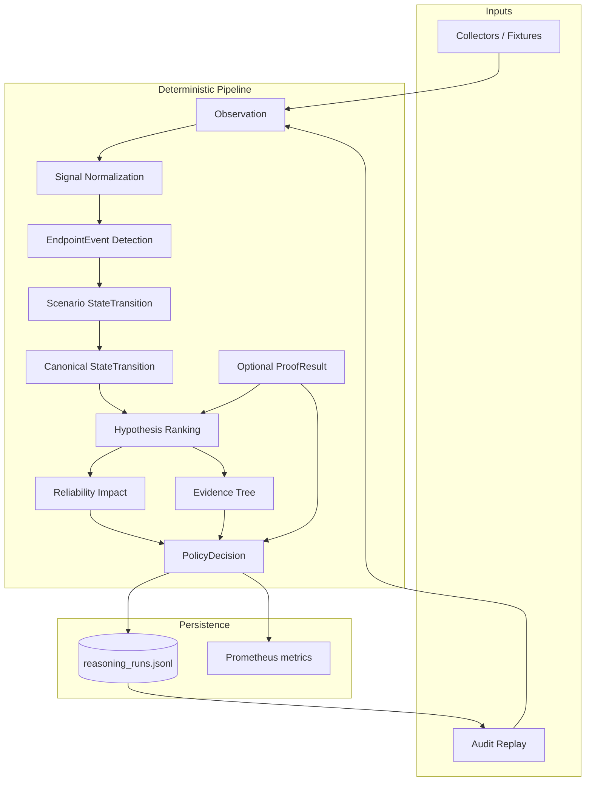

# Event-State Reasoning Platform — Architecture & Implementation Plan

## Executive summary

The Windows Network Recovery Toolkit is evolving from **Observation → Hypothesis → Policy** into a
deterministic **Event-State Reasoning Platform**:

```text
Observation
  → Event
  → State Transition (scenario + canonical)
  → Hypothesis Ranking
  → Confidence
  → Impact
  → Evidence Tree
  → Optional Proof
  → Policy
  → Audit Replay
```

All stages are **pure**, **append-only**, and **replayable** without re-running host diagnostics.

## Target vs current

| Requirement | Status | Location |
| --- | --- | --- |
| Event model (`event_id`, `timestamp`, `source`, `category`, `severity`) | Done | `platform_core/reasoning_models.py` (`EndpointEvent`) |
| Canonical state machine (`NORMAL` … `RECOVERING`) | Done | `platform_core/state_machine.py` |
| Scenario state machine (explainable path) | Done | `platform_core/reasoning_engine.py`, `failure_scenarios.py` |
| Transition engine (explicit rules) | Done | Scenario rules + `CANONICAL_TRANSITION_RULES` |
| Hypothesis ranking (weighted) | Done | `rank_hypotheses()` |
| Evidence tree (hypothesis ↔ evidence) | Done | `platform_core/evidence_tree.py` |
| Replay without probes | Done | `platform_core/reasoning_audit.py` |
| Append-only JSONL audit | Done | `platform_data/reasoning_runs.jsonl` |
| HTTP API | Done | `POST /platform/reasoning/run`, `GET /platform/reasoning/replay/{run_id}` |
| Dashboard views | Planned | Phase 7 |

## Architecture



### Dual-layer state model

Scenario states preserve operator-facing explainability (`proxy_drift_detected`, etc.).
Canonical states unify fleet dashboards and alert routing:

| Scenario state | Canonical |
| --- | --- |
| `healthy_browser_path` | `NORMAL` |
| `proxy_drift_detected` | `SUSPICIOUS` |
| `browser_path_failure_suspected` | `DEGRADED` |
| `proxy_path_failure_confirmed` | `BROKEN` |
| `remediation_preview_ready` | `BROKEN` |
| `resolved` | `RECOVERING` |
| `unresolved` | `BROKEN` |

Canonical transitions are driven by **explicit rules** in `CANONICAL_TRANSITION_RULES`, then
projected from scenario transitions when rules alone do not advance state.

### Event contract

Every `EndpointEvent` exposes:

| Field | Source |
| --- | --- |
| `event_id` | Alias of `id` (computed) |
| `timestamp` | ISO UTC |
| `source` | Collector / engine label |
| `category` | `event_category(event_type)` — proxy, browser, connectivity_positive, … |
| `severity` | `info` … `critical` |

Events always retain `observation_ids[]` for evidence-tree linkage.

### Hypothesis ranking

Weighted ordinal scoring in `rank_hypotheses()`:

- Base score + per-signal weights (`ping_ok`, `browser_https_failed`, …)
- Transition depth bonus (deeper scenario path → higher confidence)
- Proof status multiplier (`CONFIRMED` upgrades; `REJECTED` penalizes)
- Every ranked row includes `evidence[]` used in scoring

Confidence is **not** a calibrated probability.

### Evidence tree

`build_evidence_tree()` requires:

- Accepted hypothesis linked to observation and event IDs
- Scenario `state_path` and canonical path (via `ReasoningRun`)
- Rejected alternatives with reasons
- Proof node when proof was run

### Policy & safety (unchanged invariants)

- Default outcome: `PREVIEW`
- `ALLOW` only for safe-registry actions + confirmed proof + typed confirmation
- High/critical impact without proof → forced `PREVIEW`
- No automatic repair; append-only audit

### Audit & replay

`to_audit_record()` stores the full run blob plus denormalized slices for tooling.
`replay_reasoning_record()` recomputes from `raw_observations` + `proof_result` only — **no subprocess,
no network probes**.

Parity check: `policy_decision.outcome` and `canonical_state_path` must match original run for the
same engine version.

## Implementation phases

### Phase 1–5 (complete)

See `docs/event_state_reasoning_platform.md` — models, scenarios, evidence tree, impact, audit,
diagnosis-to-text.

### Phase 6 — Canonical state layer (complete)

- [x] `platform_core/state_machine.py` — enum, mapping, explicit rules
- [x] `EndpointEvent.category` + `event_id` alias
- [x] `ReasoningRun.canonical_state_path` + `canonical_state_transitions`
- [x] Audit record fields for canonical layer
- [x] `tests/test_state_machine.py`

### Phase 7 — Platform integration (next)

- [ ] Grafana panel: canonical state timeline per endpoint
- [ ] Next.js: evidence tree + canonical path on diagnosis detail
- [ ] Wire `build_diagnosis_run()` to persist full `ReasoningRun` on every CLI diagnosis
- [ ] Correlation engine: emit canonical states in API payload

### Phase 8 — Multi-scenario registry

- [ ] Register DNS-only, thermal, uplink scenarios with canonical projections
- [ ] Shared `infer_canonical_transitions()` triggers per scenario family
- [ ] Fleet-level hypothesis competition across scenarios

### Phase 9 — Recovery transitions

- [ ] Emit `endpoint_health_restored` / `proxy_restored` observations from post-remediation checks
- [ ] Activate `BROKEN → RECOVERING → NORMAL` canonical rules
- [ ] Replay fixtures for recovery parity

## API reference

### `POST /platform/reasoning/run`

Runs the full pipeline and appends to `reasoning_runs.jsonl`.

Request body:

```json
{
  "endpoint_id": "local",
  "requested_action": "restore_proxy",
  "observations": [{"signal_name": "ping_ok", "value": true, "source": "fixture"}],
  "proof_result": {"status": "NOT_RUN"},
  "explicit_confirmation": false
}
```

### `GET /platform/reasoning/replay/{run_id}`

Recomputes from audit; returns `policy_parity` boolean.

## Test plan

| Test | Proves |
| --- | --- |
| `test_state_machine.py` | Canonical path NORMAL→BROKEN for proxy fixture |
| `test_failure_scenarios.py` | Observations → events with categories |
| `test_replay_reasoning.py` | Replay policy parity |
| `test_policy_reasoning.py` | Safety gates unchanged |
| `test_correlation_engine.py` | Correlation payload shape |

Run:

```bash
pytest tests/test_state_machine.py tests/test_failure_scenarios.py tests/test_replay_reasoning.py -q
```

## File map

| File | Role |
| --- | --- |
| `platform_core/reasoning_models.py` | Typed contracts |
| `platform_core/failure_scenarios.py` | Event detection + scenario registry |
| `platform_core/state_machine.py` | Canonical enum + transition rules |
| `platform_core/reasoning_engine.py` | Pipeline orchestration |
| `platform_core/evidence_tree.py` | Explainability tree |
| `platform_core/impact_score.py` | Reliability impact |
| `platform_core/reasoning_audit.py` | JSONL + replay |
| `platform_core/correlation_engine.py` | HTTP correlation wrapper |
| `backend/platform_routes.py` | REST surface |
| `docs/event_state_reasoning_platform.md` | Original upgrade spec |
| `docs/event_state_implementation_plan.md` | This document |

## Safety review

The canonical layer adds **classification only**. It does not:

- execute remediation
- widen policy gates
- replace proof with heuristics
- mutate host configuration

Replay remains the regression oracle for policy and state-path changes.
