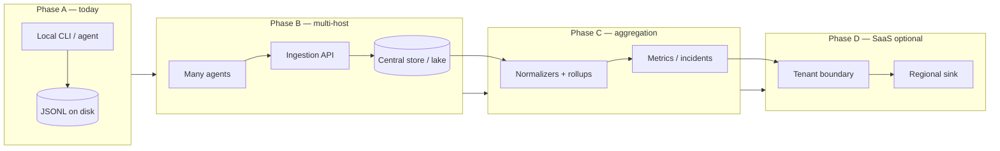

# Extension points: multi-host aggregation & SaaS (design only)

This document defines **interfaces and seams** for evolving from **one local agent** to **many hosts**, **central telemetry aggregation**, and an optional **SaaS-style** deployment—**without** implementing cloud services, vendors, or hosted control planes in this repository.

**Related today:** [`fleet_architecture.md`](fleet_architecture.md) (pull-based fleet sketch), [`architecture_platform.md`](architecture_platform.md), [`platform_api_contract.md`](platform_api_contract.md), [`safety_and_privacy.md`](safety_and_privacy.md).

**Non-goals (explicit):** no AWS/Azure/GCP modules, no multi-tenant database schema, no production auth—only **contracts** and **extension hooks** so future work plugs in behind stable boundaries.

---

## 1. Evolution path



| Phase | What changes | What stays the same |
| --- | --- | --- |
| **A** | Single machine, append-only local evidence | Deterministic scoring, policy semantics, “no silent repair” |
| **B** | **Same event contracts**, new **transport** to a receiver | Agent remains authoritative on *when* to send; local queue optional |
| **C** | **Aggregation** reads many envelopes (batch/stream) | **Privacy / redaction** applied before cross-host correlation |
| **D** | **Tenant ID**, residency, billing hooks (outside repo) | **Ingestion** and **remote control** interfaces unchanged—only adapters differ |

---

## 2. Design rules (carry forward)

1. **Data plane ≠ control plane.** Telemetry ingestion is **one interface family**; remote influence is **optional** and **strictly narrower** than “run shell.”
2. **Agents never execute opaque remote payloads.** Any future “command” is a **typed intent** validated against a **capability manifest** + **local policy** + **audit id**.
3. **Append-only bias.** Central stores should ingest **immutable events** or **content-addressed blobs**; corrections are **new rows**, not silent overwrites (aligns with JSONL posture today).
4. **Privacy by construction.** Extend [`safety_and_privacy.md`](safety_and_privacy.md): cross-host payloads should declare a **privacy tier** and **allowed field set** before aggregation enables correlation.

---

## 3. Interface: data ingestion (telemetry)

### 3.1 Purpose

Move **already-structured** diagnostic material from endpoint → aggregator without mandating vendor or topology: on-prem collector, MSP gateway, or SaaS ingress all implement the **same logical contract**.

### 3.2 Logical envelope (`InboundEnvelope` — conceptual)

Fields are **normative names** for future serializers (JSON, protobuf, NDJSON batch). Omitting optional blocks must remain backward compatible.

| Field | Required | Meaning |
| --- | --- | --- |
| `schema_version` | yes | Semantic version for the envelope (e.g. `1.0.0`). |
| `event_id` | yes | UUID; idempotency key for dedupe at sink. |
| `emitted_at_utc` | yes | Producer timestamp (RFC3339). |
| `producer` | yes | `{ "kind": "endpoint_agent \| src_cli \| failure_system \| custom", "version": "…" }`. |
| `host` | yes | **Stable pseudonymous** endpoint identity—never raw hostname unless operator opts in (`host_fingerprint_sha256`, `machine_role`, …). |
| `event_kind` | yes | Coarse enum: `heartbeat`, `snapshot_ref`, `diagnosis_summary`, `failure_block`, `audit_row`, `proof_result_summary`, … |
| `payload` | yes | Typed object or **reference** `{ "blob_storage_ref", "sha256", "byte_length" }` for large artefacts. |
| `privacy_tier` | yes | e.g. `public_safe`, `org_internal`, `full_debug` — **aggregator must reject** escalation without policy. |
| `tenant_context` | no | `{ "tenant_id", "fleet_id", "site_id" }` — **must be opaque** strings; SaaS attaches here. |
| `correlation` | no | `{ "session_id", "parent_event_id", "replay_of_run_id" }` — for drill-down across hosts. |

**Extension point:** New `event_kind` values and payload subschemas are additive; breaking changes bump `schema_version`.

### 3.3 Ingestion sink (conceptual Protocol)

Implementations: local JSONL append, `POST /platform/ingest/*`, future gRPC/stream, SaaS webhook—**same contract**.

```
TelemetryIngestionSink
├── ingest(envelopes: InboundEnvelope[]) -> IngestReceipt
│       Returns: accepted_ids, rejected[{ id, code, retryable }]
├── health() -> SinkHealth                              # optional, for backoff
└── close()                                             # flush batch queues
```

**Pluggable decorators (future):**

- `RedactingIngestionSink` wraps another sink (strip fields per `privacy_tier`).
- `QueuedIngestionSink` spools to disk when upstream is down (**outbox pattern**).

### 3.4 Aggregation extension points (no implementation here)

| Hook | Responsibility |
| --- | --- |
| **Normalizer** | Map heterogeneous producer versions → canonical envelope or drop with reason code. |
| **Deduplicator** | Use `event_id` + producer + optional `(host, emitted_at)` windowing. |
| **Rollup** | Time-bucket KPIs (`metrics.jsonl`-shaped aggregates today → same semantics, more dimensions). |
| **Correlator** | Join by `tenant_context`, `correlation.session_id`, or hypothesis keys—**never** merges raw payloads across `privacy_tier` boundaries without policy. |

---

## 4. Interface: remote control (optional)

### 4.1 Purpose

Operators or automation may **request** work on an endpoint (**policy refresh**, **trigger a local diagnostic bundle export**, **open a remediation preview session**). This is **not** remote execution of arbitrary strings.

### 4.2 Capability manifest (on the endpoint)

Declare what the installation allows **before** any control channel exists:

```
RemoteControlCaps
├── allow_policy_pull: bool
├── allow_diagnostic_bundle_request: bool     #writes local artifact only
├── allow_remediation_preview_only: bool      #never silent execute
├── allow_execute_allowlisted: bool            #today: fixed argv only
├── max_daily_remote_requests: int
└── version: str
```

**Extension:** New caps are additive; downgrade path = missing cap ⇒ denied.

### 4.3 Remote intention (conceptual record)

```
RemoteIntent
├── intent_id: UUID
├── kind: ENUM                                 # POLICY_REFRESH | REQUEST_SNAPSHOT_SUMMARY | REMEDIATION_PREVIEW | …
├── requested_at_utc: RFC3339
├── requested_by: { "principal_id", "role" }
├── ttl_seconds: int
├── correlation: { … }                         # ties to ingestion correlation
├── payload: typed small JSON                  # e.g. { "preview_action_key": "proxy_disable_preview" }
└── signature_optional: …                        # reserved for signed policy docs (future)
```

### 4.4 Remote control port (conceptual Protocol)

```
RemoteControlBroker
├── poll_intents() -> RemoteIntent[]           # pull model; avoids inbound firewall holes
├── acknowledge(intent_id, status, local_audit_ref)
├── emit_local_outcome(...) -> TelemetryIngestionSink.ingest(...)
└── revoke_expired(ttl_checked_at)
```

Local runtime **must**:

1. Reject intents outside `RemoteControlCaps`.
2. Map intents to **existing** audited code paths (CLI argv templates, documented APIs).
3. Append **audit** rows locally before any mutation (same invariant as preview/execute today).

**Extension point:** A **fleet server** stores pending intents per host fingerprint; hosts pull with mTLS/device token—outside this repo.

---

## 5. SaaS-shaped deployment (constraints on the same interfaces)

When adding a SaaS tier, treat it as **wiring**:

| Concern | Binds to |
| --- | --- |
| **Tenant isolation** | `tenant_context.tenant_id` + storage partition key |
| **Data residency** | Pluggable **TelemetryIngestionSink** + storage adapter per region |
| **Compliance** | `privacy_tier` + redaction decorators + aggregation rollups |
| **Billing/metering** | Count `InboundEnvelope` or correlated `session_id`; **metering adapter** plugs after sink accepts |

No SaaS-specific types are required in core—only **`tenant_context`** and **sink backends**.

---

## 6. Mapping to repository seams (today)

| Future interface | Stable seam in-repo today |
| --- | --- |
| **Telemetry envelope** shape | Rows under `logs/*.jsonl`, `platform_data/*.jsonl`, `failure_system` JSONL—normalize into envelope in a future adapter. |
| **Ingestion sink** | `POST /platform/ingest/*`, `endpoint_agent` optional HTTP POST. |
| **Privacy / redaction** | `platform_core.privacy`, docs in [`safety_and_privacy.md`](safety_and_privacy.md). |
| **Policy / preview** | `platform_core/policy.py`, remediation registry, RBAC docs. |
| **Remote intents (preview-shaped)** | Typed bodies on `POST /platform/remediation/preview`; **never** bypass for execute. |

---

## 7. Suggested implementation order (when ready)

1. Implement **Normalizer + IngestReceipt** in-process (single host batch export → validate envelope schema).
2. Add **OutboundQueue** decorator on agents (offline resilience) without changing aggregate API.
3. Introduce **`RemoteIntent`** pull loop **read-only** (policy doc fetch only).
4. Add multi-host **Deduper/Rollup** in a standalone service repo or `platform_core` submodule—still behind `TelemetryIngestionSink`.

This document stays the **authority** for interface names until an ADR supersede them.
