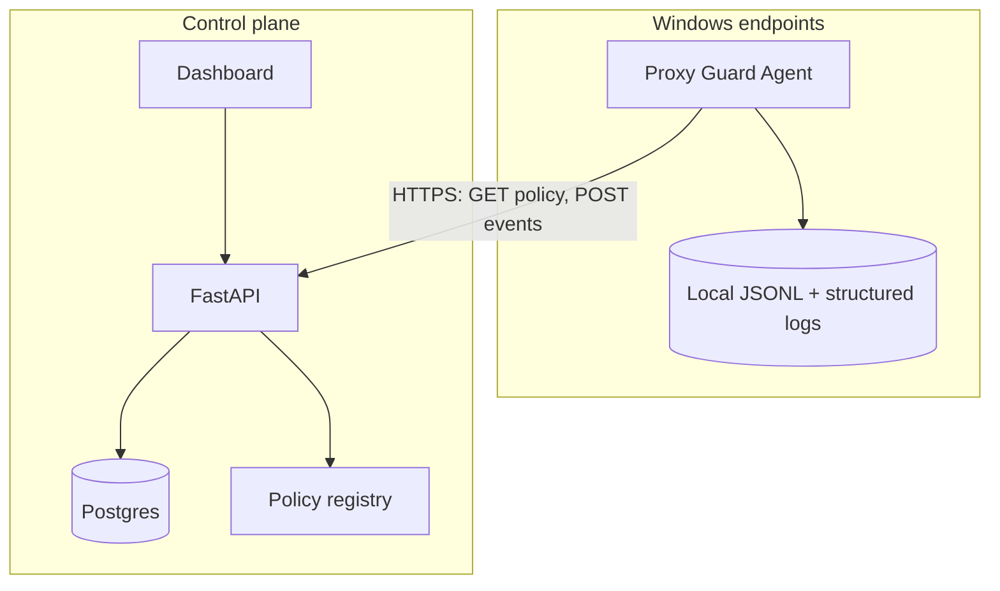

# Fleet-level architecture — Proxy Guard agent & control plane

This document describes an optional **fleet deployment**: lightweight Windows **agents** retain all **local safety-first** behavior (deterministic policy, default deny, **no destructive automation** beyond today’s explicitly scoped, opt-in rollback); a **central FastAPI** service ingests **audit/operational events**, serves a **dashboard**, and distributes **policy revisions** to agents **pull-based** (agents remain authoritative on enforcement timing).

---

## 1. Architecture diagram (text)

```
┌─────────────────────────────────────────────────────────────────────────────┐
│                           OPERATOR / ANALYST                                 │
│                    (Browser → Dashboard SPA or server-rendered UI)           │
└───────────────────────────────────────────────┬─────────────────────────────┘
                                                │ HTTPS
                                                ▼
┌─────────────────────────────────────────────────────────────────────────────┐
│                     CONTROL PLANE (central)                                   │
│  ┌──────────────┐   ┌─────────────────┐   ┌──────────────────────────────┐   │
│  │   FastAPI    │   │  Policy store   │   │  Event store (append-heavy)   │   │
│  │   :443       │──▶│  (Postgres /    │   │  (Postgres + optional           │   │
│  │              │   │   files + ver)  │   │   object store for blobs)       │   │
│  └──────┬───────┘   └────────▲────────┘   └──────────────────────────────┘   │
│         │                     │                                                  │
│         │              Admin API (policy CRUD)                                   │
└─────────┼─────────────────────┼──────────────────────────────────────────────────┘
          │                     │
          │ pull policy +        │ push/batch events (outbound from corp network)
          │ push events          │
          ▼                     │
┌─────────────────────────────────────────────────────────────────────────────┐
│              PER-HOST DATA PLANE (Windows 10/11)                             │
│  ┌──────────────────────────────────────────────────────────────────────────┐ │
│  │  Proxy Guard Agent (service / scheduled task / lightweight process)       │ │
│  │  • Local policy cache (signed JSON) + same enforcement as standalone    │ │
│  │  • Local append-only queue (disk) if server unreachable                   │ │
│  │  • No inbound listener required                                         │ │
│  └──────────────────────────────────────────────────────────────────────────┘ │
│         │ reads HKCU / attributes process │ optional rollback (local policy)   │
│         ▼                                                                      │
│  ┌──────────────┐     logs\*.jsonl (retained for air-gap / legal hold)       │
│  │  WinINET /   │                                                             │
│  │  WinHTTP     │                                                             │
│  └──────────────┘                                                             │
└─────────────────────────────────────────────────────────────────────────────┘
```

**Trust boundaries**

| Zone | Responsibility |
|------|----------------|
| **Agent** | Enforce policy locally; never execute server-supplied shell; optional upload of **already structured** events. |
| **Server** | Aggregate, search, alert; **distribute** policy documents (content-addressed); authenticate agents and users. |
| **Dashboard** | Read-only command surface for events; policy edits via admin API with audit trail. |

---

## 2. Architecture diagram (Mermaid)



---

## 3. API contract (REST + JSON)

Base URL: `https://control.example.internal/api/v1`. All bodies are `application/json`. Timestamps: RFC 3339 UTC.

### 3.1 Authentication

| Client | Header |
|--------|--------|
| Agent | `Authorization: Bearer <agent_token>` or mTLS client cert + optional `X-Agent-Id` |
| Dashboard / automation | `Authorization: Bearer <user_jwt>` |

### 3.2 Policy distribution

#### `GET /policy/manifest`

Returns available policy bundles for the fleet (not full content in one shot if large).

**Response 200**

```json
{
  "schema_version": 1,
  "bundles": [
    {
      "id": "org-default",
      "version": "2026-05-02T15:00:00Z",
      "sha256": "hexdigest",
      "uri": "/api/v1/policy/bundles/org-default/2026-05-02T15:00:00Z"
    }
  ]
}
```

#### `GET /policy/bundles/{bundle_id}/{version}`

**Response 200** — policy document (same shape as today’s agent whitelist JSON + optional fleet extensions):

```json
{
  "schema_version": 1,
  "allowed_process_name_substrings": ["chrome"],
  "allowed_process_names_exact": [],
  "allow_when_attribution_empty": false,
  "fleet_overrides": {
    "auto_rollback_allowed": false,
    "upload_control_events": true
  }
}
```

**Semantics**

- Agent **MUST** validate `sha256` after download before applying.
- **Fleet overrides** are hints: local config can still be stricter (safety-first); server cannot force destructive actions.

#### `GET /agents/{agent_id}/policy/effective` *(optional)*

Returns server-side **desired** policy assignment for an agent (which bundle id + version). Agent compares with local cache and pulls if behind.

**Response 200**

```json
{
  "assigned_bundle_id": "org-default",
  "assigned_version": "2026-05-02T15:00:00Z",
  "sha256": "hexdigest"
}
```

---

### 3.3 Event ingestion

#### `POST /events/batch`

Idempotent batch ingest for proxy-control and operational events.

**Request**

```json
{
  "schema_version": 1,
  "agent_id": "hostname-or-stable-uuid",
  "machine_fingerprint": "sha256-prefix-as-in-existing-toolkit",
  "sent_at": "2026-05-02T15:04:05Z",
  "events": [
    {
      "event_id": "uuid-v4-per-event",
      "type": "proxy_guard_control",
      "payload": {},
      "source": "logs/proxy_guard_control.jsonl",
      "ingested_line_hash": "optional-sha256-of-canonical-json"
    }
  ]
}
```

**Response 202**

```json
{
  "accepted": 42,
  "duplicates": 0,
  "rejected": 0
}
```

**Rules**

- Server dedupes on `(agent_id, event_id)` or `ingested_line_hash`.
- Payload is the **existing** JSONL object (unchanged keys) for dashboard compatibility.

#### `POST /events/heartbeat` *(optional)*

Lightweight liveness + policy version report.

```json
{
  "agent_id": "...",
  "policy_bundle_id": "org-default",
  "policy_version": "2026-05-02T15:00:00Z",
  "uptime_s": 3600,
  "queue_depth": 0
}
```

---

### 3.4 Dashboard / query API (read-heavy)

#### `GET /events`

Query parameters: `from`, `to`, `decision`, `action`, `hostname`, `cursor`, `limit`.

**Response 200**

```json
{
  "items": [
    {
      "id": "server-row-id",
      "agent_id": "...",
      "timestamp": "...",
      "summary": {
        "decision": "blocked",
        "action": "suppressed",
        "primary_process_name": "x.exe"
      },
      "raw": {}
    }
  ],
  "next_cursor": "opaque"
}
```

#### `GET /agents`

List registered agents and last seen time.

---

### 3.5 Error model

| Code | Meaning |
|------|---------|
| `400` | Validation error |
| `401` / `403` | Auth failure |
| `409` | Duplicate event id (idempotent replay; treat as success for agent) |
| `413` | Batch too large |
| `429` | Rate limited |

Error body:

```json
{
  "error": "validation_error",
  "detail": "events[0].event_id missing"
}
```

---

## 4. Agent–server interaction flow

### 4.1 Steady state (pull policy, push events)

```
Agent                           Server
  |                                |
  |  GET /policy/manifest          |
  |------------------------------->|
  |  200 + bundle list + sha256    |
  |<-------------------------------|
  |                                |
  |  GET /policy/bundles/...       |
  |------------------------------->|
  |  200 JSON policy               |
  |<-------------------------------|
  |  verify sha256, write cache    |
  |  hot-reload local engine       |
  |                                |
  |  (local) proxy_guard runs      |
  |  append JSONL events           |
  |                                |
  |  POST /events/batch            |
  |------------------------------->|
  |  202 accepted                  |
  |<-------------------------------|
```

- **Frequency**: policy poll every N minutes (config); events batched every few seconds or N KB.
- **Offline**: agent appends to local queue; **no** remote mutation of proxy settings.

### 4.2 Safety invariant (fleet cannot bypass local rules)

```
Server policy doc ──► Agent verifies hash ──► Merge with local machine policy (optional)
                              │
                              ▼
                   Local enforcement ONLY if merged policy allows
                   Auto-rollback remains OFF unless local + fleet allow
```

- Server distributes **policy content**; agent **decides** apply timing and **never** executes arbitrary commands from API responses.

### 4.3 Incident review flow

1. Operator opens dashboard → filters `decision=blocked`, `action=suppressed`.
2. Opens raw event → sees `previous_registry_view`, `attribution`, `rollback_suppressed_reason`.
3. Adjusts whitelist bundle → new version → agents pull on next manifest poll.

---

## 5. Mapping to existing codebase concepts

| Today (standalone) | Fleet role |
|--------------------|------------|
| `logs/proxy_guard_control.jsonl` | Source rows for `POST /events/batch` |
| Structured stderr JSON (`proxy_guard.service`) | Optional duplicate channel to server as `type: ops_log` |
| `shared/proxy_guard_policy.example.json` | Becomes a **bundle** served by `GET /policy/bundles/...` |
| Rollback limiter / cooldown | Unchanged locally; fleet may set `auto_rollback_allowed: false` |

---

## 6. Non-goals (explicit)

- Remote **interactive shell** or arbitrary script execution from server.
- ML-based policy on server for per-event decisions (would break determinism narrative unless versioned separately).
- Replacing local JSONL with network-only storage (local retention stays for safety and legal hold).
