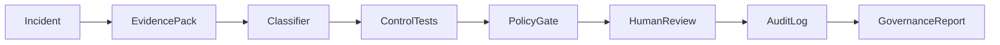

# Human review workflow

Technology risk triage requires human approval before accusatory-adjacent narratives or remediation previews become action.

## Flow

## Statuses

- `PENDING_REVIEW`
- `ACCEPTED`
- `OVERRIDDEN`
- `NEEDS_MORE_EVIDENCE`
- `REJECTED`
- `CLOSED`

## Review actions

- `accept_classification`
- `override_classification` (reason required)
- `request_more_evidence`
- `approve_remediation_preview` (requires `evidence_id` + `policy_decision_id`)
- `reject_remediation`
- `mark_false_positive`
- `close_no_action`

## Rules

| Rule | Enforcement |
|------|-------------|
| AI suggests explanation only | `explanation_guardrails` + `apply_guardrails` |
| AI cannot approve remediation | `record_decision` rejects `ai_*` actors on risky actions |
| AI cannot override policy gates | Policy engine remains authoritative |
| Human decision written to audit | `human_review.jsonl` + `audit.jsonl` mirror |
| Every override includes reason | Pydantic validator on `HumanReviewDecision` |

## Module

[`src/platform_core/governance/human_review.py`](../src/platform_core/governance/human_review.py)

## Boundaries

- Classification is not accusation.
- Policy permission is not a safety guarantee.
- Recommendation is not execution authority.
