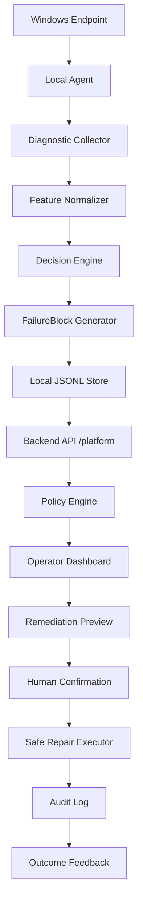

# From Windows Repair Scripts to Endpoint Reliability Platform

## STAR walkthrough (elevator + deep dive)

- **Situation:** Windows users frequently hit “looks online, browser broken” failures caused by proxy/DNS/TLS layers, while imperative repair scripts risk silent, irreversible network mutations.
- **Task:** Keep beginner `.bat` ergonomics, but add structured evidence, deterministic scoring, and explicit policy boundaries before any repair.
- **Action:** Layer a Failure Knowledge System (`failure_system/`) and `python -m src` diagnostics, then prototype an **Endpoint Reliability Platform** (`platform_core/` + `backend` `/platform/*` + `endpoint_agent/`) with append-only JSONL, RBAC-lite, allowlist-only remediation, dry-run defaults, and honest attribution tiers in `evidence/`.
- **Result:** Interview-ready story: **collect → snapshot → detect drift → attribute → policy → preview → audit → dashboard**, with regression tests proving firewall/adapter/arbitrary shell stays blocked from API execution unless policy explicitly allows preview-only paths.

## 1. Problem

Windows often shows “connected” while **browser traffic fails** because of **DNS**, **WinINET/WinHTTP proxy**, **TCP/TLS path**, or **browser-only** issues. One-size-fits-all “repair” scripts can **mutate network state** without enough **evidence**, leading to **wrong fixes** and **hard-to-debug regressions**.

## 2. Challenge

Imperative `.bat` tooling is **accessible** but **unsafe** at scale: operators need **structured evidence**, **ranked hypotheses**, and **policy boundaries** between *read-only diagnostics* and *repair*.

## 3. Solution

This repository layers a **Failure Knowledge System** (`failure_system/`) on top of beginner-friendly **scripts** and an advanced **`python -m src`** decision path, then adds an optional **Endpoint Reliability Platform** prototype:

- **Local diagnostic collector** (FKS uses safe subprocess probes — no repair from collector).
- **Normalized features** (`DiagnosticSnapshot`, `FeatureVector` in `src/`).
- **Deterministic decision engine** (rule-based, explainable).
- **FailureBlock** records (signals → cause → confidence → recommended fix → risk → safety boundary → rollback narrative).
- **`platform_core/`** — typed models, **privacy redaction**, **policy engine**, append-only **`platform_data/*.jsonl`**.
- **`endpoint_agent/`** — periodic **read-only** cycles; **optional POST** to **`127.0.0.1`** only; **never auto-repair**.
- **`GET/POST /platform/*`** on **`backend/main.py`** — remediation **preview**, **execute** with **typed confirmation** / **dry_run** defaults, **high-risk blocked** from execution.

## 4. Safety Model

- **Diagnose first**, **preview before repair**.
- **Typed confirmation** for scripted repair entry points where implemented.
- **No automatic firewall reset** and **no silent adapter disable** in conservative paths.
- **Local logs by default** — no designed-in external log upload in the platform prototype.
- **Redaction**: stable **endpoint hash** instead of raw hostname in platform JSONL; **masked private IPs** and **redacted user-profile paths** in free text.

## 5. Architecture (Mermaid)

## 6. Example Incident (talk track)

**Symptom:** Ping works but the browser fails.

**Signals:** IP reachability OK at ICMP; **DNS** probe may pass on a short name; **`curl`/`Invoke-WebRequest` HTTPS** to a stable test URL fails; **HKCU proxy** may be **on** or **loopback proxy** appears in observability.

**Hypothesis family:** **HTTPS path** and/or **proxy** rather than raw “cable unplugged.”

**FailureBlock category:** `proxy` / `tcp_tls` with **medium** risk framing.

**Recommendation path:** **Preview** `reset_proxy` or **inspect** — **not** silent reset.
For scripted guard loops, **`python -m src proxy-guard`** now distinguishes **polling heuristics vs Sysmon-backed attribution**, persists **Last Known Good** snapshots (`reports/proxy_guard_lkg.json`), and only performs **HKCU replay rollbacks** when `--auto-rollback` is combined with explicit non-dry-run intent (see **`docs/proxy_guard_attribution.md`**, **`docs/proxy_guard_rollback.md`**).

**Platform policy:** **Medium** tier may form a **preview**, but **execute** still requires **confirmation phrase** / **dry_run=true** default; **firewall** tier is **blocked** from API execution in the prototype.

**Audit:** Rows in **`platform_data/audit.jsonl`** (and JSONL streams) show **who/what/when** without shipping raw host identifiers.

## 7. What I learned

- **Observability beats random repair** — operators need **explainable** hypotheses.
- **Safe automation needs policy** — separate **read-only**, **low/medium**, and **forbidden** tiers.
- **Endpoint tools need auditability** — append-only JSONL and **stable schemas** pay off in interviews and incident review.
- **Platform thinking** turns scripts into **bounded subsystems** — agent, storage, policy, API — without erasing the beginner path.

## 8. Future work

- Fleet-scale **signed agent**, **RBAC**, **OpenTelemetry** metrics.
- Remote **policy sync** (still **no arbitrary remote command** execution).
- Incident **clustering** across endpoints and richer **dashboards**.

See also: **`docs/fleet_architecture.md`**, **`docs/endpoint_reliability_platform.md`**, **`docs/platform_architecture.md`**, **[`architecture_platform.md`](architecture_platform.md)**, **[`demo_script.md`](demo_script.md)**.
