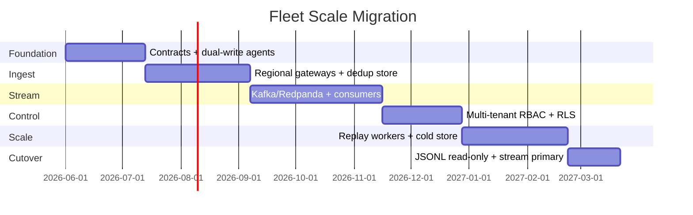
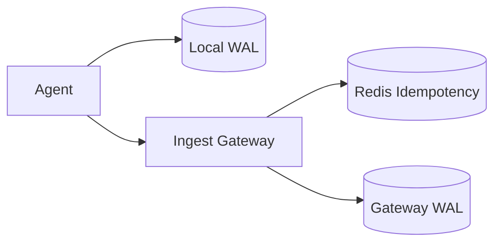
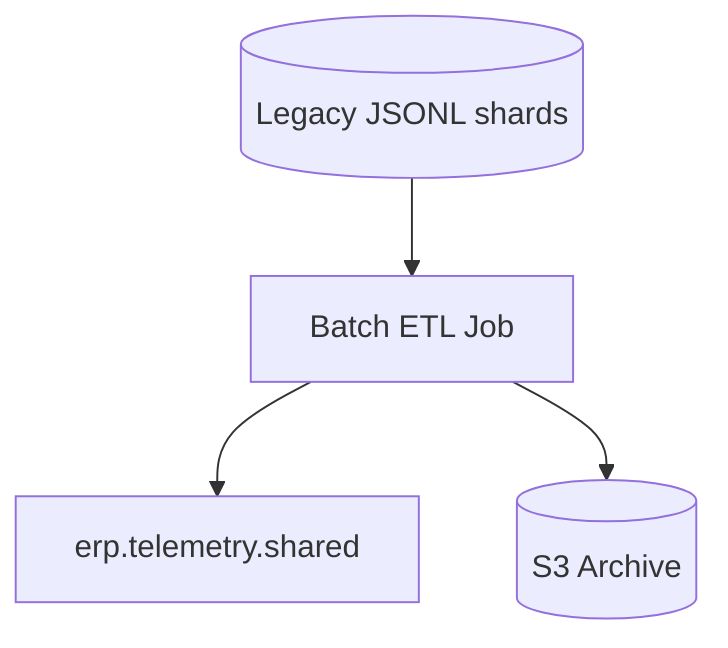

# Migration Plan — Local JSONL → 100k Endpoint Fleet

**Principle:** Zero-downtime phased migration. Each phase is **reversible**. Correctness gates block promotion.

**Target timeline:** 6–9 months (team of 4–6 platform engineers). Adjust per organizational constraints.

---

## Phase overview

---

## Phase 0 — Contracts & instrumentation (weeks 1–6)

**Goal:** Introduce fleet contracts without changing runtime behavior.

| Task | Deliverable | Exit criteria |
|------|-------------|---------------|
| Fleet envelope | `platform_core/fleet/models.py` | Agent can emit `FleetEventEnvelope` |
| Partitioning | `assign_partition()` | Deterministic tests 10k endpoints |
| Dedup interface | `IdempotencyStore` | Unit tests: accept/duplicate/conflict |
| Ingest gateway (local) | `FleetIngestGateway` + WAL | `fleet_ingest_wal.jsonl` in CI |
| Observability labels | `fleet/observability.py` | Metrics documented |
| ADR-008 approved | Architecture sign-off | SRE + Security review |

**Risk:** None — additive only.  
**Rollback:** Delete fleet package; no production impact.

---

## Phase 1 — Distributed ingestion (weeks 7–14)

**Goal:** Regional ingest gateways; agents dual-write local WAL + HTTPS.

| Task | Detail |
|------|--------|
| Deploy 2+ gateway replicas per region | K8s / Container Apps, autoscale on CPU + lag |
| Redis cluster for idempotency | 72h TTL; `SETNX` with payload hash check |
| Agent retry policy | Exponential backoff; max 24h WAL retention |
| API | `POST /platform/v3/ingest/batch` |
| Load test | 500 eps sustained, 2000 eps burst |

**Exit criteria:**
- [ ] 99.9% ingest success over 7 days (pilot 1k endpoints)
- [ ] Zero idempotency conflicts undetected in audit sample
- [ ] WAL replay recovers 100% after 1h gateway outage simulation

**Rollback:** Agent config `ingest_url=null`; local-only mode.

---

## Phase 2 — Event streaming (weeks 15–24)

**Goal:** Kafka/Redpanda as hot path; consumers build projections.

| Task | Detail |
|------|--------|
| Provision 3-broker Redpanda cluster (or managed Kafka) | 256 partitions on `erp.telemetry.shared` |
| Implement `KafkaEventPublisher` adapter | Behind `EventPublisher` protocol |
| Deploy normalizer consumer group | Writes to Postgres + ClickHouse |
| Deploy SRE incident projector | Replaces JSONL `sre_domain_events` for new incidents |
| Mirror JSONL → stream (shadow mode) | Compare counts hourly |

**Exit criteria:**
- [ ] Consumer lag p99 < 60s at 2× expected peak
- [ ] Shadow mode: < 0.01% event count divergence vs JSONL
- [ ] All existing pytest + integration tests green with `FLEET_MODE=stream` in CI

**Rollback:** `FLEET_MODE=local`; consumers paused; gateway writes WAL only.

---

## Phase 3 — Multi-tenant RBAC (weeks 25–30)

**Goal:** Production auth; tenant isolation enforced at API and DB.

| Task | Detail |
|------|--------|
| Entra ID app registration | Agent + operator apps |
| JWT middleware | Replace `X-Operator-Role` in prod |
| Postgres RLS policies | `tenant_id` on all tables |
| Per-tenant rate limits | Gateway + API middleware |
| Security review | Threat model update |

**RBAC migration:**

| Old (demo) | New (prod) |
|------------|------------|
| `X-Operator-Role: admin` | JWT `roles: [tenant_admin]` |
| `X-Operator-Id` | JWT `sub` |
| — | JWT `tenant_id` (required) |

**Exit criteria:**
- [ ] Pen test: no cross-tenant read/write in automated suite
- [ ] All API routes call `assert_tenant_access()`
- [ ] Demo headers disabled when `PLATFORM_ENV=production`

**Rollback:** Feature flag `USE_DEMO_RBAC=true` (staging only).

---

## Phase 4 — Replay at scale (weeks 31–38)

**Goal:** Partition replay workers; cold audit archive.

| Task | Detail |
|------|--------|
| `erp.replay.jobs` topic + workers | `ReplayCoordinator` distributed mode |
| S3 lifecycle policies | Audit blobs 7y retention |
| ClickHouse MTTR rollups | Replace signal-based MTTR for fleet KPIs |
| Postmortem artifacts in object store | Link from `postmortem.generated` events |
| Load test replay | 100 concurrent incident replays < 5m p95 |

**Exit criteria:**
- [ ] Replay parity ≥ 99.99% on 10k decision sample
- [ ] No single-host replay in production paths
- [ ] Postmortem generation < 30s p99

**Rollback:** Fall back to `ReplayCoordinator.run_local()` for single-incident debug only.

---

## Phase 5 — Cutover & JSONL deprecation (weeks 39–42)

**Goal:** Stream is system of record; JSONL export-only.

| Week | Action |
|------|--------|
| 39 | Stop dual-write to JSONL for **new** events |
| 40 | Migrate historical JSONL → cold store (batch ETL) |
| 41 | Read APIs query Postgres/ClickHouse only |
| 42 | JSONL paths return 410 Gone (except export tool) |

**Exit criteria:**
- [ ] 100k endpoints on stream ingest
- [ ] SLO dashboard green 30 consecutive days
- [ ] Runbook validated by game day exercise

---

## Data migration — JSONL to stream

| Source file | Target | Notes |
|-------------|--------|-------|
| `platform_events.jsonl` | `erp.telemetry.shared` | Assign `tenant_id=legacy` if missing |
| `sre_domain_events.jsonl` | `erp.sre.domain.shared` | Preserve `sequence` ordering |
| `platform_decisions.jsonl` | `erp.audit.signed` | Verify HMAC before import |
| `fleet_ingest_wal.jsonl` | Drain via gateway | Idempotency prevents dupes |

**ETL rules:**
1. Generate `FleetEventEnvelope` wrapper for each legacy row.
2. Use content hash as synthetic `idempotency_key` for historical rows.
3. Never delete source JSONL until checksum audit passes.

---

## Environment matrix

| Environment | Endpoints | `FLEET_MODE` | Stream | Idempotency |
|-------------|-----------|--------------|--------|-------------|
| Dev laptop | 1 | `local` | — | in-memory |
| CI | — | `local` | — | in-memory |
| Staging | 1,000 | `stream` | 3-node Redpanda | Redis |
| Production | 100,000 | `stream` | Managed Kafka 9+ brokers | Redis Cluster + PG fallback |

---

## Reference infrastructure (`docker-compose.scale.yml`)

Local integration test stack: Redpanda + Redis + Postgres + API. Not production topology — validates adapters only.

---

## Game day scenarios (pre-cutover)

| Scenario | Expected behavior |
|----------|-------------------|
| Gateway AZ loss | Agents failover; WAL drains; lag < 5m |
| Redis idempotency outage | Gateway 503; agents retain WAL; no dupes on recovery |
| Tenant ingest flood | Rate limit triggers; other tenants unaffected |
| Replay worker crash | Job requeued; at-least-once with idempotent results |
| Broker partition leader election | < 30s publish pause; no data loss |

---

## Success metrics

| Metric | Pre-migration | Post-migration |
|--------|---------------|----------------|
| Max endpoints | ~100 (JSONL) | 100,000 |
| Ingest p99 | N/A | < 500ms |
| Replay max incidents/hour | ~10 | 1,000+ |
| Cross-tenant data leaks | N/A (single tenant) | 0 (verified) |
| MTTR metric source | Signal fixtures | Incident lifecycle events |

---

## Team ownership (recommended)

| Area | Owner |
|------|-------|
| Agent + WAL | Endpoint team |
| Ingest gateway + dedup | Platform ingress |
| Stream + consumers | Data platform |
| RBAC + tenancy | Security + API |
| Replay + SRE tools | Reliability engineering |
| Observability | SRE / observability |
