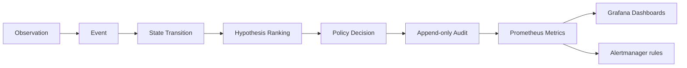

# Observability architecture

How metrics, dashboards, and alerts extend the Endpoint Reliability Platform **without claiming proof**.

## Pipeline upgrade

```text
Observation
  → Event
  → State Transition
  → Hypothesis Ranking
  → Policy Decision
  → Audit
  → Metrics
  → Dashboard
```

Prior mental model stopped at hypothesis + policy + audit. Observability closes the loop for **operators and SREs** — not for autonomous repair.



---

## Why observability improves confidence (without proof)

| Question | Metrics answer | Metrics do **not** answer |
|----------|----------------|---------------------------|
| Are proxy drift signals increasing? | `proxy_change_total` rate by `hostname` hash | Who wrote the registry key |
| Is policy blocking more than usual? | `policy_block_total` vs `policy_preview_total` | Whether block was “correct” |
| Are hypotheses ever proof-confirmed? | `hypothesis_confirmed_total` / `proof_success_total` | Root cause with legal-grade attribution |
| Is the API healthy? | `platform_http_requests_total`, `/platform/ready` | End-user browser experience |

**Observation ≠ proof.** Counters increment on observation-tier signals (WinINET reads, signal JSONL, correlation output). `proof_success_total` only moves when proof status is `CONFIRMED` in the reasoning model — still not a substitute for Sysmon/Procmon writer proof in security reviews.

**Correlation ≠ causation.** Hypothesis labels on metrics reflect **ranked candidates**, not verified causality. Dashboards visualize drift; humans decide next steps.

**Policy ALLOW ≠ safety guarantee.** `policy_allow_total` means the policy registry permitted a gated path — dry-run and typed confirmation remain mandatory for destructive actions.

---

## Prometheus metrics

Exposed at **`GET /metrics`** (text exposition).

| Metric | Labels | Meaning |
|--------|--------|---------|
| `proxy_change_total` | hostname, policy, hypothesis, confidence | Observation-tier proxy/registry drift |
| `hypothesis_generated_total` | … | Ranked hypothesis emitted |
| `hypothesis_confirmed_total` | … | Proof tier CONFIRMED only |
| `policy_allow_total` | … | ALLOW outcomes |
| `policy_preview_total` | … | PREVIEW outcomes (default posture) |
| `policy_block_total` | … | BLOCK outcomes |
| `proof_success_total` | … | Proof CONFIRMED |
| `proof_failure_total` | … | Proof REJECTED / INCONCLUSIVE |

### Label semantics

| Label | Value |
|-------|--------|
| `hostname` | **16-char hash** of endpoint id (not raw hostname) |
| `policy` | `allow` \| `preview` \| `block` |
| `hypothesis` | Sanitized slug from accepted/ranked hypothesis |
| `confidence` | Ordinal bucket: `low` \| `medium` \| `high` \| `very_high` |

Legacy flat counters (`platform_*`) and JSONL-derived gauges (`platform_endpoint_count`, `platform_audit_volume_total`) remain for fleet KPIs.

---

## Instrumentation points

| Location | Emits |
|----------|--------|
| `POST /platform/correlation/run` | Full pipeline via `record_reasoning_pipeline()` |
| `POST /platform/remediation/preview` | Policy + hypothesis counters |
| Process startup | `bootstrap_labeled_metrics_from_storage()` from audit/signals JSONL |
| Each HTTP request | `platform_http_requests_total` |

Module: [`backend/observability_metrics.py`](../backend/observability_metrics.py), [`backend/prometheus_exporter.py`](../backend/prometheus_exporter.py).

---

## Grafana dashboards

Provisioned from [`deploy/grafana/provisioning/dashboards/json/`](../deploy/grafana/provisioning/dashboards/json/):

| Dashboard | UID | Focus |
|-----------|-----|--------|
| Event Overview | `er-events-overview` | Hypothesis rate, proxy observations |
| Policy Decisions | `er-policy-decisions` | ALLOW / PREVIEW / BLOCK mix |
| Hypothesis Accuracy | `er-hypothesis-accuracy` | Generated vs confirmed, proof success/failure |
| System Health | `er-system-health` | HTTP, fleet gauges, readiness note |
| Audit Volume | `er-audit-volume` | Append-only audit growth |

Access: `http://localhost:3001` when using `docker compose up`.

---

## Alert rules

[`deploy/prometheus/alerts.yml`](../deploy/prometheus/alerts.yml):

| Alert | Intent |
|-------|--------|
| `suspicious_proxy_changes` | Spike in observation-tier proxy changes — investigate, do not auto-remediate |
| `excessive_policy_blocks` | Policy friction or abuse — review RBAC/policy config |
| `repeated_registry_modifications` | Sustained registry-related signals — escalate for human + proof-tier review |

Annotations explicitly state metrics are **not** writer proof.

---

## Operating the stack

```bash
docker compose up --build
# Prometheus: http://localhost:9090/alerts
# Grafana:    http://localhost:3001
# Metrics:    http://localhost:8000/metrics
```

Related: [architecture_service.md](architecture_service.md), [production_deployment.md](production_deployment.md).
