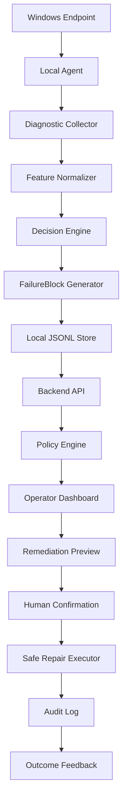

# Platform architecture (Endpoint Reliability prototype)

End-to-end flow for the **enterprise-style** prototype layered on the existing toolkit. **Beginner `.bat` flows are unchanged**; this describes the **additive** path.

## Component notes

| Stage | Implementation sketch |
| --- | --- |
| **Local Agent** | `endpoint_agent/` — optional loop; calls collectors; **never** auto-repairs. |
| **Diagnostic Collector** | Reuses `failure_system.collector` / `src` probes where applicable. |
| **Feature Normalizer** | `DiagnosticSnapshot` + platform **privacy** sanitization. |
| **Decision Engine** | Existing deterministic rules + scoring (`failure_system`, `src.decision_engine`). |
| **FailureBlock Generator** | `failure_system.generator` |
| **Local JSONL Store** | `platform_data/*.jsonl` via `platform_core.storage` |
| **Backend API** | `backend/` FastAPI routes under `/platform/*` |
| **Policy Engine** | `platform_core/policy.py` |
| **Dashboard** | `frontend/app/platform/page.tsx` (localhost demo) |
| **Remediation Preview** | `POST /platform/remediation/preview` |
| **Human Confirmation** | Typed phrase match + policy allow |
| **Safe Repair Executor** | Allowlisted `scripts/*.bat` only; dry-run supported |
| **Audit Log** | `platform_data/audit.jsonl` |
| **Outcome Feedback** | Optional append to feedback JSONL / event status update |

## Trust boundaries

- **Browser** must not bypass server policy; execution goes through **FastAPI** checks.
- **Agent** does not accept remote command execution—only **optional upload of sanitized summaries**.
