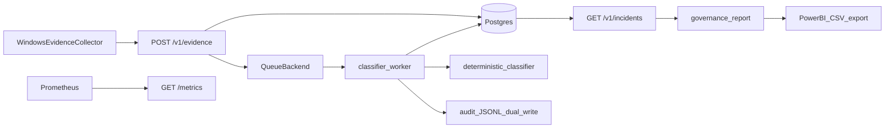

# Production Architecture

**Status:** Production-shaped portfolio prototype — not enterprise-deployed.

See [SYSTEM_DESIGN.md](../SYSTEM_DESIGN.md) for domain model and epistemic boundaries.

## End-to-end flow

## Component map

| Layer | Module | Responsibility |
|-------|--------|----------------|
| Collector | `windows_network_toolkit/cli.py` | Read-only WinINET/WinHTTP/proxy evidence |
| Ingestion API | `backend/v1_routes.py` | Validate, idempotent store, enqueue |
| Persistence | `backend/db/` | SQLModel tables — evidence through audit chain |
| Queue | `backend/queue/` | `QueueBackend` protocol; RQ implementation |
| Worker | `backend/workers/classifier_worker.py` | Calls existing classifier — no duplicated logic |
| Auth | `backend/auth/` | Demo token RBAC for `/v1` |
| Legacy read API | `backend/technology_risk_routes.py` | Fixture-backed `/trisk/*` unchanged |
| Observability | `backend/trisk_metrics.py`, `GET /metrics` | Prometheus counters |

## Honest gaps

- Not enterprise-deployed or SOC 2 attested
- Not antivirus, EDR, or MITM detection
- Not autonomous remediation
- Not a formal audit opinion tool
- Risk scores are ordinal — not calibrated probability
- No cross-platform fleet agent (Windows-focused portfolio)

## Related

- [deployment-topology.md](deployment-topology.md)
- [service-level-objectives.md](service-level-objectives.md)
- [queue-backend-choice.md](queue-backend-choice.md)
