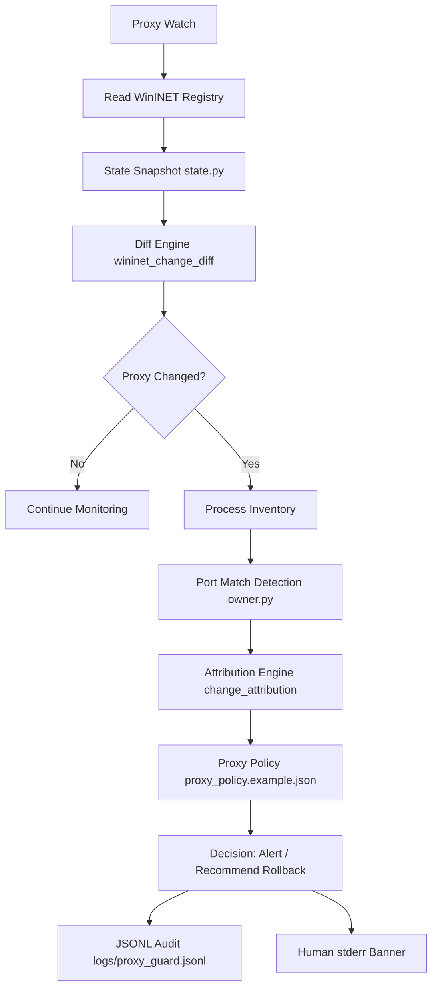

# Proxy Change Attribution System

Deterministic HKCU drift detection (**`Internet Settings`**), probabilistic listener correlation,
and append-only auditing under **`logs/proxy_guard.jsonl`**. Builds on existing Proxy Guard primitives
(registry reads, parsers, **`owner`** probes) — **never** resets firewall/adapters silently or uploads logs.

### Source modules (CLI: `python -m src proxy-watch`)

| Location | Responsibility |
| --- | --- |
| `src/proxy_guard/state.py` | Normalize HKCU WinINET keys + `parse_proxy_server` overlay for each poll. |
| `src/proxy_guard/wininet_change_diff.py` | Compare successive snapshots; emit `risk_level` and PascalCase `changed_fields`. |
| `src/proxy_guard/process_inventory.py` | Capture capped CIM rows + localhost listener correlations (best-effort, no elevated default). |
| `src/proxy_guard/change_attribution.py` | Score candidate PIDs/heuristics; explicit `limitations` (not write-proof). |
| `src/proxy_guard/evidence_import.py` | Optional Procmon CSV / Sysmon JSONL-derived confidence boosts only. |
| `src/proxy_guard/audit.py` | Append `logs/proxy_guard.jsonl` (`schema_version` `1`). |
| `src/proxy_guard/proxy_watch.py` | Poll loop wiring policy → diff → inventory → attribution → audit + stderr banners. |

## Why ping fits but HTTPS fails

ICMP echo may succeed locally while **`ProxyEnable`/PAC** send browser or WinHTTP callers through a stale
localhost port (nothing listening ⇒ TLS handshake stalls). Divergent stacks (ICMP vs SOCKS vs WinINET hooks)
amplify the mismatch.

## How localhost proxy drift happens

Vendor scripts, Electron shells, proxies, malware, or half-uninstalled tooling set **`ProxyServer`**
to **`127.0.0.1:N`**. Processes die or reinstall; **`ProxyEnable`** persists → intermittent failures spread
(across **`curl.exe`**, IDEs, service accounts honoring separate WinHTTP/Git/npm stacks).

## Why attribution is probabilistic

Registry writes do not embed immutable writer PID in user mode. Listener correlation + lexical heuristics
rank **likely editors**, not cryptographic proof — unless Sysmon/Procmon/EventLog supplies registry audit events.

Sysmon **`Event ID 13`** (registry value sets) materially improves fidelity when operators export filtered CSV/JSON.

## Safe workflow

1. **`python -m src proxy-diagnose`** — classify FailureBlocks/risk narratives.
2. **`python -m src proxy-watch --interval 5`** — HKCU snapshots + diff engine + attribution + **`logs/proxy_guard.jsonl`**.
3. **`python -m src proxy-report --tail 50`** — summarize recent audited transitions.
4. **`python -m src proxy-attribution`** — deepen listener/process rows for localhost ports.
5. Decide: allowlist benign tooling (**`config/proxy_policy.json`**) vs **`proxy-disable`** / typed rollback.
6. File restore: **`python -m src proxy-rollback --from-snapshot config\\last_known_good_proxy.json`** (preview defaults; live **`--confirm RESTORE_PROXY_SNAPSHOT_FILE`**).

## Architecture



## Policy knobs

Drop **`shared/proxy_policy.example.json`** beside your checkout → copy to **`config/proxy_policy.json`**.
Watcher searches **`config/proxy_policy.json`**, then **`config/proxy_policy.example.json`**, then **`shared`** copy.

Defaults keep **`auto_rollback`: false — `proxy-watch` never invokes live restores** regardless of wording in policy;
use **`proxy-guard`** typed flows or **`proxy-rollback`** for execution.

## Example commands

```powershell
python -m src proxy-watch --interval 5 --once
python -m src proxy-watch --interval 10 --evidence-csv .\procmon_inet_settings.csv
python -m src proxy-report --json --tail 20
python -m src proxy-rollback --from-snapshot .\config\last_known_good_proxy.json --dry-run
python -m src proxy-rollback --from-snapshot .\config\last_known_good_proxy.json --confirm RESTORE_PROXY_SNAPSHOT_FILE
```

## Safety boundaries recap

No adapter disable • no firewall resets • previews default until typed confirms • heuristic confidence never claims forensic certainty • supplemental evidence imports only uplift scores marginally.

