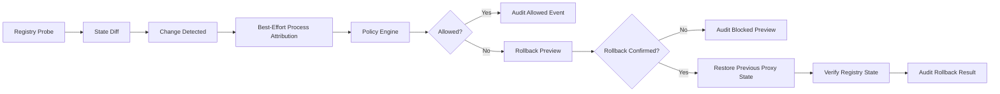

# Proxy Guard

This document covers two complementary surfaces:

1. **Native Windows scripts (no Python)** — `scripts/proxy_guard/*.bat` and `*.ps1` for quick, air-gapped diagnosis and user-confirmed reset. **Diagnose first; repair only after you type the confirmation phrases.**
2. **Python CLI** — `python -m src proxy-*` for deeper polling, policy, and JSONL audit (see [Python CLI — advanced Proxy Guard](#python-cli--advanced-proxy-guard) below).

---

## What is a proxy?

A **proxy** is an intermediary between your apps and the internet. Browsers and many developer tools can be told to send traffic through a specific host and port. On Windows, that instruction can exist in **several independent places**; if one layer still points at a **local or dead** endpoint, you get confusing failures (HTTPS timeouts, `ECONNREFUSED`, Git “Failed to connect”, npm `ENOTFOUND` masked as proxy errors, AI extension auth failures).

### Why `127.0.0.1:random_port` breaks Cursor, Git, npm, pip, browsers

VPNs, interceptors, old dev tools, or malware may set a proxy to **loopback** on a port that **nothing is listening on anymore**. Symptom patterns:

- **Cursor / VS Code–style tools**: extensions and AI features use the same HTTP stacks as the OS or embedded runtimes; broken system proxy → TLS or API calls fail intermittently.
- **Git / npm / pip**: each can follow **Git config**, **npm config**, or **environment variables** (`HTTP_PROXY`, etc.) in addition to WinINET/WinHTTP—so clearing only one layer may not fix the issue.

### Layers you should know

| Layer | What it affects | Typical tooling |
|--------|-----------------|-----------------|
| **HKCU WinINET** (`ProxyEnable`, `ProxyServer`) | “Internet Options” user profile; many GUI apps and some WinHTTP callers indirectly | Settings app, Edge (some paths), legacy stacks |
| **WinHTTP** (`netsh winhttp show proxy`) | Services and APIs using WinHTTP explicitly | Some Windows components, certain CLIs |
| **Git global** (`http.proxy`, `https.proxy`) | `git clone`, `git fetch`, GitHub | `git config --global` |
| **npm** (`proxy`, `https-proxy`) | `npm install`, registry access | `npm config` |
| **User environment** (`HTTP_PROXY`, `HTTPS_PROXY`, `ALL_PROXY`, `NO_PROXY`) | Child processes that honor env (pip, many CLIs, some IDEs) | System Properties → User variables |

**`NO_PROXY`** is diagnosed by the toolkit but **not** cleared by the safe reset (breaking excludes lists can have surprising side effects). Clear it manually if your org documents a safe value.

### Recommended workflow (native scripts)

1. **`scripts/proxy_guard/diagnose_proxy.bat`** — Read-only report → `reports/proxy_guard_report.txt`.
2. **`scripts/proxy_guard/monitor_proxy.ps1`** — Optional: detect **who** is flipping keys while you work (masked server strings; recent process **names** only in `reports/proxy_guard_watch.jsonl`).
3. **`scripts/proxy_guard/reset_proxy_safe.bat`** — Only if needed; type **`YES`**, then optionally **`CLEAR`** for user env vars, or **`ADVANCED`** for rare machine-scope env clears (may require elevation).
4. **`scripts/proxy_guard/start_cursor_safe.bat`** — Diagnose → prompt if loopback-style proxy → optional reset → start **Cursor.exe** from common install paths.

### Python `proxy-guard` (policy pipeline, attribution, rollback)

`python -m src proxy-guard` runs a **deterministic detection pipeline** against HKCU WinINET keys:



- **Rollback source of truth**: the HKCU probe snapshot captured **before** the change (`ProxyEnable`, `ProxyServer`, `AutoConfigURL`, `AutoDetect`; `ProxyOverride` when present)—**not** a blind disable.
- **`reports/proxy_guard_lkg.json`**: optional last-known-good file for onboarding (`--trust-current`) and auxiliary WinHTTP heuristics—not a prerequisite for rollback when a prior probe exists.
- **Unified audit**: `logs/proxy_guard_pipeline_audit.jsonl` (schema_version `1`, nested `policy`/`rollback` payloads). Legacy SOC rows still populate `reports/proxy_guard_watch.jsonl`, `reports/proxy_guard_actions.jsonl`, and `logs/proxy_guard_audit.jsonl`.
- **Post-change validation**: after detected proxy change, guard captures DNS (`nslookup`), TCP443 (`Test-NetConnection`), and HTTPS (`curl -I`) checks to detect regression before finalizing a low-risk allow.

#### Decision states (structured)

The control-plane output includes normalized states such as:

- `allowed_no_regression`
- `allowed_but_connectivity_regressed`
- `blocked_high_risk`
- `insufficient_evidence`
- rollback actions: `rollback_preview`, `rollback_recommended`, `rollback_skipped`, `rollback_applied`, `rollback_failed`

This keeps attribution language honest:

- **Do:** “`node.exe` is a candidate actor based on localhost listener correlation.”
- **Do not:** claim “`node.exe` changed the registry” unless direct registry-write telemetry exists.

Operational flags:

- `--auto-rollback` — rollback on **blocked** (legacy; phraseless live restore remains available when not dry-running).
- `--rollback` — opt into rollback tooling; combine with **`--rollback-confirm RESTORE_PROXY`** for live `reg` restores unless **`--auto-rollback`** already enables the legacy phraseless path.
- `--dry-run` / `--dry-run-rollback` — emit **`rollback_preview`** with no live restores.
- `--known-good <name>` — on blocked rollback, restore the **named** snapshot from **`logs/network_state_snapshots.jsonl`** (Network State Manager) when present; otherwise from **`logs/proxy_known_good_snapshots.jsonl`** (**proxy-snapshot**). Same HKCU WinINET + WinHTTP + Git + npm + user proxy env allowlist as **`network-state restore`**. See **`docs/network_state_manager.md`**.
- `--trust-current`, `--show-lkg`, `--clear-lkg`, `--restore-git-npm-env` (still blocked awaiting confirmation UX), `--attribution-mode {auto,best-effort,eventlog}`.

See **`docs/proxy_known_good_snapshot.md`** for **`python -m src proxy-snapshot`** (save/list/show/diff/restore).

### Named last-known-good snapshots (Python CLI)

Use **`proxy-snapshot save --name …`** while the endpoint is healthy to populate **`logs/proxy_known_good_snapshots.jsonl`**; optional **`config/last_known_good_proxy.json`** via **`--as-default`**.

- **`proxy-snapshot diff`** prints **changed fields only**, with hints when **`127.0.0.1` / localhost** appears in deltas.
- **`proxy-snapshot restore`** defaults to **dry-run** preview; **`--confirm RESTORE_KNOWN_GOOD_PROXY`** performs live **`reg` / `netsh` / `git` / `npm`** argv restores (no `shell=True`). **`--dry-run`** keeps preview even when the phrase is set. Each attempt appends **`logs/proxy_guard_actions.jsonl`** (`action=proxy_known_good_restore`).

Canonical policy precedence is **`config/proxy_guard_policy.json`** (fallback: `shared/proxy_guard_policy.example.json`). Optional **`observe_only_when_unknown_attribution`** downgrades unresolved attribution flows to **`observe_only`** instead of **`blocked`** (defaults off for strict posture).

See also **`docs/proxy_guard_attribution.md`** and **`docs/proxy_guard_rollback.md`**.

### Risks and registry notes

- **HKCU edits** apply to your user only and are **reversible** (re-enable proxy in Settings or restore values from your report). Some **MDM or security products** may reapply proxy policy at logon—coordinate with IT if settings “come back.”
- **Locking or corrupt registry hives** is a general Windows concern; this toolkit uses `reg.exe` for small, targeted writes—avoid manual concurrent edits to the same keys while scripts run.
- **`netsh winhttp reset proxy`** resets the **WinHTTP** proxy store (not the same as HKCU WinINET). Some enterprise apps depend on it; that is why reset is **confirmation-gated** and logged.

### Rollback ideas

- Re-enter corporate proxy **PAC URL** or server string from IT documentation.
- Restore **Git**: `git config --global http.proxy <url>` (if required).
- Restore **npm**: `npm config set proxy` / `https-proxy` as documented by your registry mirror.
- Restore **user env vars** via **Settings → System → About → Advanced system settings → Environment Variables** (or IT script).

### Privacy in logs

Reports and JSONL files **mask IPv4-like sequences** in narrative fields and avoid writing secrets. **Process lists** in the monitor are **names only** (no full paths, to reduce username leakage). Do not commit real `reports/*.txt` or `*.jsonl` from production machines.

---

## Python CLI — advanced Proxy Guard

Proxy Guard reads **HKCU** `Internet Settings` (`ProxyEnable`, `ProxyServer`, `AutoConfigURL`, `AutoDetect`), normalizes `ProxyServer` strings, correlates LISTENING `netstat` rows, optionally enriches via `Win32_Process` (through PowerShell/`Get-CimInstance`), emits JSONL audits, and offers a typed-phrase-guarded disable path (`DISABLE_WININET_PROXY`) that edits only targeted WinINET user keys.

## Commands

```powershell
python -m src proxy-status
python -m src proxy-status --json
python -m src proxy-owner [--port N] [--json]
python -m src proxy-monitor [--interval 5] [--once] [--jsonl logs/proxy_guard_events.jsonl]
python -m src proxy-guard [--interval 5] [--once] [--auto-rollback] [--rollback] [--rollback-confirm RESTORE_PROXY]
python -m src proxy-guard [--interval 5] [--dry-run] [--dry-run-rollback]
python -m src proxy-guard [--policy PATH] [--jsonl PATH] [--config shared/proxy_guard_service.config.example.json] [--structured-log logs/proxy_guard_service.jsonl]
python -m src proxy disable --dry-run
python -m src proxy disable --dry-run false --confirm DISABLE_WININET_PROXY
```

## Proxy Guard control plane (`proxy-guard`)

**Purpose:** Near–real-time polling of the same HKCU keys as `proxy-monitor`, plus:

- **Attribution:** For localhost proxy ports, resolve **port → netstat → PID → process name** (same stack as `proxy-owner`).
- **Policy:** JSON whitelist (`allowed_process_name_substrings`, `allowed_process_names_exact`); **default deny** for unknown processes; optional `observe_only_when_unknown_attribution`.
- **Rollback (opt-in):** On **blocked**, the loop can **re-apply the HKCU snapshot from the prior polling cycle** via `reg.exe` (and optional WinHTTP `netsh`, still gated by probe data). This is **not** a generic firewall/adapter reset—only the exact prior values are replayed when known.

No firewall, routing, adapter, or certificate mutations are performed automatically.

### Target architecture (modules)

| Module | Role |
|--------|------|
| `src/proxy_guard/registry.py` | HKCU reads via `reg query` (configurable per-query timeout) |
| `src/proxy_guard/probes.py` | Retry/backoff wrapper for full snapshot reads |
| `src/proxy_guard/parser.py` | Deterministic `ProxyServer` parse |
| `src/proxy_guard/planning.py` | Pure registry view helpers (no I/O) |
| `src/proxy_guard/diff.py` | HKCU diff + rollback verification tuples |
| `src/proxy_guard/pipeline.py` | Stdout/policy/rollback payloads for audits |
| `src/proxy_guard/attribution.py` | WMI / heuristic supplementation + unified audit envelopes |
| `src/proxy_guard/owner.py` | Localhost port attribution |
| `src/proxy_guard/watcher.py` | Read-only polling + legacy JSONL |
| `src/proxy_guard/policy.py` | Whitelist load + `PolicyDecision` |
| `src/proxy_guard/rollback.py` | Idempotent WinINET + WinHTTP rollback executor |
| `src/proxy_guard/rollback_limits.py` | Cooldown + sliding-window rate limit (anti-loop) |
| `src/proxy_guard/service.py` | Control loop: probes → policy → optional rollback → audit |
| `src/proxy_guard/control.py` | Shim exporting legacy `run_proxy_guard_control` |
| `src/proxy_guard/config.py` | `ProxyGuardServiceConfig` (JSON file + env) |
| `src/proxy_guard/structured_log.py` | JSON-lines operational logging |
| `src/proxy_guard/events.py` | `proxy_guard_control_event` JSONL rows |

### Configuration and environment

Optional JSON (see `shared/proxy_guard_service.config.example.json`) passed via `--config`:

- `probe`: `timeout_seconds`, `max_attempts`, `backoff_seconds` for `reg query` reads.
- `rollback_limits`: `cooldown_seconds` (min gap between auto-rollbacks), `window_seconds` + `max_rollbacks_per_window` (sliding cap).

Environment overrides (after defaults + JSON file):

| Variable | Purpose |
|----------|---------|
| `PROXY_GUARD_PROBE_TIMEOUT` | Per-`reg query` timeout (seconds) |
| `PROXY_GUARD_PROBE_MAX_ATTEMPTS` | Full snapshot retries |
| `PROXY_GUARD_PROBE_BACKOFF` | Backoff base between attempts |
| `PROXY_GUARD_ROLLBACK_COOLDOWN` | Cooldown after each rollback |
| `PROXY_GUARD_ROLLBACK_WINDOW` | Rolling window for rollback count |
| `PROXY_GUARD_ROLLBACK_MAX_PER_WINDOW` | Max rollbacks in that window |

### Structured operational logs

`src/proxy_guard/structured_log.py` writes one JSON object per line to **stderr** and, if `--structured-log PATH` is set, duplicates the same line to that file. Stable keys: `schema_version`, `timestamp`, `logger` (`proxy_guard.service`), `level`, `event`, plus context fields (`duration_ms`, `probe_notes`, etc.).

This is separate from **audit** JSONL (`--jsonl`): operational logs are for SRE triage; audit JSONL is the compliance-oriented control-plane record.

### Unsafe operations (manual review)

| Risk | Mitigation |
|------|------------|
| `--auto-rollback` / `--rollback` + `netsh winhttp` | Restores **prior** WinINET/WinHTTP literals; can disrupt apps relying on the *new* proxy until reconfigured. Opt-in; mirrored in JSONL. |
| HKCU `reg` mutations | Affects **current user** WinINET only; replayed values come from the captured prior snapshot—may still race with MDM or security products. |
| Default deny + wrong whitelist | Legitimate tools may be blocked; tune policy and use `allow_when_attribution_empty` / `observe_only_when_unknown_attribution` only with ops review. |
| Attribution gaps | Heuristic `candidate_actor` rows are **not** proof; policy may still use listener owners + optional WMI for allowlists. |

## Process attribution

Proxy Guard **detects** HKCU WinINET changes on a poll interval. Polling alone **cannot prove** which user-mode process last wrote `ProxyEnable` / `ProxyServer`.

This repository adds a **best-effort attribute** layer for pipeline audits:

- After `registry_change_detected`, the service runs :func:`src.proxy_guard.attribution.attribute_proxy_change`, which scores **optional** `psutil` process metadata (PID, name, exe path, command line, parent PID, create time). If `psutil` is not installed, `attribution_method` is `unavailable` and `candidate_actor` is null.
- The JSON uses neutral terms: **`candidate_actor`**, **`attribution_confidence`**, **`attribution_method`**, **`attribution_notes`**. This is **heuristic only**; do not treat output as a forensic accusation.
- **Confidence (heuristic-only, no `high`):**
  - **`medium`** — score ≥ 80 (strong keyword / tooling match, capped at 100).
  - **`low`** — score 40–79.
  - **`unknown`** — score < 40 or no candidate.
- **`attribution_method`:** `psutil_snapshot_heuristic` when a snapshot was scored; `unavailable` when `psutil` is missing or the snapshot is empty; `wmi_snapshot_heuristic` is reserved for future use (policy-side WMI fallback remains separate).

Example `attribute` block (abbreviated):

```json
{
  "candidate_actor": {
    "pid": 8420,
    "process_name": "clash.exe",
    "process_path": "C:\\\\Program Files\\\\Clash\\\\clash.exe",
    "parent_pid": 3000,
    "command_line": "clash.exe --proxy 127.0.0.1:7890",
    "score": 100,
    "reasons": ["matched_keyword:clash", "matched_keyword:proxy", "network_proxy_tool:clash"]
  },
  "attribution_confidence": "medium",
  "attribution_method": "psutil_snapshot_heuristic",
  "attribution_notes": [
    "best-effort attribution only",
    "registry polling cannot prove exact writer process"
  ]
}
```

**Future hardening:** direct writers can sometimes be reconstructed with Windows Event Log auditing, Sysmon registry events, or ETW—those paths may justify higher confidence separately; they are **not** part of this heuristic scorer.

### Attribution limitations (security & privacy)

The scorer collects **only** process metadata enumerated above—**not** environment variables, file contents, browser history, private IPs, machine IDs, or secrets. **Vendor / Authenticode pinning** in policy JSON remains TODO for OSS (see `trusted_exe_paths` prefix matching when Sysmon supplies paths). Policy evaluation may still use listener owners and optional PowerShell `Get-CimInstance` **without** changing the heuristic `attribute` block’s honest limits. Redact `logs/proxy_guard_pipeline_audit.jsonl` before sharing outside the machine.

### Rollback idempotency and loop prevention

- **Idempotent:** Re-running WinINET disable (`ProxyEnable=0`) and `ProxyServer` delete is safe to repeat. `netsh winhttp reset proxy` is safe to repeat. When HKCU already shows proxy off and server empty, WinINET `reg` steps are **skipped** but WinHTTP reset may still run (`rollback_detail.wininet_skipped_already_cleared`).
- **No infinite rollback loop:** After each rollback, a **cooldown** blocks further auto-rollbacks; a **sliding window** caps rollbacks per interval. When limits trip, the audit row uses `action: "suppressed"` and `rollback_suppressed_reason` instead of executing another rollback.

### Folder layout (`src/proxy_guard/`)

```
proxy_guard/
  __init__.py
  service.py      # Main control loop
  guard.py        # Poll → diff → attribute → policy → rollback → audit orchestration
  control.py      # Legacy shim -> service
  config.py       # Service config (probe + rollback limits)
  probes.py       # Registry read retries
  planning.py     # Pure view helpers
  diff.py         # Verification helpers
  pipeline.py     # Audit/stdout payload shapes
  attribution.py  # Enrichment + heuristic candidates
  rollback_limits.py
  structured_log.py
  events.py       # JSONL factories (monitor + control-plane)
  owner.py        # Attribution
  parser.py
  policy.py       # Whitelist / default deny
  registry.py
  remediation.py  # WinINET reg argv builders
  rollback.py     # apply_mutations + netsh winhttp
  watcher.py      # Read-only monitor
```

### Example control-plane JSONL (`logs/proxy_guard_control.jsonl`)

One line (pretty-printed for review):

```json
{
  "type": "proxy_guard_control",
  "event_type": "registry_change",
  "timestamp": "2026-05-02T12:00:00.000000+00:00",
  "previous_registry_view": {
    "proxy_enable": 0,
    "proxy_server": null,
    "auto_config_url": null,
    "auto_detect": 0,
    "parsed": {}
  },
  "current_registry_view": {
    "proxy_enable": 1,
    "proxy_server": "127.0.0.1:8080",
    "auto_config_url": null,
    "auto_detect": 0,
    "parsed": {
      "raw": "127.0.0.1:8080",
      "is_localhost_proxy": true,
      "localhost_port": 8080
    }
  },
  "attribution": {
    "port": 8080,
    "owners": [{ "pid": 999, "process_name": "example.exe" }],
    "notes": []
  },
  "policy": { "source_path": "C:\\\\...\\\\shared\\\\proxy_guard_policy.example.json" },
  "decision": "blocked",
  "decision_detail": "no_whitelist_match_default_deny",
  "action": "rollback",
  "matched_rule": null,
  "primary_process_name": "example.exe",
  "rollback_detail": {
    "wininet_reg": [{ "argv": ["reg", "add", "..."], "returncode": 0, "stdout": "", "stderr": "" }],
    "winhttp_reset": { "argv": ["netsh", "winhttp", "reset", "proxy"], "returncode": 0, "stdout": "", "stderr": "" }
  },
  "post_rollback_registry_view": {
    "proxy_enable": 0,
    "proxy_server": null,
    "auto_detect": 0,
    "parsed": {}
  }
}
```

### Safety model

| Area | Allowed automatically | Blocked / manual |
|------|----------------------|------------------|
| Detection | Polling HKCU Internet Settings | — |
| Attribution | Best-effort netstat/CIM | Perfect attribution (OS limits apply) |
| Policy | Whitelist match on resolved `process_name` | Everything else (default deny) |
| Rollback | **Only** when `--auto-rollback` and decision **blocked**; uses **only** WinINET HKCU disable + `netsh winhttp reset proxy` | Firewall, DNS, adapters, certs, machine-wide proxy policy |
| Audit | Append-only JSONL under `logs/` | — |

**Rollback guarantees:** Mutations are the same reversible primitives documented for `proxy-disable` plus WinHTTP reset. Operators can re-enable proxies manually or via trusted tooling; policy may reapply corporate settings after sync/logon.

### Future extensibility

- **ETW / registry callbacks:** Replace polling with filtered notifications for lower latency (same policy + rollback surface).
- **Multi-endpoint agent:** Ship control loop + JSONL forwarder; centralize policy distribution (still no cloud telemetry required).
- **Metrics:** Expose counters (changes/min, blocked rollbacks) via local Prometheus-compatible textfile or Windows Performance Counters.

## Logs

Append-only sinks (local):

- `logs/proxy_guard_events.jsonl` (`proxy-monitor`)
- `logs/proxy_guard_control.jsonl` (`proxy-guard`)
- `logs/repair_audit.jsonl` after successful `proxy-disable`

## Audit notes

Changing proxy disables the software that originally set the keys unless that software is addressed separately.
