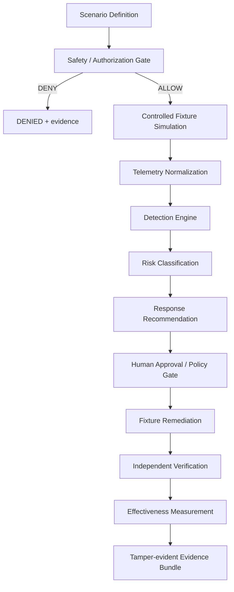

# Purple Team Architecture

## Package layout

`src/purple_team/` orchestrates existing Blue Team strengths (classifiers, safety doctrine, custody patterns) without forking remediation authority for live Windows mutation.

## Invariants

1. Deny by default; dry-run is the default execution posture.
2. Scenarios without cleanup/rollback are rejected at schema load.
3. Recommendation ≠ execution.
4. Verification failure ⇒ `recovered=false`.
5. Metrics are computed from real fixture runs — never hard-coded.

See also: [safety-model.md](safety-model.md), [threat-model.md](threat-model.md), [detection-engine.md](detection-engine.md).
