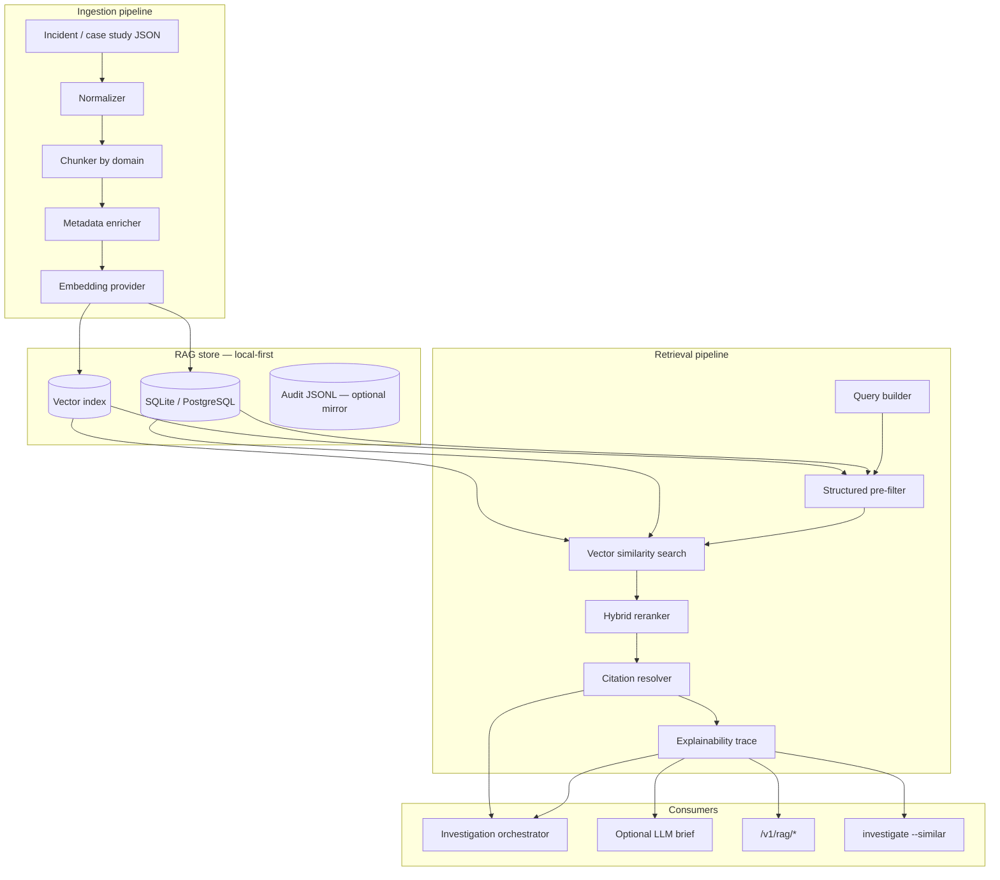
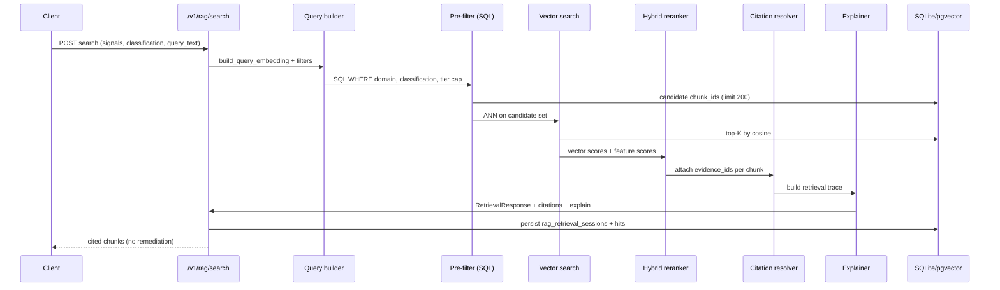

# RAG System Design — Endpoint Investigation Platform

**Status:** Design (2026)  
**Author role:** Staff AI Engineer  
**Baseline:** Windows Network Recovery Toolkit · [AI Investigation Architecture](ai_investigation_platform_architecture.md)  
**Constraints:** Local-first · SQLite → PostgreSQL · Evidence citations · Explainability · No autonomous remediation

---

## 1. Purpose

Retrieval-Augmented Generation (RAG) for this platform is **not** a generic chatbot over logs. It is a **governed retrieval layer** that:

1. Finds similar incidents and case studies across failure domains
2. Retrieves **evidence chunks** with tier metadata (observation vs proof)
3. Supplies cited context to the investigation orchestrator / optional LLM
4. Produces **explainable** retrieval traces for audit

RAG **never** upgrades evidence tier, **never** executes remediation, and **always** returns `evidence_id` + `chunk_id` citations.

### Failure domains indexed

| Domain | Example signals | Primary classification examples |
|--------|-----------------|------------------------------|
| **Proxy** | `wininet_proxy_enabled`, `listener_found`, `DEAD_PROXY_CONFIG` | WinINET drift, dead localhost proxy |
| **DNS** | `dns_resolve_ok`, `nslookup_status` | DNS path failure, split-horizon |
| **TLS** | `cert_fingerprint`, `tls_mismatch` | `POSSIBLE_MITM_RISK`, cert contrast |
| **VPN** | `vpn_adapter_up`, `split_tunnel` | VPN route conflict |
| **Registry** | `ProxyEnable`, Sysmon E13 writer | Registry writer observed |
| **Process attribution** | `pid`, `process_name`, listener correlation | `UNKNOWN_LOCAL_PROXY` |

---

## 2. Architecture overview



---

## 3. Folder structure

```text
src/platform_core/rag/
├── __init__.py
├── models.py                    # Pydantic: Document, Chunk, RetrievalResult, Citation
├── config.py                    # Embedding model, dimensions, backend selection
├── store/
│   ├── __init__.py
│   ├── base.py                  # RagStore ABC
│   ├── sqlite_store.py          # MVP — sqlite-vec or BLOB + brute force
│   ├── postgres_store.py        # pgvector backend
│   └── migrations/
│       ├── sqlite/001_rag_schema.sql
│       └── postgres/001_rag_schema.sql
├── ingest/
│   ├── __init__.py
│   ├── normalizer.py            # Incident JSON → RagDocument
│   ├── chunker.py               # Domain-aware chunking
│   ├── embedder.py              # Pluggable: local MiniLM / null hashing
│   └── indexer.py               # Batch index case_studies + incidents
├── retrieve/
│   ├── __init__.py
│   ├── query_builder.py         # Signals + classification → query vector + filters
│   ├── prefilter.py             # SQL filters (domain, classification, tier)
│   ├── vector_search.py         # ANN / brute force
│   ├── reranker.py              # Hybrid: vector + feature similarity
│   ├── citation_resolver.py     # chunk → evidence_id mapping
│   └── explainer.py               # Retrieval trace for operators
├── api/
│   └── schemas.py               # Request/response DTOs for FastAPI
└── providers/
    ├── null_embedder.py         # Deterministic hash embedding (CI / offline)
    └── sentence_transformer.py  # Optional local model

backend/
└── rag_routes.py                # /v1/rag/* FastAPI router

platform_core/db/
└── rag_schema.sql                 # PostgreSQL + pgvector DDL (symlink to migrations)

case_studies/
└── index.yaml                     # Source for bulk index job

tests/rag/
├── test_chunker.py
├── test_sqlite_retrieval.py
├── test_hybrid_rerank.py
├── test_citation_required.py
└── test_explainability_trace.py

scripts/
└── rag_index_cases.py             # `python scripts/rag_index_cases.py --all`
```

**Boundary:** `rag/` may read from `investigation/`, `principles/`, and audit JSONL — it must not import remediation executors.

---

## 4. Database schema

Dual schema: **SQLite (MVP)** and **PostgreSQL + pgvector (production)**. Same logical model; adapter pattern matches `DecisionIntelligenceStore`.

### 4.1 Entity relationship

```text
rag_incidents (1) ──< rag_documents (1) ──< rag_chunks (1) ──< rag_embeddings
                      │
                      └──< rag_chunk_evidence (N) ──> evidence_id (platform)
rag_cases (case study registry, links to fixture paths)
rag_retrieval_sessions ──< rag_retrieval_hits (explainability audit)
```

### 4.2 SQLite schema (MVP)

```sql
-- platform_core/db/migrations/sqlite/001_rag_schema.sql

PRAGMA foreign_keys = ON;

-- Incident / investigation parent record
CREATE TABLE IF NOT EXISTS rag_incidents (
    incident_id       TEXT PRIMARY KEY,
    investigation_id  TEXT,
    endpoint_id       TEXT NOT NULL DEFAULT 'local',
    primary_domain    TEXT NOT NULL,          -- proxy | dns | tls | vpn | registry | process
    primary_classification TEXT NOT NULL DEFAULT '',
    severity          TEXT NOT NULL DEFAULT 'medium',
    confidence_ordinal REAL NOT NULL DEFAULT 0.0,
    status            TEXT NOT NULL DEFAULT 'open',  -- open | resolved | archived
    source_type       TEXT NOT NULL DEFAULT 'live',  -- live | case_study | fixture | replay
    source_ref        TEXT NOT NULL DEFAULT '',      -- fixture path, audit row id
    payload_json      TEXT NOT NULL DEFAULT '{}',    -- full InvestigationPackage snapshot
    content_digest    TEXT NOT NULL DEFAULT '',      -- SHA-256 replay anchor
    created_at        TEXT NOT NULL DEFAULT (datetime('now')),
    updated_at        TEXT NOT NULL DEFAULT (datetime('now'))
);

CREATE INDEX IF NOT EXISTS idx_rag_incidents_domain_cls
    ON rag_incidents (primary_domain, primary_classification);
CREATE INDEX IF NOT EXISTS idx_rag_incidents_endpoint
    ON rag_incidents (endpoint_id, created_at DESC);

-- Logical document (one per incident section or case study chapter)
CREATE TABLE IF NOT EXISTS rag_documents (
    document_id       TEXT PRIMARY KEY,
    incident_id       TEXT NOT NULL,
    doc_type          TEXT NOT NULL,          -- observation | proof | classification | timeline | report
    title             TEXT NOT NULL DEFAULT '',
    failure_domain    TEXT NOT NULL,          -- proxy | dns | tls | vpn | registry | process
    evidence_tier     TEXT NOT NULL DEFAULT 'OBSERVED_ONLY',
    language          TEXT NOT NULL DEFAULT 'en',
    payload_json      TEXT NOT NULL DEFAULT '{}',
    created_at        TEXT NOT NULL DEFAULT (datetime('now')),
    FOREIGN KEY (incident_id) REFERENCES rag_incidents(incident_id) ON DELETE CASCADE
);

CREATE INDEX IF NOT EXISTS idx_rag_documents_incident
    ON rag_documents (incident_id);
CREATE INDEX IF NOT EXISTS idx_rag_documents_domain_tier
    ON rag_documents (failure_domain, evidence_tier);

-- Searchable chunk (retrieval unit)
CREATE TABLE IF NOT EXISTS rag_chunks (
    chunk_id          TEXT PRIMARY KEY,
    document_id       TEXT NOT NULL,
    incident_id       TEXT NOT NULL,
    chunk_index       INTEGER NOT NULL DEFAULT 0,
    chunk_text        TEXT NOT NULL,          -- human-readable retrieval text
    chunk_text_hash   TEXT NOT NULL,          -- SHA-256 for dedup
    failure_domain    TEXT NOT NULL,
    signal_tags       TEXT NOT NULL DEFAULT '[]',     -- JSON array
    classification_tags TEXT NOT NULL DEFAULT '[]',   -- JSON array
    evidence_tier     TEXT NOT NULL DEFAULT 'OBSERVED_ONLY',
    token_count       INTEGER NOT NULL DEFAULT 0,
    metadata_json     TEXT NOT NULL DEFAULT '{}',
    created_at        TEXT NOT NULL DEFAULT (datetime('now')),
    FOREIGN KEY (document_id) REFERENCES rag_documents(document_id) ON DELETE CASCADE,
    FOREIGN KEY (incident_id) REFERENCES rag_incidents(incident_id) ON DELETE CASCADE
);

CREATE INDEX IF NOT EXISTS idx_rag_chunks_incident ON rag_chunks (incident_id);
CREATE INDEX IF NOT EXISTS idx_rag_chunks_domain ON rag_chunks (failure_domain);
CREATE INDEX IF NOT EXISTS idx_rag_chunks_hash ON rag_chunks (chunk_text_hash);

-- Link chunks to platform evidence IDs (citation backbone)
CREATE TABLE IF NOT EXISTS rag_chunk_evidence (
    chunk_id          TEXT NOT NULL,
    evidence_id       TEXT NOT NULL,
    signal            TEXT NOT NULL DEFAULT '',
    tier              TEXT NOT NULL DEFAULT 'OBSERVED_ONLY',
    observed_value    TEXT NOT NULL DEFAULT '',
    PRIMARY KEY (chunk_id, evidence_id),
    FOREIGN KEY (chunk_id) REFERENCES rag_chunks(chunk_id) ON DELETE CASCADE
);

CREATE INDEX IF NOT EXISTS idx_rag_chunk_evidence_eid ON rag_chunk_evidence (evidence_id);

-- Vector storage — sqlite-vec virtual table OR BLOB fallback
CREATE TABLE IF NOT EXISTS rag_embeddings (
    chunk_id          TEXT PRIMARY KEY,
    model_id          TEXT NOT NULL,          -- null-hash-v1 | all-MiniLM-L6-v2
    dimensions        INTEGER NOT NULL,
    embedding_blob    BLOB NOT NULL,          -- float32 little-endian OR sqlite-vec ref
    norm              REAL NOT NULL DEFAULT 1.0,
    created_at        TEXT NOT NULL DEFAULT (datetime('now')),
    FOREIGN KEY (chunk_id) REFERENCES rag_chunks(chunk_id) ON DELETE CASCADE
);

CREATE INDEX IF NOT EXISTS idx_rag_embeddings_model ON rag_embeddings (model_id);

-- Case study registry (mirrors case_studies/index.yaml)
CREATE TABLE IF NOT EXISTS rag_cases (
    case_id           TEXT PRIMARY KEY,
    title             TEXT NOT NULL,
    primary_domain    TEXT NOT NULL,
    primary_classification TEXT NOT NULL,
    fixture_path      TEXT NOT NULL,
    timeline_path     TEXT NOT NULL DEFAULT '',
    tags_json         TEXT NOT NULL DEFAULT '[]',
    principles_validated INTEGER NOT NULL DEFAULT 0,
    incident_id       TEXT,                   -- links to indexed rag_incidents row
    created_at        TEXT NOT NULL DEFAULT (datetime('now')),
    FOREIGN KEY (incident_id) REFERENCES rag_incidents(incident_id)
);

-- Retrieval audit / explainability
CREATE TABLE IF NOT EXISTS rag_retrieval_sessions (
    session_id        TEXT PRIMARY KEY,
    investigation_id  TEXT,
    query_text        TEXT NOT NULL,
    query_domain      TEXT NOT NULL DEFAULT '',
    query_classification TEXT NOT NULL DEFAULT '',
    query_payload_json TEXT NOT NULL DEFAULT '{}',
    model_id          TEXT NOT NULL,
    backend           TEXT NOT NULL DEFAULT 'sqlite',
    hit_count         INTEGER NOT NULL DEFAULT 0,
    created_at        TEXT NOT NULL DEFAULT (datetime('now'))
);

CREATE TABLE IF NOT EXISTS rag_retrieval_hits (
    hit_id            TEXT PRIMARY KEY,
    session_id        TEXT NOT NULL,
    chunk_id          TEXT NOT NULL,
    incident_id       TEXT NOT NULL,
    case_id           TEXT,
    vector_score      REAL NOT NULL,
    feature_score     REAL NOT NULL,
    hybrid_score      REAL NOT NULL,
    rank              INTEGER NOT NULL,
    explain_json      TEXT NOT NULL DEFAULT '{}',   -- why this chunk matched
    evidence_ids_json TEXT NOT NULL DEFAULT '[]',
    FOREIGN KEY (session_id) REFERENCES rag_retrieval_sessions(session_id) ON DELETE CASCADE,
    FOREIGN KEY (chunk_id) REFERENCES rag_chunks(chunk_id)
);

CREATE INDEX IF NOT EXISTS idx_rag_hits_session ON rag_retrieval_hits (session_id, rank);
```

**SQLite vector options (pick one at deploy):**

| Option | When | Notes |
|--------|------|-------|
| **A. sqlite-vec** | Recommended local MVP | Virtual table `vec0`; ANN in-process |
| **B. BLOB + brute force** | CI / tiny corpus (<5k chunks) | Zero native deps; O(n) scan |
| **C. numpy memmap cache** | Dev laptops | Load embeddings at startup |

### 4.3 PostgreSQL schema (production)

```sql
-- platform_core/db/migrations/postgres/001_rag_schema.sql
CREATE EXTENSION IF NOT EXISTS vector;

-- rag_incidents, rag_documents, rag_chunks, rag_chunk_evidence, rag_cases,
-- rag_retrieval_sessions, rag_retrieval_hits — same columns as SQLite
-- (use TIMESTAMPTZ, JSONB instead of TEXT JSON)

CREATE TABLE IF NOT EXISTS rag_embeddings (
    chunk_id          TEXT PRIMARY KEY REFERENCES rag_chunks(chunk_id) ON DELETE CASCADE,
    model_id          TEXT NOT NULL,
    dimensions        INTEGER NOT NULL,
    embedding         vector(384) NOT NULL,   -- match embedder output dims
    norm              DOUBLE PRECISION NOT NULL DEFAULT 1.0,
    created_at        TIMESTAMPTZ NOT NULL DEFAULT NOW()
);

-- HNSW index — primary ANN path
CREATE INDEX IF NOT EXISTS idx_rag_embeddings_hnsw
    ON rag_embeddings USING hnsw (embedding vector_cosine_ops)
    WITH (m = 16, ef_construction = 64);

-- IVFFlat fallback for very large corpora (build after ANALYZE)
-- CREATE INDEX idx_rag_embeddings_ivfflat ON rag_embeddings
--     USING ivfflat (embedding vector_cosine_ops) WITH (lists = 100);

CREATE INDEX IF NOT EXISTS idx_rag_chunks_domain_gin
    ON rag_chunks USING gin ((metadata_json::jsonb));
```

### 4.4 Domain + tier enums (application layer)

```python
FailureDomain = Literal["proxy", "dns", "tls", "vpn", "registry", "process"]
EvidenceTier = Literal[
    "OBSERVED_ONLY", "CORRELATED", "PROVEN_REGISTRY_WRITER",
    "PROVEN_NETWORK_IMPACT", "FINAL_CAUSATION",
]
```

---

## 5. Vector indexing strategy

### 5.1 What gets embedded

Embed **retrieval text** built from structured fields — not raw registry dumps:

```text
[DOMAIN:proxy] [TIER:OBSERVED_ONLY] [CLASS:DEAD_PROXY_CONFIG]
Signals: wininet_proxy_enabled=true; listener_found=false; localhost_port=59081
Summary: WinINET points to dead localhost proxy 127.0.0.1:59081; WinHTTP direct.
Limitations: Does not prove malware or MITM.
```

Separate chunk types per failure domain:

| Chunk type | Source | Embed? | Filter key |
|------------|--------|--------|------------|
| Observation | `proxy_state`, DNS probe | Yes | `failure_domain`, `tier=OBSERVED_ONLY` |
| Proof attempt | `proof_attempts[]` | Yes | `tier>=CORRELATED` |
| Classification | `classification_result` | Yes | `primary_classification` |
| Timeline event | JSONL signal row | Yes | `signal`, timestamp |
| Process attribution | `proxy_owner`, writer | Yes | `failure_domain=process` |
| Policy / remediation | preview output | **No** (metadata only) | excluded from RAG gen context |

### 5.2 Embedding models

| Phase | Model | Dims | Storage |
|-------|-------|------|---------|
| MVP / CI | `null-hash-v1` | 384 | Deterministic feature hash — no ML deps |
| Local prod | `all-MiniLM-L6-v2` | 384 | sentence-transformers, runs offline |
| Enterprise | Configurable | 384–1536 | Azure OpenAI / Foundry embeddings API |

**Rule:** Query and corpus must use the **same** `model_id`. Re-index on model change.

### 5.3 Index lifecycle

```text
1. INGEST   case_studies/index.yaml + incident JSONL → normalizer
2. CHUNK    domain-aware splitter (max 512 tokens, 64 token overlap)
3. ENRICH   attach evidence_id rows in rag_chunk_evidence
4. EMBED    batch embed → rag_embeddings
5. INDEX    sqlite-vec / pgvector HNSW
6. VERIFY   digest + spot-check retrieval on CS1 fixture
```

Re-index triggers:

- New case study added
- `schema_version` bump on InvestigationPackage
- Embedding model change

### 5.4 Hybrid similarity scoring

Final rank combines **vector** and **structured** similarity (not probability):

```python
hybrid_score = (
    0.55 * cosine_similarity(query_vec, chunk_vec)
  + 0.25 * classification_match_score      # 1.0 if same primary, 0.5 if related
  + 0.10 * domain_match_score                # 1.0 same domain, 0.0 different
  + 0.10 * signal_jaccard(query_signals, chunk_signals)
)
# Display as: "similarity 0.87 (hybrid rank, not probability)"
```

Penalties:

- Tier downgrade: PROVEN chunks not boosted over OBSERVED for unrelated queries
- Cross-domain retrieval allowed but ranked lower unless query is multi-domain

---

## 6. Retrieval workflow

### 6.1 Sequence



### 6.2 Query builder inputs

```python
class RagSearchRequest(BaseModel):
    investigation_id: str | None = None
    query_text: str | None = None              # optional natural language
    signals: dict[str, Any] = {}               # structured primary input
    primary_domain: FailureDomain | None = None
    primary_classification: str | None = None
    evidence_tier_cap: EvidenceTier = "OBSERVED_ONLY"  # max tier retrieved for context
    include_case_studies: bool = True
    include_past_incidents: bool = True
    top_k: int = Field(default=8, ge=1, le=50)
    min_hybrid_score: float = Field(default=0.35, ge=0.0, le=1.0)
```

### 6.3 Citation resolution

Every retrieved chunk **must** resolve to ≥1 `evidence_id`:

```python
class RetrievedChunk(BaseModel):
    chunk_id: str
    incident_id: str
    case_id: str | None
    chunk_text: str
    failure_domain: FailureDomain
    evidence_tier: EvidenceTier
    citations: list[EvidenceCitation]          # from rag_chunk_evidence
    vector_score: float
    feature_score: float
    hybrid_score: float
    hybrid_score_display: str                  # "hybrid 0.82 (not probability)"
    rank: int
    explain: RetrievalExplain

class RetrievalExplain(BaseModel):
    matched_signals: list[str]
    matched_classification: str | None
    domain_match: bool
    prefilter_reason: str
    vector_rank: int
    rerank_notes: list[str]
```

### 6.4 RAG → Generation guardrails

When feeding an LLM:

```text
SYSTEM: Use ONLY provided chunks. Cite [chunk_id:evidence_id] per claim.
        Do not upgrade evidence tier. Do not recommend execution.
CONTEXT: {retrieved_chunks with tiers and limitations}
USER: {operator question}
POST: citation_validator + principles.validator
```

---

## 7. API endpoints

Router: `backend/rag_routes.py` · Prefix: `/v1/rag`

| Method | Path | Description |
|--------|------|-------------|
| `POST` | `/v1/rag/index/incident` | Index single incident/fixture |
| `POST` | `/v1/rag/index/cases` | Bulk index from `case_studies/index.yaml` |
| `POST` | `/v1/rag/search` | Hybrid retrieval + explainability |
| `POST` | `/v1/rag/search/similar-incidents` | Incident-level similarity (aggregated chunks) |
| `GET` | `/v1/rag/chunks/{chunk_id}` | Chunk + evidence citations |
| `GET` | `/v1/rag/sessions/{session_id}` | Retrieval audit trace |
| `GET` | `/v1/rag/stats` | Index counts, model_id, backend |
| `DELETE` | `/v1/rag/incidents/{incident_id}` | Archive (soft-delete) indexed incident |

Integration with investigations:

| Method | Path | Description |
|--------|------|-------------|
| `POST` | `/v1/investigations/{id}/retrieve` | Proxy to `/v1/rag/search` with investigation context |
| `POST` | `/v1/investigations/{id}/brief` | RAG context + optional LLM (cited) |

### 7.1 `POST /v1/rag/search` — request

```json
{
  "signals": {
    "wininet_proxy_enabled": true,
    "listener_found": false,
    "localhost_port": 59081,
    "browser_https_failed": true
  },
  "primary_domain": "proxy",
  "primary_classification": "DEAD_PROXY_CONFIG",
  "query_text": "browser fails ping ok dead localhost proxy",
  "top_k": 5,
  "include_case_studies": true
}
```

### 7.2 `POST /v1/rag/search` — response

```json
{
  "session_id": "rsess-abc123",
  "model_id": "null-hash-v1",
  "backend": "sqlite",
  "query_digest": "sha256:...",
  "results": [
    {
      "chunk_id": "chk-cs1-obs-01",
      "incident_id": "inc-cs1",
      "case_id": "cs1_wininet_proxy_drift",
      "failure_domain": "proxy",
      "evidence_tier": "OBSERVED_ONLY",
      "hybrid_score": 0.91,
      "hybrid_score_display": "hybrid 0.91 (not probability)",
      "citations": [
        {
          "evidence_id": "ev-listener-59081",
          "signal": "listener_found",
          "tier": "OBSERVED_ONLY",
          "observed_value": "false"
        }
      ],
      "explain": {
        "matched_signals": ["listener_found", "localhost_port"],
        "matched_classification": "DEAD_PROXY_CONFIG",
        "domain_match": true,
        "prefilter_reason": "domain=proxy AND classification=DEAD_PROXY_CONFIG",
        "rerank_notes": ["Same golden case classification", "Signal overlap 4/5"]
      }
    }
  ],
  "principle_notice": "Retrieval does not constitute proof. Verify evidence tiers before remediation preview."
}
```

---

## 8. Example queries

### 8.1 SQL — pre-filter candidates (proxy + dead listener)

```sql
SELECT c.chunk_id, c.chunk_text, c.failure_domain, c.evidence_tier
FROM rag_chunks c
JOIN rag_incidents i ON i.incident_id = c.incident_id
WHERE c.failure_domain = 'proxy'
  AND i.primary_classification IN ('DEAD_PROXY_CONFIG', 'WININET_WINHTTP_MISMATCH')
  AND c.evidence_tier IN ('OBSERVED_ONLY', 'CORRELATED')
ORDER BY i.created_at DESC
LIMIT 200;
```

### 8.2 SQL — citation lookup for chunk

```sql
SELECT ce.evidence_id, ce.signal, ce.tier, ce.observed_value
FROM rag_chunk_evidence ce
WHERE ce.chunk_id = 'chk-cs1-obs-01';
```

### 8.3 PostgreSQL — vector search (pgvector)

```sql
SELECT c.chunk_id,
       1 - (e.embedding <=> $1::vector) AS cosine_sim
FROM rag_embeddings e
JOIN rag_chunks c ON c.chunk_id = e.chunk_id
JOIN rag_incidents i ON i.incident_id = c.incident_id
WHERE e.model_id = 'all-MiniLM-L6-v2'
  AND c.failure_domain = 'proxy'
ORDER BY e.embedding <=> $1::vector
LIMIT 10;
```

### 8.4 API — similar incidents to live investigation

```bash
curl -s -X POST http://127.0.0.1:8000/v1/rag/search/similar-incidents \
  -H "Content-Type: application/json" \
  -d '{
    "signals": {"listener_found": false, "wininet_proxy_enabled": true},
    "primary_domain": "proxy",
    "primary_classification": "DEAD_PROXY_CONFIG",
    "top_k": 3
  }'
```

### 8.5 CLI — index + search (planned)

```powershell
python scripts/rag_index_cases.py --all
python -m windows_network_toolkit investigate --similar --fixture case_studies/cs1_wininet_proxy_drift/fixture.json
```

### 8.6 Natural language + structured hybrid

```json
POST /v1/rag/search
{
  "query_text": "ERR_PROXY_CONNECTION_FAILED WinINET localhost no listener",
  "signals": { "browser_https_failed": true, "direct_path_success": true },
  "primary_domain": "proxy"
}
```

Expected top hit: `cs1_wininet_proxy_drift` proof chunk with citations to listener check + WinINET/WinHTTP contrast.

### 8.7 Cross-domain — TLS + proxy combined investigation

```json
{
  "query_text": "possible MITM certificate mismatch with localhost proxy",
  "signals": { "tls_cert_mismatch": true, "wininet_proxy_enabled": true },
  "primary_domain": "tls",
  "top_k": 8
}
```

Pre-filter expands to `failure_domain IN ('tls', 'proxy')`; rerank boosts chunks sharing `POSSIBLE_MITM_RISK` or `SUSPICIOUS_PROXY`.

---

## 9. Explainability

Every retrieval session persists to `rag_retrieval_hits.explain_json`:

```json
{
  "prefilter": {
    "domain": "proxy",
    "classification_in": ["DEAD_PROXY_CONFIG"],
    "tier_cap": "OBSERVED_ONLY",
    "candidates_after_sql": 42
  },
  "vector": {
    "model_id": "null-hash-v1",
    "query_text_used": "...",
    "cosine": 0.88
  },
  "feature": {
    "classification_match": 1.0,
    "signal_jaccard": 0.8,
    "domain_match": true
  },
  "hybrid_formula": "0.55*vector + 0.25*class + 0.10*domain + 0.10*signals",
  "hybrid_score": 0.91,
  "limitations": ["Retrieval similarity is not causation.", "Tier OBSERVED_ONLY — not proof."]
}
```

Operator UI renders:

1. **Why retrieved** — matched signals + classification
2. **Evidence cited** — clickable `evidence_id` → source probe
3. **What we cannot claim** — tier + principles notice

---

## 10. Local-first → PostgreSQL migration

| Concern | SQLite MVP | PostgreSQL |
|---------|------------|------------|
| Driver | stdlib `sqlite3` | `psycopg2` (existing) |
| Vectors | sqlite-vec / BLOB | pgvector HNSW |
| JSON | TEXT | JSONB + GIN |
| Migrations | `migrations/sqlite/` | `migrations/postgres/` |
| Selection | `RAG_DATABASE_URL` unset → SQLite default | `DATABASE_URL=postgres://...` |

Migration job:

```text
1. Export rag_* tables from SQLite
2. Bulk COPY into PostgreSQL
3. Rebuild pgvector HNSW index
4. Verify CS1 retrieval parity (same top-3 chunk_ids)
5. Switch RAG_DATABASE_URL
```

Store interface:

```python
class RagStore(ABC):
    def index_incident(self, package: InvestigationPackage) -> str: ...
    def search(self, req: RagSearchRequest) -> RetrievalResponse: ...
    def get_session(self, session_id: str) -> RetrievalSession: ...
    def stats(self) -> RagStats: ...

def get_rag_store() -> RagStore:
    if is_postgres_configured():
        return PostgresRagStore(database_url())
    return SqliteRagStore(Path("platform_data/rag.db"))
```

Default DB path: `platform_data/rag.db` (gitignored) — separate from `backend/toolkit.db` SaaS demo schema.

---

## 11. MVP vs enterprise

| Capability | MVP (SQLite) | Enterprise (PostgreSQL) |
|------------|--------------|-------------------------|
| Index case studies | ✅ | ✅ |
| Hybrid search | Feature + hash embedding | + MiniLM / API embeddings |
| ANN | Brute force / sqlite-vec | pgvector HNSW |
| Explainability sessions | ✅ | ✅ + retention policies |
| Fleet incident ingest | Manual index | Automated agent pipeline |
| Multi-tenant isolation | Single org | `org_id` column + RLS |

---

## 12. Security & compliance

- **No PII in embeddings** — strip usernames, hostnames optional via config
- **Tier cap** — retrieval for LLM context capped at `CORRELATED` unless operator elevates
- **Audit** — every search logged with `session_id` + digest
- **Local-first default** — no embedding API calls unless configured
- **Principle gate** — retrieval responses include fixed disclaimer; generation still runs `principles.validator`

---

## 13. Implementation order

1. `rag/models.py` + SQLite DDL
2. `ingest/chunker.py` + index CS1 fixture
3. `retrieve/prefilter.py` + `reranker.py` (feature-only, no vectors)
4. `null_embedder.py` + vector search brute force
5. `POST /v1/rag/search` + explainability persistence
6. Wire `/v1/investigations/{id}/retrieve`
7. pgvector migration + HNSW
8. Optional sentence-transformer embedder

**First test:** Index `case_studies/cs1_wininet_proxy_drift/fixture.json` → search with CS1 signals → top result `case_id=cs1_wininet_proxy_drift` with ≥2 evidence citations.

---

## Related docs

- [ai_investigation_platform_architecture.md](ai_investigation_platform_architecture.md)
- [evidence_model.md](evidence_model.md)
- [case-study-1-proxy-drift.md](case-study-1-proxy-drift.md)
- `src/platform_core/principles/` — epistemic gates
